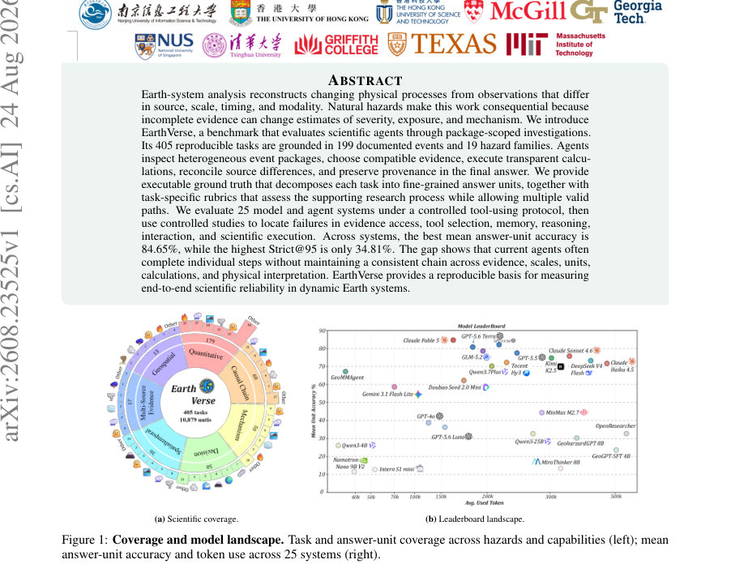
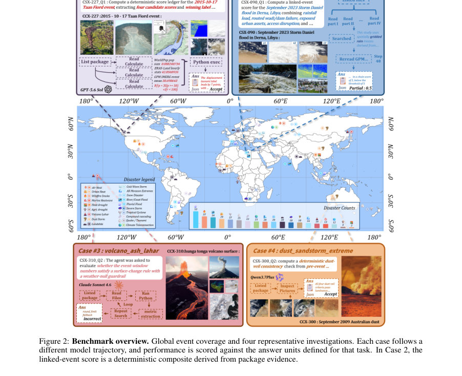
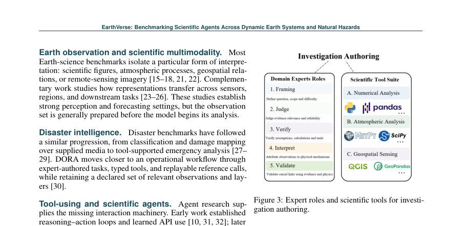

# EarthVerse: Benchmarking Scientific Agents Across Dynamic Earth Systems and Natural Hazards

- **게시일:** 2026-08-25
- **arXiv:** [2608.23525v1](http://arxiv.org/abs/2608.23525v1) · [PDF](https://arxiv.org/pdf/2608.23525v1)
- **저자:** Zhiqing Cui, Xinxiang Yin, Yihong Tang, Xinglang Zhang, Yuanzhe Hu, Siru Zhong, Weidong Tang, Yuxuan Liang, Weijia Li, Ming Jin, Shirui Pan, Yuhao Kang, Dingyi Zhuang, Jinhua Zhao
- **분야:** cs.AI
- **선정 점수:** 6.19
- **선정 이유:** 최근성 0.8, 인용 영향 0.0 (인용 0회), 저자 영향 1.6 (최고 h-index 15), AI 주제 적합성 2.8, 개발자 관심 0.5, 학술 신호 0.6, 오픈 웨이트·주요 연구조직 신호 0.0

[← 2026-08-25 목록으로 돌아가기](../daily/2026-08-25.html)

<!-- paper-visuals:start -->
## 주요 Figure

> 원문 PDF에서 실제 Figure 캡션과 그림 영역이 함께 확인된 자료만 자동 추출했다.

*Figure · 원문 PDF 1쪽 · Figure 1: Coverage and model landscape. Task and answer-unit coverage across hazards and capabilities (left); mean*

*Figure · 원문 PDF 3쪽 · Figure 2: Benchmark overview. Global event coverage and four representative investigations. Each case follows a*

*Figure · 원문 PDF 4쪽 · Figure 3: Expert roles and scientific tools for investi-*

<!-- paper-visuals:end -->

## 한 문장 요약

지구 시스템 재해 패키지(다중 출처 자료)를 열람·선택·계산·증거 연계·출처 보존하는 과정을 평가하는 실행 가능하고 재현 가능한 과학 에이전트 벤치마크를 제안하고, 25개 시스템을 통제된 도구 사용 프로토콜로 평가해 증거 지역화와 증거–주장 결속의 실패가 신뢰성 병목임을 규명한다.

## 해결하려는 문제

기존 지구과학·재난 분석 벤치마크는 분석에 필요한 관측·데이터를 사전에 고정하여 제공하는 경우가 많아, ‘어떤 증거를 선택하고 어떻게 서로 정렬하여 계산과 물리적 해석까지 일관되게 유지하는지’라는 실제 연구 흐름을 평가하지 못한다. 이로 인해 모델이 개별 계산이나 해석은 잘해도 다중 출처 증거를 구성·대조·보존해 최종 결론까지 일관되게 도달하는 능력(신뢰성)을 측정하기 어렵다. 연구 질문(RQ)은 (1) 현재 시스템이 감시 가능한 다중-출처 재난 조사를 완수할 수 있는가, 평균 성능과 신뢰성(완전성) 격차의 원인은 무엇인가, (2) 언제 추론이 조사 성능을 개선하는가(증거 접근·도구·메모리·중단·실행 제어의 역할), (3) 관측이 이미 주어졌을 때의 해석 성능과 증거를 스스로 구성·유지하는 성능의 차이는 어느 정도인가이다.

## 핵심 기여

- EarthVerse: 405개 재현 가능한 패키지-스코프 조사(199개 실재 사건·19개 위험군)에 기반한 벤치마크와 10,879개의 세분화된 실행 가능(장치로 계산 가능한) 정답 단위(answer units) 및 작업별 20점 프로세스 루브릭을 제공함.
- 공통 툴 인터페이스(파일발견, 읽기, 텍스트검색, 구조화된 데이터 검사, 범위 내 Python 실행, 최종화)를 통한 통제된 도구-사용 평가 프로토콜을 설계하고 25개 모델·에이전트 시스템(오픈·호스티드·프레임워크)을 동일 환경에서 비교함.
- 증거 지역화·도구 선택·메모리·추론·상호작용·과학적 실행 단계별 통제 실험을 수행하여 주요 실패 지점을 진단(예: 관련 파일 오라클이 Core를 +14.72 포인트 향상)하고, 추론이 효과를 내기 위해서는 편집 가능한(claim–evidence state) 증거 상태가 필요함을 보임.
- 교차-벤치마크 실험으로 ‘관측이 이미 주어졌을 때’(supplied-observation) 모델 적응이 기존 공개 기준 및 일부 인간 기준을 만족하거나 초과할 수 있으나, 증거를 스스로 구성·정렬해야 하는 EarthVerse 문제는 여전히 훨씬 어렵다는 점을 계량적으로 제시함.

## 접근 방법

* EarthVerse는 사건별 패키지(평균 약 34개 파일, 전체 공개 릴리스에서 패키지당 평균 7.26개 서로 다른 출처가 필요한 구성)를 저자-검증된 형태로 구성하고, 각 과제를 질문(qi)과 패키지(Pi)를 공개한 뒤 에이전트가 도구 호출로 파일탐색·읽기·검색·구조화 데이터 검사·범위 내 Python 실행을 통해 다중 라운드 τ=(a1,o1,...,aT,oT)로 연구 궤적을 생성하게 한다.
* 평가 계약은 (i) 정답 단위(answer units)로 세분화된 기계적/허용 오차 기반 정답(y⋆i)과 compute_gt.py로 생성되는 실행 가능 정답, (ii) 작업별 20점 루브릭(Bi)을 포함한다.
* 점수 체계: 각 과제에 대해 정답 정확도 Ai=min(Hi,Ui) (Ui=완료된 정답 단위 비율, Hi=전체적 판단), Pi=프로세스 루브릭 점수, 전체 Combined Core = (1/(2N)) * Σ(Ai+Pi).
* Strict@95는 Ui≥95%인 과제 비율로 신뢰성(near-complete) 측정.
* 통제 연구로는(1) 증거 접근 모드(압축 텍스트·전체 텍스트 직접 입력·EarthVerse 대화형 인터페이스·대화형+최종검토), (2) 증거-경로 개입(관련 파일 오라클·증거 맵 오라클·도구 부분집합·계획 오라클 등), (3) 증거 변형(단위 동등 변경·추가 교란 파일·증거 누락·잘림·상충) 등이 포함되어 각 개입이 Core 및 역량별(Core by capability) 성능에 미치는 영향을 비교하였다.

## 주요 결과

- 벤치마크 규모: 405개 조사, 199개 사건, 19개 위험군, 6,709개 로컬 파일(릴리스 전체), 10,879개 정답 단위.
- 평가 대상: 25개 시스템을 동일 패키지 인터페이스로 평가. 최고 평균 정답-단위 정확도(mean answer-unit accuracy)는 Claude Fable 5 기준 84.65%(논문 본문 수치)이며 최고 Strict@95(완전성 기준)는 GPT-5.6 Sol의 34.81%로 보고됨. 즉 평균적으로는 많은 단위를 맞추더라도 ‘거의 완전한’ 조사(95% 이상 정답 단위 만족)는 낮음(최고 ~34.8%).
- 상호작용·추론 실험: 고정된(편집 불가능한) 증거 스냅샷에서는 추가 추론 노력이 오히려 성능을 악화시키는 경우가 많음(예: 압축 직접 입력에서 고(高) effort가 Core를 떨어뜨림). 반면 대화형 증거 검색·수정이 가능한 환경에서는 노력 증가가 Core를 크게 향상시키며(예: EarthVerse interactive에서 none→high effort 시 Core 상승), 최종 검토(final review)는 적절히 쓰이면 대폭 향상(xhigh에서 Core 68.58→86.29).
- 증거-경로 개입 결과: 관련-파일 오라클은 Core를 +14.72 포인트(95% CI에 의해 유의) 향상시켰고, 증거-맵 오라클도 +11.34 포인트 향상. 도구 부분집합·계획 오라클 등은 유의미한 개선을 제공하지 못함. 역량별 효과: 관련-파일 오라클은 시공간 재구성(spatiotemporal)과 정량 계산(quantitative calc.), 물리적 메커니즘 역량에서 특히 큰 향상을 보였음.
- 교차-벤치마크 적응: GPT-5.5를 여러 기존 지구/지리 벤치마크에 맞춰 구조화된 절차(정답 계약·스키마 명시)를 적용하면 EarthSE의 fill-in 정확도가 20.29%→61.90%로, GeoMMBench 정확도는 84.52%→98.01%로 개선되는 등, '관측이 주어진' 과제는 모델 적응으로 기존 공개 기준을 따라잡거나 초과할 수 있음. 그러나 EarthVerse의 증거 구성·정렬 요구는 별개로 훨씬 어려움.

## 한계

- 저자 명시(본문에서 밝힌 한계): EarthVerse는 복잡한 미분방정식이나 비가시적 전문 수식의 암기·재현을 요구하지 않으며(투명한 산술·집계·비율·공간오버랩·가중지수·경계화된 반사실험 등에 초점), 문제는 주로 증거 선택·정렬·단위·시간 창 일치성에 놓여 있음.
- 저자가 언급한 실험적 제약: 태스크는 저자·전문가에 의해 구성·검증된 고정 패키지를 사용하므로 실제 실시간 데이터 흐름(live feeds)이나 추가 외부 검색을 모사하지 않음(패키지 바운더리 내에서 증거 검색을 요구).
- 본 분석에서 합리적으로 확인되는 추가 한계(저자가 명확히 '한계'로 쓰지 않은 관찰): (i) 비용·확장성 제약 — 논문 자체가 전형적 상용 프론티어 모델 평가에 과제당 높은 비용(최신 프론티어 모델 전체 평가에 >$2,500)을 보고하므로 대규모 지속적 평가·튜닝에는 자원이 많이 듦; (ii) 에이전트·도구 등록과 인터페이스 설계 의존성 — 벤치마크는 6종 기본 도구와 170개의 재사용 연산을 제공하지만, 실제 시스템은 도구 명명·설명·계층 구성에 민감함(테이블 실험에서 불투명한 도구명은 성능 저하를 야기); (iii) 평가자·루브릭의 주관성 리스크 — 루브릭·예비검토·LLM 쌍비교 보정이 있으나 일부 판정(물리적 해석·완전성 판단)은 여전히 주관적일 수 있음.

## 개발자 관점

- 재현 가능한 정답 계약을 설계할 것: 작업별 compute_gt.py와 구조화된 정답 단위를 포함해 모든 결정(시간창, 단위, 허용오차, 필수 출력 필드)을 기계적으로 검증 가능하게 구성해야 재현성과 공정한 평가가 가능하다.
- 증거 지역화(related-file localization)에 투자하라: 실무적 병목은 ‘어떤 파일이 관련인가’를 찾아내고 그 파일의 시간·공간·단위를 올바르게 정렬하는 단계이다. 검색·색인·메타데이터 정합성·증거 맵(파일→역할 매핑) 기능이 성능을 크게 끌어올린다(오라클 실험에서 Core +11~+15 포인트).
- 주장–증거 상태(claim–evidence state)를 편집 가능하도록 설계하라: 에이전트의 추론이 효과를 내려면 검색·계산 결과로 증거 선택을 바꾸고 그것을 최종 응답에 반영할 수 있어야 한다. 고정된 스냅샷에 대한 장시간 추론은 오류를 고착화할 수 있다.
- 최종검토 단계와 타깃 검증을 도입하라: ‘대화형 조사 + 최종 검토’가 잘 설계되면 신뢰성이 크게 오르는 사례가 관찰되므로, 출력 전에 증거-출처·단위·중간계산을 자동 재검증하는 리뷰 루틴을 포함하라.
- 비용-성능 설계: 프론티어 모델은 높은 품질을 내지만 평가 비용이 크다(전체 평가 >$2,500). 실무에서는 저비용 플래시 모델로 선별하고 상위 후보에 대해 고성능 모델로 검증하는 계층적 파이프라인을 고려하라.

**근거 범위:** 이 분석은 제공된 논문 PDF 본문(본문과 부록 일부 텍스트)을 기반으로 작성되었음. 표·수치(예: 405개 과제, 199개 사건, 10,879 정답 단위, mean unit accuracy 및 Strict@95 수치, 오라클 실험 결과 등)는 본문에서 직접 인용했다. PDF에서 완전한 부록(예: 전체 시스템 목록, 상세 하이퍼파라미터, 비용 산정 세부내역)이나 일부 표·그림 원문을 자동으로 추출하지 못한 부분이 있을 수 있으므로, 구현 복제나 추가 수치 확인이 필요하면 원문 PDF의 해당 부록과 공개 저장소(저자 제공 GitHub/Hugging Face)를 참조하기 바람.
