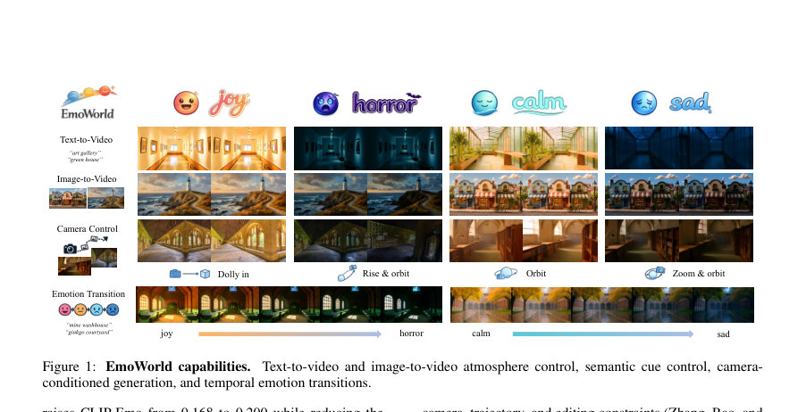
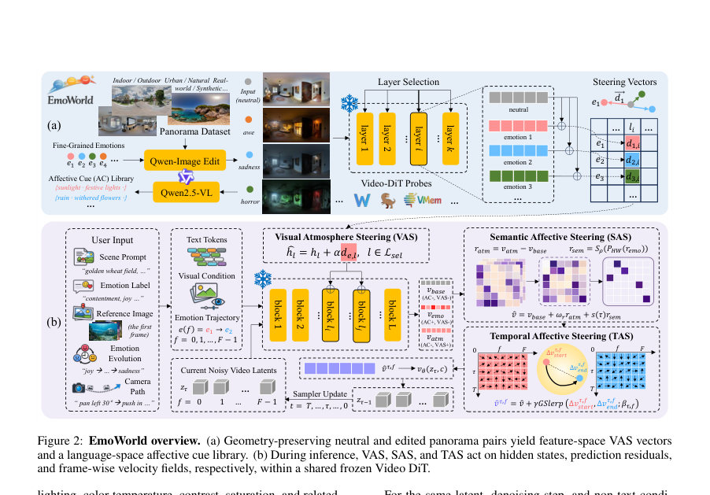
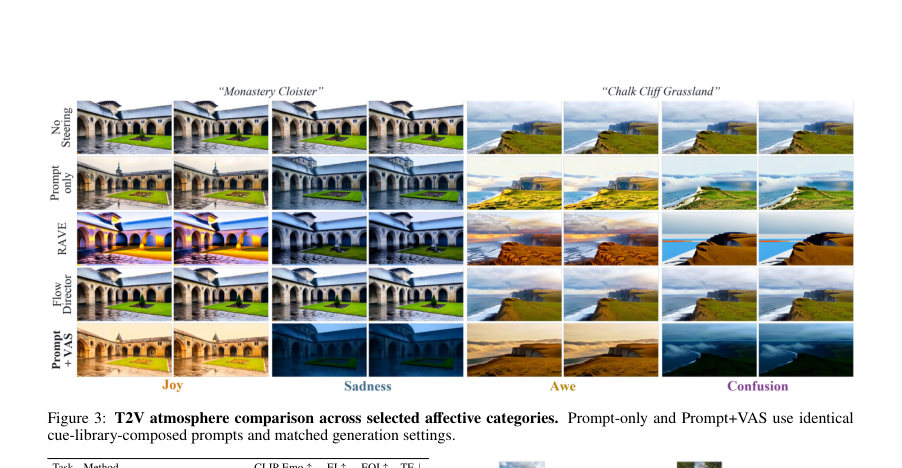

# EmoWorld: A Decoupled Affective Field for Controllable Emotional Video Generation

- **게시일:** 2026-08-09
- **arXiv:** [2608.06231v1](http://arxiv.org/abs/2608.06231v1) · [PDF](https://arxiv.org/pdf/2608.06231v1)
- **저자:** Bingyuan Wang, Baistan Zhyldyzbekov, Kunyu Feng, Zeyu Wang
- **분야:** cs.CV
- **선정 점수:** 3.27
- **선정 이유:** 최근성 0.5, 인용 영향 0.0 (인용 0회), 저자 영향 0.0 (최고 h-index 0), AI 주제 적합성 2.0, 개발자 관심 0.2, 학술 신호 0.6, 오픈 웨이트·주요 연구조직 신호 0.0

[← 2026-08-09 목록으로 돌아가기](../daily/2026-08-09.html)

<!-- paper-visuals:start -->
## 주요 Figure

> 원문 PDF에서 실제 Figure 캡션과 그림 영역이 함께 확인된 자료만 자동 추출했다.

*Figure · 원문 PDF 2쪽 · Figure 1: EmoWorld capabilities.*

*Figure · 원문 PDF 4쪽 · Figure 2: EmoWorld overview. (a) Geometry-preserving neutral and edited panorama pairs yield feature-space VAS vectors*

*Figure · 원문 PDF 6쪽 · Figure 3: T2V atmosphere comparison across selected affective categories. Prompt-only and Prompt+VAS use identical*

<!-- paper-visuals:end -->

## 한 문장 요약

EmoWorld은 기학(geometry)을 보존한 중립·감정 편집 파노라마 쌍에서 추출한 레이어별 특성 방향(feature directions)과 언어-공간 단서를 이용해, 고정된 flow-matching Video DiT를 재학습 없이 조작하여 전역 분위기(atmosphere), 감정표현을 담는 국소적 시맨틱 단서(semantic cues), 그리고 시간적 감정 전개를 분리해 제어하는 프레임워크이다.

## 해결하려는 문제

기존 텍스트-조건만을 통해 감정 제어를 시도하면 전역 색조·조명(분위기), 장면 내의 감정을 전달하는 국소적 시각 단서(예: 비, 전등, 시든 식물), 그리고 시간적 변화를 한 채널에 억지로 넣게 되어 결과물이 일반적 색 보정에 그치거나(약한 시맨틱 신호), 시간적으로 불연속하거나(급격한 변화) 목표 감정과 정렬되지 않는 문제가 있다. 또한 감정-쌍으로 된 동일한 장면의 비디오 데이터는 희소하고, 비디오 생성기 재학습 없이 감정 제어를 세밀하게 분리·조절하는 방법이 부족했다.

## 핵심 기여

- 감정 제어를 전역 분위기(Visual Atmosphere), 국소적 감정 단서(Semantic Affective Cues), 시간적 전개(Temporal Affective Steering)로 분리된 ‘디커플드(Decoupled) affective field’로 정식화한 점.
- 기하학 보존(geometry-preserving)된 중립/감정 편집 파노라마 쌍으로부터 Video-DiT의 레이어별 feature 차이를 평균화해 VAS용 steering 벡터를 추출하고, 차이-인지 멀티모달 VLM(Qwen2.5-VL)로부터 재사용 가능한 affective cue 라이브러리를 만든 일회성 준비 절차(paired multimodal preparation)를 제안한 점.
- 학습 없이 고정된(frozen) Video DiT 내부에 개입하는 세 가지 연산자 제안: VAS(레イヤ별 은닉 상태 주입으로 전역 분위기 제어), SAS(텍스트-유도 예측 잔차를 프레임·공간 차원에서 중심화·희소화하여 국소적 단서를 독립적으로 스케일링), TAS(엔드포인트 잔차장을 denoising-프레임 좌표 위에서 great-circle 보간하여 부드러운 감정 전개 생성).
- 포괄적 평가(27개 감정 분류, T2V/I2V, 백본 이식성, 카메라 조건 컴포지션, 인간 주관 평가)를 통해 각 연산자가 목표 제어 항목에 대해 정량·정성 개선을 보였음을 입증한 점. 

## 접근 방법

* 구성요소 및 절차 요약: - 준비 단계(offline paired preparation): LayerPano3D에서 가져온 649개 파노라마와 각 파노라마당 Qwen-Image-Edit 변형 5종(총 3,245 편집)을 사용.
* 각 감정 e와 레이어 l에 대해 고정된 Video-DiT로 중립/감정 편집 파노라마를 순회해 레이어별 feature 차이를 계산·평균화하고 정규화하여 감정·레이어별 steering 벡터 de,l을 생성(VAS용).
* 동시에 Qwen2.5-VL에 중립/편집 쌍과 감정 라벨을 넣어 변화만 기술하도록 요청해 atomic한 atmosphere/semantic descriptor들을 추출·정규화하여 감정별 affective cue 라이브러리 Ce를 구성(SAS용).
* - 추론(인퍼런스): 입력은 장면 프롬프트 pb, 목표 감정 e(또는 감정 궤적), 선택적 참조 이미지/카메라 경로.
* Cue Retrieval: Ce에서 장면-호환 단서를 골라 pe(감정-증강 프롬프트)를 구성.
* 공통된 동결 생성기(예: Wan2.2-5B)를 사용하되 세 연산자는 서로 다른 위치에서 작동하며 필요에 따라 조합됨.
* VAS(Visual Atmosphere Steering): 선택된 transformer block의 feature hook(예: self-attn 입력 블록 {0,5,10,15,20,25,29} 및 late cross-attn 출력 블록 {15,20,25,29})에 레이어·감정별 정규화 벡터 de,l을 방송(broadcast)하고, 경로별 게인 γ(q,f)e,l,r로 강도를 스케줄링하여 은닉 상태를 수정함.
* VAS의 출력-공간 잔차 ratm = v_b^VAS - v_b_base로 정의되어 분위기 성분을 표현한다.
* SAS(Semantic Affective Steering): 감정-증강 프롬프트 pe와 기본 프롬프트 pb로 동일한 잠재/노이즈에서 완전한 forward를 실행해 vb, ve를 얻고, r = ve - vb 에 대해 프레임별 공간 평균을 빼는 투영 PHW(프레임·공간 중심화)를 적용한 뒤, 전체 텐서(C×F×H×W)에서 크기 상위 ρ분위(ρ = 0.20 기본값)의 좌표만 남기는 희소화 Sρ를 수행하여 r_sem을 얻음.
* 이 r_sem은 따로 λ_sem으로 스케일링하고 warmup–hold–fade 일정 s(ξ)으로 타임스텝별 활성화하여 최종 예측에 독립적으로 합성(구성식: v = v_uncond + w(vb - v_uncond) + λ_sem s(ξ) r_sem + w r_atm).
* TAS(Temporal Affective Steering): 시작·종료 감정에 대해 VAS가 적용된 조건성 예측으로부터 프레임·denoising 스텝 쌍(q,f)상의 잔차장 ∆v_{q,f}^{e1}, ∆v_{q,f}^{e2}를 구함.
* 각 프레임을 평탄화해 벡터 z1,z2로 변환하고, 방향은 단위구면에서 great-circle 보간(GSlerp)으로 보간하고 크기는 별도로 선형 보간하여 각 (q,f)에 대해 보간된 잔차장을 얻음(β_{q,f}는 사용자 지정 narrative profile을 denoising 축에서 완화·프레임 축에서 평활화한 좌표장).
* 보간된 v_{q,f}^{TAS}를 샘플러에 전달하여 시간적인 감정 전개를 생성함.
* 구현·하이퍼파라미터(본문·부록에서): 기본 CFG w=5.0, Wan2.2 출력 해상도 832×480, 49프레임, VAS strength T2V 0.18(평균실험값), I2V 0.15, SAS ρ=0.20 λ_sem=5.0 warmup a=0.05 fade-start b=0.65, TAS 40 steps VAS strength 0.22 등.

## 주요 결과

- 데이터·범위: 27개 감정(Cowen–Keltner 분류), 649 LayerPano3D 파노라마, 3,245 편집 관측치로 affective cue 라이브러리 및 VAS 벡터 구성.
- 단일-감정 전역 분위기 제어(T2V, 표준화된 교차-시스템 하위집합): Prompt-only에서 Prompt+VAS로 바꿀 때 CLIP-Emo가 0.168 → 0.200으로 개선(상대 +19%), temporal-fluctuation proxy(TF)는 1.22 → 0.63으로 감소(약 −48%). (Table 1)
- I2V 분위기 제어(동일 하위집합): Prompt+VAS가 CLIP-Emo 0.162 → 0.171로 개선(표에 보고된 macro 평균).
- 시맨틱 단서 제어(SAS 고립 평가): Cue+VAS → Cue+VAS+SAS 비교에서 CLIP-Emo가 0.155 → 0.212로 증가(상대 +36.9%), 검출된 affect-bearing cue 평균 개수가 프레임당 2.57 → 3.50로 증가(상대 +36.1%).
- 시간적 감정 전개(TAS): TAS가 가장 강한 기준선 대비 전환 monotonicity 0.788(본 논문 TAS) vs 0.687(강한 baseline EFM)로 개선; T2V endpoint alignment는 0.207(ours) vs 0.163(Static start) 등으로 개선(Table 2). 부가: GSlerp(대각선-대체 보간)과 LERP 비교에서 GSlerp는 거시 평균에서 monotonicity 0.558 vs 0.053, smoothness 0.439 vs 0.141로 유의한 개선을 보임(부록 Table 6). - 사람 주관 평가: VAS(대기호감 전달)에서 Prompt+VAS 선호율 66.0% (95% CI [59.8%,72.1%]) 등, SAS(시맨틱 단서 실현) 63.2%, TAS(전환 명료성) 71.4%로 각 연산자 수준의 지각적 개선이 통계적으로 유의하게 관찰됨(부록 D, Holm-adjusted p < 0.003). - 백본 이식성·계산비용: CogVideoX-5B에도 백본별 추출·훅 설정으로 원리 이식 가능(Table 14). 런타임 영향을 측정한 결과 VAS는 기본 대비 +3.5% 런타임(20 steps), SAS(한 번의 추가 DiT 호출)는 +32.2%, TAS(40 steps, 3예측/스텝)는 약 1.975× 런타임 증가(부록 Table 5).

## 한계

- 저자 명시 한계: EmoWorld는 주로 환경·장면 수준의 감정(환경적 affect)을 제어하며 얼굴 표정, 캐릭터 행동이나 서사적 인과성(narrative causality)은 주로 다루지 못함. 또한 오프라인 쌍 편집(paired edits), 백본별 특징(steering vector) 추출, 그리고 다중 포워드(여러 forward pass)를 요구함. 저자들은 인간 중심 평가, 영역 인식(region-aware) 제어, 효율적인 공동 추론(joint inference) 등을 향후 과제로 명시함.
- 실험·절차로부터 확인되는 제약(합리적 추론): - 계산 비용·추론시간: SAS와 특히 TAS는 각 denoising 스텝당 여러 번의 생성기 호출을 필요로 하여 실시간/대규모 배포에 부담(예: TAS는 기본 대비 약 1.975× 런타임). - I2V(참조 이미지 제약)가 T2V보다 감정 정렬 개선 폭이 작음(부록과 Table 13에 일부 카테고리는 작은 변화 또는 음수 변화). - 구조 보존과 단서 실현 간의 트레이드오프: 일부 사례에서 Edge-SC(인접 프레임 엣지 일관성)는 SAS 적용 시 감소하여(예: butterfly-dome 예시) 새로운 시맨틱 단서 실현과 원본 구조 보존 사이의 균형 필요. - 자동 메트릭 의존성: 결과의 많은 부분이 CLIP-Emo, Grounding DINO, DINOv2 등 신경 임베딩 기반 지표에 의존하므로, 인간 심리적 감정 인식과의 정합성은 추가적 인간 평가가 필요할 수 있음.

## 개발자 관점

- 재현에 필요한 핵심 자원: LayerPano3D 파노라마(논문은 649개 사용)와 편집 변형(논문은 편당 5개), Qwen2.5-VL(차이-인지 VLM), 고정된 Video-DiT 백본(예: Wan2.2-5B) 및 백본별 훅 위치 정보(부록에 훅 블록 인덱스 명시). 준비 단계에서 steering 벡터와 cue 라이브러리는 한 번 오프라인으로 계산·보관하면 재사용 가능하다.
- 하이퍼파라미터·운영 팁: 기본 CFG(w)=5.0, 출력 해상도 832×480, 49프레임을 기준으로 VAS strength T2V≈0.18, I2V≈0.15, SAS retention ratio ρ=0.20, λ_sem≈5.0, SAS 스케줄 warmup a=0.05 fade-start b=0.65, TAS는 40 steps와 VAS strength 0.22 등 논문 부록에 구체값이 기재되어 있어 이를 출발점으로 민감도 실험 권장.
- 성능·비용 균형 설계: VAS는 런타임 오버헤드가 작아(약 +3.5%) 프로덕션 적용 가능성이 높고 전역 분위기 제어에 효과적. 반면 SAS(추가 예측 호출)와 TAS(예측 수·스텝 증가)는 계산비와 메모리·시간 비용 증가가 크므로 배포 시 배치 처리, 캐시된 벡터·프롬프트 사용, 또는 추론 단계 축약(스텝 수 조정, 희소화 비율 조정)로 비용 절감 고려 필요.
- 안전·거버넌스 고려사항: 감정 조작 컨텐츠는 윤리적·사회적 영향(예: 잘못된 정서 유도) 가능성이 있으므로 배포용 인터페이스에 투명한 제어 표시(어떤 감정·단서를 어떤 강도로 적용했는지), 사용자 동의 및 악용 방지 정책을 포함할 것을 권고.
- 공학적 구현 팁: VAS 벡터는 레이어·감정별로 정규화해 저장하면 다양한 초기화(seed)와 프롬프트에 재사용 가능. SAS의 PHW(프레임별 공간 중심화)와 Sρ(글로벌 magnitude threshold)는 구현상 효율적으로 텐서 평탄화 후 top-k threshold로 계산하면 됨. TAS의 GSlerp는 방향 보간과 크기 선형 보간을 분리하는 수치적 예외(near-zero, 거의 평행/대척점) 처리가 필요함(논문에 구현 언급). GPU 메모리: 논문 측정환경은 NVIDIA RTX 6000 Ada 48GB, 전체 peak alloc ≲23.2GB로 보고되어 있어 대형 GPU 필요는 아니나 계산량은 높음.

**근거 범위:** 이 분석은 제공된 논문 PDF 본문(메인 텍스트 및 부록)을 근거로 작성되었다. 모든 정량값·설정·하이퍼파라미터·데이터 규모는 본문과 부록에 명시된 수치만을 사용했으며, 구현 세부(예: 소스코드, exact prompt 템플릿 문자열)가 PDF에 포함되지 않아 그런 항목은 재현 지시로만 정리하였다. 본문 외부의 숨겨진 실험 재현 결과나 코드 베이스는 확인하지 못했으므로 실제 구현 시 부록의 매니페스트·프로토콜 파일과 원저자 코드(있다면)를 참조하면 좋겠다.
