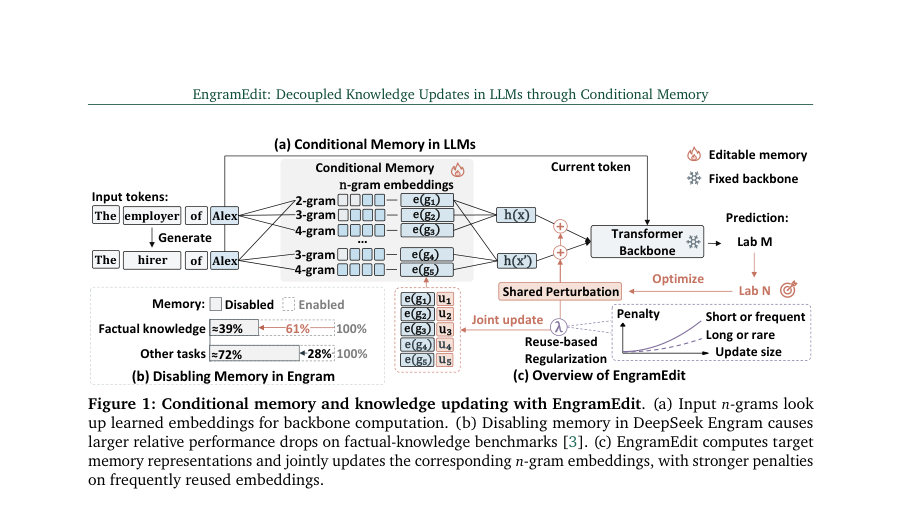
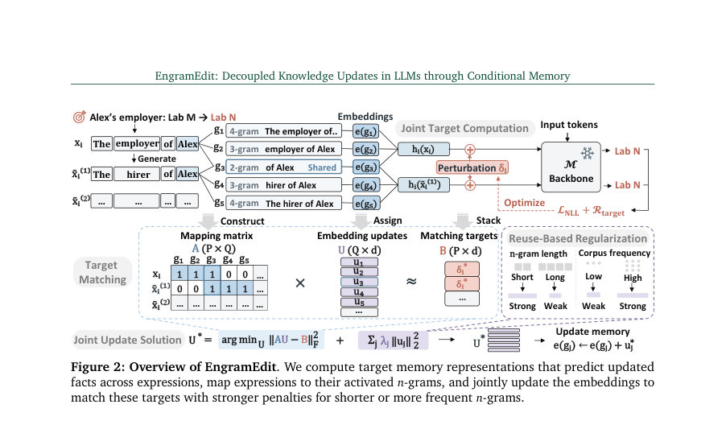
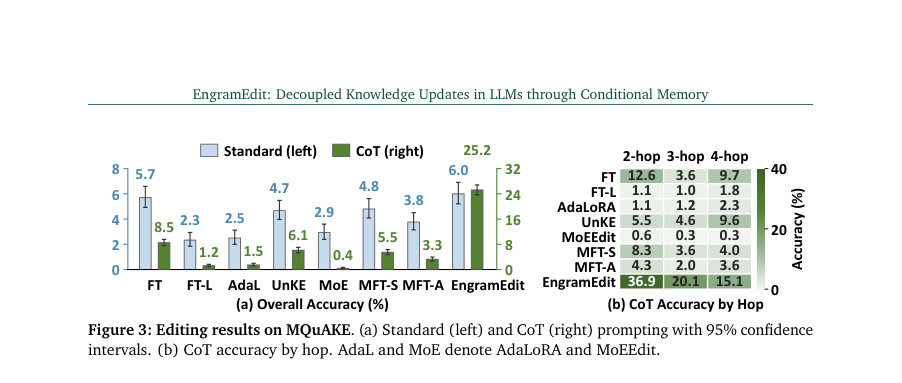

# EngramEdit: Decoupled Knowledge Updates in LLMs through Conditional Memory

- **게시일:** 2026-10-08
- **arXiv:** [2610.10533v1](http://arxiv.org/abs/2610.10533v1) · [PDF](https://arxiv.org/pdf/2610.10533v1)
- **저자:** Hongru Cai, Ran Wei, Wenjie Wang, Chengfa Wu, Ning Song, Yongqi Li, Wenjie Li
- **분야:** cs.CL
- **선정 점수:** 5.81
- **선정 이유:** 최근성 1.4, 인용 영향 0.0 (인용 0회), 저자 영향 0.0 (최고 h-index 0), AI 주제 적합성 2.1, 개발자 관심 0.2, 학술 신호 0.6, 오픈 웨이트·주요 연구조직 신호 1.6

[← 2026-10-08 목록으로 돌아가기](../daily/2026-10-08.html)

<!-- paper-visuals:start -->
## 주요 Figure

> 원문 PDF에서 실제 Figure 캡션과 그림 영역이 함께 확인된 자료만 자동 추출했다.

*Figure · 원문 PDF 2쪽 · Figure 1: Conditional memory and knowledge updating with EngramEdit. (a) Input 𝑛-grams look*

*Figure · 원문 PDF 4쪽 · Figure 2: Overview of EngramEdit. We compute target memory representations that predict updated*

*Figure · 원문 PDF 8쪽 · Figure 3: Editing results on MQuAKE. (a) Standard (left) and CoT (right) prompting with 95% confidence*

<!-- paper-visuals:end -->

## 한 문장 요약

EngramEdit은 입력 n-그램 기반의 조건부 메모리(Engram)에서 수정하고자 하는 사실을 여러 표현으로 유도해 목표 메모리 표현을 계산한 다음, 표현들이 공유하는 n-그램 임베딩들에 대해 공동 최적화(재사용 기반 정규화 포함)를 수행하여 변형 가능한 지식 업데이트를 구현하는 방법이다.

## 해결하려는 문제

조건부 메모리(𝑛-gram 임베딩)를 쓰는 LLM에서는 사실 저장이 Transformer 백본과 분리되어 있을 가능성이 있어 백본을 고정한 채 사실을 업데이트할 수 있는 잠재력이 있으나, 실제로는 1) 서로 다른 표현이 서로 다른 𝑛-그램을 활성화해 동일 사실을 표현할 때 업데이트가 전파되지 못하는 일반화 문제, 2) 여러 편집이 동일 임베딩을 공유하면 충돌이 발생해 효용이 떨어지는 문제(Efficacy), 3) 짧고 자주 재사용되는 𝑛-그램을 변경하면 관련 없는 예측이 손상되는 특이성(Specificity) 문제가 있어 조건부 메모리를 통한 ‘독립적이고 보존성 있는 지식 업데이트’가 어렵다.

## 핵심 기여

- EngramEdit 알고리즘 제안: 여러 표현에 대해 공동으로 목표 메모리 표현(target memory representation)을 계산하고, 표현들이 활성화하는 공유 𝑛-그램 임베딩들에 대해 하나의 공동 업데이트를 풀어 적용하는 프레임워크를 제시함.
- 재사용 기반 정규화(reuse-based regularization): 𝑛-그램 길이 및 말뭉치 빈도를 이용해 짧거나 자주 재사용되는 𝑛-그램에 대해 더 강한 페널티를 부과하여 비관련 지식 보존을 도모함.
- 수학적 성질 및 해석 제공: 합계( sum ) 집계 하에서 AU ≈ B 목표와 가중 정규화를 결합한 선형 시스템의 닫힌형 해(U* = (A^T A + Λ)^{-1} A^T B)를 유도하고, 해의 고유성, 최소 업데이트 비용 성질, 목표 변화에 대한 안정성 등을 증명함(부록에 증명 제공).
- 광범위한 실험적 검증: LongCat-Flash-Lite를 대상으로 CounterFact, ZsRE, MQuAKE 등에서 연속 편집(최대 5,000 사례)을 수행해 높은 편집 성공률과 교차표현 일반화, CoT 기반 다중 홉 추론에서의 실용성, 그리고 일반 능력 보존을 보임.
- 실제 사용성 분석: 생성된 표현의 역할, 편집 시 메모리 활성화 분석, 특정 업데이트 비활성화 실험 등을 통해 수정된 지식이 실제로 메모리 업데이트에 의해 사용됨을 입증하고, 실패가 대부분 교차-편집으로 공유되는 소수의 𝑛-그램에 집중됨을 보임.

## 접근 방법

* EngramEdit의 절차(논문 본문 기준):
* 표현 생성: 각 편집 e_i에 대해 모델 M으로부터 K개의 동의어적(문장 재표현) 표현들을 생성해 원본 편집 프롬프트와 합쳐 X_i를 구성(본문 기본값 K=4).
* 이 집합은 메모리 매핑 및 목표 계산에 사용됨.
* 목표 메모리 표현 계산(Joint Target Computation): 각 표현 x∈X_i의 마지막 주체(subject) 토큰 위치 q_i(x)에서 현재의 메모리 표현 h_i(x)=h(x,q_i(x))를 얻고, 모든 표현에 같은 학습가능한 공유 퍼터베이션 δ_i를 임시로 더한 뒤(모델 파라미터 고정) 편집 대상 정답 o*_i에 대한 NLL을 평균한 손실을 δ_i만 최적화해 δ*_i를 얻는다(정규화 R_target 포함, ∥δ_i∥₂ ≤ ρ∥h_i(x_i)∥₂로 노름 클램프).
* 목표 표현은 h*_i(x)=h_i(x)+δ*_i.
* 메모리 매핑(Memory Mapping): 각 표현의 마지막 주체 위치에서 활성화되는 𝑛-그램 집합 G_i(x)를 수집하고, 배치 전체에서 중복을 제거해 Q개의 고유 𝑛-그램 {g_j}₁..Q을 만든다.
* 표현-임베딩 관계를 표시하는 매핑 행렬 A∈ℝ^{P×Q}(P은 모든 편집-표현 쌍 수)를 구성하며 A_{p j}=1이면 표현 p가 𝑛-그램 j를 활성화한다.
* 공동 임베딩 업데이트 할당(Joint Update Allocation): 합계 집계(sum aggregation)를 가정하면 각 표현의 목표 변화 b_p(=δ*_i_p)와 임베딩 업데이트들 u_j는 AU ≈ B 관계를 만족해야 한다.
* 각 임베딩 업데이트 u_j에 대해 재사용 기반 가중치 w_j(𝑛-그램 길이와 말뭉치 빈도로 결정)를 사용해 Λ=diag(λ_j)로 정규화(λ_j = λ_reuse w_j + λ_ridge) 항을 추가한다.
* 최종 목적은 \|\|AU - B\|\|_F^2 + Σ_j λ_j \|\|u_j\|\|_2^2를 최소화하는 U로, 해는 U*=(A^T A + Λ)^{-1} A^T B의 닫힌형 해로 계산된다.
* 메모리 적용: 각 임베딩 e(g_j) ← e(g_j) + u*_j로 갱신(백본과 다른 파라미터는 고정).
* 추론 시 해당 𝑛-그램이 활성화될 때만 업데이트가 모델 계산에 반영됨.
* 추가 설계: 재사용 기반 가중치는 짧거나 빈도가 높은 𝑛-그램에 더 큰 페널티를 주어 관련 없는 영향 최소화.
* 부록에서 context-aware gated aggregation으로의 확장과 여러 이론적 성질을 다룸.

## 주요 결과

- 데이터셋·환경: 모든 실험은 LongCat-Flash-Lite 모델에서 수행됨. 순차 편집(batch 단위) 실험: CounterFact 및 ZsRE에서 2,000 편집, 일부 실험 및 안정성 확인은 5,000 편집까지 확장. MQuAKE에서는 3,000 케이스로 다중 홉 활용성 평가(표준/CoT 프롬프트). 비교 대상 편집기: FT, FT-L, AdaLoRA, UnKE, MoEEdit, Memory-FT(Subject/All tokens).
- CounterFact (2,000 sequential edits): EngramEdit은 Efficacy 99.5±0.31%, Generalization 97.0±0.69%, Specificity 85.2±0.92%, Utility(평균) 93.9을 달성해 비교 기법 대비 높은 종합 성능을 보임(표 1).
- ZsRE (2,000 sequential edits): EngramEdit은 Efficacy 97.3±0.40%, Generalization 93.7±0.79%, Specificity 38.3±1.18%, Utility 76.4로 다른 편집기 대비 Efficacy와 Generalization에서 우위.
- 다중 홉 활용성(MQuAKE): 표준 프롬프트에서는 EngramEdit과 FT가 유사한 정확도이나, CoT(추론 과정 제시) 프롬프트에서는 EngramEdit이 강력한 개선을 보이며 "거의 3배(near 3×)" 정도로 최강 베이스라인 대비 CoT 정확도를 향상시킴(본문 설명).
- 일반 능력 보존: 5,000 sequential CounterFact 편집 동안 여섯 일반-능력 태스크(예: SST, MRPC, CoLA, RTE, MMLU, NLI)의 평균 F1을 측정한 결과 EngramEdit은 사전 편집 대비 평균 F1의 96% 이상을 유지(본문: 'over 96% of its pre-edit mean F1 after 5,000 edits'). 특정 태스크(MRPC)에서 다소 하락이 관찰됨(문장 유사성 판단 민감).

## 한계

- 저자가 명시한 한계: 다른 조건부 메모리 아키텍처 및 더 큰 모델 규모에서의 적용성, 더 많은 사실을 더 높은 빈도로 효율적·안정적으로 업데이트하는 문제는 향후 연구 과제로 제시됨(논문 결론 및 향후 연구).
- 실험적 제약(본문에서 확인 가능한 제약): 모든 실험은 LongCat-Flash-Lite 기반과 Engram 계열의 설정에서 수행되었으므로, 다른 조건부 메모리 구현이나 대형 상용 아키텍처에서 동일 성능이 보장되지는 않음.
- 모델 및 집계 가정: 주요 수학적 유도와 닫힌형 해는 합계(sum) 집계를 전제로 전개되었음(문헌은 context-aware gated aggregation 확장 가능성을 부록에서 다루나 본문 핵심은 sum 기반 유도).
- 공유(충돌)로 인한 실패: 편집 실패는 소수의 교차-편집 공유된 𝑛-그램에 집중되어 있음(본문 분석). 즉, 동일 임베딩을 여러 사실이 공유하면 상충 가능성이 남아 있음(해결은 정규화 완화/추가 메커니즘 필요). 또한 일부 검증되지 않은 패러프레이즈가 어떤 경우엔 업데이트된 임베딩을 전혀 활성화하지 않아 일반화 실패를 유발함(본문: 일부 held-out paraphrases activating no fact-related embeddings가 전체 실패의 큰 부분을 차지).

## 개발자 관점

- 구현 요지: 편집 파이프라인은 (1) 편집별 여러 생성 표현 수집(K≈4 권장), (2) 각 표현의 마지막 주체 위치에서 메모리 표현 추출, (3) 편집별 공유 퍼터베이션 δ 최적화(제한된 노름), (4) 표현↔𝑛-그램 매핑 행렬 A 구축, (5) (A^T A + Λ)^{-1} A^T B로 닫힌형 해 계산해 임베딩 갱신 순으로 구성됨. 부록 Algorithm 1에 전체 절차 요약이 있음.
- 필요한 데이터·메타정보: 𝑛-그램별 말뭉치 빈도와 𝑛-그램 길이 정보를 계산해 재사용 기반 가중치 w_j를 만들고, 이로 λ_j를 구성해야 함. 또한 편집 배치당 고유 𝑛-그램(Q)의 수와 차원 d에 따라 선형 시스템 크기(Q×Q)에 의한 계산·메모리 비용이 결정되므로 배치 크기(논문은 배치 100 사용)를 적절히 설정해야 함.
- 계산 비용·스케일링: 전체 모델 파라미터를 업데이트하지 않고 임베딩 테이블만 갱신하므로 전통적 FT보다 비용이 낮으나, 공동 업데이트의 선형 시스템(크기 Q×Q) 역행렬 계산 비용은 무시할 수 없음. 실무에서는 정규화 Λ가 양의 정부호를 보장하므로 수치적으로 안정된 선형 시스템 솔버(예: Cholesky)를 사용해야 함.
- 안전·배포 지침: 편집 권한 통제, 편집 전 검증(수정된 사실의 검증), 감사 로그 유지가 필요. 논문 윤리 진술에서 변경 가능한 지식이 악용될 수 있음을 명시하므로 운영 환경에서는 편집 권한 및 검증 절차를 엄격히 설계할 것.
- 재현성·검증: 저자 코드를 공개(리포지터리 링크 제공)하므로 동일 환경(LongCat-Flash-Lite, 제공된 기본 하이퍼파라미터 λ_reuse=0.05, λ_ridge=0.01, clamp ρ=32, editable n-gram lengths 2–4 등)을 사용해 재현 가능. 단, 실제 적용 시 말뭉치 빈도 산출, 𝑛-그램 해시/샤딩 구현 등 구현 세부는 아키텍처별로 달라질 수 있음.

**근거 범위:** 이 분석은 제공된 논문 PDF 본문(주요 본문과 부록에서 직접 인용된 표·수식·설명)을 기반으로 작성되었다. 본문에서 제시된 수치(예: 표의 평균±95% CI, 하이퍼파라미터 기본값)는 PDF에 명시된 값을 사용했으며, 구체적 프롬프트 텍스트나 구현 세부(해시·서브테이블 구성 등)는 부록/코드 레포지토리에서 확인해야 정확하다. 일부 확장 설명(예: 합계 집계 가정, context-aware 확장 내용의 유무)은 본문과 부록의 기술을 근거로 구분해 기재했다.
