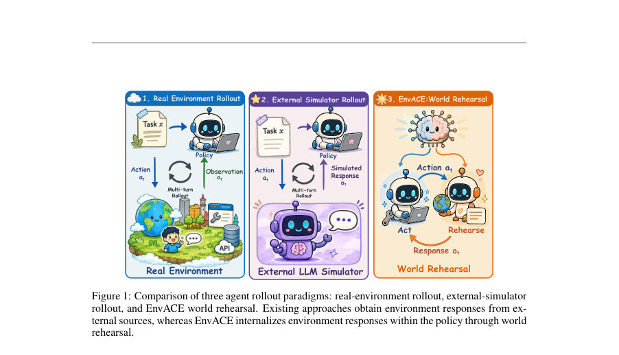
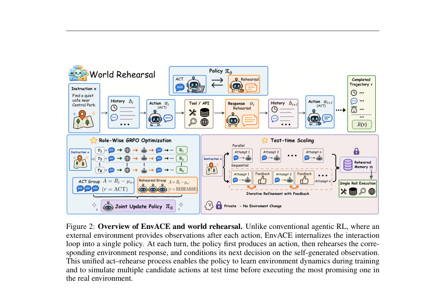
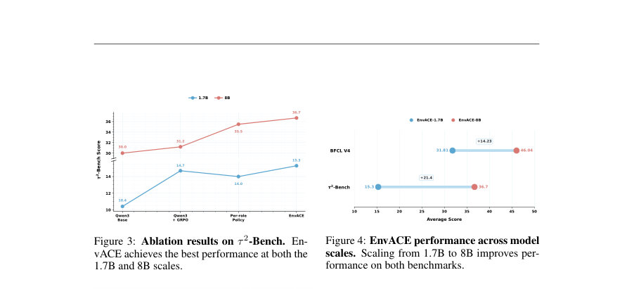

# EnvACE: Internalizing Environment Dynamics via World Rehearsal for Agentic Reinforcement Learning

- **게시일:** 2026-08-07
- **arXiv:** [2608.06197v1](http://arxiv.org/abs/2608.06197v1) · [PDF](https://arxiv.org/pdf/2608.06197v1)
- **저자:** Zishan Xu, Zhiyuan Yao, Yuxin Chen, Yifu Guo, Zhengxi Lu, Yuquan Lu, Jinyang Huang, Yan Xu, Yasheng Wang, Weinan Zhang, Xingshan Zeng, Weiwen Liu
- **분야:** cs.AI
- **선정 점수:** 13.21
- **선정 이유:** 최근성 1.4, 핵심어: large language model, 핵심어: llm, 핵심어: agent, 핵심어: scaling

[← 2026-08-07 목록으로 돌아가기](../daily/2026-08-07.md)

<!-- paper-visuals:start -->
## 주요 Figure

> 원문 PDF에서 실제 Figure 캡션과 그림 영역이 함께 확인된 자료만 자동 추출했다.

*Figure · 원문 PDF 2쪽 · Figure 1: Comparison of three agent rollout paradigms: real-environment rollout, external-simulator*

*Figure · 원문 PDF 4쪽 · Figure 2: Overview of EnvACE and world rehearsal. Unlike conventional agentic RL, where an*

*Figure · 원문 PDF 8쪽 · Figure 3: Ablation results on τ 2-Bench. En-*

<!-- paper-visuals:end -->

## 한 문장 요약

EnvACE는 정책이 '행동'과 '세계(환경) 리허설' 두 역할을 번갈아 수행하도록 학습시켜 외부 환경 쿼리 없이 환경 반응을 정책 파라미터로 내재화하고, 역할별 GRPO로 두 역할을 공동 최적화하는 agentic 강화학습 방법이다.

## 해결하려는 문제

기존 대형 언어모델(LLM) 기반 에이전트 학습은 실제 실행 가능한 환경을 구축하거나 외부 시뮬레이터에 의존해 도구 호출의 응답을 얻는데, 환경 합성·검증 비용이 크고 시뮬레이터 응답은 부정확하거나 접지(grounding)가 필요해 정책이 환경 동역학을 직접 학습하지 못한다는 한계가 있다. 본 연구는 외부 환경 상호작용 없이 정책이 스스로 환경 반응을 생성·학습(=world rehearsal)하여 환경 동역학을 내부화하면 장기 도구 사용·상태유지(task-success)에 더 효과적인 에이전트를 얻을 수 있는지에 대해 묻는다.

## 핵심 기여

- world rehearsal 개념 제안: 정책이 행동(ACT)과 환경 응답 생성(REHEARSE)을 번갈아 수행하여 환경 동역학을 정책 파라미터로 내재화하는 학습 패러다임을 제시함.
- EnvACE 알고리즘: 단일 공유정책 πθ가 두 역할을 수행하도록 설계하고, 역할별 보상 기준(role-wise baseline)을 이용한 역할별 GRPO로 행동과 리허설을 공동 최적화하도록 한 방법을 제시함.
- 테스트타임 스케일링: 학습된 정책의 내부화된 세계모델로 N번의 사적 리허설(병렬/순차)을 수행해 최종 실행을 결정하는 테스트타임 전략을 제안함.
- 광범위한 실험평가: BFCL-v4, τ2-Bench, VitaBench, FinMCP-Bench 등에서 EnvACE가 대표 환경-확장(EnvScaler, AWM 등) 및 GRPO 기반 기준선보다 일관되게 우수한 성능을 보였음을 보고함.
- 역할 파라미터 공유의 유효성·모델 규모 확장성 검증: acting과 rehearsal의 파라미터 공유가 성능 개선을 가져오며(예: τ2-Bench에서 +1.2%), 1.7B→8B로 확장 시 성능 향상이 크게 나타남. 

## 접근 방법

* EnvACE는 단일 공유정책 πθ에 두 역할(ACT, REHEARSE)을 부여해 롤아웃을 정책 내부에서 자가 전개(self-unfolded)한다.
* 구체적 절차는 다음과 같다: 주어진 상호작용 히스토리 ht에서 acting 역할이 툴 호출(행동) at을 생성(at ∼ πθ(·\|ht,ACT)), 이어서 rehearsal 역할이 해당 행동에 대응하는 환경 응답 ŏt를 생성(ŏt ∼ πθ(·\|ht,at,REHEARSE))하고 이를 ht에 추가해 다음 행동을 결정하게 한다(ht+1 = ht ⊕ (at, ŏt)).
* 학습은 Group Relative Policy Optimization(GRPO)를 변형한 역할별(role-wise) GRPO를 사용한다.
* 각 instruction x에 대해 K개의 롤아웃을 수집하고, 동일 역할(r)에 속하는 모든 출력 Gx,r의 궤적 보상의 평균 µx,r을 역할별 기준선으로 삼아 각 출력 yi,m의 이점(Ai,m = Ri − µx,ri,m)을 계산한다.
* 공유정책 θ는 두 역할의 출력으로부터 클리핑된 GRPO 목적식(토큰 단위 likelihood ratio 포함)으로 공동 업데이트된다.
* 테스트 시에는 학습된 πθ로 N번의 사적 리허설을 병렬(parallel) 또는 순차(sequential)로 생성하고 각 리허설의 피드백을 요약해 rehearsal memory mx를 구성한 뒤, 이 메모리를 조건으로 외부 환경에 한 번만 커밋 실행한다.
* 구현·학습 세부: 주요 실험은 Qwen3-8B 백본으로 수행했고, 학습 스텝은 470, 학습률 1e-6, 배치 크기 16, 프롬프트당 4개의 롤아웃, KL 계수 1e-4, 엔트로피 계수 0.0, 매 스텝 64 인스턴스 샘플링, 최대 입력/응답 길이 12,000/8,000 토큰, 각 에이전트 궤적 최대 30턴, LLM 평가는 Qwen3-30B-A3B를 사용했으며 학습은 16개의 NVIDIA H20 GPU에서 verl 프레임워크로 실행함.
* 역할별 샘플링 온도 등 세부 설정은 실험표에 따라 조정됨(예: Table 3에서는 ACT/REHEARSE 온도 1.0, 나머지는 0.01 등).

## 주요 결과

- 전체 벤치마크(논문 정의된 Overall: BFCL V4 Avg., τ2-Bench Avg., VitaBench Avg. 평균)에서 EnvACE-8B는 Overall 32.91%로 EnvScaler-8B(31.92%)·AWM-14B(32.54%) 등을 제치고 최고 성능을 기록함(표 1).
- BFCL V4: EnvACE-8B 46.04% (Qwen3-8B 41.2~28.48% 등과 비교해 우수), τ2-Bench Avg: 36.7%, VitaBench Avg: 16.0%로 세부 벤치마크 전반에서 일관된 성능 향상 보고(표 1).
- FinMCP-Bench (표 2): EnvACE-8B는 TF1 46.78%로 가장 높고, 툴 정밀도(TP) 54.04%로 최고값을 보였음(툴 리콜(TR)은 41.23%).
- 대조 실험: τ2-Bench에서 표준 GRPO 대비 EnvACE는 평균 점수를 31.2%→36.7%로 +5.5%p 향상시켰고, acting/rehearse를 분리한 Per-role Policy 대비 파라미터 공유는 35.5%→36.7%로 +1.2%p 향상을 보였음(Fig.3).
- 모델 확장성: 1.7B→8B로 스케일 업 시 BFCL V4 평균 31.81%→46.04%(+14.23%p), τ2-Bench 15.3%→36.7%(+21.4%p)로 큰 개선 관찰(Fig.4). 학습 다이내믹(그레이디언트 과정)에서는 오프라인 평가가 step 50에서 30.0%에서 step 470에서 36.7%로 전반적 상승 추세를 보였음(Fig.5).

## 한계

- 저자 명시 한계: 계산 자원 제약으로 실험을 최대 8B 모델까지만 수행했으며(따라서 더 큰 모델에서의 효능은 추후 연구 대상), 평가가 주로 도구-인터랙티브(tool-interactive) 과제에 집중되어 다른 agentic 설정으로의 일반화는 추가 연구가 필요하다고 명시함.
- 본문·실험에서 확인되는 제약(합리적 관찰): 학습 스텝이 논문에서 470 스텝으로 비교적 짧으며(논문 설정 기준) 일부 실험(TTS 관련)은 계산 비용으로 단일 실행만 보고되어 결과의 분산·재현성 검증이 제한적임(Table 설명). 또한 테스트타임 리허설에서 큰 N(예: N=3 이상)일 때 입력 길이 증가로 인해 성능이 감소하는 현상이 관찰되어(논문 보고) 컨텍스트 길이에 민감함이 실용적 제약으로 보임.

## 개발자 관점

- 재현성: 코드 공개(깃허브 링크 제공)와 함께 주요 하이퍼파라미터가 본문에 제시되어 있어 재현 가능성이 높으나, 일부 실험(TTS)은 단일 실행만 보고되어 재현을 위해서는 랜덤 시드·여러 반복 실행이 필요함.
- 컴퓨팅·인프라: 훈련은 16×NVIDIA H20에서 verl 프레임워크로 수행되었고, 최대 입력/응답 길이가 각각 12k/8k 토큰으로 매우 긴 컨텍스트를 처리해야 하므로 대용량 GPU 메모리와 긴 시퀀스 처리 인프라가 필요함.
- 구현·튜닝 포인트: 역할별 보상 기준(role-wise baseline)과 공유 정책 설계(acting과 rehearsal의 파라미터 공유)는 성능에 민감하므로 역할별 이점 계산(µx,r)과 GRPO 클리핑(ϵ) 설정을 조심스럽게 튜닝해야 함.
- 운영·배포: 학습 시 외부 환경을 대규모로 합성·검증하는 비용을 줄일 수 있으나, 학습된 내부화된 세계모델이 잘못 일반화할 경우 실제 실행에서 오류를 유발할 수 있으므로(케이스 스터디는 리허설이 안전성 향상에 도움됨을 보임) 배포 전 소규모 실제 환경 검증이 권장됨.
- 테스트타임 정책: 학습된 모델으로 사적 리허설을 수행해 실행 전 후보 행동을 검증·수정할 수 있으나 리허설 예산(N)은 적정값(논문에서 N=2가 대표적 이득)을 유지해야 하며, 너무 많은 리허설은 입력 길이·컨텍스트 한계로 오히려 성능 저하를 초래함.

**근거 범위:** 이 분석은 제공된 논문 PDF 본문 전체(페이지 및 표·그림 포함)에 근거해 작성되었음. 표와 그림의 수치(예: Table 1–3, Table 2의 TR/TP/TF1, 학습 하이퍼파라미터, GPU 수 등)는 본문에서 직접 추출한 값이다. 다만 일부 실험(예: TTS)은 단일 실행만 보고되어 분산 관련 정보가 제한적이며, 논문 본문에 표기된 설정(예: '배치 크기 16'과 '매 스텝 64 인스턴스 샘플링'의 관계 등)은 추가 세부 구현에서 해석 여지가 있어 완전한 재현을 위해서는 공개 코드와 추가 구현 세부 확인이 필요하다.
