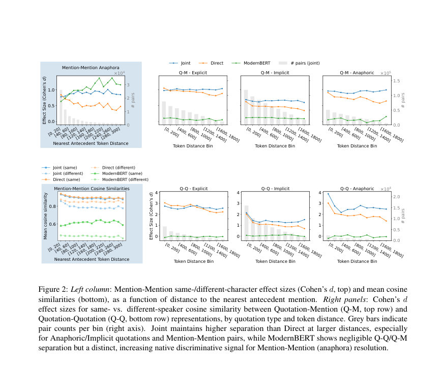
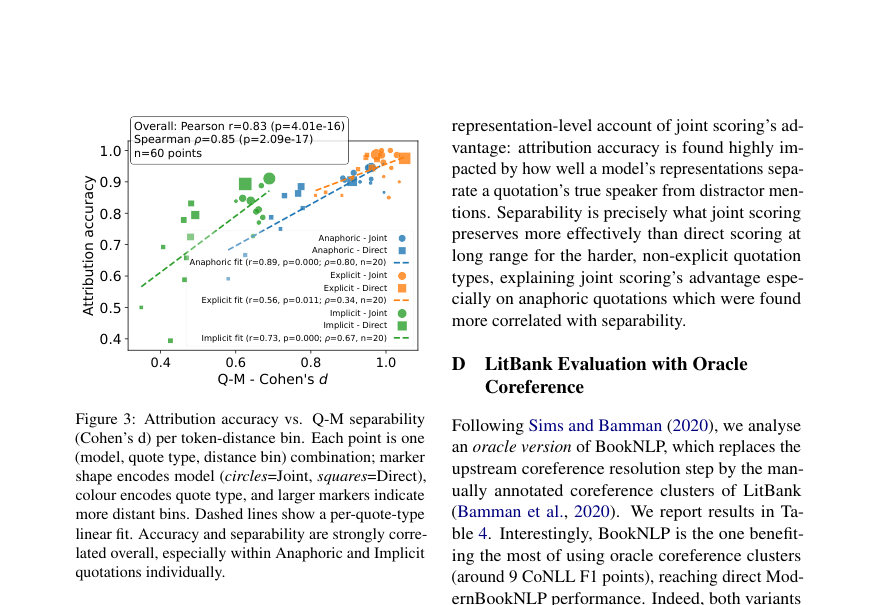

# Fast and Accurate Quotation Attribution in Literary Texts

- **arXiv:** [2608.02359v1](http://arxiv.org/abs/2608.02359v1) · [PDF](https://arxiv.org/pdf/2608.02359v1)
- **저자:** Gaspard Michel, Hugo Attali, Elena V. Epure
- **분야:** cs.CL
- **선정 점수:** 10.25
- **선정 이유:** 최근성 0.6, 핵심어: large language model, 핵심어: llm, 핵심어: efficient, 분야 가중치 2.0

### 한 문장 요약

공유 컨텍스트 창에서 다수의 인용-발화자 귀속을 함께 해결하는 span 기반의 joint scoring 엔코더 모델로 PDNC에서 SOTA 94.5%를 달성하고, 기존의 직접 점수화 방식보다 약 20배, LLM 기반 접근보다 1000배 이상 빠르게 처리한다.

### 해결하려는 문제

문학 텍스트에서 인용의 화자 귀속(quotation attribution)은 여전히 어려운 문제이며, 기존의 고정된 각 인용구를 독립적으로 예측하는 직접 점수화(direct scoring) 방식은 효율적이지만 정확도가 낮고, LLM 기반 접근은 높은 정확도를 달성하나 대규모 분석에 비현실적으로 비싸다. PDNC( Project Dialogism Novel Corpus)처럼 수천 개의 인용구를 포함하는 데이터에서 긴 맥락(window) 내 여러 인용구를 함께 해석하는 모델이 필요하다. 연구 문제는 이러한 한계를 넘어서, 긴 컨텍스트에서 다수의 attribution 결정을 공동으로 최적화할 수 있는 효율적이고 정확한 formalization을 제시하는 것이다.

### 핵심 기여

-  span 기반의 joint scoring 포맷을 제안하여 컨텍스트 윈도우 내 다수의 인용-발화자 매핑을 동시에 학습하고, PDNC에서 SOTA 성능을 달성하도록 한다(최고 Overall 정확도 94.5%).
-  동일한 인코더로 여러 인용/언급을 공유 컨텍스트에서 처리하는 다중-인스턴스 손실(Ljoint) 구조의 효율성 및 정확도 이점을 실증한다(기존 직접 점수화 대비 대략 4-5포인트 차이, 5×~20× 더 빠름; 2000 토큰 컨텍스트에서 특히 우수).
-  엔코더 선택(ModernBERT-large의 효과), 컨텍스트 크기(T)와 보폭(S), 그리고 언급 후보의 유형(코퍼런스 기반의 pronominal/nominal/named)을 포함한 핵심 설계 요인을 체계적으로 비교 분석한다.
-  representations 분석을 통해 joint scoring이 장거리의 앵커-발화자 연결 및 anaphora(참조) 신호를 더 잘 보존함을 제시하고, Q-M 재현성(Quotation-Mention 구간의 유사성 차이)이 정확도와 강한 상관 관계를 보임을 보여준다.
-  독립적으로 학습된 최고 시스템의 구현을 도와주는 ModernBookNLP의 포크를 공개하고, best 시스템을 BookNLP 기반 파이프라인에 적용해 LitBank 외부 데이터에서도 성능 개선을 입증한다.

### 접근 방법

* 본 연구는 인용-발화자 귀속 태스크를 직접 점수화 방식과 구분되는 span-based joint scoring으로 재정의한다.
* 공통 컨텍스트 윈도우 C에서 인용(q)과 각 후보 언급(m)을 동일한 인코더 표현 HC에서 임베딩하고, 각 인용-언급 쌍의 표현 hq, hm을 추출하여 s(q,m) = ψ([hq, hm]) 형식의 점수를 매긴다.
* Direct scoring은 q에 대해 각 m에 대해 독립적으로 점수를 매기지만, Joint scoring은 C 내의 QC(인용 후보)와 MC(언급 후보)를 공유 컨텍스트에서 같이 처리하고 Ljoint(C) = (1/\|QC\|) Σq∈QC L(q) 형태의 다중 인스턴스 손실을 최소화한다.
* 실험은 PDNC에 대해 5-fold 교차 검증으로 수행되며, ModernBERT-large를 기본 인코더로 사용하고, 컨텍스트 길이 T와 스트라이드 S를 다양하게 조정한다.
* Upstream coreference 정보로는 BookNLP의 코퍼런스 클러스터(또는 명시된 alias들)를 후보 언급으로 이용하며, 실험에서는 Alias와 Coref 두 설정을 비교한다.
* 학습은 10 에폭, 학습률 7e-5, MLP ψ의 계층 수/크기(dBERT×2, 숨김 크기 1024×2) 등을 사용하고, 배치 크기는 Direct 32, Joint 16으로 설정한다.
* 인퍼런스 시 Flash Attention(bfloat16) 사용과 A100 GPU에서의 실행 환경을 명시한다.

### 주요 결과

-  PDNC에서 Joint scoring이 Direct scoring 대비 일관적으로 우수하며, T=2000, S=512, Coref 설정에서 Overall 94.5±2.4, Non-Explicit 92.4±2.8, Explicit 99.3±0.7, Anaphoric 95.5±2.0, Implicit 89.3±3.5를 달성(5-fold 교차 검증 평균)하며 Llama-3-8b 기반 SOTA보다 약 5포인트 개선.
-  동일 컨텍스트에서 다수의 인용-발화자 예측을 공유하므로 0.43초 내의 단일 북(Inference) 시간에 근접하며, Peak VRAM 약 9.2GB로 고용량 컨텍스트에서도 4×~20×의 속도 향상 및 1,000× 이상의 LLM 대비 효율성을 달성한다.
-  Llama-3-8b(8-bit quantized) 및 다른 baselines(CEQA, BookNLP+, GraphLit) 대비 Joint scoring의 종합 성능이 상회하며, 특히 비명시적(Non-Explicit) 인용과 Anaphoric/Implicit 유형에서 큰 향상.
-  LitBank 외부 검증에서 공동 모델(Joint)로 BookNLP 대비 CoNLL F1이 약 10 포인트 증가하는 외부 유효성 확인이 이루어짐. 또한 LitBank에서 코어퍼런스 결과도 개선.

### 한계

-  연구가 클래식 영어 소설에 한정되어 있어 다른 언어·현대 소설의 대화 양상에 대한 일반화 여부가 불확실하다.
-  PDNC에 수록된 책 수가 상대적으로 적고 다양성이 제한되어Robustness가 데이터 도메인에 민감할 수 있다.
-  평가가 upstream coreference 모듈(BookNLP 등)에 의존하며, 잘못된 코퍼런스 예측이 인용 귀속으로 전달될 수 있다(특히 PDNC의 gold character 리스트 의존성).
-  PDNC의 평가 프로토콜은 realism 측면에서 한계가 있으며, oracle coreference 시나리오에서도 일부 차이가 존재한다(oracle coreference로의 전환 시 BookNLP의 개선이 크고 ModernBookNLP의 이익은 상대적으로 감소).

### 개발자 관점

-  재현을 위해 ModernBERT-large 기반의 피처링 파이프라인과, 컨텍스트 윈도우 T=2000, S=512 구성을 우선 시도하되 GPU 메모리 여건에 따라 T를 조정하길 권장한다.
-  Direct vs Joint scoring의 비교는 공정한 평가를 위해 같은 C를 입력으로 처리하고, segment stride를 통해 분할 인용의 중복 예측을 방지하는 처리 로직을 구현해야 한다.
-  Coreference 후보 후보군은 Alias보다 Coref를 포함하는 것이 비명시 인용 및 애너포라에 대해 더 큰 성능 향상을 제공하므로, 가능하면 코퍼런스 기반 후보를 사용하되 upstream 코퍼런스 오류의 영향에 대한 경계가 필요하다.
-  BookNLP 기반 전처리 의존도를 완화하려면 Doc 수준의 파이프라인 구성에서 Coreference-Oracle 실험과 같이, 후보 언급의 품질이 최종 Attribution에 미치는 영향을 분석하고, named mention 중심으로의 예측 경향도 확인하는 것이 필요하다.
-  GitHub의 ModernBookNLP_QA 저장소를 통해 best 시스템을 공개하였으므로 재현과 재배포를 위한 설정 파일/하이퍼파라미터를 활용할 수 있으며, LitBank 외부 평가를 위한 엔진 구성도 참고할 수 있다.

## 주요 Figure

> 원문 PDF에서 실제 Figure 캡션과 그림 영역이 함께 확인된 자료만 자동 추출했다.

*Figure · 원문 PDF 3쪽 · Figure 1: Left: standard approaches score independent*

*Figure · 원문 PDF 6쪽 · Figure 2: Left column: Mention-Mention same-/different-character effect sizes (Cohen’s d, top) and mean cosine*

*Figure · 원문 PDF 13쪽 · Figure 3: Attribution accuracy vs. Q-M separability*

<!-- paper-visuals:end -->

**근거 범위:** 논문 PDF 본문 기반 분석. 제시된 수치와 실험 구성을 PDF 본문에 기반해 정리했으며, Appendix B/C/D 및 외부 데이터(LitBank) 관련 세부 구현은 본문에 요약되어 있어 일부 세부 방법은 원문 부록에서 확인해야 할 수 있다. PDF에서만 확인 가능한 실험 세부사항이나 파라미터의 일부는 본문에 의존하여 기재하였고, 일부 수치가 표의 부재나 요약에 의해 달라 보일 수 있다.

---

- **소개 날짜:** 2026-08-05
- [← 2026-08-05 논문 목록으로 돌아가기](../daily/2026-08-05.md)
- [일별 아카이브 보기](../daily/index.md)

