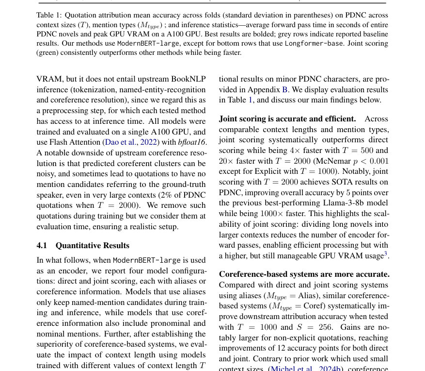
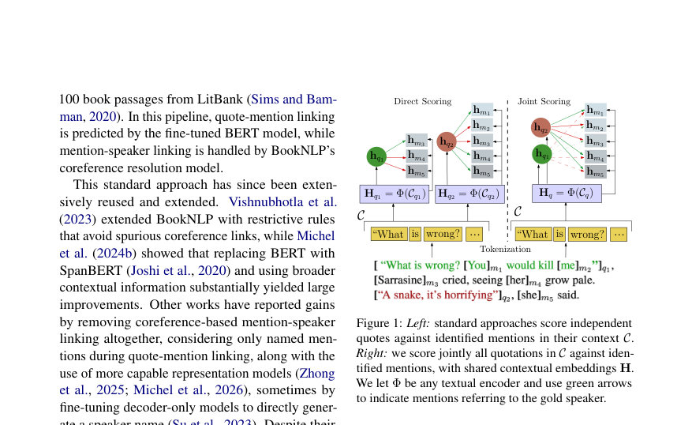

# Fast and Accurate Quotation Attribution in Literary Texts

- **arXiv:** [2608.02359v1](http://arxiv.org/abs/2608.02359v1) · [PDF](https://arxiv.org/pdf/2608.02359v1)
- **저자:** Gaspard Michel, Hugo Attali, Elena V. Epure
- **분야:** cs.CL
- **선정 점수:** 10.25
- **선정 이유:** 최근성 0.6, 핵심어: large language model, 핵심어: llm, 핵심어: efficient, 분야 가중치 2.0

### 한 문장 요약

저자 결속(quotation attribution)을 문맥 창을 공유하는 엔코더 기반의 'joint scoring' 방식으로 한꺼번에 해결해 PDNC 코퍼스에서 SOTA 정확도(94.5%)를 내고 계산 효율도 크게 개선한 연구다.

### 해결하려는 문제

문학 텍스트에서 따옴표로 처리된 발화(quotations)를 누구에게 귀속시키는지는 여전히 어려운 문제이다. 기존의 독립적 예측 방식은 효율적이지만 정확도가 한계가 있고, 대형 언어모델(LLM)은 정확도가 높지만 계산 비용이 커서 대규모 문학 분석에 부적합하다.

### 핵심 기여

- 여러 따옴표의 귀속을 하나의 큰 문맥 창(shared large context window) 안에서 함께 해결하는 효율적인 엔코더 기반의 새로운 정식화인 'joint scoring'을 제안했다.
- Project Dialogism Novel Corpus(PDNC, 22권의 영문 소설, 35,000개 이상의 수동 주석된 따옴표)를 대상으로 SOTA 성능을 보고했으며, 최고 모델이 전체 귀속 정확도 94.5%를 달성했다.
- 제안한 방식이 표준 독립 예측 방법보다 약 20배 빠르고, A100 GPU 기준으로 LLM 접근법보다 1000배 이상 빠르다는 계산 효율성을 보였다(초록에서의 주장).
- 분석을 통해 joint scoring이 장거리 지시(anaphora) 해소 신호를 보존하여 까다로운 귀속 사례에서 개선을 이루며, 이런 신호는 사전학습된 엔코더에 이미 존재함을 시사했다.
- BookNLP의 따옴표 귀속 모델을 대체하는 ModernBookNLP 포크(코드)를 공개하여 채택을 용이하게 했다.

### 접근 방법

초록에 따르면 저자들은 각 따옴표마다 독립적으로 화자 언급을 예측하는 기존 방법과 달리, 하나의 큰 문맥 창 안에서 다수의 따옴표 귀속을 동시에 점수화하는 'joint scoring' 엔코더 기반 정식화를 사용한다. 이 방식은 대체로 사전학습된 인코더 표현을 활용하여 장거리 지시 해소 신호를 유지하고, LLM 방식보다 계산 비용을 낮추는 것을 목표로 한다. (구체적인 모델 아키텍처, 학습 절차, 손실함수, 하이퍼파라미터 등은 초록만으로 확인하기 어렵다.)

### 주요 결과

- PDNC(22권의 소설, 35,000+ 수동 주석된 따옴표)에서 최고 모델이 전체 귀속 정확도 94.5%를 보고했다.
- 제안한 모델은 표준 독립 예측 방법들보다 소설 처리 속도가 약 20배 빠르다고 보고되었다(초록의 주장).
- LLM 기반 접근법과 비교하면 A100 GPU 기준으로 초록에서 1000배 이상 빠르다고 보고되었다.
- 분석 결과는 joint scoring이 장거리 지시(anaphora) 관련 신호를 보존하여 어려운 귀속 사례에서 도움을 준다고 제시한다.

### 한계

- 초록만으로는 구체적인 학습/평가 설정(훈련/검증/테스트 분할, 교차검증 여부), 평가 메트릭의 세부 정의, 기준선(비교한 '표준 방법'과 어떤 모델을 의미하는지), 그리고 통계적 유의성 여부를 확인하기 어렵다.
- PDNC 이외의 장르나 다른 언어(비영어)에 대한 일반화 성능은 초록만으로 확인하기 어렵다.
- 정확도가 문체적 변이(예: 고전 문체, 1인칭 서술, 대화가 복잡한 작품)나 화자 수가 극단적으로 많은 텍스트에서 어떻게 변하는지는 알 수 없다.
- 속도 비교(20x, 1000x)는 어떤 하드웨어·배치·최적화 조건에서 측정되었는지 초록만으로는 확인하기 어렵다(예: CPU vs GPU, 배치 크기, 토크나이저 등).

### 개발자 관점

- 문학 텍스트에서 따옴표 귀속 작업을 대규모로 수행하려면 LLM보다 사전학습된 인코더와 joint scoring 같은 공동 정식화가 실용적이고 비용 효율적인 대안이 될 수 있다.
- joint scoring은 여러 따옴표를 동일한 문맥 창에서 함께 처리하므로 장거리 대참조(anaphora) 정보를 보존하기 쉬워 까다로운 사례에서 성능 향상을 기대할 수 있다.
- 사전학습된 인코더에 이미 대참조 정보를 담고 있다는 결과는, 대규모 고비용 LLM 대신 적절히 미세조정된 인코더 기반 파이프라인으로도 높은 성능을 얻을 수 있다는 실무적 근거가 된다.
- 저자들이 공개한 ModernBookNLP 포크를 통해 기존 BookNLP 파이프라인에서 따옴표 귀속 모듈을 즉시 교체해 실험해볼 수 있다. 실제 도입 전에는 코드베이스에서 요구하는 입력 포맷, 토크나이저, 문맥 창 크기, 배치 처리 방식 등을 확인하라.
- 실무적으로는 (1) 공개된 구현을 로컬/목표 하드웨어에서 프로파일링하여 실제 처리 속도와 메모리 사용량을 검증하고, (2) 도메인 차이(다른 시대·작가·언어)에 따른 성능 저하를 평가하기 위해 소규모 레이블 데이터로 재현성 실험(혹은 미세조정)을 해보는 것을 권장한다.

<!-- paper-visuals:start -->
## 주요 그림·그래프·표

> 원문 PDF에서 자동 추출한 자료다. 정확한 해석은 원문 캡션과 본문을 함께 확인해야 한다.

*그림·그래프 · 원문 PDF 3쪽 · Figure 1: Left: standard approaches score independent*

*표 · 원문 PDF 5쪽 · Table 1: Quotation attribution mean accuracy across folds (standard deviation in parentheses) on PDNC across*

*그림·그래프 · 원문 PDF 6쪽 · Figure 2: Left column: Mention-Mention same-/different-character effect sizes (Cohen’s d, top) and mean cosine*

<!-- paper-visuals:end -->

**근거 범위:** 이 분석은 논문의 제목과 초록에만 근거한다. 위에 기재된 성능 수치(94.5%, 20×, 1000×)와 데이터셋 규모(35,000+)는 초록의 주장에 따른 것이다. 구체적 구현 세부사항, 실험 설정, 추가 분석 결과 등은 초록만으로는 확인하기 어렵고 원문과 공개된 코드 저장소를 통해 검증할 것을 권한다.

---

- **소개 날짜:** 2026-08-05
- [← 2026-08-05 논문 목록으로 돌아가기](../daily/2026-08-05.md)
- [일별 아카이브 보기](../daily/index.md)

