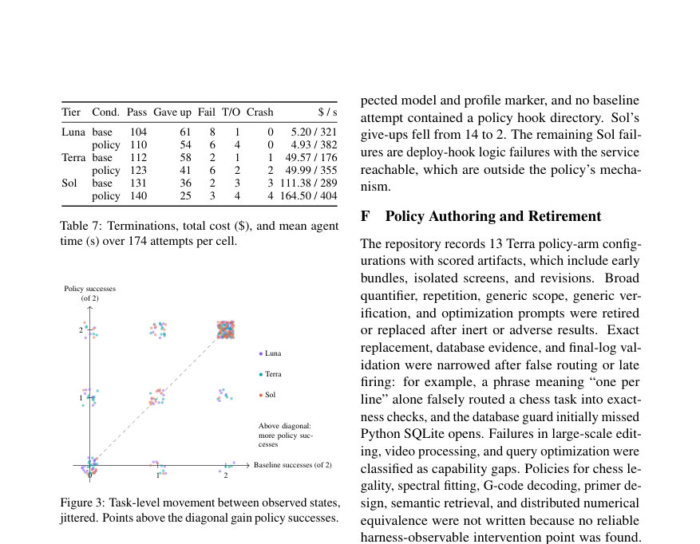

# FIRE: Failure-Informed Runtime Engineering for Reliable Language-Model Agents

- **게시일:** 2026-09-23
- **arXiv:** [2609.26048v1](http://arxiv.org/abs/2609.26048v1) · [PDF](https://arxiv.org/pdf/2609.26048v1)
- **저자:** Nikita Agarwal, Nivedit Jain
- **분야:** cs.AI, cs.CL, cs.SE
- **선정 점수:** 5.21
- **선정 이유:** 최근성 1.2, 인용 영향 0.0 (인용 0회), 저자 영향 0.0 (최고 h-index 0), AI 주제 적합성 2.2, 개발자 관심 0.2, 학술 신호 0.5, 오픈 웨이트·주요 연구조직 신호 1.1

[← 2026-09-23 목록으로 돌아가기](../daily/2026-09-23.html)

<!-- paper-visuals:start -->
## 주요 Figure

> 원문 PDF에서 실제 Figure 캡션과 그림 영역이 함께 확인된 자료만 자동 추출했다.

*Figure · 원문 PDF 11쪽 · Figure 3: Task-level movement between observed states,*

<!-- paper-visuals:end -->

## 한 문장 요약

실행 중 관찰된 절차적 실패 지점에서 자연어 지침 또는 도구 호출 거부를 넣는 '런타임 정책'을 고정된 포트폴리오로 적용해, 모델을 재학습하지 않고도 언어모델 에이전트의 반복적 전달(repeatable delivery) 신뢰도를 높이는 방법을 제안하고 검증한다.

## 해결하려는 문제

언어모델 에이전트는 작업의 핵심 해법을 찾아내면서도 그 해결물을 반복해서 제대로 '전달'하지 못해 실패하는 사례가 잦다(예: 서버를 띄우고 세션에서 종료해 서버가 함께 죽음, 손상된 DB를 열어 증거를 변경함, 포맷터가 보호된 바이트를 변경함). 기존의 두 접근(모델에게 자기 점검/재고를 시키거나 런타임에서 규칙/가드레일을 거는 것)은 개입 타이밍 자체의 효과와 개입 '내용'의 효과를 분리하기 어렵고, 단순한 일반적 자기검토는 종종 실패를 고치지 못한다는 관찰이 있다. 연구 질문은 "상태 기반으로 실패가 일어났던 지점에만 발동하는 표적화된 자연어 런타임 정책이, 개입의 타이밍이 아니라 정책의 내용 자체로 에이전트의 전달 신뢰도를 향상시키는가"이다.

## 핵심 기여

- 무작위화된 5-armed 설계(실제 정책, 타이밍-일치 샴, 항상 검증, 재고 요청, 무음)로 런타임 개입의 내용(content)과 단순한 중단(timing)·일반 검증 효과를 분리해 검증함(주 대조: 실제 정책 − 샴).
- 메커니즘 규명: 모든 군에서 '위험 상태'는 동등하게 발생하지만 실제 정책의 자연어 텍스트만이 일관되게 의도한 시정 행동을 유도한다는 퍼널(funnel) 증거를 제시함.
- 재현성/복제: 하나의 정책(service-persistence)를 다른 두 모델 티어(Luna, Sol)에서 동일 소스·동일날짜로 복제해 유사한 메커니즘 효과를 보였고, 세 티어(소·중·고) 전체에 대한 완전-스위트 실험을 실행해 방향성 있는 일관된 개선을 관찰함.
- 운영적 효과: 고정된 포트폴리오(정책집)를 적용하면 동일 모델 능력을 유지한 채 반복적 성공(pass∧2)을 실질적으로 증가시켜, 일부 경우 더 높은 모델 티어의 베이스라인 성능을 더 낮은 티어에서 적은 비용으로 회복할 수 있음을 보임.

## 접근 방법

* 런타임 정책 추상화: 각 정책은 (E, G, A, R, S) 튜플로 정의된다.
* E는 태스크 지문을 한 번 읽어 범위를 결정하는 eligibility(논리적 매칭, Terra 포트폴리오는 어휘적 패턴 사용), G는 프롬프트 제출/각 도구 호출 전/에이전트가 종료하려 할 때 등 사전정의된 '하니스 이벤트'의 행동 기록(h_t)과 정책 상태(S_t)를 읽는 런타임 술어이다.
* A는 자연어 지침을 삽입하거나(종료 시 추가 턴 요구 포함) 제안된 도구 호출을 거부(deny)하는 개입이며, R과 nudge 한도는 루프를 방지한다.
* 포트폴리오 구축 절차: 정책-자유(policy-free) 에이전트를 각 태스크에서 두 번 실행해 실패 궤적을 검사하고(특히 1/2 실패와 0/2 중 절차적 누락이 명백한 경우) 실패 메커니즘별로 군집화하여, 각 가족에 대해(런타임 상태 X → 개입 A → 등록된 행동 B → 검증기 조건) 명시적 술어와 행동 마커를 고정(freeze)한 포트폴리오를 작성한다.
* 평가 설계: (1) 무작위화된 5-armed 패널(Terra, 30개 태스크: 14 eligible + 16 silent, 각 조건에서 태스크당 2시도, 총 300시도) — 실제 정책, 타이밍-일치 샴(동일 트리거 타이밍, 일반 리뷰 텍스트), 항상-검증(always-verify), 재고(reconsider), 무음(silent); (2) 같은날 복제된 7-태스크 서비스-퍼시스턴스 스크린(Sol, Luna); (3) 완전-스위트(87개 태스크, 세 티어 각각)로 구성.
* 통계적 추론: 태스크를 단위로 두 번 시도의 평균을 취하고 태스크-수준 페어드 차이를 사용해 10,000 부트스트랩 퍼센타일 신뢰구간과 태스크-레벨 sign-flip 순열검정(패널은 100,000 반복)으로 검정.
* 정책 소스, 실행 로그, per-attempt 결과를 공개해 재현을 지원함.

## 주요 결과

- 무작위화된 5-armed 패널(14 eligible 태스크): 실제 포트폴리오의 성공률은 17/28 시도(60.7%), 신선한 베이스라인 11/28(39.3%), 타이밍-일치 샴 10/28(35.7%), 항상-검증 11/28(39.3%), 재고 12/28(42.9%). 주요 대조(실제 − 샴)는 +25.0 percentage points(95% CI [7.1, 46.4], p = 0.061, 사전지정 주 대조). 실제 − 베이스라인은 +21.4 points (p = 0.032).
- 퍼널(작업-레벨 분해): 런타임의 '위험 상태'는 모든 군에서 동등하게 자주 발생(각 군 24–26/28 시도)했으나, 등록된 시정 행동(behavior marker)은 실제 정책에서 22/24 코딩된 시도에서 관찰된 반면(동일한 결정 규칙으로 사전정의된 로그 추출기 사용), 다른 군에서는 11–14/24에 불과해(샴은 13/24) '중단 자체'가 아니라 개입 텍스트가 행동을 바꾼다는 증거를 제공함.
- 정책의 한계적 효과: 예컨대 데이터베이스 증거 보존 정책은 발동해 완전한 복사본을 확보하게 하고(실제: 4/4 pass), 바이너리 등가 정책은 절차를 고치지만 능력 격차가 있으면(재구현 필요) 여전히 실패함 — 즉 행동은 필요조건이나 능력 부족 시 충분조건은 아님.
- 서비스-퍼시스턴스 같은정책 복제(같은날 스크린, 3시도): Sol 성공 7/21 → 19/21, Luna 11/21 → 19/21(등록된 행동도 각각 5/21 → 20/21, 8/21 → 16/21로 증가).
- 완전-스위트(87태스크, 두 시도): 세 티어 모두에서 정책 적용 시 pass@1 상승을 보였고, 반복적 전달(pass∧2)에서 유의미한 개선을 관찰함(수치 요약: Luna pass@1 59.8→63.2 (+3.4 [−3.4,10.3], p=.43), pass@2 69.0→72.4, pass∧2 50.6→54.0; Terra pass@1 64.4→70.7 (+6.3 [−1.7,14.4], p=.17), pass@2 73.6→80.5, pass∧2 55.2→60.9; Sol pass@1 75.3→80.5 (+5.2 [0.0,10.9], p=.09), pass@2 86.2→87.4, pass∧2 64.4→73.6). Sol의 경우 best-of-two(pass@2) 변화는 +1.2포인트인 반면 pass∧2는 +9.2포인트로, 정책이 '도달 가능한 해법을 안정적으로 전달하게' 만드는 효과를 시사함. 또한 전체-스위트에서 정책이 발동한 태스크 비율과 비용 영향은 포트폴리오의 범위에 따라 다름(예: Terra 포트폴리오는 15/87 발동에 비용 +0.9%; Sol 포트폴리오는 81/87 발동에 비용 +47.7%). 추가로, 패널 수준에서 실제 군의 평균 실행 비용은 $19.92(실제) vs $23.22(기준)였고, 평균 에이전트 시간은 418s→473s로 늘었음(대부분은 eligible 태스크에서: 190s→273s).

## 한계

- 저자 언급: (1) 두 번의 시도만으로 pass∧2는 '관찰된 비율'일 뿐 각 태스크의 장기 신뢰도를 추정하는 지표가 아니다. (2) 패널 태스크는 개발 분포에서 샘플링되었으므로, 포트폴리오가 고정된 상태에서 패널이 보이는 '내용 효과'는 그 분포에 대한 것이며 일반화가 보장되지 않는다. (3) 단일 벤치마크(영어 Terminal-Bench 2.1), 단일 하니스(Codex CLI), 단일 모델 계열(GPT-5.6 루트)과 단일 reasoning-effort 설정만 사용했다. (4) 모델은 제공자 라우트(route) 식별자로 기록되어 고정된 체크포인트 해시는 아니며, 평가 기간 중 라우트 변화가 없었다고 가정하지만 이를 외부에서 독립 검증할 수 없다. (5) 포트폴리오와 정책은 티어별로 모델-특이적이며, 논문에서 계획한 'leave-one-family-out' 소거 실험을 수행하지 않았다. (6) 동작 코딩은 각 가족의 등록된 마커만을 포함하며, 검증기를 만족시키는 모든 가능한 에이전트 행동을 포괄하지 않는다. (저자-언급 한계는 본문 'Limitations' 섹션에서 직접 명시됨).
- developer_takeaways':['정책 설계 워크플로우: 실패 궤적을 두 번 실행해(각 태스크), "위험 상태"를 관찰하고 그 상태→개입→등록 행동→검증 조건 체인을 작성한 뒤 어휘적(lexical) eligibility와 런타임 술어로 포트폴리오를 고정(freeze)해야 한다.','정책 구현 관례: 정책은 프롬프트 제출·도구 호출 전·종료 시 이벤트를 관찰하고 per-session 상태를 추적하며(nudge 한도, 추적 변수 S), 개입은 자연어 지침 또는 deny로 가볍게 주입한다. 소스는 태스크 이름·정답을 포함하지 않아야 하고 사전정의된 행동 마커(로그 기반 추출기)를 고정해야 재현 가능한 평가가 가능하다.','운영/비용 트레이드오프: 포트폴리오가 좁고 표적화될수록 발동 빈도와 비용 상승은 작고 이익은 특정 태스크에서 크다(Terra 예; 발동 15/87, 비용 +0.9%). 반대로 범위가 넓은 포트폴리오는 더 많은 태스크에서 발동해 비용·지연(예: Sol 비용 +47.7%, 실행시간 증가)을 크게 만들 수 있다.','제한적 보강: 런타임 정책은 에이전트의 '절차적 전달 실패'를 방지하지만 새로운 알고리즘적 능력이나 도메인 지식을 추가하지는 못한다(따라서 능력 격차가 핵심 원인인 실패는 해결하지 못함).','안전·검사성: 정책은 파괴적 명령(증거 제거·배포 상태 파괴 등)을 거부할 수 있으므로 배포 시 사용자·이해관계자가 정책을 검토할 수 있도록 정책 소스·결정 로그를 공개·감사 가능하게 해야 하며, 정책이 에이전트 행동의 영구성을 높이면 잘못된 목표의 결과가 더 위험해질 수 있음을 고려해야 한다.'], 
- 
- keywords

## 개발자 관점

- 정책 설계 워크플로우: 실패 궤적을 두 번 실행해(각 태스크), "위험 상태"를 관찰하고 그 상태→개입→등록 행동→검증 조건 체인을 작성한 뒤 어휘적(lexical) eligibility와 런타임 술어로 포트폴리오를 고정(freeze)해야 한다.
- 정책 구현 관례: 정책은 프롬프트 제출·도구 호출 전·종료 시 이벤트를 관찰하고 per-session 상태를 추적하며(nudge 한도, 추적 변수 S), 개입은 자연어 지침 또는 deny로 가볍게 주입한다. 소스는 태스크 이름·정답을 포함하지 않아야 하고 사전정의된 행동 마커(로그 기반 추출기)를 고정해야 재현 가능한 평가가 가능하다.
- 운영/비용 트레이드오프: 포트폴리오가 좁고 표적화될수록 발동 빈도와 비용 상승은 작고 이익은 특정 태스크에서 크다(Terra 예; 발동 15/87, 비용 +0.9%). 반대로 범위가 넓은 포트폴리오는 더 많은 태스크에서 발동해 비용·지연(예: Sol 비용 +47.7%, 실행시간 증가)을 크게 만들 수 있다.
- 제한적 보강: 런타임 정책은 에이전트의 '절차적 전달 실패'를 방지하지만 새로운 알고리즘적 능력이나 도메인 지식을 추가하지는 못한다(따라서 능력 격차가 핵심 원인인 실패는 해결하지 못함).
- 안전·검사성: 정책은 파괴적 명령(증거 제거·배포 상태 파괴 등)을 거부할 수 있으므로 배포 시 사용자·이해관계자가 정책을 검토할 수 있도록 정책 소스·결정 로그를 공개·감사 가능하게 해야 하며, 정책이 에이전트 행동의 영구성을 높이면 잘못된 목표의 결과가 더 위험해질 수 있음을 고려해야 한다.

**근거 범위:** 이 분석은 제공된 논문 PDF 본문 전체(본문, 표, 그림 캡션, 부록에 포함된 고정된 포트폴리오 소스 및 수치)를 근거로 작성되었다. 본문에 명시된 모든 정량값(비율, 차이, 신뢰구간, p값, 비용·시간 수치 등)을 직접 인용했으며, 저자가 별도로 표시한 한계는 본문 'Limitations' 섹션에서 따로 표기했다. 구현 세부(예: 외부 제공자 라우트의 내부 변화 여부, 실제 실행 시의 요금 청구 세부항목)는 본문에서 전제로 삼았으나 외부 검증은 논문 범위를 벗어나므로 독립 확인이 필요하다.
