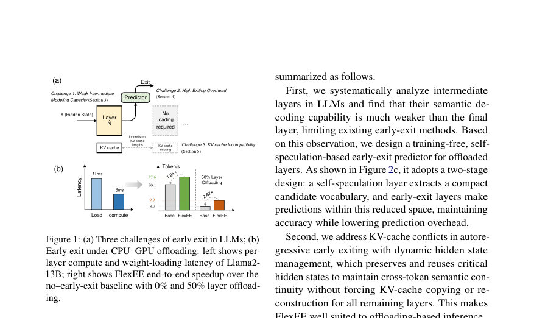
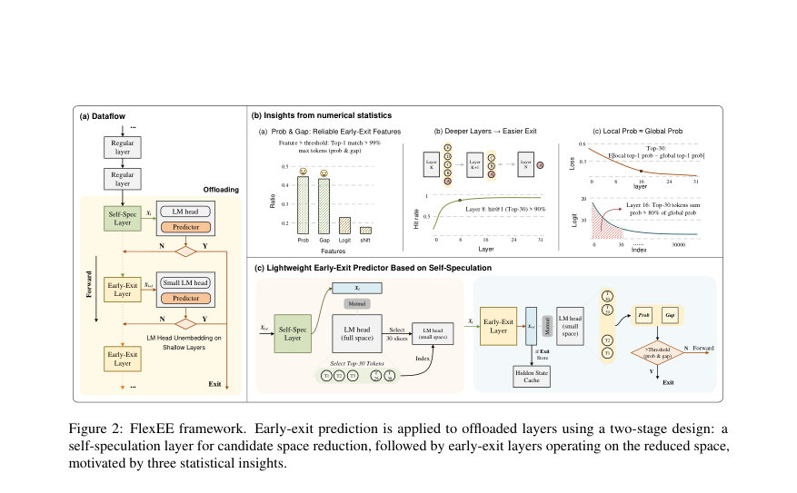
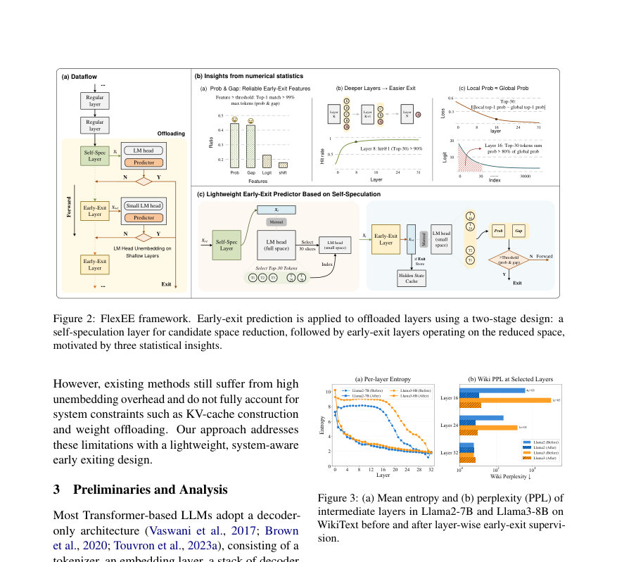

# FlexEE: Self-Speculative and KV-Compatible Early Exiting for Offloading-Aware LLM Inference

- **게시일:** 2026-09-16
- **arXiv:** [2609.17008v1](http://arxiv.org/abs/2609.17008v1) · [PDF](https://arxiv.org/pdf/2609.17008v1)
- **저자:** Qihu Xie, Ziwei Li, Yi Kang
- **분야:** cs.AI
- **선정 점수:** 6.54
- **선정 이유:** 최근성 1.1, 인용 영향 0.0 (인용 0회), 저자 영향 0.0 (최고 h-index 0), AI 주제 적합성 3.0, 개발자 관심 1.0, 학술 신호 0.3, 오픈 웨이트·주요 연구조직 신호 1.1

[← 2026-09-16 목록으로 돌아가기](../daily/2026-09-16.html)

<!-- paper-visuals:start -->
## 주요 Figure

> 원문 PDF에서 실제 Figure 캡션과 그림 영역이 함께 확인된 자료만 자동 추출했다.

*Figure · 원문 PDF 2쪽 · Figure 1: (a) Three challenges of early exit in LLMs; (b)*

*Figure · 원문 PDF 3쪽 · Figure 2: FlexEE framework. Early-exit prediction is applied to offloaded layers using a two-stage design: a*

*Figure · 원문 PDF 3쪽 · Figure 3: (a) Mean entropy and (b) perplexity (PPL) of*

<!-- paper-visuals:end -->

## 한 문장 요약

FlexEE는 오프로드 기반 LLM 추론에서 중간층에서 조기 종료(early exit)를 안전하고 비용효율적으로 수행하기 위해, 자기-사전추정(self-speculation) 기반의 국소 어휘 축소와 계층별 출구 감독, 그리고 KV-캐시 호환성을 보장하는 동적 은닉 상태 관리(system–algorithm 공동설계)를 결합한 프레임워크이다.

## 해결하려는 문제

대형 언어모델(LLM) 추론에서 오프로드(메모리 계층 간 가중치 전송)가 병목이 되어 레이턴시가 증가한다. 기존의 early exiting은 (1) 중간층의 출력이 최종층과 잘 정렬되지 않아 품질 저하가 발생하고, (2) 각 출구 판단을 위해 전체 어휘로 LM 헤드(unembedding)를 반복 적용하면 오버헤드가 커져 속도 이득을 상쇄하며, (3) 중간층에서 조기 종료하면 이후 레이어들의 KV-cache가 비어 있거나 불일치하여 후속 토큰 생성 품질 및/또는 오프로드 이점이 사라진다는 문제를 갖는다. 이 논문은 오프로드 환경에서 실용적으로 early exit을 적용해 메모리 전송 비용을 줄이면서 품질을 유지할 수 있는 방법을 묻는다.

## 핵심 기여

- 중간층의 언어모델링 능력(출력 디코더빌리티)이 약함을 실험적으로 분석하고, 계층별 출구 감독(layer-wise early-exit supervision)을 통해 중간층의 디코딩 품질을 향상시킨 점.
- 자기-사전추정(self-speculation) 기반의 2단계 경량 예측기 설계: 한 번의 전체 어휘 투영으로 self-speculation 레이어에서 Top-K 후보를 뽑고 이후 출구 판단은 축소된 로컬 어휘(Top-K)로만 수행해 unembedding 오버헤드를 크게 줄인 점.
- 동적 은닉 상태 관리(dynamic hidden state management)를 도입해, 조기 종료 시 후속 레이어의 KV-cache를 모두 불러오지 않고도 교차-토큰 의미 연속성을 보존하도록 구현한 점(즉, KV 복사 없이 KV-cache-정합성 확보).
- 시스템 레벨 통합( FlexGen + HuggingFace 기반 백엔드 확장, 비동기 가중치 로딩 등)과 다양한 모델(Llama2-7B/13B, Llama3-8B 등), 태스크(WikiText, Alpaca, MMLU 등)에서의 정량적 평가를 통해 오프로드 비율에 따른 실사용 속도 개선(최대 수배)이 가능함을 보인 점.

## 접근 방법

* 아키텍처 및 알고리즘 요약: (1) 계층별 출구 감독: LayerSkip로 미리 학습된(또는 layer-wise supervision을 적용한) 체크포인트를 기반으로 중간층에 LM 헤드를 연결해 중간층의 디코딩 가능성을 높인다.
* (2) Self-Speculation + Top-K 예측: 지정한 self-speculation 레이어(예: Llama2에서 n=16 등)에서 한 번만 전체 어휘로 LM 헤드 투영을 수행해 해당 토큰의 Top-K 후보(예: Llama2에 K=30, Llama3에 K=80)를 선택한다.
* 이후 각 early-exit 레이어는 로컬 후보 집합에 대해서만 소형 LM 헤드(혹은 축소된 투영)를 수행해 Top-1 확률(Top Prob)과 gap(Top1−Top2)을 계산한다.
* 출구 판단은 계층별로 오프라인으로 계산한 임계치(τ=0.99 기준, WikiText로 캘리브레이션)와 비교해 동시에 확률·gap 조건을 만족하면 조기 종료한다.
* (3) 동적 은닉 상태 관리: 토큰이 레이어 l에서 exit하면 해당 시점의 은닉 상태를 캐시하고 다음 토큰 생성 시 l+1 레이어 진입 시점에서 그 은닉 상태를 합성(참여)하여 KV-cache를 업데이트한다.
* 이로써 후속 레이어의 KV를 전부 불러오거나 복사하지 않고도 토큰 간 의미 연속성을 보존한다.
* (4) 시스템 구현: FlexGen을 기반으로 HuggingFace Transformers와 통합, 비동기적 가중치 로딩을 이용해 가중치 전송(latency)을 겹쳐 숨기고, 로컬 어휘 처리 및 은닉 상태 캐싱을 추가한 백엔드를 구현했다.
* 학습·추론 절차: 계층별 감독은 사전 학습 혹은 추가 훈련을 통해 얻고(논문은 LayerSkip 기반 체크포인트 사용), 출구 임계치는 300K WikiText 토큰으로 오프라인 탐색하여 계층별 λ*l 산정(τ=0.99) 후 배포 시 사용한다.

## 주요 결과

- End-to-end throughput(Alpaca, 토큰/s): Llama2-7B 기준 베이스(조기 종료 없음) 48.0 → FlexEE 60.9 (0% offloading, 1.27×), 베이스 6.9 → FlexEE 21.8 (50% offloading, 3.16×). Llama3-8B: 베이스 38.9 → FlexEE 48.6 (0%, 1.25×), 베이스 6.3 → FlexEE 17.8 (50%, 2.83×). Llama2-13B도 유사한 개선 보고(예: 0%: 30.1→37.6, 1.25×; 50%: 3.7→9.9, 2.67×). (출처: Table 3).
- 중간층 출구 통계 및 실행 깊이 절감: Llama2-7B에서 self-spec 시작층 8/16에 대해 평균 exit layer는 각각 22.8 / 24.9로, 명목상 실행 깊이는 28.8% / 22.2% 감소. Llama2-13B와 Llama3-8B에서도 유사한 평균 exit layer와 18–30% 수준의 실행 깊이 감소를 보고함(본문 Table 1).
- 품질 보전: 다양한 태스크(WikiText, Alpaca, LAMBADA, MMLU, CommonsenseQA 등)에서 PPL 및 정확도가 촉발되는 수준으로 유지됨. 예: Llama2-7B의 Alpaca PPL은 Dense 5.52 vs FlexEE 변형에서 5.52–6.08 범위(태스크별로 큰 열화 없음). 열린생성 평가(AlpacaEval-LC, MT-Bench)에서 FlexEE의 win-rate는 Dense에 대해 약 49–50%로 동등 수준(표 4).
- 예측 오버헤드 비교(논문 계산): FlexEE의 추가 per-token FLOPs ≈ 0.264 GFLOPs(설정: B=1,h=4096,V=32k,n=16,m=24.9,K=30). 반면 AdaInfer ≈ 8.13 GFLOPs, SpecEE ≈ 0.666 GFLOPs으로 FlexEE가 예측 오버헤드가 훨씬 작음(표 7).
- KV-cache 처리 비교: 동적 은닉 상태 관리는 기존의 state copying / KV copying / KV eviction 대비 장기간 생성 시(긴 시퀀스) 더 낮은 perplexity와 더 작은 레이턴시를 보여 의미 연속성 보존과 실행 효율을 동시에 달성한다고 보고함(본문 Figure 6).

## 한계

- 저자가 직접 명시한 한계: (i) FlexEE는 계층별 early-exit 감독으로 학습된(또는 LayerSkip 유형의) 사전학습 모델에 의존하므로 기본 모델 품질/학습 설정의 영향을 받는다. (ii) FlexEE는 소규모 배치나 메모리 제약이 큰 서빙 환경에서 특히 유용하며, 대규모 배치 환경에서는 이득이 줄어든다고 저자가 밝힘.
- 본문에서 합리적으로 확인되는 추가 제약(저자 언급과 구분): (i) 배치 크기가 커질수록 이득이 감소함(테이블 5, 배치 증가 시 throughput 이득 감소). (ii) 시스템 적용을 위해 FlexGen과 HuggingFace의 백엔드 변경, 비동기 가중치 로딩 및 은닉 상태 캐시/주입 로직 구현이 필요해 기존 인프라에 통합 비용이 듦. (iii) 출구 임계치와 Top-K 설정은 논문에서 WikiText(300K 토큰)로 오프라인 캘리브레이션했으며(τ=0.99), 다른 도메인·언어·어휘크기에서는 추가 검증이 필요할 수 있음. (iv) 은닉 상태 캐싱 등 메모리 오버헤드가 존재하나 본문 측정에서는 비교적 작음(은닉 상태 로드/스토어 0.02 ms/레이어 보고), 실제 임베디드 환경에서는 구현 방식에 따라 달라질 수 있음.

## 개발자 관점

- 재현성·전제: 논문은 LayerSkip로 미리 계층별 감독된 체크포인트를 사용하므로 동일한 성능을 얻으려면 layer-wise supervision으로 사전학습하거나 LayerSkip 계열 체크포인트를 확보해야 한다.
- 핵심 구현 요소: (1) self-speculation 레이어에서 전체 어휘 투영을 한 번 수행해 Top-K 후보를 추출하는 모듈, (2) 이후 레이어에서 Top-K만 대상으로 하는 축소된 LM 헤드(또는 인덱스 기반 작은 matmul)를 구현해 매-레이어 전체 어휘 matmul을 피하는 것, (3) 조기 종료 판정(Top Prob, Gap)용 계층별 임계치(오프라인 산정, τ=0.99) 적용, (4) 동적 은닉 상태 캐시와 다음 토큰에서의 주입 로직, (5) 비동기적 가중치 로딩(현재 레이어 계산 중 다음 레이어 가중치 I/O 수행) 및 FlexGen 기반 오프로드 파이프라인 통합.
- 하이퍼파라미터·설정 권장치: Llama2 계열에는 Top-K=30, Llama3 계열에는 Top-K=80을 기본으로 시작(논문 실험값). self-speculation 레이어는 모델·태스크별로 실험적으로 선택(논문에서는 8/16/24 등 시험). 임계치는 WikiText(약 300K 토큰)로 캘리브레이션했음을 참고. batch-size 1이 목표 사용 사례(인터랙티브 서빙)에서 최대 이득.
- 성능·비용 관찰: 예측 오버헤드는 논문 설정에서 매우 작음(≈0.264 GFLOPs/토큰). 오프로드 비율이 높을수록(예: 50%) FlexEE의 상대적 이득이 커짐(메모리 전송이 병목일 때 효과적). 단, 배치가 크면 배리언스 있는 exit depths 때문에 효율 저하 발생.
- 안전·검증: 출구 결정은 분포를 일부 변경할 수 있으므로 민감·고위험 도메인에서는 태스크별 안전성·편향·환각 평가를 별도 수행해야 함. 열린생성 품질은 본문에서 Dense와 거의 동등(AlpacaEval-LC win rate ≈ 49–50%, MT-Bench 점수 유사)으로 보고되었으나 배포 전 인간평가 권장.

**근거 범위:** 이 분석은 제출된 논문 PDF 본문(본문, 표, 그림, 부록)을 기반으로 작성되었다. 제시한 수치(throughput, 평균 exit layer, FLOPs 등)와 설정(Top-K, τ=0.99, 캘리브레이션 코퍼스 등)은 PDF 표·본문·부록에서 직접 확인된 값들이다. 다만 구현의 세부 스케줄링(예: 비동기 로딩의 정확한 동기화 방식, 메모리 버퍼 크기, 실험적 세부 튜닝 파라미터)은 본문에 요약되어 있으나 소스 코드·실행 스크립트가 제공되지 않아 정확한 재현을 위해서는 추가 구현·검증이 필요하다. 또한 실험은 논문에 명시된 하드웨어(RTX PRO 6000 GPU, Intel Xeon) 및 FlexGen 기반 환경에서 수행되었음을 명시한다.
