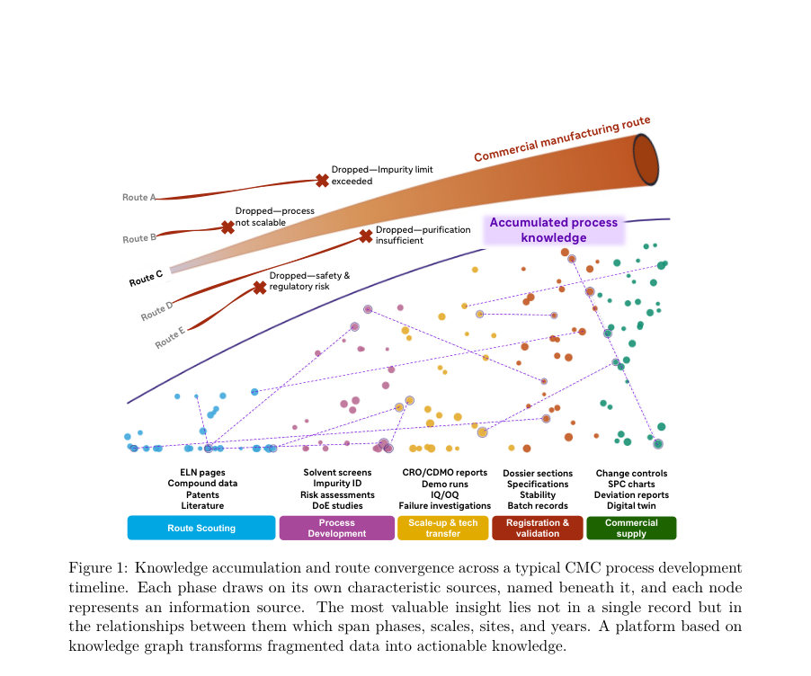
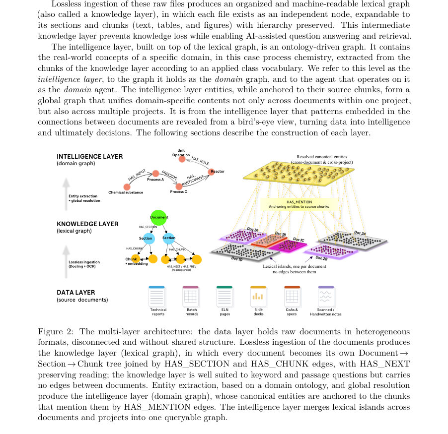
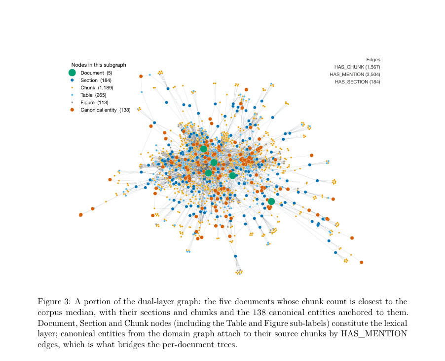

# From Document Silos to Process Intelligence: A Multi-Layer Knowledge Graph for CMC Process Development

- **게시일:** 2026-09-11
- **arXiv:** [2609.11493v1](http://arxiv.org/abs/2609.11493v1) · [PDF](https://arxiv.org/pdf/2609.11493v1)
- **저자:** Reza Amirmoshiri, Faryad Sahneh, Yasser Jangjou
- **분야:** cs.AI, cs.MA
- **선정 점수:** 5.06
- **선정 이유:** 최근성 1.2, 인용 영향 0.0 (인용 0회), 저자 영향 0.0 (최고 h-index 0), AI 주제 적합성 3.0, 개발자 관심 0.6, 학술 신호 0.3, 오픈 웨이트·주요 연구조직 신호 0.0

[← 2026-09-11 목록으로 돌아가기](../daily/2026-09-11.html)

<!-- paper-visuals:start -->
## 주요 Figure

> 원문 PDF에서 실제 Figure 캡션과 그림 영역이 함께 확인된 자료만 자동 추출했다.

*Figure · 원문 PDF 3쪽 · Figure 1: Knowledge accumulation and route convergence across a typical CMC process development*

*Figure · 원문 PDF 5쪽 · Figure 2: The multi-layer architecture: the data layer holds raw documents in heterogeneous*

*Figure · 원문 PDF 12쪽 · Figure 3: A portion of the dual-layer graph: the five documents whose chunk count is closest to the*

<!-- paper-visuals:end -->

## 한 문장 요약

혼합 형식의 CMC(제약 공정개발) 문서들을 무손실로 색인한 ‘문서-섹션-청크’ 기반의 렉시컬(정밀) 그래프와 온톨로지 정렬·증거로 연결된 도메인(지능) 그래프의 이중층 아키텍처를 제안하고, 질문 유형에 따라 LLM 에이전트를 라우팅해 사내 비공개 코퍼스에서의 RAG(검색증강생성) 신뢰도를 3단계 벤치마크로 정량평가했다.

## 해결하려는 문제

CMC 프로세스 개발 영역에서는 기술 문서가 기능별·형식별로 파편화되어 있어 추적성·지식전달 비용이 크고, 단순한 RAG나 대화형 챗봇은 문서계열(버전·라인리지)과 전(跨)문서·전(跨)프로젝트 집계·이상탐지 같은 과제를 신뢰성 있게 해결하지 못한다는 한계가 존재한다.

## 핵심 기여

- 문서의 무손실(디지털·스캔·손글씨·다국어 포함) 수집을 통해 Document→Section→Chunk 계층을 갖는 렉시컬 그래프를 구축하고, 동일 추출 산출물로부터 온톨로지 기반의 도메인 그래프를 구성하여 각 정규화된 개체를 근거 청크로 연결(provenance anchoring)하는 이중층(dual-layer) 파이프라인을 설계·구현함.
- 질문 유형에 따라 렉시컬 레이어(정밀·통과문장 검색)와 도메인 레이어(온톨로지 집계·연결)를 선택·결합하는 에이전트 기반 추론 워크플로(두 개의 ReAct 에이전트와 라우터 에이전트)를 제시함.
- 사내 비공개 코퍼스에 적합한 배포-성능(Deployment-fidelity)을 평가하기 위한 3단계 벤치마크 프로토콜(1: 객관식(Tier-1), 2: 옵션 없이 자유서술을 LLM 심사로 채점(Tier-2), 3: Tier-1/Tier-2 불일치에 대한 SME 검토)을 제안하고, 505문항으로 렉시컬 레이어를 정량평가하여 실패 분류를 제시함.
- 렉시컬 그래프와 도메인 그래프의 장단점을 실험적으로 비교하고, 라우터 에이전트 규칙을 설계해 서로 보완하는 하이브리드 운영이 더 넓은 질의 범위를 다룰 수 있음을 보임.

## 접근 방법

* 아키텍처는 데이터 레이어(원시 문서)→지식(렉시컬) 레이어→지능(도메인) 레이어의 3단계로 구성된다.
* 문서 파싱 및 레이아웃·테이블·읽기순 복원을 위해 Docling을 사용해 각 문서를 Document–[HAS_SECTION]→Section–[HAS_CHUNK]→Chunk 트리로 무손실 저장하고, 요소단위 청크(element-aligned)마다 1024차원 Titan Text Embeddings V2 임베딩을 부착한다.
* 검색은 BM25(전체 텍스트 인덱스)와 벡터 근사 최근접탐색을 결합한 하이브리드 검색을 사용한다.
* 도메인 그래프는 같은 청크 추출 JSON을 입력으로 LLM이 엔티티(chemical_substance, planned_process, unit_operation, equipment, role)와 관계(PRECEDES, HAS_SPECIFIED_INPUT/OUTPUT 등)를 제안하고, 전역 엔티티 해소(union-find 기반, 우선순위: 정확명/별칭/사전동의어→역할승격→임베딩 유사도(코사인>0.92) 백업)로 1개의 정규화 엔티티 레지스트리를 만든 뒤 HAS_MENTION 엣지로 근거 청크에 앵커링한다(프로비넌스 앵커링).
* 추론은 DSPy 기반 ReAct 패러다임으로 구현된 세 에이전트(렉시컬_ReAct, 도메인_ReAct, 라우터)를 사용한다.
* 렉시컬 에이전트는 문서·청크 수준의 Cypher 쿼리 도구(여러 검색·네비게이션 템플릿)와 반복적 추론 예산(12회 반복 등)을 갖고 정확한 지역정보 질의에 특화되며, 도메인 에이전트는 온톨로지적 조회 템플릿을 사용해 집계·연결·중복·독점성 질의에 응답한다.
* 라우터는 우선 결정론적 규칙(예: 수량·로트 번호→렉시컬, 전(跨)문서·집계·중복질의→도메인)으로 배분하고 미확정시는 LLM 분류를 단회 호출해 결정한다.
* 시스템은 AWS Bedrock의 Anthropic Claude Sonnet 4.5(온도 0.2, max generation 2048 토큰)와 Neo4j(Desktop 2026.05)를 사용했다.

## 주요 결과

- 평가 코퍼스: 단일 중단된 Sanofi 소분자 프로그램의 38개 문서(약 600페이지, 약 52,000단어). 도큐먼트 스냅샷 31개 포함(버전·라인리지 강조).
- 이중층 그래프 규모: 전체 그래프 12,353 노드·45,471 엣지. 렉시컬 레이어: 38 Document, 1,452 Section, 10,326 Chunk(그중 Table 1,925, Figure 800), 9,620/10,326 청크(93.2%)에 임베딩 포함. 도메인 레이어: 537 canonical entity(chemical_substance 252, planned_process 153, unit_operation 91, equipment 30, role 11), 22,688 HAS_MENTION 엣지(22,017 to chunks, 671 to sections), 이 중 315개(59%)는 직접 HAS_MENTION을 가짐; 98.9%의 유효한 프로비넌스 커버리지(직접 앵커 또는 인접 1-hop). 도메인 관계 총 1,825개(예: HAS_SPECIFIED_INPUT 960, HAS_ROLE 293, HAS_SPECIFIED_OUTPUT 264, PRECEDES 244 등).
- 글로벌 엔티티 해소: 문서-로컬 언급 3,236개를 537개 canonical로 병합(총 2,699 merge 중 2,396(88.8%)는 정확명·별칭·사전동의어, 248(9.2%)는 역할 승격, 55(2.0%)는 임베딩 유사도로 해결).
- 벤치마크: 질문은행 505문항(코호트: easy-mixed 86, hard-anchored 164, hard-unanchored 187, comparative 68)을 LLM 질문디자이너가 생성·사전검토 후 사용. 렉시컬_ReAct 성능: Tier-1 MCQ 정확도 95.0% (480/505, Wilson 95% CI 92.8–96.6), Tier-2 LLM-심사 통과율(judge_score≥4) 84.7% (428/505, CI 81.4–87.6). 벡터-RAG 베이스라인과 비교: 벡터-RAG T1 88.5%, T2 65.5%; 렉시컬_ReAct가 T1에서 +6.5%p, T2에서 +19.2%p 개선.
- Tier-1·Tier-2 불일치(74문항)에 대한 SME Tier-3 검토 결과 실패 분류: 질문 품질 문제 43% (n=32), 추출 오류 36% (n=27), 객관식 문자 파싱 오류 11% (n=8), LLM 심사 오류 5% (n=4), 추론 실패 3% (n=2), 자유서술 포기 1% (n=1).

## 한계

- 저자가 명시한 한계: 도메인 그래프 평가는 소규모 질문셋으로만 비교되었고(본 논문에서는 렉시컬 레이어의 대규모 3단계 벤치마크만 적용), 도메인 에이전트에 대한 대규모·다프로젝트 벤치마크가 필요하다고 밝힘.
- 그래프 기여 분리 미실시: 렉시컬_ReAct의 개선은 그래프 구조 자체뿐 아니라 반복적 ReAct 루프·도구 접근성·프롬프트 등의 조합 효과로 귀결되므로 그래프 구조만 토글하는 격리 실험이 수행되지 않음(저자 제언).
- 재현성 문제: 엔티티 추출 단계가 비결정적이며(예시로 같은 문서 반복 추출에서 94 vs 91 엔티티, 온도 0 고정 실행에서 83 vs 86 등 차이 관찰), 디코딩 온도 고정만으로 재현성을 담보하지 못함. 후속으로 시드 고정 엔드포인트 또는 추출 검증 패스가 필요함.
- 온톨로지 깊이 제한: 온톨로지를 프롬프트 수준의 스키마·일관성 제약으로 사용했으며 실제 OWL 로딩·설명논리(Description Logic) 추론기는 사용하지 않았음. 실사용에서는 더 풍부한 온톨로지(불순물·처치·통제전략 등)가 필요함을 명시함(저자 언급).」「실험 범위 제약: 본문 평가는 단일 중단된 소분자 프로그램(38문서)에 대한 결과를 보고하며, 저자도 다수 프로젝트에 대해 플랫폼을 시험했으나 본 논문 정량평가는 이 하나의 테스터드셋에 한정됨.

## 개발자 관점

- 무손실 문서 파싱: Docling을 사용해 레이아웃·테이블·읽기순을 복원하고 요소단위로 청크화하면 문서 라인리지(버전) 추적에 유리함.
- 임베딩·검색 스택: 1024차원 Amazon Titan Text Embeddings V2, BM25(full-text) + 벡터 ANN 하이브리드 검색이 실무적 정밀검색과 의미검색을 결합하는 실용적 선택임.
- 도메인 그래프 설계: 엔티티를 정규화하고 HAS_MENTION으로 근거 청크에 앵커링하면 도메인-레벨 응답을 문서 수준으로 검증 가능하게 만들어 규제·감사 요건을 충족시키기 쉬움.
- 엔티티 해소(practical): 우선순위로 정확명/별칭/수작업 동의어 테이블을 사용하고 임베딩 유사도를 보수적 백업으로 사용하는 전략이 재현성과 정확성 측면에서 유용함.
- 에이전트·라우팅 패턴: 결정론적 규칙 우선 후 LLM 분류(cheapest-first)라는 라우터 설계가 비용·신뢰성 균형에 유리함. 정밀·지역 질의는 렉시컬_ReAct, 코퍼스 집계·중복·연결성 질의는 도메인_ReAct가 적합함(혼합 호출 가능).」「재현성·운영 권고: 엔티티 추출의 비결정성 문제를 해결하려면(1) 시드 고정 제공되는 추론 엔드포인트 사용 또는 (2) 추출된 엔티티를 원문 스팬과 대조·검증하는 검증 패스를 도입해야 함(규제 환경 필수).」「스케일·비용 고려: 저자에 따르면 동일 파이프라인으로 문서 수가 ∼300개일 때 노드 수가 ∼80,000 수준으로 성장하므로 색인·쿼리 비용, 그래프 쿼리 응답성, 저장소 관리를 설계단계에서 고려해야 함.」「시각·반응식 자료: 파지된 반응식·그림 내 의미(예: 반응 스킴)는 현재 파이프라인으로는 읽히지 않으므로 고정밀 VLM→구조화(CML/CDXML) 변환이 필요함.

**근거 범위:** 이 분석은 제공된 논문 PDF 본문 전체(본문, 표, 부록)에 근거하여 작성되었으며 모든 수치·실험설정·결과는 본문에서 직접 인용한 것이다. 구현 세부사항(예: 내부 파라미터나 미공개 코드)이나 본문에 명시되지 않은 추가 실험 결과는 포함하지 않았다. 재현성 관련 관찰은 논문에 보고된 반복실험 예시(추출 시 엔티티 수 변동 등)에 기반하며, 저자도 재현성 테스트가 한정적이라고 명시하고 있다.
