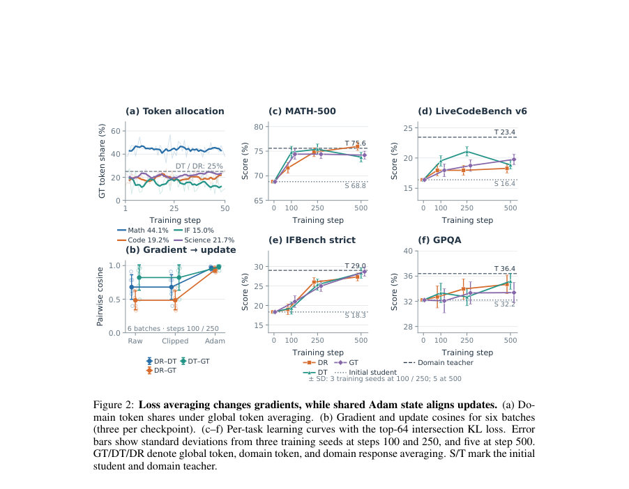
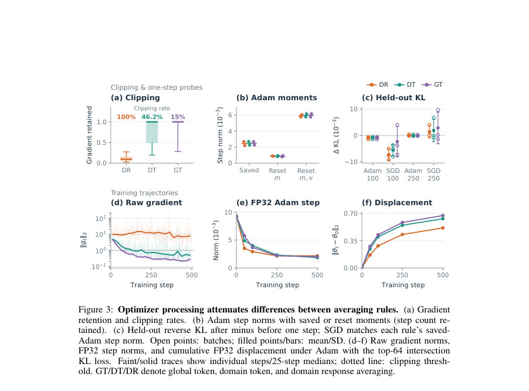
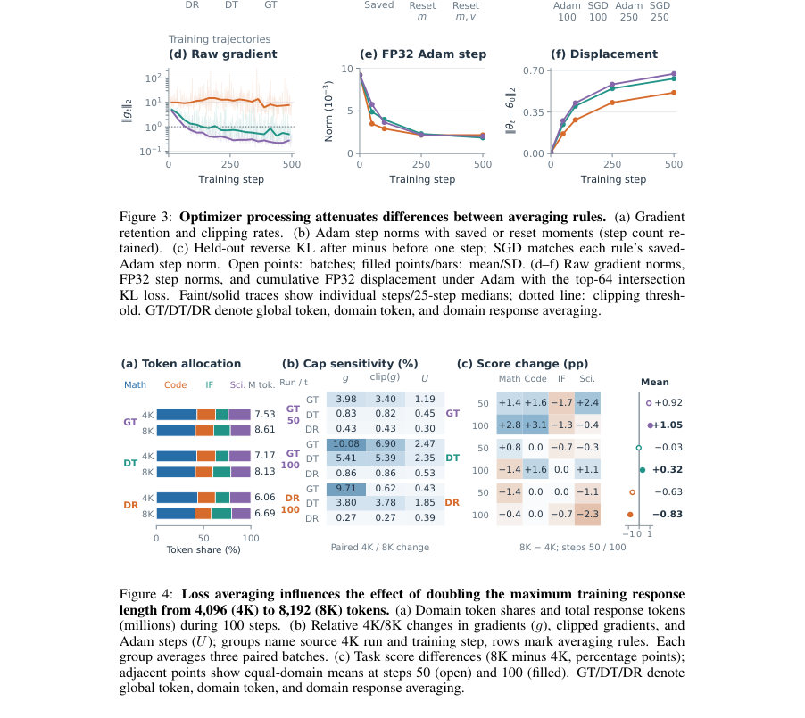

# From Gradients to Capabilities: Understanding Multi-Teacher On-Policy Distillation

- **게시일:** 2026-10-04
- **arXiv:** [2610.02179v1](http://arxiv.org/abs/2610.02179v1) · [PDF](https://arxiv.org/pdf/2610.02179v1)
- **저자:** Siqi Zhu, Suozhi Huang, Kaixuan Zhang, Yuheng Yang, Zhanyang Jin, Yihang Sun, Jiaxuan You
- **분야:** cs.LG
- **선정 점수:** 3.67
- **선정 이유:** 최근성 0.5, 인용 영향 0.0 (인용 0회), 저자 영향 0.0 (최고 h-index 0), AI 주제 적합성 1.4, 개발자 관심 0.0, 학술 신호 0.3, 오픈 웨이트·주요 연구조직 신호 1.5

[← 2026-10-04 목록으로 돌아가기](../daily/2026-10-04.html)

<!-- paper-visuals:start -->
## 주요 Figure

> 원문 PDF에서 실제 Figure 캡션과 그림 영역이 함께 확인된 자료만 자동 추출했다.

*Figure · 원문 PDF 5쪽 · Figure 2: Loss averaging changes gradients, while shared Adam state aligns updates. (a) Do-*

*Figure · 원문 PDF 6쪽 · Figure 3: Optimizer processing attenuates differences between averaging rules. (a) Gradient*

*Figure · 원문 PDF 6쪽 · Figure 4: Loss averaging influences the effect of doubling the maximum training response*

<!-- paper-visuals:end -->

## 한 문장 요약

다수의 RL로 학습된 교사 모델을 한 학생에 통합하는 MOPD에서 손실 평균화 규칙, 어휘 후보 폭(Top-k), 옵티마이저 모멘텀, 그리고 FP16/BF16 반올림이 교사 신호의 기울기, 파라미터 업데이트 및 최종 능력 습득에 미치는 영향을 Qwen3-1.7B와 SmolLM3-3B로 실험적·계량적으로 규명한다.

## 해결하려는 문제

다수 교사 기반의 on-policy 지식증류(MOPD)는 도메인별로 RL로 특화된 강력한 교사들을 단일 학생에 통합하려고 한다. 그러나 (1) 서로 다른 손실 평균화 규칙(응답별·도메인별 토큰·전역 토큰)이 학생 파라미터 변화에 어떻게 영향을 주는지, (2) 샘플된 토큰(PG) 대비 어휘 전체 또는 Top-k 기반 손실이 기울기와 성능에 미치는 차이, (3) 옵티마이저(특히 Adam)의 모멘텀과 수치 정밀도(BF16)가 실제 관측되는 파라미터 이동을 어떻게 가리는지 등, 교사 신호가 파라미터 변경으로 어떻게 전환되는지에 대한 이해가 부족하다.

## 핵심 기여

- 손실 평균화 규칙이 암묵적인 응답·도메인 가중치를 만든다는 이론적·경험적 증거를 제공하고, 응답 길이와의 공분산 항으로 그 효과를 정리했다.
- Adam의 1차 모멘트(모멘텀)가 서로 다른 교사로부터 유도된 현재 기울기 차이를 크게 정렬하여 실제 업데이트 방향을 유사하게 만든다는 사실을 실험적으로 입증했다(교사-스텝 코사인 >0.83, 평균 업데이트 코사인 ≈0.96).
- BF16 반올림이 FP32 마스터 가중치의 광범위한 변화를 숨겨 희소한 변화처럼 보이게 함을 보였다(예: FP32에서 약 97%가 초기화와 달라지지만 BF16으로는 7–11%만 달라지는 관측).
- 학생-교사 상호공통 Top-64(intersection) 손실이 Qwen에서 전체 어휘 KL 기울기 방향을 거의 복원함(Top-64 → full 코사인 >0.999)이지만, 그 기울기 근사도가 실제 태스크 성능 향상(prediction gain)을 일관되게 보장하지는 않음을 보였다(평균적으로 경우에 따라 +2.6pp 또는 −2.1pp 등).
- 샘플 수(샘플링된 토큰 갯수)를 늘리면 PG의 기울기 근사도가 개선되며(1→16→64 샘플 시 PG-to-full 코사인 0.54→0.87→0.97), 그러나 샘플링 기반 노이즈와 평균화 규칙이 결합되어 성능에 복잡한 영향을 준다는 사실을 규명했다.

## 접근 방법

* 주요 실험은 Qwen3-1.7B 학생과 네 개 도메인(수학, 코드, 지시-따르기, 과학)별로 RL로 특화된 교사들을 같은 초기화에서 출발해 준비한 뒤, 동일한 학생 파라미터·응답·옵티마이저 상태에서 서로 다른 손실 규칙과 평균화 규칙을 비교한다.
* 사용한 핵심 손실은 (1) full-vocabulary reverse KL, (2) sampled-token policy-gradient(PG) surrogate, (3) student/teacher top-k 교집합(intersection) KL(주로 k=16,64)이고, 평균화 규칙으로는 전역 토큰 평균(GT), 도메인 토큰 평균(DT), 도메인 응답 평균(DR)을 비교한다.
* 옵티마이저로는 AdamW와 모멘텀 없는 SGD를 사용해 동일 배치와 저장된 Adam 상태에서 한 스텝 프로브를 수행하거나 전체 학습(최대 500 스텝)을 진행한다.
* 기울기와 업데이트(클리핑 전·후, FP32 업데이트, BF16 모델 라이트백)를 기록하고, 코사인 유사도·상대 기울기 오차·가중치 비율(변화된 좌표 비율, 90% 에너지 점유 비율) 등 정량 지표로 진단한다.
* 보조 진단에는 SmolLM3-3B를 사용해 Top-k 커버리지의 한계와 태스크별 민감도를 확인한다.
* 실험 설정(학습률, 클리핑, 배치 구성 등)은 본문과 부록의 기록을 따른다.

## 주요 결과

- 손실 평균화: 동일 응답·파라미터에서 DT(도메인 토큰 평균)과 DR(도메인 응답 평균)의 평균 기울기 코사인은 6개 배치에서 평균 0.68으로, 평균화 규칙이 기울기 방향을 상당히 변경함을 보였다(Section 3.1, Fig.2b).
- 옵티마이저 정렬: 동일 저장된 Adam 상태에서 DT·DR·GT로부터 계산한 한-스텝 FP32 업데이트들의 평균 코사인은 0.96으로, Adam의 1차 모멘트가 서로 다른 교사 기울기 차이를 크게 정렬했다(Section 3.2, Fig.2b). 교사별 업데이트 코사인은 0.83 이상으로 보고되었다(Section 4.2).
- BF16 반올림: MOPD 학생의 FP32 마스터 가중치 중 약 97%가 초기값과 달라지지만, BF16으로 라이트백하면 7–11%만 달라지는 것으로 관측되어(BF16 반올림이 작은 변화들을 숨김), 파라미터 이동이 희소해 보일 수 있다(Section 4.1, Fig.5a).
- 어휘 제한과 기울기 근사: Qwen에서 Top-64 교집합은 평균적으로 학생 확률의 >99.9%를 유지하고 Top-64 → full-gradient 코사인이 >0.999로 거의 완전 복원되었다(Section 5.1, Fig.6b). 반면 SmolLM3-3B에서는 Top-64가 평균 97.42%(초기)에서 98.56%(학습 후)를 유지하지만 일부 접두사에서 90% 미만 케이스가 존재하여 상대적 기울기 오차(예: 2.16–24.54%)가 발생했다(Section 5.1, Fig.7).
- 태스크 성능 영향: Table 1과 본문 결과로, 초기 학생의 4-domain 평균은 33.93%. Adam+PG 학습(응답 평균 DR)에서 4-domain 평균은 38.91±0.69. Adam+Top-64(DR) 평균은 39.07±0.68. SGD(모멘텀 없음)+PG(DR)는 평균 39.94±0.52로, 모든 평균화 규칙에서 SGD가 Adam보다 높은 4-task 평균을 달성했다(Section 4.3, Table 1). 또한 Top-64 대 PG의 수학(MATH-500) 성능 차이는 응답 평균(DR)에서 Top-64가 PG보다 +2.6 percentage points 우수했으나 전역 토큰 평균(GT)에서는 −2.1 points로 악화되는 등 평균화 규칙에 따라 상반된 효과가 나타났다(Section 5.3, Fig.6c).

## 한계

- 저자 명시 한계: 실험은 제한된 모델 계열과 규모(Qwen3-1.7B, SmolLM3-3B)에서 도출되었으며, 더 큰 스케일 환경에서는 관측 결과가 달라질 수 있음을 저자가 명시했다(Discussion).
- 추가 관측 기반 제약: (1) 교사들은 학생과 동일 초기화에서 RL로 특화되어 준비되었으므로 다른 교사 준비 방식(예: 외부 초기화·파라미터 차이)에서는 결과가 달라질 가능성이 있다. (2) Top-k 교집합 구현은 엔지니어링 제약(교사 인터페이스로 위치별 학생 top-k 쿼리가 불가능함) 때문에 선택된 것으로, student-top-k의 직접 구현과는 다르다(Appendix D.2). (3) BF16 라이트백은 실제 배포 환경에서 관측 가능한 변화량을 숨기므로, BF16 관찰상으로는 파라미터 희소성 판단이 오도될 수 있다. (4) PG의 편향 없음(고정 접두사에서는 unbiased)은 증명되지만, 샘플 노이즈·평균화 규칙·옵티마이저 상호작용이 성능에 복잡하게 작용하여 이론적 무작위성만으로는 성능 예측이 불충분하다.

## 개발자 관점

- 손실 평균화 규칙 선택은 단순한 가중치 변경이 아니라 응답 길이에 따른 암묵적 가중치 부여 효과를 만든다. 도메인별 응답 길이 불균형이 있으면 GT는 긴 응답 도메인에 과도한 영향력을 준다. 따라서 도메인·응답 데이터 분포를 확인하고 DR/DT/GT 중 목표에 맞는 규칙을 선택하거나 명시적 재정규화를 고려하라.
- Adam(특히 β1 모멘텀)은 서로 다른 교사 신호를 빠르게 정렬해 현재 기울기 차이를 가리므로, 온라인으로 빠르게 바뀌는 교사 신호에 더 민감하게 적응하려면 모멘텀을 낮추거나(β1 감소), 모멘텀 없는 SGD를 검토하라. 실험에서 SGD는 PG 손실 하에서 Adam보다 높은 4-task 평균을 만들었다(예: DR: SGD 39.94 vs Adam 38.91).
- BF16으로 학습 상태를 관찰·로그할 때는 FP32 마스터 복사본을 기록하라. BF16 라운딩은 작은 변화들을 숨겨 파라미터 이동이 매우 희소한 것처럼 보이게 할 수 있어 디버깅과 진단을 오도한다(예: FP32 변경 ≈97% vs BF16 변경 7–11%).
- Top-k(특히 교집합 Top-64)는 Qwen에서 전체 어휘 방향을 거의 복원하므로 통신·계산 비용을 줄이는 합리적 대안이 될 수 있으나, 태스크별 이득은 평균화 규칙에 민감하므로 단일 규칙으로 일괄 적용하기 전에 소규모 AB 테스트를 수행하라.
- 샘플링 기반 PG는 샘플 수를 늘리면(full KL 근사 개선) 기울기 품질이 향상된다(1→16→64 샘플: 코사인 0.54→0.87→0.97). 실무에서는 샘플 수·Top-k 후보 예산·응답 길이(4K vs 8K)를 운영 예산과 성능 민감도로 균형 잡아야 한다.

**근거 범위:** 이 분석은 제공된 논문 PDF 본문(본문, 그림, 표, 부록)을 기준으로 작성되었다. 본문과 부록에서 직접 인용 가능한 수치(예: 코사인 유사도, BF16/FP32 비율, Table 1의 점수, 샘플링 코사인 등)만 사용했으며, PDF에 명시되지 않은 구현 세부사항이나 외삽 값은 생성하지 않았다. 부록과 본문 전반을 검토했으나, 외부 코드·데이터 릴리스나 표에 없는 추가 실험 결과는 포함하지 않았다.
