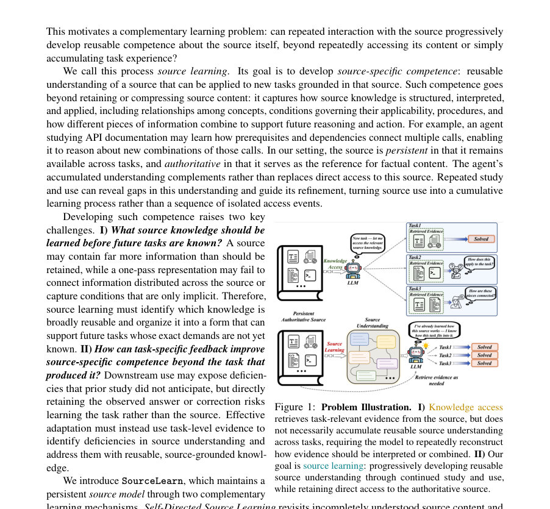
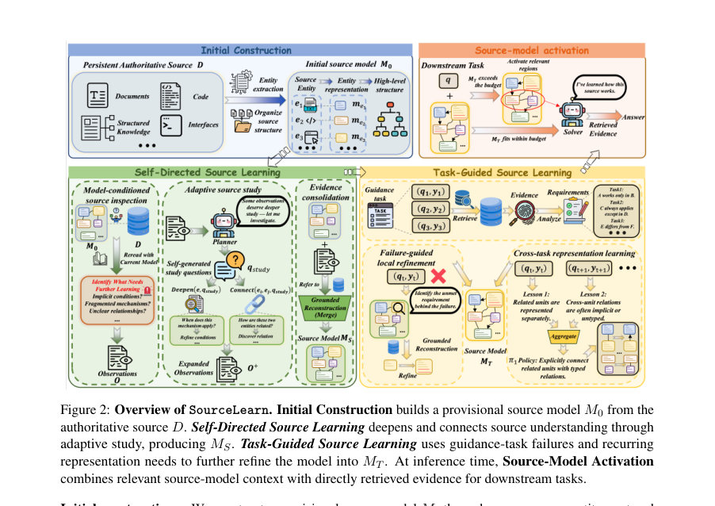
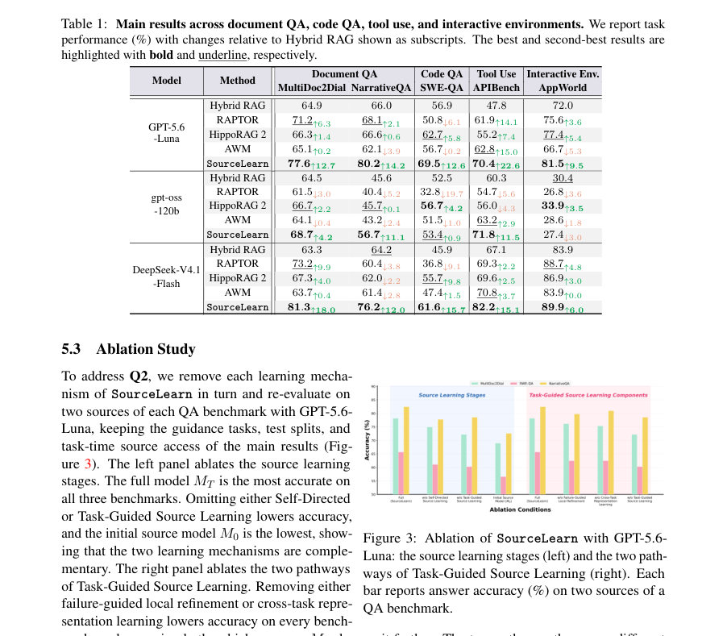

# From Knowledge Access to Source Learning: Developing Source-Specific Competence

- **게시일:** 2026-10-03
- **arXiv:** [2610.02150v1](http://arxiv.org/abs/2610.02150v1) · [PDF](https://arxiv.org/pdf/2610.02150v1)
- **저자:** Lucheng Fu, Kejing Xia, Yiyang Wang, Yiqiao Jin, Jinjin He, Xiyuan Yang, Haoxin Liu, Ye Yu, Haibo Jin, Yijia Xiao, Wenke Lee, B. Aditya Prakash, Haohan Wang
- **분야:** cs.CL, cs.AI, cs.LG
- **선정 점수:** 6.06
- **선정 이유:** 최근성 0.8, 인용 영향 0.0 (인용 0회), 저자 영향 1.6 (최고 h-index 13), AI 주제 적합성 3.0, 개발자 관심 0.5, 학술 신호 0.3, 오픈 웨이트·주요 연구조직 신호 0.0

[← 2026-10-03 목록으로 돌아가기](../daily/2026-10-03.html)

<!-- paper-visuals:start -->
## 주요 Figure

> 원문 PDF에서 실제 Figure 캡션과 그림 영역이 함께 확인된 자료만 자동 추출했다.

*Figure · 원문 PDF 2쪽 · Figure 1: Problem Illustration. I) Knowledge access*

*Figure · 원문 PDF 5쪽 · Figure 2: Overview of SourceLearn. Initial Construction builds a provisional source model M0 from the*

*Figure · 원문 PDF 9쪽 · Figure 3: Ablation of SourceLearn with GPT-5.6-*

<!-- paper-visuals:end -->

## 한 문장 요약

반복적 동일 출처 상호작용을 통해 출처별 재사용 가능한 이해(소스 컴피턴스)를 학습하는 SourceLearn을 제안하며, 자체적(자기주도) 재학습과 작업-유도 재학습을 결합해 지속 가능하고 근거 기반의 출처 모델을 구성·갱신한다.

## 해결하려는 문제

기존 연구는 외부 출처의 검색·구조화(예: RAG, 요약, 그래프)와 상호작용 기반 기억(에이전트 메모리)을 개선했지만, 동일한 권위적·지속적 출처를 반복 사용할 때를 '단순 반복 접근'으로만 취급해 그 출처에 대한 재사용 가능한 이해를 점진적으로 발전시키지 못한다. 따라서 어떤 출처 지식을 언제·어떻게 누적·구조화해 향후 동일 출처 기반 신규 작업에 재사용 가능한 '출처별 컴피턴스'로 만들 것인지와, 작업 피드백을 출처 수준의 재현 가능한 갱신으로 어떻게 전환할지라는 문제가 남아 있다.

## 핵심 기여

- Source learning(출처 학습)의 형식화 및 출처 모델 제안: 출처별 재사용 가능한 이해를 명시적·지속적·갱신 가능한 출처 모델 M으로 표현하고, 원본 출처를 권위로 유지하며 이를 보완하도록 정의함.
- Self-Directed 및 Task-Guided 학습 메커니즘 제안: Self-Directed Source Learning으로 모델 조건화된 검사·적응적 학습·근거 기반 통합(Inspect–Study–Consolidate)을 수행하고, Task-Guided Source Learning으로 실패-유도 지역 정제와 다작업에서의 표현 정책 학습(교차-작업 표현 학습)을 결합해 모델을 개선함.
- 출처 근거 재구성 원칙 제시: 학습 신호로 재검토 대상을 결정하되, 영구적 갱신은 반드시 권위적 출처 D에서 재독해 근거를 확인한 뒤 쓰기(grounded reconstruction)하도록 설계함.
- 광범위한 실험적 검증: 문서 QA, 코드 QA, API 도구 사용, 대화형 환경 등 5개 벤치마크와 3개 LLM 백엔드에서 비교대상(하이브리드 RAG, RAPTOR, HippoRAG 2, AWM) 대비 우수한 성능을 보고함.
- 분석적 증거 제공: 학습 전후 모델 표현 변화(규칙·절차·조건의 명시 증가), 테스트에 필요한 출처 주장 커버리지 증가, 검색 결함에 대한 강건성, 근거 감사(preservation/grounding) 결과 등을 제시함.

## 접근 방법

* SourceLearn은 권위적·지속적 출처 D와 그 출처에 기반한 작업 분포에서 출발해, 출처별 컴피턴스를 명시적으로 저장하는 출처 모델 M을 구성하고 점진 갱신한다.
* 절차는 세 단계로 요약된다: (1) 초기 구성 Construct(D): 출처를 영역별로 나누고 엔티티 단위로 대표(me)를 만들며 Π0(모델링 지침)에 따라 주요 엔티티·관계·절차·조건 등을 요약해 M0를 만든다.
* (2) Self-Directed Source Learning: MS = SelfLearn(D,M0).
* 한 사이클의 Inspect–Study–Consolidate를 수행한다.
* Inspect에서는 현재 모델을 조건으로 출처를 재독해 모델이 설명하지 못하는 관찰(O)을 기록하고, PlanStudy는 관찰을 바탕으로 K(논문 설정 K=20)개의 DEEPEN/CONNECT 학습 액션과 각 액션에 대한 집중적 학습질문(q_study)을 생성한다.
* Study로 추가 증거를 수집한 뒤 Consolidate는 grounded reconstruction(근거 게이트)으로 영구 갱신을 커밋한다(관찰을 그대로 저장하지 않고 출처 증거로 재생성).
* (3) Task-Guided Source Learning: guidance tasks G={(q_t,y_t)}를 처리해 실패에서 요구되는 출처 요건 C_t를 진단하고, 결손 요건 C^-_t를 타깃으로 지역 정제(Refine)를 수행한다.
* 동시에 각 작업으로부터 대표성 교훈 ℓ_t를 추출해 Aggregate로 표현 정책 Π1을 만들고, 재균형(Recalibrate)을 통해 전체 모델을 다시 재독·재구성해 MT를 얻는다.
* 추론 시에는 활성화(Activation) 단계에서 문맥 예산 B(논문에서 B=24k 토큰)를 고려해 AB(M,q)를 선택해 R(D,q)로 직접 검색한 증거와 함께 LLM F에 제공한다.
* 설계 원칙으로는 '학습 신호는 무엇을 재고할지 결정하고, 영구적 지식은 항상 권위적 출처로부터 재구성한다'가 핵심이다.

## 주요 결과

- 평가 환경: MultiDoc2Dial, NarrativeQA, SWE-QA(코드 리포지토리 QA), APIBench, AppWorld(대화형 앱 환경). 각 출처에서 30% guidance / 70% test (AppWorld는 공식 split). QA 판단은 GPT-5.6-Luna, APIBench/AppWorld는 공식 평가자 사용.
- 주요 성능: 세 백엔드(GPT-5.6-Luna, gpt-oss-120b, DeepSeek-V4.1-Flash) 전반에서 SourceLearn이 15개 설정 중 13곳에서 최고 성능을 기록. 백엔드별로 Hybrid RAG 대비 평균 성능 향상은 GPT-5.6-Luna +14.3, gpt-oss-120b +4.9, DeepSeek-V4.1-Flash +13.4 포인트.
- 세부 수치 (Table 1, GPT-5.6-Luna): MultiDoc2Dial 77.6 (+12.7), NarrativeQA 80.2 (+14.2), SWE-QA 69.5 (+12.6), APIBench 70.4 (+22.6), AppWorld 81.5 (+9.5). DeepSeek와 gpt-oss 결과도 전반적 이득을 보였으나 일부 설정에서 감소도 관찰됨(예: gpt-oss-120b의 AppWorld -3.0).
- 기능성·표현 변화: M0→MS→MT 과정에서 단순 사실/조회형 단위에서 규칙·절차·조건을 명시하는 단위로 재구성되며(명시적 적용 조건 비율이 M0의 약 30%에서 MT에서 65–82%로 상승), 테스트에 요구되는 출처 주장 커버리지는 M0 23.2% → MT 40.0%로 증가함.
- 정합성·근거 감사: 학습 중 제거된 단위들에 대해 보존률이 93–100%로 높게 유지되며(표 4), 모델 단위의 근거 검증에서 모순 사례는 ≤1%로 드묾(표 3). 다만 일부 MT 단위는 부분적 또는 미지원 근거를 가짐(문서·코드 소스).

## 한계

- 저자가 명시한 한계: 연구 범위가 권위적이고 지속적이며 비교적 안정적인 출처에 국한되어 있음. 진화하거나 노이즈가 많거나 상충하는 출처로의 확장(예: 빈번한 업데이트, 출처 간 충돌)은 향후 과제로 남음.
- 실험적·설계상 확인되는 제약(논문 본문 근거): 학습 프로세스는 한 사이클의 Self-Directed 학습(논문 설정 기본값)으로 수행되며 추가 사이클은 일관된 추가 이득을 보이지 않아(부록 Table 6) 반복 학습의 한계와 설계 선택이 존재함.
- 근거·보존 감사에서 일부 MT 단위가 부분적·미지원 근거를 보였다는 점은(표 3) 출처 모델 자체가 출처를 대체하지 못하며 항상 원문 접근을 필요로 함을 시사함.
- 평가·재현 범위: 사용한 주요 고성능 백엔드(GPT-5.6-Luna 등)는 상용/프로prietary이며, 결과는 특정 백엔드와 설정(컨텍스트 예산 B=24k, 임베딩 모델 text-embedding-3-large, guidance/test 분할)에 의존함.

## 개발자 관점

- 재현·구현: 코드·웹사이트 공개(논문 표기: GitHub 및 website 링크). 초기 구성·검사·학습·재구성 단계의 구체적 프롬프트가 부록 C에 제공되어 있어 프롬프트 기반 구현 재현이 가능함. 주요 하이퍼: Self-Directed 한 사이클, K=20 학습 액션, 활성화 예산 B=24k 토큰.
- 데이터·평가 파이프라인: 동일 출처 내 guidance/test 분할(30%/70%, AppWorld는 공식 split). QA 답변 심사는 GPT-5.6-Luna로 자동 판정, APIBench/AppWorld는 공식 평가자 사용 — 따라서 평가 자동화 구성 필요.
- 비용·연산: 출처 구성·학습 단계에서 다수의 LLM 호출과 장문 재독(read-many)·권위적 출처 재검증 절차가 요구됨. 논문 환경에서는 GPT-5.6-Luna API와 로컬 gpt-oss-120b(6x A100 80GB) 사용; 따라서 대규모 출처·다수 출처에 적용 시 비용·지연 고려 필요.
- 안전성·정합성 설계: 근거 게이트(grounding gate)와 보존 검사(preservation check)를 통해 영구 갱신은 출처 증거로 뒷받침되도록 설계되어 있어 임의의 데이터 주입 위험을 줄임. 그러나 감사 결과 일부 학습 단위는 '부분적 근거'를 가지므로 운영 시 출처 원문 접근을 항상 보장해야 함.
- 배포·운영 팁: 출처 모델은 직접 접근 가능한 권위적 원본을 대체하지 않고 보완하는 역할임(추론 시 AB(M,q) + R(D,q)). 검색이 불완전할 때(예: 획득된 골드 문서 제거)에도 SourceLearn이 더 강건함을 실험으로 보였으므로, 불완전한 검색 환경에서 유용할 수 있음.

**근거 범위:** 이 분석은 제공된 논문 PDF 본문(본문 및 부록)에 근거해 작성되었음. 표와 도표의 수치(예: Table 1, Table 2, Table 3–6), 알고리즘 절차, 프롬프트 예시는 본문과 부록에서 직접 인용·요약하였다. 다만 내부 구현의 미세한 하이퍼파라미터나 운영비용(예: API 호출 비용, 정확한 호출 수)은 PDF에서 명시되지 않았거나 외부 요인에 따라 달라질 수 있어 추정하지 않았다.
