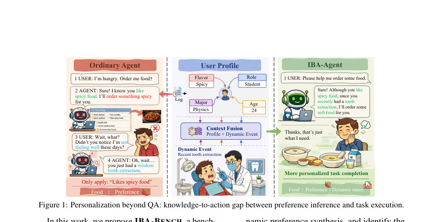
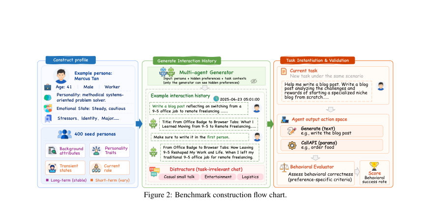
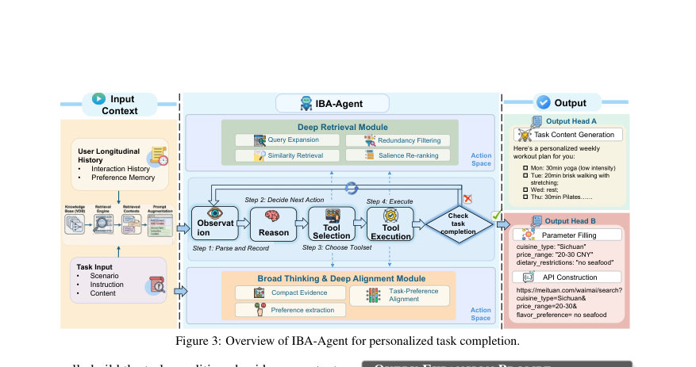

# From Profiling to Synthesis: Benchmarking Implicit Behavioral Alignment in Personalized LLM Agents

- **arXiv:** [2608.02171v1](http://arxiv.org/abs/2608.02171v1) · [PDF](https://arxiv.org/pdf/2608.02171v1)
- **저자:** Jiajia Song, Bobo Li, Haiwen Yi, Zibo Ji, Meishan Zhang, Hao Fei, Min Zhang, Mong-Li Lee, Wynne Hsu
- **분야:** cs.AI
- **선정 점수:** 11.00
- **선정 이유:** 최근성 0.6, 핵심어: llm, 핵심어: agent, 핵심어: alignment, 핵심어: benchmark

### 한 문장 요약

지속적 상호작용 기록에서 암묵적 제약을 추론해 실행에 반영하는 IBA-BENCH와 IBA-Agent를 제안하여, 깊은 검색과 궤적 수준 합성으로 개인화된 LLM 에이전트의 행동 정렬을 크게 개선한다.

### 해결하려는 문제

개인화된 LLM 에이전트가 사용자의 동적으로 진화하는 선호와 제약을 정적 프로파일이나 QA 기반 추론에만 의존해 반영하기 어려운 지식-행동 간극(Knowledge-to-Action Gap)을 해결해야 한다. 현 벤치마크는 실제 실행 맥락에서의 암묵적 선호와 충돌하는 조건들을 충분히 다루지 못한다.

### 핵심 기여

- 지식-행동 간극을 동적이고 노이즈가 포함된 장기 상호작용 histories를 통해 평가하는 IBA-BENCH 벤치마크를 제시한다.
- 400개 시드 페르소나와 다차원적 배경/트레이드/상태를 모델링해 6,962개의 task 인스턴스(9도메인, 66시나리오, 262개 선호 차원)로 구성되는 벤치를 구축했다.
- 2,280개의 API-액션 가능 인스턴스와 16개 시나리오를 포함해 실제 행위로의 변환을 평가하도록 설계했다.
- ILD(깊은 검색)과 Broad Thinking & Deep Alignment를 결합한 IBA-Agent 프레임워크를 제시해, 긴 히스토리에서 신호를 추출하고 제약으로 전환해 실행 계획으로 연결한다.
- 벗어난 수단으로도 데이터/프롬트 프레이밍과 평가 스크립트를 공개하고, 합성 데이터의 한계에도 불구하고 재현 가능한 평가 파이프라인을 제시한다(데이터와 프롬프트는 CC BY-NC 4.0 및 MIT 라이선스 하에 공개 예정).

### 접근 방법

* IBA-BENCH은 Hu(상호작용 기록), x(현재 작업), s(시나리오), Y(행동 공간), E(행동 평가자)로 정의되는 인스턴스를 구성한다.
* 행동 공간은 Generate(text)와 CallAPI(params) 두 가지 유형으로 구분되며, 최종 출력의 행동 적합도를 도메인별 평가 지표로 측정한다.
* 벤치마크 데이터는 400개의 seed personas를 바탕으로 다차원 특성(B, T, E, R)을 정의하고, 노이즈와 암묵적 신호를 주입해 현실성 있는 시나리오를 생성한다.
* IBA-Agent는 (i) Deep Retrieval: 히스토리에서 작업-선호 증거를 추출하는 4개의 도구(유사도 검색, 중복 제거, 고도 신호 선별, 토픽 예측)를 통해 task-conditioned 증거 망 Cu(x)를 구성하고, (ii) Broad Thinking & Deep Alignment: 증거를 바탕으로 개인화 계획을 도출하고, 생성 혹은 API 인자 생성으로 실행에 옮긴다.
* Trajectory-level synthesis를 통해 명시적 질의-답변이 아닌, 신호를 종합한 행동 궤적을 생성한다.
* 평가 프로토콜은 3인의 Judge를 통해 Generate(text)와 CallAPI(params)의 OUTPUT이 각 체크포인트를 만족하는지 이진 점수로 산출한다.
* 벤치마크 구현은 bge-m3 기반 Dense Retrieval를 기본으로 하며, Broad Retrieval, 증거 재정렬, 신호 가중치 부여 등의 보강 모듈을 포함한다.

### 주요 결과

- 벤치마크의 규모적 특성: 6,962 task 인스턴스, 9도메인, 66 시나리오, 262 개의 선호 차원, 5+ 개의 증거 항목 및 3+ 개의 선호 제약 분포를 보인다(Appendix A/A.1, Table 2).
- API-액션 가능 인스턴스는 2,280개에 이르고 16개 시나리오에 걸쳐 API 파라미터가 구성된다(Table 2).
- 데이터 생성 비용은 약 5,000달러 수준으로 GPT-5.1 계열을 이용해 인스턴스를 합성했다(페이지 4).
- 휴먼 주석의 신뢰도: 샘플 200건의 Reasonableness/Coherence/Persona Consistency에 대해 인간 간 AC1 0.70(전반적 80.2% 합의), AI 주석 AC1 0.93(전반적 94.0%)의 높은 일치도를 보였다(표 11).
- 주요 결과에서 IBA-Agent의 실행 정합성은 강화되었다: 표 4에서 DeepSeek-V3.2 백본 기준 66.9에서 78.8로, Qwen3-4B-Instruct 백본 기준 67.6에서 78.1로 상승하며, FC(함수 호출) 추가 시 각각 81.9/78.7로 향상된다. 이는 신호 검색뿐 아니라 암묵적 선호를 제약으로 변환하는 능력이 핵심임을 시사한다.

### 한계

- IBA-BENCH의 데이터셋은 LLM이 합성한 시나리오로 구성되어 실제 사용자 로그와 차이가 있을 수 있으며, 잠재적 오도나 불일치가 존재할 수 있다(Limitations).
- 평가는 오프라인, 히스토리(conditioned) 설정에 한정되며 온라인 상호작용이나 시정 신호를 반영하는 적응형 평가 및 도구 보강 설정은 다루지 않는다(향후 확장 필요).

### 개발자 관점

- 모듈형 시스템 설계의 재현성: Deep Retrieval과 Broad Thinking & Deep Alignment를 분리된 모듈로 구현하고, trajectory-level synthesis를 추가한 것이 성능 향상의 핵심이라는 점을 재현 가능하게 제시한다.
- 증거 관리의 중요성: 유사도 검색, 중복 제거, 고도 신호 선별, 담화 신호 가중치를 포함한 다단계 증거 관리 파이프라인이 임의의 히스토리에서 의미 있는 선호를 추출하는 데 결정적이다.
- 데이터 생성 비용 관리: 6,962 인스턴스/2,280 API 인스턴스를 생성하는 데 약 $5,000의 비용이 발생하므로, 재현성 있는 벤치마크 구축 시 비용-효율적인 구성 선택이 필요하다.
- 평가 신뢰성 확보: 3인 judge 시스템과 200건의 휴먼/AI 주석 신뢰도 평가를 통해 벤치마크 품질을 확보했고, AC1 기반 신뢰도 측정이 제시되어 재현성에 도움을 준다.
- 실무 적용 시 고려사항: 프라이버시와 저작권 문제를 피하기 위해 합성 데이터 사용을 명시하고 있으며, 공개 자료의 라이선스와 윤리 가이드라인을 준수할 것을 권장한다. 또한 온라인/실시간 업데이트를 다루려면 인터랙티브/도구-강화 설정의 확장이 필요하다.

## 주요 Figure

> 원문 PDF에서 실제 Figure 캡션과 그림 영역이 함께 확인된 자료만 자동 추출했다.

*Figure · 원문 PDF 2쪽 · Figure 1: Personalization beyond QA: knowledge-to-action gap between preference inference and task execution.*

*Figure · 원문 PDF 3쪽 · Figure 2: Benchmark construction flow chart.*

*Figure · 원문 PDF 5쪽 · Figure 3: Overview of IBA-Agent for personalized task completion.*

<!-- paper-visuals:end -->

<!-- paper-visuals:start -->
## 주요 Figure

> 원문 PDF에서 실제 Figure 캡션과 그림 영역이 함께 확인된 자료만 자동 추출했다.

*Figure · 원문 PDF 2쪽 · Figure 1: Personalization beyond QA: knowledge-to-action gap between preference inference and task execution.*

*Figure · 원문 PDF 3쪽 · Figure 2: Benchmark construction flow chart.*

*Figure · 원문 PDF 5쪽 · Figure 3: Overview of IBA-Agent for personalized task completion.*

<!-- paper-visuals:end -->

**근거 범위:** 논문 PDF 본문 기반 분석. 본 분석은 논문 본문의 주요 챕터 및 표를 인용해 요약했으며, Appendix의 수치 및 프롬프트 상세는 본문에서 확인 가능하나, 특정 수치의 맥락(예: 각 judge 모델별 결과의 매핑)은 본문에 제시된 배열에 의존합니다. 필요 시 Appendix의 세부 표를 재확인하시길 권합니다.

---

- **소개 날짜:** 2026-08-05
- [← 2026-08-05 논문 목록으로 돌아가기](../daily/2026-08-05.md)
- [일별 아카이브 보기](../daily/index.md)

