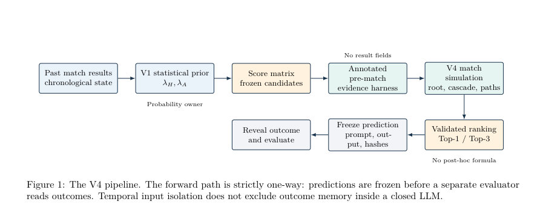

# From Score Matrices to Football-Aware Match-State Simulation: An Auditable LLM Harness for Exact-Score Reranking

- **게시일:** 2026-08-06
- **arXiv:** [2608.05030v1](http://arxiv.org/abs/2608.05030v1) · [PDF](https://arxiv.org/pdf/2608.05030v1)
- **저자:** Shaopeng Liang
- **분야:** cs.AI
- **선정 점수:** 9.48
- **선정 이유:** 최근성 1.4, 핵심어: llm, 핵심어: reasoning, 핵심어: benchmark, 분야 가중치 2.0

[← 2026-08-06 목록으로 돌아가기](../daily/2026-08-06.md)

## 한 문장 요약

동적 Dixon–Coles 점수 행렬을 확률적 우선권으로 유지하고, 프리매치 증거를 포장한 '하네스'로 LLM에게 골-단계 경기 시뮬레이션과 순위 재정렬을 맡겨 정확스코어(Exact-score) 선택을 개선하려는 감사 가능(hlicable) 하이브리드 시스템 설계 및 네 가지 반복(V1→V4)의 실험적 검증.

## 해결하려는 문제

정확 스코어 예측은 골 수가 적고 경기 상태에 따른 상호작용(예: 선제골 이후 전술 변화), 선수 결장·교체·매치업의 의미 등 맥락적 판단이 중요해 기존의 동적 포아송 계열 모델은 통계적 일관성은 제공하나 이러한 의미론적·조건적 변화를 반영하지 못한다. 반면 LLM은 맥락 추론이 가능하지만 보정된 확률 출력이 아니므로 단독 사용 시 신뢰할 수 있는 분포를 제공하지 못한다. 본문은 '고정된 확률 사전(prior)을 유지하면서 LLM이 감사 가능한 방식으로 경기-기제(reasoning)만 추가할 수 있는가'라는 구체적 질문을 다룬다.

## 핵심 기여

- 확률적 상태 추정(동적 Dixon–Coles/GAS 기반)과 LLM 추론, 증거 포장(harness), 결정론적 검증기를 분리한 감사 가능한 하이브리드 아키텍처 제안.
- V1(수학적 베이스) → V2(LLM 잔차를 λ로 매핑) → V3(냉동 후보에 대한 골별 시뮬레이션) → V4(공유된 선제골 판단, 포스트골 캐스케이드, 시간 인지 중단, 결정론적 꼬리 후보)로 이어지는 설계 진화와 각 버전의 비교·분석 문서화.
- 프롬프트·입출력·스키마·해시를 매치 단위로 고정·보관하는 연대기적 리플레이(protocol)와 per-match 아카이브로 개발 과정의 재현성·감사를 가능하게 한 절차.
- 정확스코어 재순위에서 축적된 음성(negative) 결과와 어디에서 시뮬레이션이/되지 않는지를 명확히 보여주는 경험적 발견(예: 0–0 문제, 꼬리 후보는 커버리지를 넓혔으나 실제 히트로 이어지지 않음).

## 접근 방법

* 아키텍처는 네 구성 요소로 분리된다: (1) V1 동적 확률적 우선(prior): GAS(일반화자기회귀스코어) 형태의 공격/취약성 상태 업데이트(하프라이프 h=1440일, ga=0.04, gv=0.02)로 팀별 기대득점 λH, λA를 계산하고 Dixon–Coles 저득점 보정 τxy(ρ=−0.05)로 정규화된 점수 행렬 p(x,y)를 만든다; (2) 프리매치 증거 하네스: 킥오프·컷오프, V1의 λ와 행렬·후보, 리그·폼·선발·교체·보고·매치업 등 구조화된 증거를 포함해 LLM에게 공급하고 입력 의미를 명시적으로 정의한다; (3) LLM 역할 변화(버전별): V2는 LLM이 홈/어웨이 공격/수비에 대한 상대지표 4개를 출력하고 단일 학습 κ로 이를 log-λ 보정에 매핑하는 '수학+LLM+수학' 샌드위치였으나 일관성 없음; V3는 LLM이 0–0에서 출발해 최대 세 개의 골-단계(goal-by-goal) 경로를 시뮬레이션하고 각 골 이후 전술적 재평가를 수행해 냉동된 Top-10 후보를 재정렬(LLM은 λ를 변경 불가); V4는 공통의 '선제골(root)' 판단, 시간 기반 중단 규칙, 포스트골 캐스케이드(반복성·추격측 반응력·리더의 공간활용)와 최대 다섯개의 결정론적 꼬리(High-scoring draw, high-scoring wins, runaway 등) 앵커를 추가해 경로 깊이 통제; (4) 검증기: 반환된 점수는 항상 냉동 후보 풀에 속하도록 스키마 검증.
* 실험은 연대기적 리플레이로 각 매치별로 별도 LLM 컨텍스트를 사용하고 프롬프트·응답·해시를 동결한 뒤 별도 평가기로 결과를 채점하는 절차로 수행되었다.

## 주요 결과

- 중심 벤치마크: 2025–26 EPL의 첫 150경기(연대기적 리플레이). V1(점수 행렬 모드) Top-1 정확도 15/150 = 10.0%, Top-3 40/150 = 26.7%.
- V3(경로 시뮬레이션) Top-1 18/150 = 12.0%, Top-3 45/150 = 30.0%.
- V4(캐스케이드 포함) Top-1 22/150 = 14.7%, Top-3 46/150 = 30.7%. V4은 후보 커버리지를 V1의 77.3% (116/150)에서 84.7% (127/150)로 증가시켰지만 새로 추가된 꼬리 앵커는 정확한 Top-3 히트가 없었음.
- V1의 '원래' 1X2 확률(행렬 합산에 의한) 성능: argmax 정확도 80/150 = 53.3%, 로그손실 0.987803, 브라이어 점수 0.586970, 정규화 RPS 0.209451. V3/V4는 순위만 반환해 적절한 확률 기반 점수는 계산 불가.
- 통계적 검정: V1→V4의 Top-1 차이에 대한 페어드 McNemar p=0.2295(유의하지 않음), Top-3 p=0.3075(유의하지 않음); score-derived 1X2 차이는 p=0.0024(유의). 그러나 저자들은 첫 100경기가 개발에 사용되어 이 결과는 탐색적이라 명시함.

## 한계

- 저자 기재 한계 — 잠재적 메모리 오염: LLM은 닫힌 가중치 모델(gpt-5.6-sol)로 실험은 목표 시즌 이후 실행되었으므로 프리트레인·검색 히스토리에 경기 결과가 포함될 수 있어 완전한 비오염을 보장하지 못함.
- 저자 기재 한계 — 개발 재사용: V4 설계는 첫 100경기를 참조해 개발되었으므로 첫-150 결과는 '엔지니어링 벤치마크'이며 확증적 일반화 증거가 아님.
- 저자 기재 한계 — 확률 미출력: V3·V4는 정규화된 사후 확률을 출력하지 않으므로 proper scoring rule(로그손실·브라이어 등)로 비교하거나 캘리브레이션할 수 없음.
- 관찰된 제약 — 0–0(무득점) 문제: V4는 모든 150경기에 대해 'first_goal_more_likely'를 선택해 0–0을 식별하지 못했고, 실제 0–0 8경기 중 어느 것도 Top-3에 포함되지 못함(0–0에 대한 재현 실패). 이는 루트 판단의 편향을 드러냄(감사 가능하지만 교정 필요).  

관찰된 제약 — 꼬리 후보는 커버리지는 늘렸으나 순위로 승격되지 않음: V4가 꼬리 후보 커버리지를 11경기 늘렸으나 추가 앵커가 최종 Top-3에 들어온 경우는 드물고(추가 앵커가 Top-3로 들어간 건 3경기에 불과, 추가 앵커 자체가 정확 히트는 없음), 대형 마진·고득점 사건에 대한 재현(리콜)은 낮음(예: 마진≥3인 24경기 중 Top-3 정확 매치 수 3개).

## 개발자 관점

- 확률적 소유권을 명확히 분리하라: 수학적 모델이 정규화된 분포와 후보 생성을 소유하게 하고 LLM은 조건부 이유·경로 시뮬레이션에 집중하도록 인터페이스를 엄격히 정의하면 감사성과 안정성이 향상된다.
- 프롬프트·입출력·스키마·해시를 매치 단위로 영구 아카이빙하라(논문은 이를 구현). 실전 재현을 위해선 아카이브와 함께 LLM 버전·샘플링 설정·스키마 해시를 고정해야 함.
- LLM이 순위만 내놓을 경우 proper scoring과 캘리브레이션이 불가능하므로, 실전 배포 전에는 '후보 집합에 대한 정규화된 사후 확률 + 예약(꼬리) 질량'을 출력하고 개발 창에서 캘리브레이션을 수행해 정형화해야 함.
- 입력 증거의 질(보고 신뢰도)과 신호 유형별로 계층적 캘리브레이션을 도입하라: 신호 타입·확신도·남은 시간·게임 상태에 따라 조정 크기를 달리하고 가중치 수축(shrinkage)을 적용해야 함(저자는 V2의 단일 κ가 실패했다고 명시).
- 후보 생성(coverage)과 후보 승격(ranking)을 분리해 평가·로그를 남겨라. 꼬리 후보가 존재하더라도 랭킹 모델이 이를 상향시킬 수 있어야 실제 성능 향상으로 이어짐—따라서 별도 지표로 커버리지·순위 효과를 측정해야 함.

<!-- paper-visuals:start -->
## 주요 Figure

> 원문 PDF에서 실제 Figure 캡션과 그림 영역이 함께 확인된 자료만 자동 추출했다.

*Figure · 원문 PDF 3쪽 · Figure 1: The V4 pipeline. The forward path is strictly one-way: predictions are frozen before a separate evaluator*

<!-- paper-visuals:end -->

**근거 범위:** 이 분석은 제공된 논문 PDF 본문 전체를 근거로 작성되었다. 표·수치·설계 세부는 본문에서 직접 인용했으며, 프롬프트 원문(중문)이나 내부 코드·데이터는 저자가 아카이브한 항목을 참조한다고 명시되어 있으나 본문에 전부 포함되지 않아 세부 재현 절차(예: LLM의 내부 샘플링 seed, 완전한 프롬프트 텍스트)는 별도 확인이 필요하다. 또한 저자가 명시한 바와 같이 LLM이 닫힌 가중치 모델이므로 모델 메모리 오염 가능성은 본문 자체에서 완전히 배제되지 않는다.
