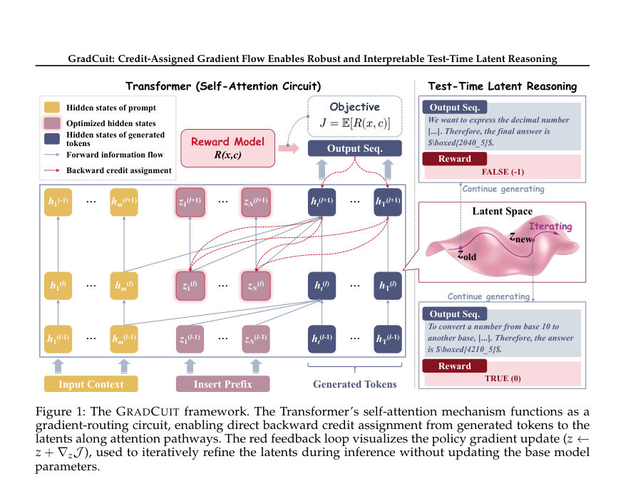
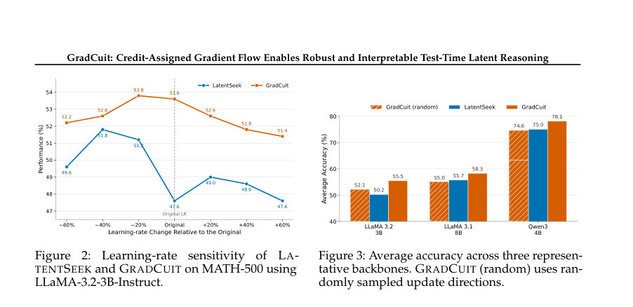

# GradCuit: Credit-Assigned Gradient Flow Enables Robust and Interpretable Test-Time Latent Reasoning

- **arXiv:** [2608.02585v1](http://arxiv.org/abs/2608.02585v1) · [PDF](https://arxiv.org/pdf/2608.02585v1)
- **저자:** Zhaoxin Yu, Qi Shen, Hengli Li, Zhaowei Zhang, Song-Chun Zhu, Chi Zhang, Zilong Zheng
- **분야:** cs.LG, cs.CL
- **선정 점수:** 9.80
- **선정 이유:** 최근성 0.7, 핵심어: large language model, 핵심어: reasoning, 핵심어: scaling, 분야 가중치 2.0

### 한 문장 요약

GradCuit은 생성 과정 중간의 Transformer 내부에 최적화 가능한 연속 잠재 상태를 삽입해, 후속 토큰의 로그확률로부터 직접 보상 기반 그래디언트를 할당함으로써 테스트 시점의 잠재 추론을 더 견고하고 해석 가능하게 만드는 방법이다.

### 해결하려는 문제

기존의 테스트 시점 최적화 기반 잠재 추론 방법들은 보통 잠재 상태와 추론 궤적을 디코딩된 토큰을 통해 간접적으로 연결하여 시퀀스 수준의 크레딧 할당이 비직접적이고, 잠재 업데이트가 이후 추론에 어떻게 영향을 주는지가 불분명하다.

### 핵심 기여

- GradCuit 방법 제안: 프롬프트의 히든 표현과 생성된 연속(continuation) 사이의 선택된 Transformer 레이어에 최적화 가능한 연속 잠재 상태를 삽입하여, 모델 파라미터는 고정된 상태로 테스트 시점에 인스턴스별 잠재를 최적화함.
- 인과적(self-) 어텐션을 활용해 연속의 각 토큰 로그확률이 남은 Transformer 블록을 통해 각 선행 잠재 상태에 대해 미분 가능한 경로를 갖도록 설계함으로써, 연속 전체로부터 보상 가중 그래디언트를 잠재에 직접 할당할 수 있게 함.
- 광범위한 실험(초록 기준): 5개의 instruction-tuned 백본, 3개의 추론 벤치마크, 2개의 답변 포맷에서 평균 정확도 64.5%를 달성했으며, chain-of-thought 프롬프트보다 6.6%p, 가장 강한 경쟁 방법보다 2.4%p 우수하다고 보고함(초록에 기재된 수치).
- 견고성 향상 보고: 7개 학습률 설정에서 LatentSeek보다 일관되게 뛰어나며, 정확도의 표준편차를 1.53에서 0.82로 줄였다고 보고함. 또한 무작위 워크(random-walk) 변형도 LatentSeek과 경쟁 가능한 성능을 보였다고 주장함(초록 기준).
- 해석성 분석: 토큰 수준 그래디언트 귀속(token-level gradient attribution)은 잠재의 영향이 추론 연결자(reasoning-connector) 토큰들에 집중됨을 드러내며, 레이어 분석은 초기~중간 Transformer 레이어가 최적화 공간으로 가장 효과적임을 시사함.

### 접근 방법

초록에 따르면 GradCuit은 다음과 같이 동작한다. 선택한 Transformer 레이어의 프롬프트 쪽 히든 표현과 생성될 연속 사이에 최적화 가능한 연속 잠재(state)를 삽입한다. 모델 파라미터는 고정한 채로, 생성된 연속의 토큰들에 대한 로그확률이 남은 Transformer 블록을 통해 삽입된 각 잠재 상태에 대해 미분 가능한 경로를 가지므로(인과적 self-attention 구조 덕분에) 전체 연속에 대한 보상 신호를 이용해 잠재에 대한 그래디언트를 직접 계산하여 보상 가중 최적화를 수행한다. 구체적인 잠재의 차원, 초기화 방법, 사용한 최적화 알고리즘(예: 어떤 옵티마이저, 배치 처리 여부), 삽입 레이어 선택 기준 등은 초록만으로는 확인하기 어렵다.

### 주요 결과

- 초록에 보고된 전체 평균 정확도는 64.5%임.
- GradCuit은 chain-of-thought(혹은 chain-of-thought 프롬프트) 대비 평균 성능에서 6.6 퍼센트포인트 더 높았다고 초록에서 명시함.
- 가장 강한 경쟁 방법 대비 2.4 퍼센트포인트 우수하다고 보고함(초록 기준).
- 학습률 영향을 평가한 결과, 7개 학습률 설정 전반에서 LatentSeek보다 일관되게 우수했고 정확도의 표준편차를 1.53에서 0.82로 감소시켰다고 보고함.
- 무작위 워크(random-walk) 변형도 LatentSeek과 비교해 경쟁력 있는 성능을 보였다고 초록에 기술됨.

### 한계

- 초록만으로는 구현 상세(잠재 벡터의 차원·수, 초기화 전략, 사용한 옵티마이저와 하이퍼파라미터 범위, 계산·메모리 비용, 지연 시간 등)을 확인하기 어렵다.
- 초록은 "5개 백본, 3개 벤치마크, 2개 포맷"이라고만 기술되어 구체적인 모델 이름, 벤치마크 명칭(예: 어떤 추론 문제들), 데이터셋별 성능 분포는 알 수 없다.
- GradCuit는 테스트 시점에 내부 활성화와 그래디언트 접근이 필요하므로(잠재를 삽입하고 역전파를 통해 최적화해야 함) 폐쇄형 API(예: 외부에서 내부 히든/그래디언트 접근이 불가능한 상용 모델)와의 호환성은 제한될 가능성이 높으며, 초록만으로는 이 호환성 여부를 확인하기 어렵다.
- 보상 신호의 질(예: 정확한 보상/피드백이 있어야 하는지)과 보상 설계 민감도에 대한 정보는 초록만으로 확인하기 어렵다. 잘못된/희박한 보상은 성능 저하를 초래할 수 있다는 일반적 위험이 존재한다고 추정되지만, 구체적 실험은 초록에 나와 있지 않음.

### 개발자 관점

- 모델 내부에 잠재를 삽입하고 테스트 시점에 그래디언트로 최적화하려면 모델의 활성화 및 역전파 훅(access to hidden states and gradients)이 필요하다. 따라서 오픈 소스 모델 또는 내부에서 실행 가능한 모델에 적합하다; 폐쇄형 API에서는 바로 적용하기 어려울 수 있다.
- 방법은 인과적(causal) self-attention 구조를 활용하므로 주로 autoregressive Transformer 계열에 적합하다. 모델 구조가 비표준적이면 미분 경로가 달라질 수 있다.
- 초록 보고에 따르면 초기~중간 레이어가 최적화 공간으로 효과적이므로, 레이어 선택을 실험적으로 탐색하되 우선 초기·중간 층을 시도해보는 것이 유용하다.
- 보상-가중 그래디언트(reward-weighted gradients)를 사용하므로 보상 신호 설계와 안정적인 최적화(학습률 스케줄링, 정규화 등)가 중요하다. 초록에는 다양한 학습률(7개 설정)에서의 견고성을 강조하므로 하이퍼파라미터 민감도 실험을 권장한다.
- 해석성 도구로서 토큰 수준 그래디언트 귀속을 사용해 잠재의 영향이 어디에 집중되는지 확인할 수 있다. 이 정보는 잠재의 역할 해석과 레이어/토큰 선택에 실용적 인사이트를 줄 수 있다(초록에서 해당 분석을 보고함).

<!-- paper-visuals:start -->
## 주요 Figure

> 원문 PDF에서 실제 Figure 캡션과 그림 영역이 함께 확인된 자료만 자동 추출했다.

*Figure · 원문 PDF 2쪽 · Figure 1: The GRADCUIT framework. The Transformer’s self-attention mechanism functions as a*

*Figure · 원문 PDF 6쪽 · Figure 2: Learning-rate*

*Figure · 원문 PDF 6쪽 · Figure 3: Average accuracy across three represen-*

<!-- paper-visuals:end -->

**근거 범위:** 이 분석은 논문의 제목과 초록에 근거해 작성되었으며, 초록에 명시되지 않은 구체적 실험 설정, 구현 세부사항, 데이터셋 이름 등은 초록만으로 확인하기 어렵다. 위의 수치·주장은 초록에 보고된 내용만을 인용하였다.

---

- **소개 날짜:** 2026-08-05
- [← 2026-08-05 논문 목록으로 돌아가기](../daily/2026-08-05.md)
- [일별 아카이브 보기](../daily/index.md)

