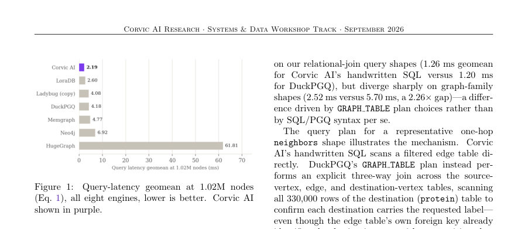
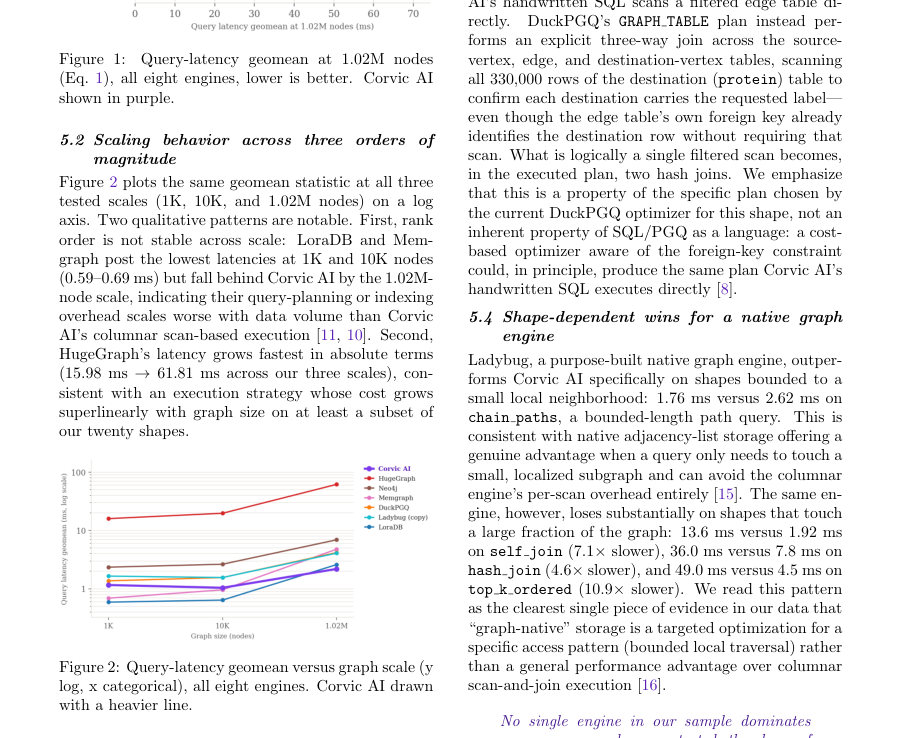
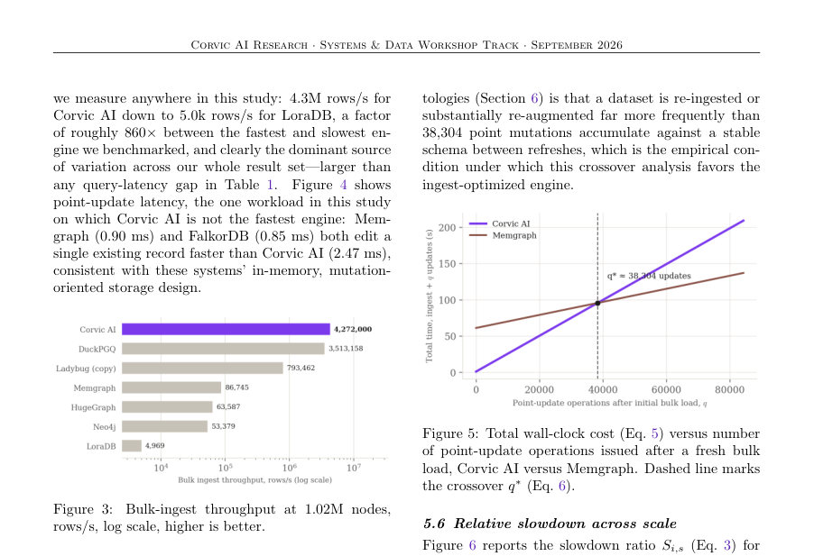

# Graph Memory for LLM Agents: At What Cost? A Comparative Evaluation of Query, Ingest, and Update Performance Across Graph Database Engines

- **게시일:** 2026-09-22
- **arXiv:** [2609.23315v1](http://arxiv.org/abs/2609.23315v1) · [PDF](https://arxiv.org/pdf/2609.23315v1)
- **저자:** Donald Nguyen, Gurbinder Gill, Hadi Ahmadi, Christopher J. Rossbach
- **분야:** cs.DB, cs.AI
- **선정 점수:** 4.12
- **선정 이유:** 최근성 0.6, 인용 영향 0.0 (인용 0회), 저자 영향 0.0 (최고 h-index 0), AI 주제 적합성 2.3, 개발자 관심 0.5, 학술 신호 0.8, 오픈 웨이트·주요 연구조직 신호 0.0

[← 2026-09-22 목록으로 돌아가기](../daily/2026-09-22.html)

<!-- paper-visuals:start -->
## 주요 Figure

> 원문 PDF에서 실제 Figure 캡션과 그림 영역이 함께 확인된 자료만 자동 추출했다.

*Figure · 원문 PDF 4쪽 · Figure 1: Query-latency geomean at 1.02M nodes*

*Figure · 원문 PDF 4쪽 · Figure 2: Query-latency geomean versus graph scale (y*

*Figure · 원문 PDF 5쪽 · Figure 3: Bulk-ingest throughput at 1.02M nodes,*

<!-- paper-visuals:end -->

## 한 문장 요약

그래프형 온톨로지(메모리)용 데이터베이스 엔진들에 대해 합성 바이오메디컬 형태의 프로퍼티 그래프와 20개 쿼리 형태를 사용해 쿼리 지연, 대량 적재(ingest) 처리량, 포인트 업데이트 지연, 정답률을 비교하고 ingest/쿼리 비용을 합산한 간단한 총소유비용(TCO) 모델로 실무적 교차점(q*)을 분석한다.

## 해결하려는 문제

기존 벤치마크들은 '그래프 네이티브' 대 '관계/칼럼형' 간 성능 차이를 혼재된 변수(쿼리 언어, 실행계획, 저장구조, 인덱싱, 적재 비용)로 보고하는 경향이 있어, 실제로 어떤 시스템 차원이 실무에 영향을 미치는지(특히 쿼리계획 품질과 데이터가 질의 가능한 상태가 되는 비용)를 분리해 평가하지 못한다. 본 연구는 쿼리-계획 효과와 저장엔진·인덱싱 효과를 분리하고, 적재 처리량이 총 비용에서 차지하는 비중을 정량화하는 것을 목표로 한다.

## 핵심 기여

- 재현 가능한 20개 쿼리 형태(workload)를 설계하여 쿼리계획 효과와 스토리지 엔진 효과를 구분할 수 있게 함(이웃 조회, 경로, 교집합, anti-join, 그룹집계, top-k, 시간 필터, 전체 스캔, 릴레이션 조인 등 포함).
- 합성 바이오메디컬-형태의 프로퍼티 그래프(1.02M 노드, 5.34M 행)와 3개 스케일(1K, 10K, 1.02M)에서 Corvic AI(칼럼형 OLAP)와 7개 경쟁 엔진(LoraDB, Ladybug, DuckPGQ, Memgraph, Neo4j, HugeGraph, FalkorDB)을 쿼리 지연(geomean), 대량 적재 처리량, 포인트 업데이트 지연, 정답률 측면에서 비교·보고함(부록에 전체 원시 비교표 공개).
- 쿼리계획 민감도 분석: DuckPGQ와 Corvic AI의 동일 논리적 질의에서 옵티마이저가 다른 계획을 선택해 그래프 계열(shape)에서 2.26× 성능 차이를 야기하는 사례(구체적으로 GRAPH TABLE 계획이 목적지 테이블을 불필요하게 스캔하는 현상)를 분해·설명함.
- 총소유비용(TCO) 모델을 제시하고, ingest 비용과 쿼리 지연의 교차점 q*를 수식화(Eq. 5–6)하여 실제 운영에서 적재 최적화 vs 쿼리 최적화의 우선순위를 결정하는 근거를 제공함(예: 점 업데이트 기준 Corvic AI vs Memgraph의 교차점 q*≈38,304).

## 접근 방법

* 논문 본문 기준으로: (1) 데이터셋: STaRK-PRIME·PrimeKG 스키마를 참조하여 합성된 바이오메디컬-형태 프로퍼티 그래프를 생성(전체: 1.02M 노드·5.34M 노드+엣지 행), 추가로 1K·10K 노드 축소본 준비.
* (2) 워크로드: 20개 쿼리 형태를 각 엔진의 고유 쿼리언어(Cypher, Gremlin, SQL, SQL/PGQ, 엔진 DSL 등)로 각 엔진에 '관용적으로' 구현하여 실행(각 엔진의 관습적/권장 표현 사용).
* (3) 시스템: Corvic AI(칼럼형 OLAP), DuckPGQ(SQL/PGQ), LoraDB, Ladybug, Memgraph, Neo4j, HugeGraph, FalkorDB를 동일 하드웨어·측정 하니스에서 비교(단, PuppyGraph는 워크로드 완료 불가로 제외; FalkorDB 일부 결과는 20/20 미달).
* (4) 측정치: 20개 쿼리형의 엔진별 지연을 기하평균(geomean, Eq.1)으로 집계, 정답률(참조 구현과 비교), 전체 행 적재 처리량(rows/s, Eq.2), 단건 포인트 업데이트 지연, 배치 업데이트 처리량을 반복 실험으로 기록.
* (5) 지표 정의와 TCO 모델: 지연의 기하평균 사용(왜냐하면 지연이 heavy-tailed), ingest 처리시간과 평균 쿼리 지연을 합산해 총 벽시계 시간으로 모델링하고 두 엔진의 교차점 q* 도출(Eq.6).

## 주요 결과

- 데이터셋 크기: 전체 그래프 1.02M 노드, 5.34M 총 행(노드+엣지). 세 가지 스케일: 1K, 10K, 1.02M.
- 쿼리 지연(geomean@1.02M, Table 1): Corvic AI 2.19 ms(20/20 정답), FalkorDB 1.81 ms(18/20, 일부 쿼리 미완료로 직접 비교 제한), LoraDB 2.60 ms(18/20), Ladybug(copy) 4.08 ms(20/20), DuckPGQ 4.18 ms(20/20), Memgraph 4.77 ms(20/20), Neo4j 6.92 ms(20/20), HugeGraph 61.81 ms(19/20).
- 스케일링: 엔진 간 순위가 스케일에 따라 변함(LoraDB, Memgraph는 1K·10K에서 낮은 지연을 보였으나 1.02M에서 Corvic AI에 뒤짐). HugeGraph는 스케일에 따라 지연이 급증(15.98 ms→61.81 ms)해 그래프 크기에 대해 서브라인어·초과성장 비용을 보임.
- 쿼리계획 민감도: DuckPGQ와 Corvic AI의 동일 논리적 질의 비교에서 '그래프 계열' 쿼리형은 Corvic AI 2.52 ms vs DuckPGQ 5.70 ms로 2.26× 차이 발생. 원인은 DuckPGQ의 GRAPH TABLE 계획이 목적지 테이블 전체(330k 행)를 스캔하고 두 개의 해시조인을 수행하는 실행계획을 선택했기 때문이며, 이는 옵티마이저/계획 선택의 산물임.
- 패턴별 성능: Ladybug(네이티브 그래프)는 '작은 국소 이웃' 접근 패턴에서 우위(예: chain path: Ladybug 1.76 ms vs Corvic AI 2.62 ms(본문)), 그러나 그래프의 큰 부분을 건드리는 조인·top-k·self-join에서는 훨씬 느림(예: self-join 13.6 ms vs 1.92 ms, hash-join 36.0 ms vs 7.8 ms, top-k 49.0 ms vs 4.5 ms 등 본문 수치). 결론: 그래프-네이티브 저장은 국소 탐색에 유리하지만 범용적 우위는 아님. (본문에서 여러 예시 제시).

## 한계

- 저자 언급: 샘플링·일반성 한계 — 8개 엔진과 하나의 합성 데이터형태만 평가했으므로 그래프 DB 시장 전체에 대한 포괄적 결론이 아님.
- 저자 언급: 합성 데이터 사용 — 데이터셋은 PrimeKG/STaRK-PRIME 스키마를 참조해 생성했지만 실제 데이터에서의 차수 분포·지역성·갱신 패턴이 다르면 상대적 순위가 달라질 수 있음.
- 저자 언급: 제외·구성표시 — PuppyGraph는 워크로드 완료 불가로 제외, FalkorDB는 일부 쿼리 미완료로 20/20 비교 대상에서 제외; Ladybug는 두 가지(attach, copy) 구성 중 더 빠른 copy만 메인에 표기(부록에 다른 구성 공개).
- 저자 언급: 단일 하니스·하드웨어 — 모든 타이밍은 하나의 측정 하니스와 동일 하드웨어에서 수집되었고, 하드웨어 구성·동시성 수준·클라이언트 오버헤드 등은 변동해 실험하지 않음(외적 타당성 제한). 또한 HugeGraph의 배치 업데이트는 DNF로 측정 불가한 항목이 있음.  저자 소속(이해상충) 공개됨: Corvic AI가 피험자 시스템임을 밝힘(편향 가능성 완화 위한 공개 조치 있음).

## 개발자 관점

- 벤치마크 설계: 쿼리 성능만 보고 '베스트 DB'를 결정하지 말고 적재(ingest) 비용과 업데이트 비용을 함께 측정하라. 총소유비용 모델(TCO, Eq.5–6)을 사용해 쿼리 볼륨 대비 적재·쿼리 교차점 q*를 계산하면 실무적 판단 기준이 된다(예: 본 연구의 점-업데이트 기준 q*≈38,304).
- 쿼리계획 검사: 동일한 논리적 질의라도 쿼리언어/인터페이스가 다르면 옵티마이저가 다른 계획을 내릴 수 있으므로(graph syntax vs hand-written SQL), '언어'와 '실행계획'을 분리해 비교하고 실제 실행계획(EXPLAIN 등)을 확인하라.
- 데이터 준비 비용 우선순위: 적재 처리량은 본 연구에서 최대 효과 크기였음(범위 5.0k–4.3M rows/s). 자주 재적재되거나 대량 보강이 잦은 온톨로지라면 적재 최적화(칼럼형/배치 최적화 등)를 우선 고려하라.
- 실행환경·스케일 테스트: 소규모(1K~10K)에서의 우위가 대규모(1.02M)에서도 유지되지 않으므로 프로덕션 규모에서의 스케일링 특성을 반드시 시험하라. 또한 일부 시스템은 특정 쿼리 패턴(국소 탐색 등)에 특화되어 있으므로 실제 쿼리 형태에 맞춘 엔진 선택이 필요하다.
- 정확성 검증: 일부 엔진(예: FalkorDB)이 낮은 지연을 보였지만 일부 쿼리를 올바르게 완료하지 못했으므로 성능뿐 아니라 결과 정합성(정답률)을 자동화된 비교로 검증해야 한다.

**근거 범위:** 이 분석은 제공된 논문 PDF 본문(본문 및 부록 Table 1 포함)의 텍스트를 근거로 작성되었음. 하드웨어 사양·동시성 실험 변수 등은 본문에 구체적 변동 실험이 없어 재현 관련 세부(예: 클러스터 설정, 네트워크 등)는 본문에서 확인되지 않아 분석에 포함하지 않았음. 부록에 PuppyGraph·FalkorDB 관련 제외 사유 및 Ladybug 구성 차이(attach vs copy) 등 추가 정보가 있으므로 재현 시 부록 원표를 함께 참고해야 함.
