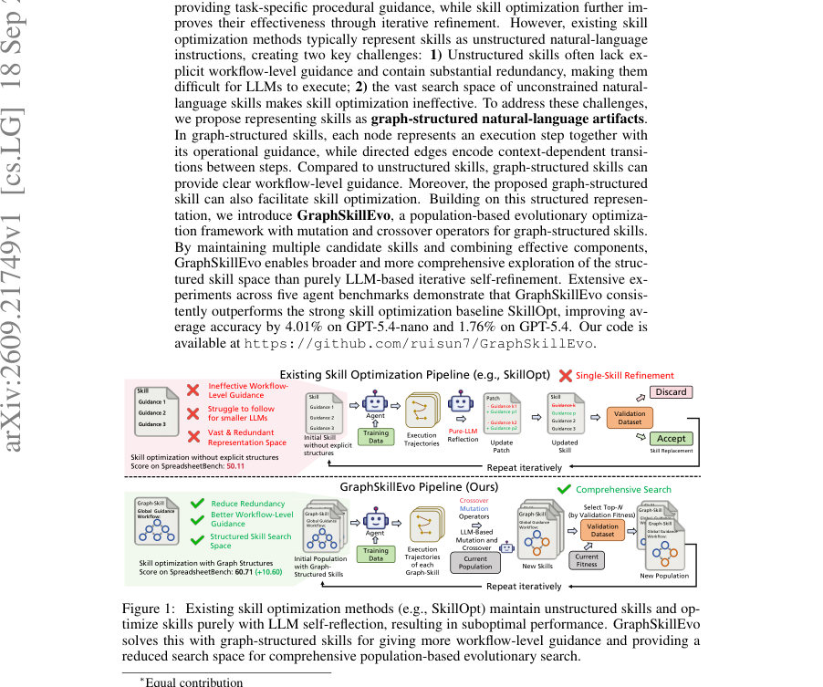
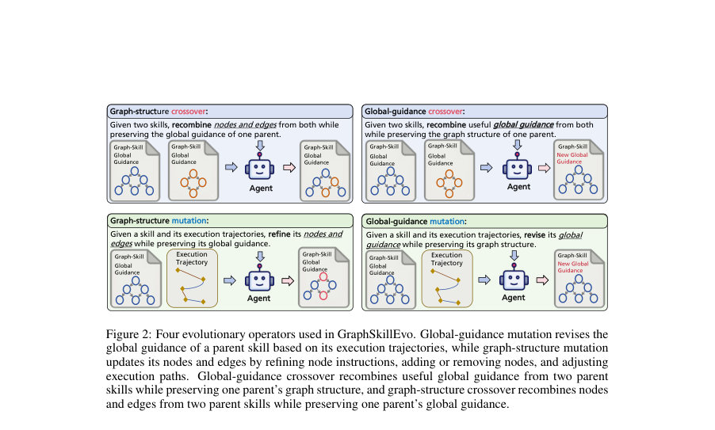
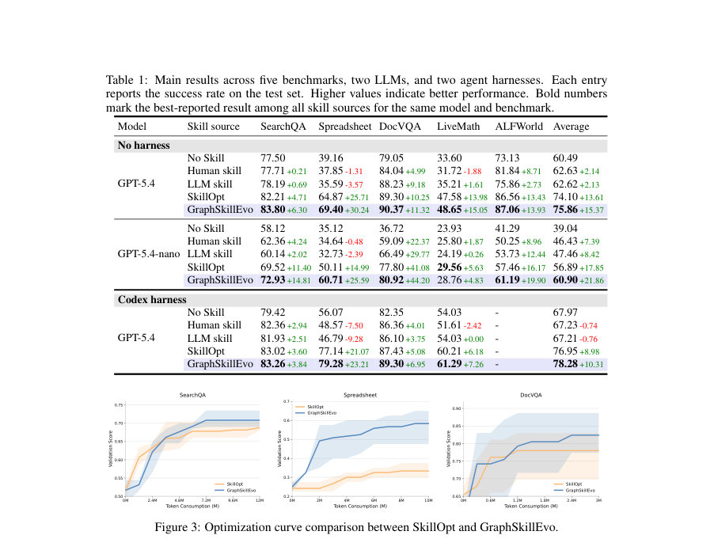

# GraphSkillEvo: Evolutionary Optimization of Graph-Structured Agent Skills

- **게시일:** 2026-09-21
- **arXiv:** [2609.21749v1](http://arxiv.org/abs/2609.21749v1) · [PDF](https://arxiv.org/pdf/2609.21749v1)
- **저자:** Rui Sun, Zhi Zheng, Zhenkun Wang, Zhichao Lu
- **분야:** cs.LG
- **선정 점수:** 4.40
- **선정 이유:** 최근성 0.4, 인용 영향 0.0 (인용 0회), 저자 영향 0.0 (최고 h-index 0), AI 주제 적합성 2.9, 개발자 관심 0.5, 학술 신호 0.6, 오픈 웨이트·주요 연구조직 신호 0.0

[← 2026-09-21 목록으로 돌아가기](../daily/2026-09-21.html)

<!-- paper-visuals:start -->
## 주요 Figure

> 원문 PDF에서 실제 Figure 캡션과 그림 영역이 함께 확인된 자료만 자동 추출했다.

*Figure · 원문 PDF 1쪽 · Figure 1: Existing skill optimization methods (e.g., SkillOpt) maintain unstructured skills and op-*

*Figure · 원문 PDF 5쪽 · Figure 2: Four evolutionary operators used in GraphSkillEvo. Global-guidance mutation revises the*

*Figure · 원문 PDF 7쪽 · Figure 3: Optimization curve comparison between SkillOpt and GraphSkillEvo.*

<!-- paper-visuals:end -->

## 한 문장 요약

LLM 에이전트용 절차적 지침을 그래프 구조로 표현하고, 그래프-구조화된 스킬에 대해 구조 인식 변이·교차 연산자를 사용하는 개체군 기반 진화 최적화(GraphSkillEvo)를 제안하여 기존의 비구조적 스킬 최적화(SkillOpt 등)보다 더 높은 성능과 적은 토큰 소비를 달성한다.

## 해결하려는 문제

기존 스킬 최적화는 스킬을 비구조적 자연어 지침으로 다루어 1) 워크플로우 수준의 명시적 안내가 부족하여 특히 능력이 낮은 모델에서 실행이 어렵고(지침이 길고 관련성 판단이 어려움), 2) 비구조적 표현이 중복과 거대한 표현 공간을 만들어 최적화 탐색이 비효율적이라는 두 가지 문제를 갖는다.

## 핵심 기여

- 스킬을 각 노드가 실행 단계와 운영 지침을 담고 방향성 엣지로 단계 전이를 표현하는 그래프-구조화된 자연어 아티팩트로 공식화하여 워크플로우 수준 안내를 명시화하고 중복을 줄임.
- 그래프 구조를 탐색 공간으로 삼아 구조 인식 변이(mutation)와 교차(crossover) 연산자를 갖는 개체군 기반 진화 계산 프레임워크 GraphSkillEvo를 제안함.
- 구조 인식 변이(글로벌-가이드/그래프 구조 변이)와 교차(글로벌-가이드/그래프 구조 교차)를 설계하여 실행 궤적의 실패 사례를 이용한 국소 수정과 후보 간 효과적 구성 요소 결합을 가능하게 함.
- 다섯 개의 에이전트 벤치마크( SearchQA, SpreadsheetBench, DocVQA, LiveMathematicianBench, ALFWorld )와 두 LLM(GPT-5.4, GPT-5.4-nano), 두 실행 설정(무허니스/ Codex harness)에서 SkillOpt 대비 평균 성능 향상과 토큰 소비 절감을 실험적으로 보임.
- 사전 및 부록(Appendix)에 연산자·초기화 프롬프트와 최적화된 스킬 예시 및 그래프 유효성 검사 절차를 공개하고 코드 저장소를 제시함 (https://github.com/ruisun7/GraphSkillEvo).

## 접근 방법

* (표현) 스킬 s = ⟨h_s, g_s⟩로 정의하며 h_s는 전역 가이드(공통 원칙·출력 포맷 등), g_s = (V_s, E_s)는 재사용 가능한 노드 집합(V_s, 각 노드가 실행 단계와 지침 포함)과 엣지 집합(E_s, 작업별 적용 조건과 순서로 정의된 여러 워크플로우로 표현)으로 구성된다.
* 각 워크플로우는 적용 조건 c_m과 순서화된 노드 경로 p_m으로 기술된다.(알고리즘) GraphSkillEvo는 개체군 기반 진화를 수행한다.
* 초기화: 인구 P(1) 크기 N(논문 실험에서 N=4)로 초기 스킬(주어진 스킬 + LLM으로 생성된 다양한 그래프 스킬)들을 생성하고 검증 데이터 D_val로 초기 적합도 계산.
* 각 세대 t에 대해: 1) 훈련 데이터에서 배치 B(t) (논문에서 B=15)를 샘플하여 각 스킬을 실행하고 실행 궤적 τ_x,s를 수집, 실패 궤적 최대 K(논문에서 K=5)를 반영 정보로 보관.
* 2) 연산자 선택(4개 연산자를 라운드로빈): 글로벌 가이드 변이, 그래프 구조 변이(노드 지침 수정·노드 추가/삭제·워크플로우 조정), 글로벌 가이드 교차(두 부모의 전역 가이드 재조합), 그래프 구조 교차(두 부모의 노드·워크플로우 재조합).
* 변이는 해당 부모의 실패 궤적을 참조하여 LLM(A_gen)을 호출해 새 스킬 생성; 교차는 부모 스킬들만 참조.
* 생성된 새 스킬은 그래프 유효성 검사기(노드 참조 일관성 등)를 통과해야 함.
* 3) 생성된 N개 자식들을 전체 D_val에서 평가하고 현재 인구와 합쳐 상위 N개를 선택하여 다음 세대로 이행.
* 총 세대 수 T(논문 실험에서 T=5) 반복 후 최종 인구에서 최고 적합도를 가진 스킬 반환.
* 연산자 프롬프트와 초기화·유효성 검사·검증 절차는 본문 및 부록에 구체화되어 있음.

## 주요 결과

- 벤치마크: SearchQA, SpreadsheetBench, DocVQA, LiveMathematicianBench, ALFWorld. LLM: GPT-5.4 및 GPT-5.4-nano. 하니스: 무하니스 및 Codex harness 실험 포함.
- 주요 비교 대상: No skill, Human skill, LLM one-shot skill, SkillOpt(기존 최적화 방법). 모든 실험은 동일 LLM로 실행·최적화하며 결과는 세 번 반복 평균(본문) 또는 추가 유의성 검정 시 5회 반복(부록)으로 보고됨.
- 정량 성능 요약(본문 표 기반): GraphSkillEvo는 14개 모델–하니스–벤치마크 설정 중 13개에서 최고 결과를 기록. 평균 개선치(대상: SkillOpt): GPT-5.4 무하니스에서 평균 +1.76% (논문 본문 진술), GPT-5.4-nano 무하니스에서 평균 +4.01%. 예: SpreadsheetBench에서 GPT-5.4 무하니스 기준 SkillOpt=64.87 → GraphSkillEvo=69.40(+4.53 절대). GPT-5.4-nano 무하니스의 SpreadsheetBench: SkillOpt=50.11 → GraphSkillEvo=60.71(+10.60 절대). (자세한 표는 본문 Table 1).
- 토큰 소비(표 2): 총 토큰 소비는 GPT-5.4 기준 SkillOpt=81.08M vs GraphSkillEvo=61.94M(약 1.31배 차이), GPT-5.4-nano 기준 SkillOpt=103.54M vs GraphSkillEvo=75.94M(약 1.36배 차이).
- 그래프 구조 효과(표 3): Graph-structured vs Unstructured counterpart(전역 가이드·노드 지침은 같고 워크플로우 조직만 제거): GPT-5.4-nano 최적화된 스킬로 실행 시 평균 성능 감소(예: SearchQA -4.52pp, Spreadsheet -2.50pp, DocVQA -4.19pp 등), 즉 명시적 워크플로우가 실행 성능 향상에 기여함을 보임.(Table 3)

## 한계

- 저자 언급: 향후 과제로 파라메트릭(모델 파라미터) 최적화와의 결합, 더 풍부한 그래프 합성 메커니즘 확장, 도메인 간 그래프-스킬 병합 방법 개발을 제시함(결론 부).
- 본문에서 확인되는 한계(분리 기술):
- - 실험 자원·설정 제약: 제안 방법은 논문에서 N=4(인구), T=5(세대), 각 세대 B=15 샘플 등 비교적 작은 진화 예산으로 평가되었으나 더 큰 인구·세대에서의 확장성·수렴 거동은 본문에서 실험적으로 광범위히 검증되지 않음.
- - LLM·환경 범위: 실험은 GPT-5.4 계열(정확히 GPT-5.4 및 GPT-5.4-nano) 두 모델과 Codex 하니스/무하니스 두 실행 환경에 한정되어 있어 다른 모델군·하니스에서의 일반화는 추가 검증이 필요함(본문은 두 모델 간 전이 실험을 일부 보고함).  (이 항목들은 논문 본문의 설정과 결과 표로부터 합리적으로 확인되는 제약임).

## 개발자 관점

- 재현성: 초기화·연산자 프롬프트와 예시 스킬, 그래프 유효성 검사기 로직이 부록(E)와 알고리즘(섹션 B.4)에 상세히 제공되어 있어 코드 저장소와 함께 재현 가능성이 높음. 프롬프트 기반 연산자(4종)를 라운드로빈으로 선택하는 점과 실패 궤적 K개(논문 예: K=5)를 반영정보로 사용하는 방식은 구현 핵심임.
- 구현 팁: 그래프-스킬은 세 섹션(## Global Guidance, ## Node Lists, ## Task Graphs)로 엄격히 유지해야 하며, 자동화 파이프라인에 그래프 유효성 검사기(노드 참조 일관성, 모든 노드가 적어도 하나의 워크플로우에 사용되는지 등)를 넣어 잘못된 생성 결과를 걸러야 한다(본문 B.3, Algorithm 1).
- 연산 비용·토큰 비용: GraphSkillEvo는 동일 성능 대비 SkillOpt보다 최종 토큰 소비가 적었으므로(논문 Table 2), 비용 민감한 환경에서는 개체군·그래프 편집 기반 전략이 토큰 효율적일 수 있음. 단 실험은 특정 최적화 예산(N, T, B)에 대한 값이므로 다른 예산에서의 비용-효율성은 재실험 필요.
- 운영·배포: 그래프-구조 스킬은 노드 재사용성과 워크플로우 명시성 때문에 모델 교체 시(예: 작은→큰 LLM) 스킬 전이성이 높음(본문 Table 5에서 GPT-5.4-nano로 최적화한 스킬을 GPT-5.4에 적용해 성능 향상 관찰). 따라서 스킬 저장·버전관리 시 그래프 구조를 유지하면 교체·전이 운영에 유리함.
- 안전성·검증: 스킬 수정은 LLM으로 자동 생성되므로 악의적·불안정한 지침 삽입을 방지하기 위해 검증 파이프라인(유효성 검사, 자동 테스트셋 평가, 인간 검토)을 권장. 특히 그래프 구조 변화(노드 추가/삭제)는 워크플로우 일관성을 해칠 수 있으므로 자동 일관성 검사 외에 샘플 기반 행동 검증이 필요함.

**근거 범위:** 이 분석은 제공된 논문 PDF 본문(및 부록 내용 포함)을 근거로 작성되었음. 본문 표(예: Table 1–5), 알고리즘 의사코드(Algorithm 1), 연산자 프롬프트(부록 E)와 실험 설정(섹션 4, B.2)을 그대로 인용하여 수치·설정 정보를 보고함. 코드·세부 구현(예: 실제 프롬프트의 API 호출 파라미터, 하이퍼파라미터 튜닝의 추가 세부)은 공개 저장소에서 확인해야 하며, 본문에 명시되지 않은 추가 재현 세부사항은 명시적으로 생성하지 않았음을 밝힘.
