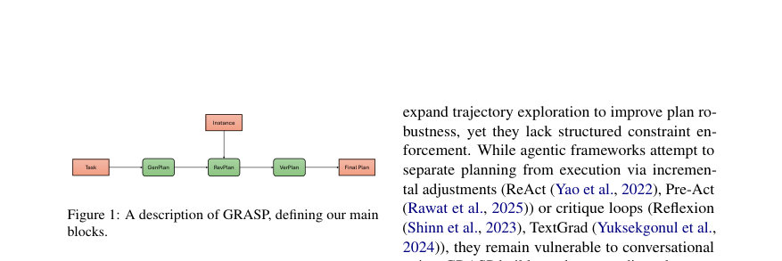
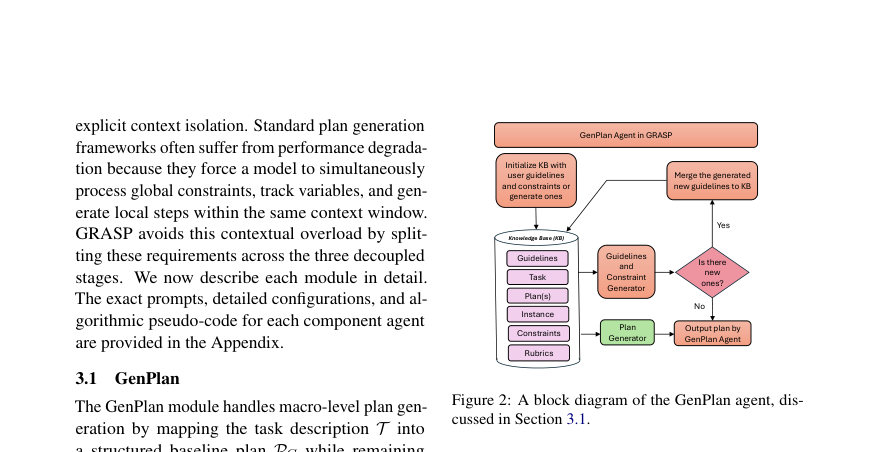
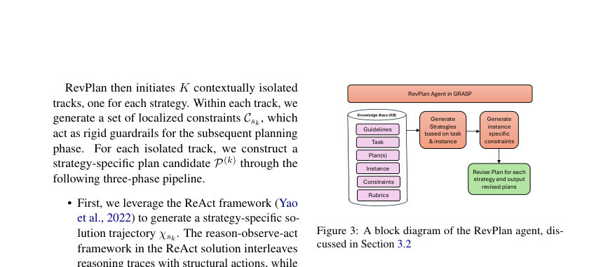

# GRASP: Generating, Revising, and Assessing for Strategic Planning with Agentic AI

- **게시일:** 2026-09-27
- **arXiv:** [2609.30147v1](http://arxiv.org/abs/2609.30147v1) · [PDF](https://arxiv.org/pdf/2609.30147v1)
- **저자:** Arunabh Srivastava, Mohammad A., Khojastepour, Srimat Chakradhar, Sennur Ulukus
- **분야:** cs.AI, cs.CL, cs.LG, cs.MA
- **선정 점수:** 5.68
- **선정 이유:** 최근성 0.5, 인용 영향 0.0 (인용 0회), 저자 영향 2.0 (최고 h-index 63), AI 주제 적합성 2.9, 개발자 관심 0.0, 학술 신호 0.3, 오픈 웨이트·주요 연구조직 신호 0.0

[← 2026-09-27 목록으로 돌아가기](../daily/2026-09-27.html)

<!-- paper-visuals:start -->
## 주요 Figure

> 원문 PDF에서 실제 Figure 캡션과 그림 영역이 함께 확인된 자료만 자동 추출했다.

*Figure · 원문 PDF 2쪽 · Figure 1: A description of GRASP, defining our main*

*Figure · 원문 PDF 3쪽 · Figure 2: A block diagram of the GenPlan agent, dis-*

*Figure · 원문 PDF 5쪽 · Figure 3: A block diagram of the RevPlan agent, dis-*

<!-- paper-visuals:end -->

## 한 문장 요약

복잡한 자연어 계획 생성에서 문맥 오염과 누적 오류를 줄이기 위해 전역 제약/가이드라인 수립(GenPlan), 문맥 격리된 복수 전략 탐색(RevPlan), 독립적 검증(VerPlan)을 순차적으로 적용하는 다단계 계획 프레임워크 GRASP를 제안하고 실험으로 유효성을 입증한다.

## 해결하려는 문제

기존 단일 트랙 LLM 계획자는 장기·다단계 자연어 지시가 늘어날수록 문맥 오염과 주의력 소진(attention fatigue)으로 인해 환각(hallucination) 및 실행 실패가 급증한다. 본문에서는 'Curse of Instructions'로 명명된 이런 성능 붕괴를 해결하여, 복잡한 작업에 대해 실행 가능한 고품질 자연어 계획을 자동으로 생성·수정·검증하는 방법을 제시하는 것이 연구 질문이다.

## 핵심 기여

- 전역 매크로 규제와 엄격한 문맥 격리를 통해 누적 오류 피드백 루프를 차단하는 다단계 자율 계획 프레임워크 GRASP(GenPlan, RevPlan, VerPlan)를 제안함.
- GenPlan·RevPlan·VerPlan 모듈의 상호의존성을 체계적 절제(ablation)로 분석해, 전역 제약점(GenPlan) 없이 국지적 탐색(RevPlan)이 어떻게 비제어적 환각으로 붕괴되는지 규명함.
- 실험적으로 여러 벤치마크( Natural Plan Calendar Scheduling, ZebraLogic, SciBench Math, GPQA )에서 GRASP가 기존 단일샷/탐색 기반 플래너 및 PlanGEN/ToT/BoN 등 범용 기법을 능가함을 보이고, 특히 멀티태스크(인터리브된 듀얼/트리플 작업) 확장 시 표준 플래너의 성능 붕괴를 완화함.

## 접근 방법

* GRASP는 세 개의 문맥격리 모듈로 구성된다.
* (1) GenPlan: 입력된 과업 기술 T에서 하드 제약(C)과 소프트 가이드라인(G)을 지식베이스(KB)에 축적하고 Constraint Agent(CA), Guidelines Agent(GA), Plan Generation Agent(PGA)의 반복적 상호작용으로 전역 기준선 계획 PG를 생성·수렴시킨다.
* KB는 튜플 ⟨T, C_t, G_t, P_t⟩로 관리하고, GA/CA는 새로운 가이드라인·제약을 추출·병합한다.
* (2) RevPlan: 특정 인스턴스 I에 대해 GenPlan의 PG를 바탕으로 K개의 서로 격리된 전략 트랙 S={s1..sK}을 유도한다(논문에서 보통 2≤K≤4, 최적은 문제별).
* 각 트랙에서 전략별 국지 제약 C_sk를 만들고 ReAct 기반 사고·행동 궤적 χ_sk를 생성한 뒤 ExtractPlan으로 실행 가능한 단계만 뽑아 P_k_specific을 얻고 MergePlans(P_k_specific, PG)로 구조적 청사진을 보존하며 후보 계획 P(k)를 만든다.
* (3) VerPlan: 각 후보 계획을 격리된 문맥에서 LLM 기반 평가자(스코어 1–100)로 평가하여 Ψ(k)=Score(P(k)\|T,I,C,C_sk,Rubrics)를 계산하고 최고 점수 P*를 선택한다.
* 생성·개정·검증 과정의 프롬프트, 알고리즘 의사코드와 예시는 부록에 수록되어 있으며, 생성된 계획의 실행은 RunAgent(논문에 명시된 설정: GPT-4o/GPT-4.1-mini 등)를 사용해 자동화 실행한다.
* 실험은 온도 0으로 결정론적 실행을 수행했다.

## 주요 결과

- Natural Plan Calendar Scheduling: GPT-4o 플래너 대비 GRASP(GPT-4o) EM 정확도 63 → 75.4 (절대 +12.4%p). GPT-4o-mini 플래너 대비 GRASP(GPT-4o-mini) 54.3 → 74.3 (+20.0%p). (표1)
- ZebraLogic: GPT-4o 플래너 30.6 → GRASP(GPT-4o) 61.4, 즉 +30.8%p 개선을 보고함 (표2).
- SciBench Math(세부 항목): GRASP(GPT-4o) 가 Stat/Calc/Diff 각각 80.56/78.05/62 (표3에 따른 표기)로 GPT-4o 플래너보다 전반적으로 우수하거나 동등한 성능을 보였음. 일부 subset에서는 PlanGEN 계열과 유사한 성능을 보임.
- GPQA: GRASP은 통계적 우위를 보이지 않음(표4; GRASP(GPT-4o,2 strat.) 47.54, GPT-4o baseline 47.99 등).
- 대안 기법과 비교(표5): GRASP는 Natural Plan, SciBench Stat, ZebraLogic에서 제시된 PlanGEN·BoN·ToT 변형들을 능가했으나 SciBench Calc/Diff에서는 PlanGEN 변종과 동등한 결과를 보임(논문 표5).(표5 수치들을 본문 참조).  

멀티태스크(인터리브) 내성(표7): 단일 작업에서는 여러 플래너가 유사했으나 듀얼/트리플 작업으로 확장 시 표준 플래너들이 성능 붕괴를 보인 반면 GRASP(GPT-4o)는 듀얼 45.7%, 트리플 46.6%로 유지되었고, GRASP(GPT-4o-mini)는 듀얼 41.2%로 GPT-4o-mini 직접 플래너 대비 절대 +16.7%p 개선을 보였음. 또한 GPT-5-mini(직접 플래너)는 듀얼 26.7%로 GRASP에 비해 낮았고, GRASP(GPT-4o-mini)은 GPT-5-mini 대비 절대 +14.5%p 우위를 보고함(표7).  

아블레이션(표8): GenPlan Only 40.8%, RevPlan Only 10.9%, VerPlan Only 30.7%, RevPlan+VerPlan 12.5%, GenPlan+RevPlan 42.5%, 전체 GRASP 45.7%로 나타나 GenPlan(전역 규제)의 존재가 국지적 전략 탐색의 성공에 필수적임을 실험적으로 확인함.  

토큰·비용(표6, 표9): Natural Plan에서 GRASP(GPT-4o,3 strat.)는 토큰 사용량과 비용이 크게 증가(정규화 비용 NC ≈16.5)했지만 GRASP(GPT-4o-mini,3 strat.)는 NC≈1.16로 상대적으로 비용 효율적이었음. 논문은 단일 실행(대부분 1회)으로 실험을 수행했다(부록 D).

## 한계

- 저자 언급: 대기시간(레이다시) — 다단계 생성·복수 전략 탐색·검증으로 단일 패스보다 런타임 지연이 크며 실시간 상호작용이 요구되는 응용에는 부적합할 수 있음.
- 저자 언급: 모델 수준의 추론 능력 개선 불가 — GRASP는 추론 능력을 근본적으로 향상시키는 학습·모델 수정 방법이 아니라 추론 시점(inference-time)에서의 계획 규제 역할을 하므로 기저 LLM이 도메인 지식이나 기본 논리능력이 부족하면 한계를 극복할 수 없음(본문에서 GPQA·SciBench Calc/Diff 결과로 지적).
- 저자 언급: 작업별 전략 수(K)는 하이퍼파라미터이며 도메인별 튜닝이 필요함(예: Calendar Scheduling에서 K=3이 최적), 자동 조절 기능 없음.
- 저자 언급: 윤리·보안·개인정보 위험 — 향상된 계획 신뢰성은 악의적 용도로 전용될 수 있고, 모델 바이어스나 민감 데이터 누수 위험을 내재함; 다중 에이전트 파이프라인에서 컨텍스트 유출 위험 존재함(본문 'Ethical Considerations').  

본문 관찰: 비용·토큰·자원 — GRASP(GPT-4o,여러 전략)는 토큰·비용 증가가 매우 크며(표6 NC 최대 21.2), 실전 배포시 비용-성능 절충이 필요함.  

본문 관찰: 소형 모델의 용량 경계 — GPT-4o-mini 구성은 듀얼 작업에서는 견고했으나 트리플 작업에서 급락해(41.2% → 28.1%) 하드웨어·파라미터 제약에 민감함.  

본문 관찰: 실험 반복성 제약 — 대부분 실험이 단일 런(1회)으로 수행되어 일부 비교의 통계적 유의성이 제한적임(부록 D, E에 기술).

## 개발자 관점

- 아키텍처 구현: 계획 파이프라인을 GenPlan(전역 KB·제약/가이드라인 생성), RevPlan(격리된 다중 전략 트랙, ReAct 기반 궤적 → ExtractPlan → MergePlans), VerPlan(격리된 LLM 스코어러)로 분리하면 문맥 오염을 줄이고 모듈별 역할을 명확히 할 수 있음. 부록에 프롬프트와 의사코드가 포함되어 있어 재현 시 참고 가능함.
- GenPlan의 제약·가이드라인 자동 생성은 RevPlan의 국지적 탐색을 제약하여 'garbage-in, garbage-out' 문제를 방지한다. ablation에서 GenPlan이 빠지면 RevPlan 단독은 성능이 극단적으로 낮아짐(10.9%). 따라서 전역 제약 추출·병합 절차는 필수로 설계할 것.
- 전력·비용 예산: GPT-4o 기반 GRASP는 토큰·비용이 크게 증가(정규화 비용 NC 최대 수십배)하므로, 비용 제약이 있는 배포에서는 소형 모델(GPT-4o-mini) + 전략 수 제한(K=2~3) 또는 빈도 기반 조기 종료(early-exit) 설계를 고려하라.
- 전달·실행 파이프라인: 계획의 기계적 실행에는 RunAgent와 같은 별도 실행 레이어가 필요하며, 논문은 실행에 대해 RunAgent(GPT-4o/GPT-4.1-mini)를 사용했음을 명시한다. 실행 단계에서의 오류 보정은 최소화해 계획 품질을 직접 평가하도록 구성해야 한다(본문 실험 설정).
- 검증·평가: VerPlan은 후보를 독립적으로 점수화해 편향을 줄이나, 후보 품질이 낮으면 필터만으로는 효과를 못 낸다. 따라서 후보 생성(RevPlan)과 전역 규제(GenPlan)를 함께 튜닝해야 함. 평가 파이프라인에서는 논문처럼 외부 고성능 판정자(GPT-5)를 사용해 결과를 자동화할 수 있으나 평가자 의존성을 고려해 휴먼 샘플링 검증이 필요함(논문: 50개 샘플 수동검증 일치 보고).  

재현성 주의: 논문은 대부분 실험을 1회만 수행했으므로 결과 재현을 위해 반복 실험과 랜덤 시드·온도 관리(논문은 온도=0) 및 프롬프트·하이퍼파라미터(전략 수 K 등)를 명시적으로 고정할 것. 또한 프롬프트·토큰 가격 표와 모델 버전 정보(부록 D,E,F)가 제공되어 있어 비용 추정에 활용 가능하다.

**근거 범위:** 본 분석은 제공된 논문 PDF 본문(본문 및 부록 포함)의 텍스트에 근거함. 모든 정량적 수치(정확도, 토큰/비용 지표, ablation 값 등)는 논문 표와 본문에서 직접 인용함. 구현 세부사항(코드·리포지토리)은 PDF에 완전한 코드가 포함되어 있지 않아 본문 설명과 부록의 프롬프트·의사코드를 근거로 정리했으며, 일부 결과는 논문이 단일 런(대부분 1회)으로 보고했기 때문에 통계적 일반화에는 제한이 있을 수 있음.
