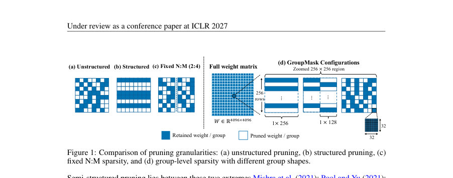
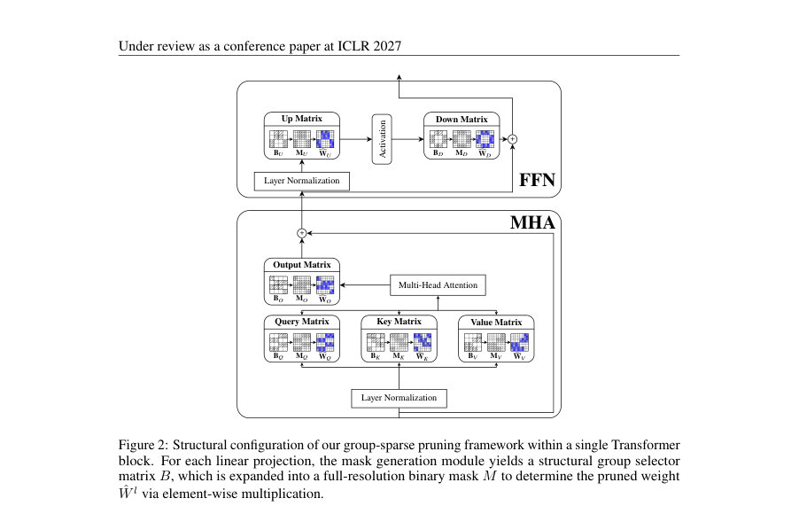
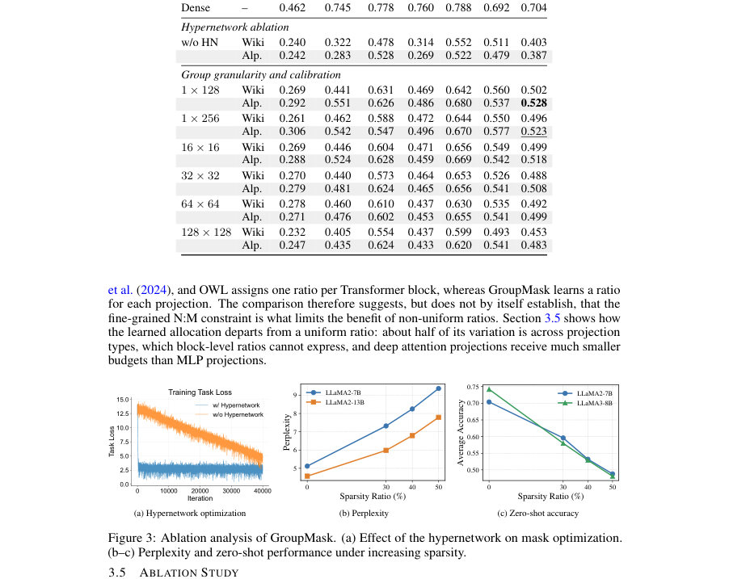

# GroupMask: Layer-Adaptive Group-wise Sparsity for Semi-Structured LLM Pruning

- **게시일:** 2026-09-29
- **arXiv:** [2609.33977v1](http://arxiv.org/abs/2609.33977v1) · [PDF](https://arxiv.org/pdf/2609.33977v1)
- **저자:** Zhengao Li, Shuoqiu Li, Xiaofang Zhang, Yukai Jin, Gokcen Kestor, Yanfu Zhang, Yiming Zeng, Bin Ren, Chuxu Zhang, Shangqian Gao
- **분야:** cs.LG, cs.AI
- **선정 점수:** 6.16
- **선정 이유:** 최근성 0.8, 인용 영향 0.0 (인용 0회), 저자 영향 0.0 (최고 h-index 0), AI 주제 적합성 2.3, 개발자 관심 0.2, 학술 신호 0.3, 오픈 웨이트·주요 연구조직 신호 2.5

[← 2026-09-29 목록으로 돌아가기](../daily/2026-09-29.html)

<!-- paper-visuals:start -->
## 주요 Figure

> 원문 PDF에서 실제 Figure 캡션과 그림 영역이 함께 확인된 자료만 자동 추출했다.

*Figure · 원문 PDF 2쪽 · Figure 1: Comparison of pruning granularities: (a) unstructured pruning, (b) structured pruning, (c)*

*Figure · 원문 PDF 4쪽 · Figure 2: Structural configuration of our group-sparse pruning framework within a single Transformer*

*Figure · 원문 PDF 7쪽 · Figure 3: Ablation analysis of GroupMask. (a) Effect of the hypernetwork on mask optimization.*

<!-- paper-visuals:end -->

## 한 문장 요약

GroupMask는 행렬을 규칙적인 그룹으로 분할한 'group-level' 반구조적 희소 패턴을 도입하고, 경량 하이퍼네트워크로 모든 층의 그룹 선택자를 공동 생성해 Gumbel-Sigmoid + STE와 전이(teacher)→자기-증류(student) 학습, 로그-비율 정규화를 통해 사전학습 가중치를 고정한 채 LLM의 레이어별 가변 희소율을 학습하는 방법이다.

## 해결하려는 문제

기존의 반구조적(pruning) 방법은 주로 N:M 패턴을 사용해 각 블록 내 로컬 희소 비율을 모든 층에서 동일하게 고정한다. 반면 비구조화(unstructured) 절삭에서는 층별 비균일 희소 배분이 성능 향상에 기여하는 것으로 보고되었지만, N:M 패턴 하에서는 비균일 배분의 이점이 감소한다고 보고되어 왔다. 본 논문은 이 관찰이 '레이어 적응형 배분 자체의 한계' 때문인지 아니면 'N:M의 세밀한 로컬 제약' 때문인지를 규칙적이지만 로컬 비율을 고정하지 않는 group-level 희소성 패턴을 통해 규명하려고 한다.

## 핵심 기여

- 레이어 적응형 할당을 N:M 외의 반구조적 패턴(그룹 수준)으로 확장하여, 고정 로컬 비율 제약이 제거되면 레이어 적응형 할당이 실질적 이득을 준다는 점을 실험적으로 보였다.
- GroupMask: 모든 대상 선형층의 그룹 선택자(selector)를 하나의 경량 하이퍼네트워크(양방향 GRU + 층별 헤드)로 생성하고 Gumbel-Sigmoid 이완과 straight-through estimator를 적용해 이진 마스크를 학습하는 프레임워크를 제안했다.
- 전역 sparsity 예산을 로그-비율 정규화(Lreg = λ |log(s/st)|)로 강제하고, 사전학습된 밀집 모델을 교사(teacher)로 사용한 자기-증류(self-distillation) 손실로 마스크를 학습하며, 원본 가중치는 고정하여 후처리 파인튜닝 없이 희소 서브네트워크를 얻는 실용적 파이프라인을 제시했다.
- 다양한 LLaMA·Qwen 모델(7B–14B)과 그룹 크기, 보정(calibration) 데이터(WikiText-2, Alpaca)에 걸친 실험으로 GroupMask의 언어모델링(perplexity)과 제로샷 성능 우수성을 보였다.
- 학습된 마스크 분석을 통해 attention과 MLP 투영 간 보존율 차이, 깊이별(특히 심층) Q/K의 강한 절삭 등 구조적 규칙성을 관찰하고, GPU용 그룹-스팸(SpMM) 예비 커널 성능(특정 설정에서 50% 희소성에 1.09×, 90%에 1.88×)을 보고했다.

## 접근 방법

* 대상은 트랜스포머의 각 선형층 W^l ∈ R^{d_out×d_in}이고, 이를 gl_out × gl_in 크기의 비중첩 그룹으로 분할해 각 그룹을 통째로 보존(1)하거나 제거(0)하는 그룹 선택자 B^l ∈ {0,1}^{G_out×G_in}을 도입한다.
* 하이퍼네트워크 h_θ는 층별 고정 랜덤 입력 시퀀스 z를 양방향 GRU로 처리하고 층별 출력 헤드에서 그 층의 모든 그룹에 대한 로짓을 출력한다.
* 출력을 Gumbel-Sigmoid 이완으로 샘플링하고 forward는 이진화된 selector(B)로, backward는 연속 이완값으로 그래디언트를 흐르게 하는 STE를 사용해 θ를 최적화한다.
* 전역 목표 희소도 s_t은 로그-비율 정규화 L_reg = λ \|log(s/s_t)\|로 제약하며, 학습 신호는 교사-학생 자기-증류로 제공한다: 교사는 밀집 모델(모든 selector=1), 학생은 현재 생성된 마스크를 적용한 희소 모델이며 교사 분포와 학생 분포의 크로스엔트로피 L_KD를 최소화한다.
* 전체 손실은 L_total = L_KD + L_reg이다.
* 사전학습 가중치는 고정되어 있고, 학습 중 업데이트되는 파라미터는 오직 하이퍼네트워크 θ뿐이다.
* 평가 시에는 Gumbel 잡음을 제거하고 임계값(thresholding)으로 이진 마스크를 얻어 가중치에 적용한다.

## 주요 결과

- 설정: 기본은 그룹 1×256, 전체 희소도 50%, 캘리브레이션 데이터는 WikiText-2 또는 Alpaca, 학습 스케줄 40k 스텝, 학습 하드웨어 1×NVIDIA DGX B200, LLaMA-2-7B에서 학습 시간 약 3.7 GPU-시간(논문 부록의 하이퍼파라미터 표 참고).
- LLaMA-2-7B(50% 희소, 1×256, WikiText-2): GroupMask 적응형 배분 퍼플렉시티 8.30, 동일 그룹/희소에서 균일(Uniform) 배분 퍼플렉시티 10.02 → 퍼플렉시티가 10.02 → 8.30으로 개선됨(절대/상대 감소 수치 표기됨).
- 같은 비교에서 제로샷 평균 정확도(6개 벤치 평균): 균일 할당 0.455 → GroupMask 적응형 0.496 (WikiText-2 캘리브레이션), Alpaca 캘리브레이션 시 평균 0.523로 더 향상(표 2).
- 밀집 모델 대비 주요 베이스라인들과의 비교(LLaMA-2-7B, WikiText-2, 50%): GroupMask(1×256) 퍼플렉시티 8.30, DISP-LLM(structured) 9.84, SparseGPT(2:4) 10.17, Wanda(2:4) 11.02 등으로 보고되어 GroupMask가 비교 대상 중 최저 퍼플렉시티를 달성함(표 1).
- 다중 모델 제로샷(Alpaca 보정, 50%): LLaMA-2-7B avg 0.523, LLaMA-2-13B avg 0.577, LLaMA-3-8B avg 0.517, Qwen3-8B avg 0.555, Qwen3-14B avg 0.589 — 논문은 이 값들이 비교군 중 최고 평균을 기록한다고 보고함(표 2). 종종 WikiText보정보다 Alpaca 보정이 높은 downstream 성능을 보였다(여러 표와 절에서 일관).  
    
    

## 한계

- [저자] 비교의 간접성: N:M과의 비교가 간접적이며, 기존 N:M 관련 비균일 비율은 블록 수준(Transformer block) 또는 휴리스틱에 기반해 할당된 반면 본 연구의 비율은 투영(projection) 단위로 학습되므로 두 요인의 분리가 완전하지 않음.
- [저자] 평가 범위 한계: 적응형 대 균일 비교는 주로 LLaMA-2-7B에서 수행되었으며, 모든 비교가 모든 모델에 대해 반복적으로 검증된 것은 아님.
- [저자] 하드웨어/속도 한계: 그룹 수준 희소성은 네이티브 하드웨어 지원이 없고, 제시된 GPU 그룹-스파스 SpMM 커널은 예비 수준이며 엔드투엔드 가속과 시스템-커널 공동 설계는 후속 연구를 필요로 함.
- [저자] 실험 범위: 실험은 최대 50% 희소도 및 최대 14B 모델까지 다루며, 더 높은 희소도나 더 큰 모델에 대한 일반화는 검증되지 않음 (논문 결론의 언급).

## 개발자 관점

- 재현성: 사전학습 가중치를 고정하고 하이퍼네트워크만 학습하므로 파라미터 업데이트 비용이 낮아 재현·실험 비용이 상대적으로 작다(논문에서는 LLaMA-2-7B 약 3.7 GPU-시간 보고).
- 구현 세부: 하이퍼네트워크는 층 시퀀스 입력(z)에 양방향 GRU를 쓰고 층별 출력 헤드로 Gl_out·Gl_in 로짓을 출력한다. 마스크 이완은 Gumbel-Sigmoid, 그라디언트는 STE로 흐르게 하고 평가 시에는 Gumbel 잡음 제거 후 임계값 이진화한다.
- 운영·배포: group-level 희소성은 네이티브 GPU 가속(예: cuBLAS 대체) 지원이 없으므로 실제 서빙 환경에서 지연/추론 비용 절감은 커널·런타임 수준의 추가 작업이 필요하다. 논문에서 제시한 예비 CUTLASS/CUDA 구현은 특정 행렬 설정에서 50% 희소에 1.09× 속도up(그룹=64), 희소가 높을수록 더 큰 이득(90%에 1.88×)을 보였으나 이는 커널-레벨 측정에 한정된다.
- 설계·튜닝: 그룹 크기와 캘리브레이션 데이터가 성능에 큰 영향을 미친다. 작은 그룹(예: 1×128, 1×256 또는 32×32 등)은 대형 그룹(128×128)에 비해 일반적으로 더 좋은 품질을 보였고, Alpaca 보정은 downstream 제로샷 성능을 일관되게 향상시켰다.
- 운영정책·안전성: 본 방법은 사전학습된 밀집 모델의 예측을 보존하려고 자기-증류를 사용하므로, 교사 모델의 편향·유해출력 특성이 희소 모델에 전이될 수 있다(운영 전 검증 필요). 또한 마스크는 per-projection 수준으로 다르기 때문에 서빙 시 가중치·마스크의 호환성·저장 포맷 관리를 신경써야 한다.

**근거 범위:** 이 분석은 제공된 논문 PDF 본문(본문 및 부록의 텍스트)을 기반으로 작성되었다. 표·숫자(퍼플렉시티, 제로샷 평균 등), 하이퍼파라미터(학습률, 스텝수, 정규화 계수 등), 커널 측정치는 본문과 부록에서 직접 추출한 값이다. 논문에서 간접적으로 비교하거나 저자가 언급한 추정치(예: 다른 논문과의 비교 조건 차이)는 본문 설명을 그대로 반영했으며, 구현·시스템 성능(엔드투엔드 서빙 속도)은 논문이 제시한 예비 커널 수준 측정에 한정되어 있음을 명시한다.
