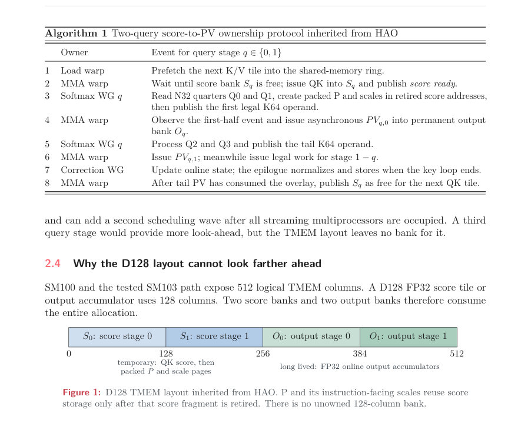
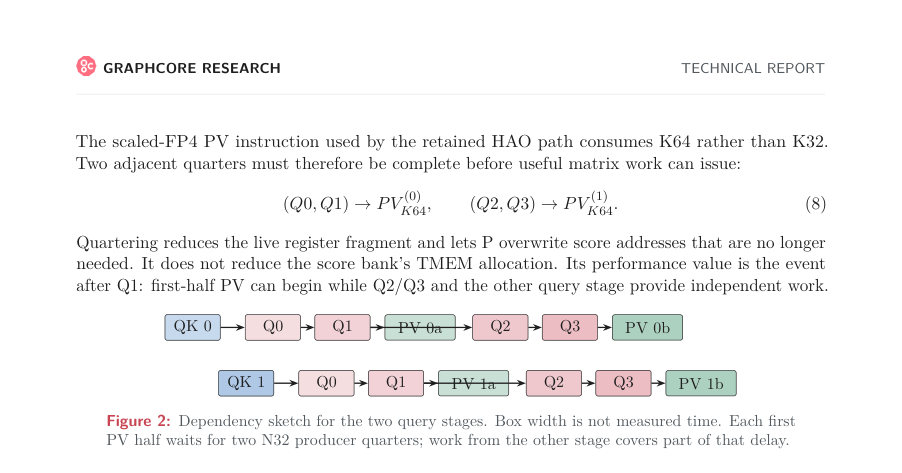
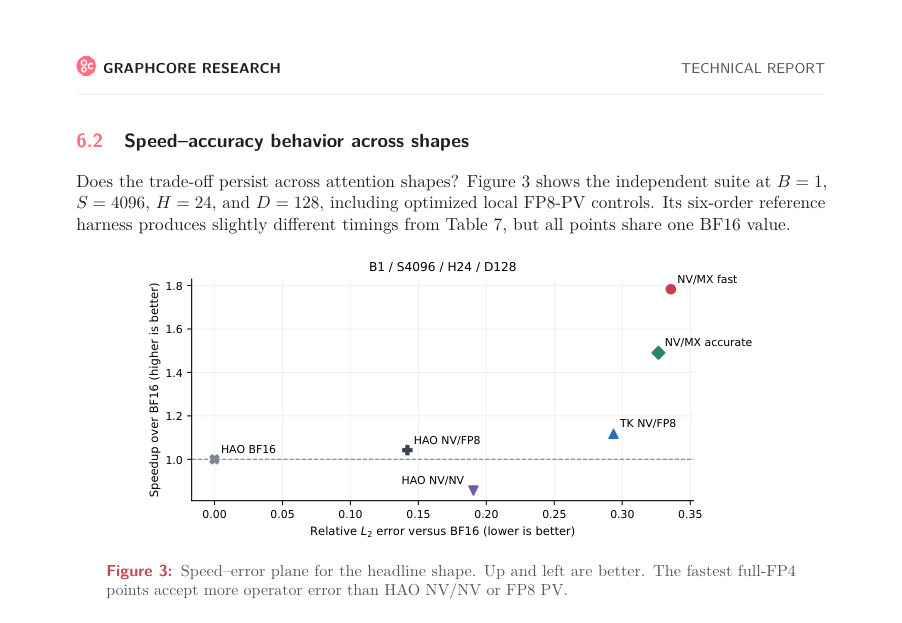

# Hardware-Aware FP4 FlashAttention-4

- **게시일:** 2026-09-06
- **arXiv:** [2609.04105v1](http://arxiv.org/abs/2609.04105v1) · [PDF](https://arxiv.org/pdf/2609.04105v1)
- **저자:** Robert Hu
- **분야:** cs.LG
- **선정 점수:** 4.33
- **선정 이유:** 최근성 0.5, 인용 영향 0.0 (인용 0회), 저자 영향 0.0 (최고 h-index 0), AI 주제 적합성 1.9, 개발자 관심 0.2, 학술 신호 0.3, 오픈 웨이트·주요 연구조직 신호 1.4

[← 2026-09-06 목록으로 돌아가기](../daily/2026-09-06.html)

<!-- paper-visuals:start -->
## 주요 Figure

> 원문 PDF에서 실제 Figure 캡션과 그림 영역이 함께 확인된 자료만 자동 추출했다.

*Figure · 원문 PDF 5쪽 · Figure 1: D128 TMEM layout inherited from HAO. P and its instruction-facing scales reuse score*

*Figure · 원문 PDF 6쪽 · Figure 2: Dependency sketch for the two query stages. Box width is not measured time. Each first*

*Figure · 원문 PDF 15쪽 · Figure 3: Speed–error plane for the headline shape. Up and left are better. The fastest full-FP4*

<!-- paper-visuals:end -->

## 한 문장 요약

NVIDIA Blackwell 환경에서 소프트맥스 경로를 재설계해 점수에서 직접 4비트(MXFP4) 확률 코드를 생성하고, 인과적 역전파에서는 전방에서 만든 양자화 상태를 재사용하여 FP4 기반 주의 연산의 전방 처리량을 크게 높이고(최대 약 2.13×), 인과적 훈련 경로에서는 FP8을 결합해 단일 GPU 업데이트를 소폭 가속(최대 약 1.14×)한 연구.

## 해결하려는 문제

기존 FlashAttention-4(HAO의 구현 포함)는 Blackwell의 FP4 텐서 코어로 행렬곱을 빠르게 수행하더라도 softmax(점수 감소·지수·정규화·블록 스케일링·패킹)와 온칩 종속성(TMEM 소유권 등)이 남아 있어 전체 어텐션 연산의 지연 병목이 해소되지 않는다. 또한 4비트 표현(E2M1)의 범위와 블록 스케일 제약 때문에 확률 P를 전통적 경로로 구성하면 수치적 손실(언더플로우·제로 블록 등)이 크다. 연구 질문은 (1) Q, K, P, V 네 연산자 모두를 FP4로 처리해도 BF16 대비 실제 전방 처리량 이득을 얻을 수 있는지, (2) 인과적 역전파에서 전방의 저정밀 상태를 재사용해 완전한 업데이트를 가속하면서 수치적 안정성을 유지할 수 있는지이다.

## 핵심 기여

- Direct-P: 정규화된 점수(z−m)를 직접 E2M1(FP4_payload) 코드로 매핑하는 기법을 제안해 확률 구성 경로를 단축하고, 같은 반올림된 코드들과 블록 스케일에서 분모를 누적해 표현된 확률로 정규화함으로써 전방 FP4 P/V 경로를 실용화했다.
- 비인과·인과 경로 분리와 설계: 비인과 전방에서는 NVFP4 Q/K와 MXFP4 P/V 조합 및 Direct-P(affine 분류기 또는 선택적 EX2 사용)를 사용해 최대 2.13× BF16 전방 처리량을 달성했고, 인과적 역전파에서는 전방에서 저장한 양자화된 Q/K와 스케일, LSE(normalizer)를 재사용하고 FP8 gradient 오퍼랜드를 도입해 단일-GPU 8B 업데이트를 최대 1.14× 가속했다.
- 하드웨어-인지적(하드웨어-어웨어) 분석: TMEM(텐서 메모리) 소유권이 오버랩의 주된 제약임을 규명하고, P 출판 시점(첫 절반/나머지 절반)과 128컬럼 TMEM 배치(D128)로 인해 스케줄상의 한계가 존재함을 정량적·설계적으로 제시했다.
- 분산 훈련 관찰: 분산 실험에서 MXFP4 P/V를 유지한 모든 테스트 경로가 발산함을 보고하고, 따라서 배포·분산 훈련에서는 FP8 P/V를 선택해야 한다고 결론지었다.

## 접근 방법

* 기본적으로 HAO AI Lab의 두-쿼리(두 쿼리 스테이지) Blackwell 스케줄과 TMEM 소유권·퍼블리시 프로토콜을 유지한다.
* 전방 한도에서는 Q/K을 NVFP4로 미리 양자화하고, Direct-P로 각 N32 블록에 대해 다음을 수행한다: (1) 행 참조 mi로 정규화된 점수 x=(z−mi) log2 e − eB + log2 6를 계산, (2) 빠른 운영점에서는 affine 분류기 bu(x)=max(0,A x + B) (기본 A=1.50,B=1.20 또는 Wan에서 A=1.60,B=0.95)를 이용해 E2M1 코드를 직접 예측하거나 필요 시 부분적으로 하드웨어 EX2 사용, (3) 네이티브로 생성되는 E8M0 블록 암플리튜드 αB를 사용해 MXFP4 블록 스케일을 결정하고 PV가 소비할 코드(qij)와 동일한 코드로 분모 eLiB를 누적해 정규화한다.
* 극단적 로짓(very large logits)이 나오는 레이어만 샘플링 기반 가드를 적용(Algorithm 3)하여 언더플로우·서브노멀 문제를 회피한다.
* 인과적 역전파 경로는 전방에서 저장한 양자화된 Q/K 페이로드, 스케일, LSE(리프팅된 통계)를 그대로 받아 확률을 재구성하고, dP·dV 등 그라디언트 행렬곱을 위해 FP8(E5M2/E4M3 등 형식 구분) 뷰를 퍼블리시하여 역전파를 수행한다.
* 실험은 GB200(및 일부 B300)에서 D128 두-쿼리 토폴로지의 커널 경계(점수 로딩→소프트맥스→P 퍼블리시→PV→에필로그)와 인과적 경계(확률 재구성+그라디언트)를 분리해 시간 및 수치 정확도를 측정했다.

## 주요 결과

- 전방 연산: GB200 D128 그리드(주요 9개 행)에서 Direct-P fast 정책은 BF16(HAO의 CuTe-BF16) 대비 기하평균 2.023×, 최대 2.125×(예: S8192/H64에 근접) 속도향상을 보였고 최고 2998 TFLOP/s(예: S32768/H24에서 4.400448 ms)를 기록했다. 'accurate' 운영점은 기하평균 1.669×, 최대 약 2416 TFLOP/s를 기록했다.
- 정확도·작업 전파: NV/MX fast의 연산자 수준 평균 코사인은 약 0.9438(상대-L2≈0.3366)였고 accurate는 약 0.9517(상대-L2≈0.3272)였다. FP8 PV(HAO NV/FP8)는 더 정확했으며 본 연구의 NV/MX 포인트는 FP8 대비 더 큰 연산자 오차를 수용했다.
- 모델 수준(고정 입력): ViT S4096에서 NV/MX fast는 물리적 어텐션 속도 1.783×를 유지하면서 BF16과 같은 top-1 정확도(88.5%)를 보였고 예측 일치율 95.5%를 기록했다. 여러 ViT/BERT 고정 입력 시험에서 task-level 영향은 제한적이었음(예: ViT S256 등에서 높은 일치율 유지).
- 비디오 확산(Wan) 합성: Wan2.1 1.3B에서 TK NV/MX fast는 전방 시간 0.1653 ms로 CuTe BF16 대비 1.75×, 14B에서는 0.4250 ms로 2.09× 가속을 달성했다. 하지만 다중-스텝(예: 20 steps) 누적에서는 품질 편차(예: 14B 20-step에서 cosine 0.8496 vs HAO NV/NV 0.9036) 증가를 관찰했다.
- 인과적 역전파·업데이트: 인과적 경로에서 전방 양자화 상태를 재사용하고 FP8 그라디언트 오퍼랜드를 도입한 최종 경로는 투입-출력 포함한 단일-GPU 8B 업데이트에서 최대 약 1.14×의 속도 향상을 보고했다(역방향의 격리된 개선/과거 실험에서 D128 역전파 속도 개선 예: 1.206–1.241×).

## 한계

- 저자가 명시한 한계: (1) 'Full-FP4'는 어텐션 내의 Q/K/P/V에 한정된 용어로, 프로젝션(learned QKV/O)이나 전체 모델의 모든 연산을 FP4로 실행하는 것은 아니며 학습시 프로젝션은 별도의 정밀도 경계로 남아 있다. (2) 분산 훈련에서는 MXFP4 P/V를 유지한 모든 시험이 발산하였고, 따라서 분산 훈련·장기 훈련 환경에서는 MXFP4 P/V 사용이 불안정하므로 FP8 P/V를 선택해야 한다고 저자가 보고했다. (3) 방법과 측정은 NVIDIA Blackwell(GB200/B300) 하드웨어와 HAO의 두-쿼리 스케줄에 특화되어 있어 다른 하드웨어·스케줄에 대한 일반화는 제한적이다.
- 본문에서 합리적으로 확인되는 한계: (4) Direct-P는 P 구성 경로만을 변경하므로 Q/K 스케일 폴딩(오프라인 MSE 규칙)·K64 소비 형식 등 전제(operand contract)가 준수되어야 하며, 실제 배포에서는 전처리·레이아웃 변경이 필요하다. (5) 수치 정확도는 FP8 PV보다 낮아 일부 민감한 모델·레이어·다중 스텝 누적 시 품질 저하(예: Wan 20-steps 누적 드리프트)가 발생한다. (6) 극단적 로짓을 처리하기 위해 레이어 샘플링 기반의 가드(Algorithm 3)와 컴파일타임 상수(M,L)가 필요하며, 이 역시 모델·레이어별 튜닝 및 추가 비용을 수반한다. (7) 분산 실험은 한 경로당 하나의 실행(trajectory)으로 통계적 변동성(런-투-런)을 평가할 수 없어 발산 관찰은 강한 증거이나 확률적 보장(예: 여러 시드 반복)은 제공되지 않는다.

## 개발자 관점

- 대부분의 변경은 소프트맥스→P 퍼블리시 영역에 국한되므로 기존 두-쿼리 HAO 스케줄을 유지할 경우 구현 경로가 비교적 좁다. 그러나 배포 시 K64용 Q/K 스케일의 오프라인 폴딩(또는 projection에서 해당 레이아웃 직접 출력)이 필요하다.
- Direct-P 구현에서 핵심은 점수→E2M1 코드 매핑(affine A,B 또는 선택적 EX2), 동일한 E2M1 코드·E8M0 블록 스케일로 분모를 누적해 정규화하는 것, 그리고 일부 레이어에 대해 샘플링 기반 가드를 적용해 서브노멀 언더플로우를 피하는 것이다. 구현 상수(A,B), 가드 매개변수(M,L)는 모델별·레이어별로 조정 가능하지만 논문은 기본값(A=1.50,B=1.20)과 Wan용(A=1.60,B=0.95)·가드값((110,16),(112,14))를 제시한다.
- 인과적 역전파 파이프라인에서는 전방에서 저장한 양자화된 Q/K, 스케일, 리프팅된 LSE를 그대로 재사용하고 dO 등 민감한 중간 결과는 적절한 FP8 형식(E5M2/E4M3 선택)을 퍼블리시해야 한다. Projection(learned weight) 정밀도는 별도로 다뤄야 하며 E4M3와 NVFP4 사이의 차이가 성능·안정성에 큰 영향을 줄 수 있다.
- 분산 훈련에서는 MXFP4 P/V를 유지한 경로가 실험적으로 수렴 실패(발산)를 보였기 때문에 프로덕션·대규모 분산 학습에서는 FP8 P/V를 권장한다. 단일-GPU·비인과 추론 등 제한된 환경에서는 MXFP4 P/V가 유리할 수 있다.
- 재현성·검증: 저자는 측정 경계(커널 경계·인과 경계)를 엄격히 분리하고 JSON 영수증과 구현/실험 메타데이터(부록 E, receipts)를 제공하므로 재현 구현 시 같은 입력·레이아웃·확약(operand contract)을 정확히 맞춰야 한다.

**근거 범위:** 이 분석은 제공된 논문 PDF 본문 전체(본문, 표, 알고리즘, 부록의 영수증/실험 설명)에 근거해 작성되었다. 수치와 수식, 표의 값은 본문에서 직접 인용하였다. 다만 일부 성능 비교(예: 공개된 HAO의 GB300 값)는 논문이 제시한 교차-런 컨텍스트이므로 직접 동일한 바이너리·하드웨어 환경에서 측정한 것이 아니라 논문 표기대로 인용했음을 밝힌다. 분산 훈련의 발산 관찰은 논문이 보고한 단일-경로 히스토리(trajectory)에 근거하므로 런-투-런 통계적 안정성은 추가 실험이 필요하다.
