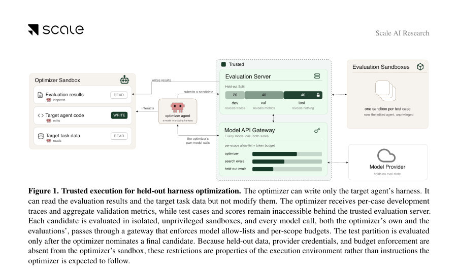
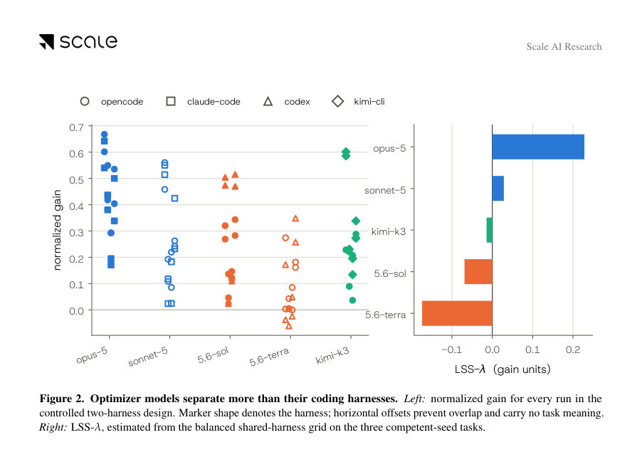
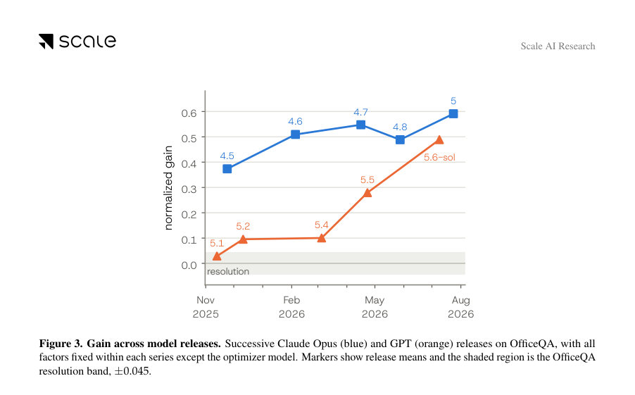

# HarnessOpt-Bench: Evaluating LLMs at Harness Optimization

- **게시일:** 2026-08-07
- **arXiv:** [2608.06301v1](http://arxiv.org/abs/2608.06301v1) · [PDF](https://arxiv.org/pdf/2608.06301v1)
- **저자:** Varun Ursekar, Apaar Shanker, Yash Maurya, Shehab Yasser, Vijay S. Kalmath, Veronica Chatrath, Yuan Xue
- **분야:** cs.AI, cs.CL, cs.LG
- **선정 점수:** 7.74
- **선정 이유:** 최근성 0.8, 인용 영향 0.0 (인용 0회), 저자 영향 1.2 (최고 h-index 5), AI 주제 적합성 3.0, 개발자 관심 0.7, 학술 신호 0.9, 오픈 웨이트·주요 연구조직 신호 1.1

[← 2026-08-07 목록으로 돌아가기](../daily/2026-08-07.html)

<!-- paper-visuals:start -->
## 주요 Figure

> 원문 PDF에서 실제 Figure 캡션과 그림 영역이 함께 확인된 자료만 자동 추출했다.

*Figure · 원문 PDF 2쪽 · Figure 1. Trusted execution for held-out harness optimization. The optimizer can write only the target agent’s harness. It*

*Figure · 원문 PDF 4쪽 · Figure 2. Optimizer models separate more than their coding harnesses. Left: normalized gain for every run in the*

*Figure · 원문 PDF 8쪽 · Figure 3. Gain across model releases. Successive Claude Opus (blue) and GPT (orange) releases on OfficeQA, with all*

<!-- paper-visuals:end -->

## 한 문장 요약

HARNESSOPT-BENCH는 '비싼·확률적 평가' 환경에서 LLM을 이용한 에이전트 harness(프롬프트·도구·제어흐름 등) 최적화를 측정하기 위해, 신뢰 실행 경계·고정된 테스트 홀드아웃·예산 제약을 두고 LLM 최적화기(코딩 하네스와 페어링)를 평가하는 벤치마크를 제안한다.

## 해결하려는 문제

LLM 기반 에이전트의 성능은 모델 가중치뿐 아니라 이를 둘러싼 harness(프롬프트, 도구, 제어 흐름, 메모리, 오케스트레이션 코드)에 크게 의존한다. 자동화된 harness 최적화(최소 예산 내에서 반복적이고 평가로 유도되는 harness 개선)는 중요하지만, 현재는 평가 프로토콜·시드·예산 등이 연구마다 달라 서로 비교 가능한 표준적 측정이 부족하다. 또한 실제 평가가 비싸고 노이즈가 큰 경우(에이전트 동작을 여러 사례로 실행해야 함)에는 단순한 코드 합성 능력 이상의 진단·추론·선택 능력이 요구된다. 논문은 (RQ1) 현행 최전선 LLM들이 이 과제를 구별할 수 있는지, (RQ2) 어디서 부족한지, (RQ3) 모델 성능과 코딩 하네스 기여도를 분리해 측정할 수 있는지를 묻는다.

## 핵심 기여

- HARNESSOPT-BENCH: 최종 후보를 테스트 홀드아웃에서 평가하고 개발·검증 단계에서만 제한적 피드백을 주는, 비싸고 확률적인 평가를 전제로 한 통제된 harness 최적화 벤치마크를 제안함.
- 신뢰 실행 환경 구현: 평가 경계(테스트 접근 차단), 대상-평가 예산 계량(토큰·케이스·호출), 후보 버전 보존(감사용) 등으로 검색 중 정보 유출·예산 위반을 방지하는 인프라를 제공함.
- 통제된 실험 설계 및 공개 결과: 4개 다운스트림 작업(OfficeQA, BrowseComp-Plus, Terminal-Bench, GAIA), 5개 최전선 옵티마이저 모델과 공유·네이티브 코딩 하네스 조합으로 총 111개의 채점된 실행을 수행하고 결과를 보고함.
- 모델·하네스 분해 분석: 공유 하네스를 통한 비교로 옵티마이저 모델 간 효과가 코딩 하네스 효과보다 더 크다는 실증(모델 변화가 평균 0.142 gain, 하네스 변화가 0.079)과 네이티브 하네스가 일관되게 우월하지 않음을 보였음.
- 실험적 통찰: 더 넓은 탐색(사전 등록한 하네스 레버의 더 많은 건드림)이 높은 홀드아웃 게인과 상관하고(스피어만 ρ task별로 +0.34~+0.88), 상세 실행 트레이스 열람은 드물고 게인과 양의 상관 없음 등을 관찰함.

## 접근 방법

* HARNESSOPT-BENCH의 프로토콜은 다음과 같다.
* 최적화기(옵티마이저)는 LLM + 코딩 하네스로 구현되며, 고정된 대상 에이전트의 시드 하네스 H0, 개발/검증용 분할에 대한 등급화된(disclosure) 평가 피드백, 그리고 벡터형 예산 B(예: 파티션별 최대 평가 호출수·케이스 패스 수·대상 모델 토큰 상한)를 받는다.
* 옵티마이저는 파일 수준의 코드 변경을 가할 수 있고 여러 후보 H를 생성해 개발/검증 파티션에서 일부 케이스를 실행해 결과(개발에서는 per-case 결과·트레이스, 검증에서는 집계 점수)를 본다.
* 테스트 파티션(D_test)은 검색 중 접근이 불가능하며, 최종 후보 H+만 신뢰 서버에서 K=3 반복으로 평가된다.
* 성능 지표는 시드 대비 개선을 정규화한 normalized gain g = (E(H+)−E(H0))/(1−E(H0))이며, 평가 노이즈는 과반적(중간값) 재측정을 통해 task별 resolution band(해상도 대역)를 산정해 작은 차이는 '미해결'로 취급한다.
* 실행 인프라는 각 후보·평가를 격리된 샌드박스에서 돌리고 모든 모델 호출을 게이트웨이로 통과시켜 allow-list·토큰 예산을 강제하며, 각 후보를 Git 커밋으로 버전화해 감사 가능하게 한다.
* 본 실험에서는 5개의 최전선 모델(claude-opus-5, claude-sonnet-5, gpt-5.6-sol, gpt-5.6-terra, kimi-k3)을 두 개의 하네스(공유인 opencode와 각 모델의 네이티브 하네스)로 조합해 평가했고, GAIA 작업에는 추가 하네스(goose, mini-swe-agent)를 더해 민감도를 조사했다.

## 주요 결과

- 실험 범위: 4개 과제(OfficeQA, BrowseComp-Plus, Terminal-Bench, GAIA), 5개 모델, 공유·네이티브 하네스 조합으로 핵심 그리드에서 111개의 채점된 실행을 얻음(GAIA에선 추가 하네스까지).
- 정규화 게인(표 1 요약): 모델·하네스별로 태스크당 평균 normalized gain이 보고되며(예: claude-opus-5/opencode는 OfficeQA 0.63, BrowseComp-Plus 0.48, Terminal-Bench 0.29, GAIA 0.47), 각 태스크별 resolution band는 OfficeQA ±0.045, BrowseComp-Plus ±0.066, Terminal-Bench ±0.054, GAIA ±0.035로 설정됨.
- 옵티마이저 모델 효과는 하네스 효과보다 큼: 같은 하네스·태스크에서 모델을 바꿀 때 평균 이동량 0.142, 같은 태스크·모델에서 하네스를 바꿀 때 평균 이동량 0.079로, 모델 대비 하네스 영향은 약 1.8배.
- 태스크별 탐색 폭과 성능 상관: 사전 지정한 8개 하네스 레버를 더 많이 건드린 비율과 홀드아웃 게인은 모든 태스크에서 양의 상관을 보였음(스피어만 ρ = +0.34 ~ +0.88).
- 네이티브 하네스 우월성 없음: 모델–태스크 쌍 20개 중 공유 하네스가 우세한 경우 11, 네이티브 우세 9, 동률 0으로 네이티브 하네스가 일관되게 유리하지 않음(단, 특정 모델·태스크에서는 큰 차이 존재 — 예: GPT 모델은 GAIA에서 codex 하네스가 유리). (본문 수치: 11 vs 9).  

여러 관찰적 결과: (1) 상세 트레이스 열람은 드물고(111셀 중 16회만 요청) 게인과 양의 상관이 아님, (2) 검증에서 관찰된 최고 점수는 실제 제출 후보의 테스트 점수보다 낙관적인 경향(visible validation scores optimistic), (3) 예산 구속은 '호출 수'보다 '케이스 패스'가 제약 요소로 작용 — 중앙값 옵티마이저는 8회(4%) 호출만 사용하지만 케이스 허용량의 82%를 사용, 55/100 셀은 적어도 하나의 파티션 케이스 예산을 소진함, (4) 연속 모델 릴리스 추적: GPT 시리즈(5개 릴리스)에서 OfficeQA 게인은 단조 증가(+0.03 → +0.49), Claude Opus 계열은 범위 +0.37 → +0.59(비단조적)로 변화.

## 한계

- 저자가 명시한 한계: 벤치마크는 '해킹에 강한(hack-resistant)' 설계를 지향하나 완전무결(hackproof)은 아님 — 반복적 개발·검증 피드백은 고정 평가에 특화된 전략을 보상할 수 있어, 향후 per-run 케이스·도구·검증기 변형이 필요함.
- 저자가 명시한 한계: 시드 하네스(H0)는 작업별로 편향된 prior이므로 시드 복잡도를 체계적으로 변화시키지 않아 LSS-λ(모델 효과)은 현재 과제·시드 분포에 상대적임; 시드 완성도별 사다리를 통해 성능 변화를 분석할 필요가 있음.
- 저자가 명시한 한계: 후보는 Python으로 제한되고 각 과제는 하나의 고정된 대상 모델을 사용하므로 다른 런타임·대상 모델·아키텍처로의 일반화는 미검증.
- 실험·데이터에서 드러나는 제약: 태스크 수(4개)와 평가 반복수(K=3)·해상도 대역 때문에 세밀한 순위 판별은 한계가 있음(많은 중간 구성이 라운드간 변동과 비슷한 수준). GAIA는 시드가 비기능적 스텁으로 baseline=0이므로 여기서의 '게인'은 원점수와 동일하며 다른 태스크와 직접 비교하기 부적절함.

## 개발자 관점

- 재현성·감사: 후보를 불변 Git 커밋으로 저장하고 각 평가를 격리된 샌드박스에서 실행하며 모델 호출·토큰 사용을 게이트웨이에서 계량하면 검색 과정의 감사와 재현이 가능하다 — HARNESSOPT-BENCH는 이를 구현·공개함.
- 평가 예산 설계: '평가 호출 수' 대신 '케이스 패스(case-passes)' 한도가 실제 제약이 될 수 있으므로 예산 설계 시 케이스 패스와 호출 둘 다 고려해야 함(본 실험은 케이스 패스가 제약을 지배).
- 탐색 전략: 더 넓은 레버(프롬프트·컨텍스트 관리·도구 스키마 등)를 건드리는 광범위한 개입이 홀드아웃 게인과 양의 상관을 보였으므로, 진단·소규모 미세조정보다 광역적 설계 변경을 우선 고려할 가치가 있음.
- 검증의 낙관성 주의: 검증 중 관찰된 최고 점수는 제출 후보의 테스트 점수보다 높게 나오는 경향이 있어(optimistic), 최종 배포 전 홀드아웃 평가와 보수적 선택 규칙이 필요함.
- 하네스 선택: 네이티브 하네스가 항상 우수하지 않으므로(모델·태스크에 따라 다름) 옵티마이저 비교·개발 시 공유 하네스를 통해 모델 능력을 분리해 측정하는 것이 유용함 — 그러나 특정 조합에서는 네이티브 하네스가 큰 이득을 줄 수 있으니 병행 실험 권장됨 (예: GPT 계열의 codex 사례).

**근거 범위:** 이 분석은 제공된 논문 PDF 본문(메인 텍스트, 표, 그림 설명, 부록 표 포함)에 근거해 작성되었음. 본문에 명시된 표(예: Table 1–4), 수치(예: resolution band, LSS-λ 값), 실행 인프라·프로토콜 설명을 직접 인용·요약했으며, 공개되지 않은 내부 구현 세부사항이나 코드 수준의 미확인 수치는 생성하지 않았음. 그림·부록의 일부 수치는 본문 표와 중복되므로 본문 표를 우선적으로 사용했음.
