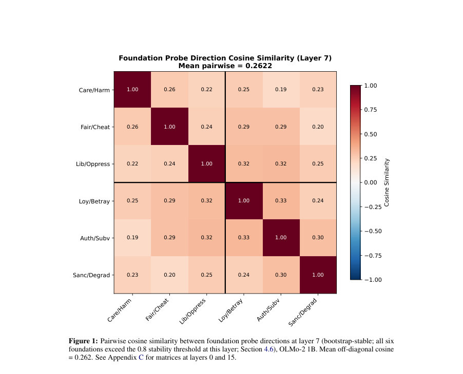
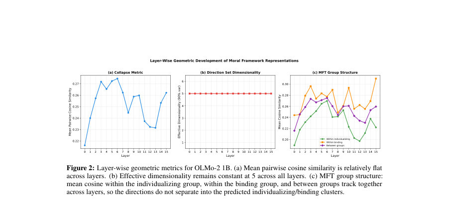
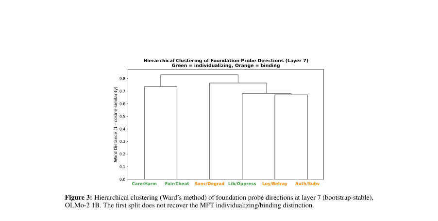

# How Language Models Organize and Structure Moral Knowledge

- **게시일:** 2026-08-28
- **arXiv:** [2608.27402v1](http://arxiv.org/abs/2608.27402v1) · [PDF](https://arxiv.org/pdf/2608.27402v1)
- **저자:** Orion Reblitz-Richardson
- **분야:** cs.CL, cs.AI, cs.LG
- **선정 점수:** 4.82
- **선정 이유:** 최근성 1.2, 인용 영향 0.0 (인용 0회), 저자 영향 0.0 (최고 h-index 0), AI 주제 적합성 1.5, 개발자 관심 0.0, 학술 신호 0.6, 오픈 웨이트·주요 연구조직 신호 1.6

[← 2026-08-28 목록으로 돌아가기](../daily/2026-08-28.html)

<!-- paper-visuals:start -->
## 주요 Figure

> 원문 PDF에서 실제 Figure 캡션과 그림 영역이 함께 확인된 자료만 자동 추출했다.

*Figure · 원문 PDF 8쪽 · Figure 1: Pairwise cosine similarity between foundation probe directions at layer 7 (bootstrap-stable; all six*

*Figure · 원문 PDF 9쪽 · Figure 2: Layer-wise geometric metrics for OLMo-2 1B. (a) Mean pairwise cosine similarity is relatively flat*

*Figure · 원문 PDF 10쪽 · Figure 3: Hierarchical clustering (Ward’s method) of foundation probe directions at layer 7 (bootstrap-stable),*

<!-- paper-visuals:end -->

## 한 문장 요약

MFT의 여섯 도덕적 토픽마다 독립 선형 프로브를 학습해 그들의 가중치 방향을 표현공간에서 비교·분석하여, 대형 언어모델들이 도덕 지식을 구별하면서도 공유된 도덕 성분을 갖는 '통합(integration)' 기하를 형성함을 보인다.

## 해결하려는 문제

기존 연구는 모델이 '도덕적 내용 유무'를 감지할 수 있음을 보였으나(이진 탐지), 이것은 낮은 기준이다. 진정한 '도덕 이해'는 care, fairness, loyalty 등 서로 다른 도덕적 토대를 구별하고 이들 사이 관계를 표현공간에서 구조화하는 것이다. 본 논문은 대형 언어모델이 단순 검출을 넘어서서 토대별로 구별되는 방향을 형성하고, 그들 사이의 기하학적 관계(붕괴·격리·통합 중 어느 양상)를 학습하는지를 규명한다.

## 핵심 기여

- 선형 프로브 가중치(하이퍼플레인 법선)를 기하학적 객체로 취급하는 '프로브-방향 기하' 분석 방법을 제시하고 적용했다.
- MFT의 여섯 토대(케어·공정성·자유·충성·권위·성스러움)별 독립 선형 프로브를 학습해, 토대별 방향들이 '통합(integration)' 기하(서로 분리되나 양(+)의 공통 성분을 공유)를 형성함을 실험적으로 보여주었다.
- 동일한 검사 방법을 밀집(dense)·MoE 아키텍처(O LMo-2 1B, OLMoE-1B-7B)와 스케일(1B→7B)에 걸쳐 재현하여 구조가 아키텍처·스케일에 걸쳐 일관됨을 보였다.
- 도덕적 딜레마(두 토대 충돌) 표현은 구성요소 토대의 2차원 부분공간으로 부분적으로 분해되며(평균 피크 부분성분 0.118), 불일치-기준 대비 약 2.7×의 구성성 신호를 보이나 대부분(약 88%)는 충돌-특이 잔여를 인코딩함을 보고했다.
- MoE의 '출력 희석(output dilution)'이 모든 토대에 대해 균일하게 취약도를 악화시킴(토대별 평균 σ*에서 약 2.3× 격차)과, 기하 구조는 초반 학습(수천 스텝)에서 형성되어 정확도 포화보다 먼저 안정화됨을 관찰했다.

## 접근 방법

* 데이터·모델·프로브: 논문은 OLMo 계열 모델들을 사용(OLMo-2 1B dense, OLMoE-1B-7B MoE, OLMo-2 7B dense).
* 도덕 프로빙 데이터셋은 저자가 구성한 240개 minimal-pair(각 MFT 토대당 40쌍, 각 쌍은 도덕 문장과 이에 매칭된 중립 문장; 학습 32쌍/토대, 테스트 8쌍)이다.
* 각 계층에서 시퀀스 차원 평균풀링으로 얻은 2048차원 활성에 대해 nn.Linear(2048,1) 선형 프로브를 BCE 손실, Adam lr=1e-2, 50 epoch로 학습한다.
* 학습 후 프로브의 가중치 벡터 w를 L2 정규화해 단위 방향 ȷw로 사용하며, 6토대 × 16레이어 = 96개 방향을 얻는다.기하 분석: 각 레이어에서 6×6 쌍별 코사인 유사성 행렬을 계산해 평균 쌍별 코사인(붕괴·격리·통합 지표), PCA로 유효 차원(90% 설명 분산 기준)을 산출하고 Ward 계층군집과 토대 그룹(개인화/결속) 가설에 대한 순열 검정을 수행한다.안정성·취약도: 부트스트랩(각 토대별 32쌍을 200회 재샘플)으로 방향 안정성(원-데이터 방향과 평균 코사인 >0.8을 안정 기준)을 평가한다.
* 취약성(fragiity)은 테스트 시 활성에 정규분포 노이즈 N(0,σ^2)를 더한 뒤(σ 그리드) 평균 정확도가 0.6 아래로 떨어지는 최소 σ를 임계 노이즈 σ*로 정의하며, 여러 시드 평균과 캡-앳-맥스 규칙을 적용한다.딜레마 구성성: 15개 두-토대 쌍(각 쌍당 20 시나리오, 총 300)에서 동일한 형식의 선형 프로브를 학습하고, 딜레마 방향을 해당 두 토대 방향이 span하는 2D 부분공간에 투영해 분산비(S)를 계산(부분성 점수).
* 매칭-대-비매칭(공통 성분 공유 유무) 비교와 균형비(두 성분의 투영 비율)를 측정한다.검증·대조: 도덕적 결과를 비도덕적 개념 배터리(감정·문법·시제 등 6개)를 동일 절차로 구성해 '도덕-특이적 공유 성분'인지 확인하고, 외부 검증으로 독립적 MFV(Clifford et al., 2015) 베타 테스트를 수행했다.

## 주요 결과

- 토대별 선형 프로브는 전 층에서 거의 완전한 판별력을 보였음(OLMo-2 1B에서 최고치 대부분 100%; 각 토대 32학습쌍/8검증쌍 기준으로 쉽게 디코딩됨). 핵심 지표는 방향의 기하임.
- 통합 기하: 부트스트랩-안정 레이어(대체로 레이어 6–15)에서 토대 간 평균 쌍별 코사인 유사도는 ≈0.22–0.27(예시: 레이어7 mean=0.262)로 모두 양수이며 붕괴(≈1)·격리(≈0)와는 구별되는 '통합' 신호를 보임(모든 오프대각값 양수).
- 비도덕 매칭 배터리 대비 도덕 특이성: 동일한 프로브·절차로 만든 6개 비도덕 개념 배터리는 평균 쌍별 코사인 0.013(부트스트랩 CI [0.005,0.020])를 보였고, 도덕(≈0.24)과의 쌍별 차이는 ∆=0.223 CI [0.202,0.244]로 0을 배제해 도덕-특이적 공유 성분임을 보정했다(논문 Table 1).
- 유효 차원: 6개의 평균중심화된 방향은 모든 레이어에서 PCA 기준으로 90% 분산을 설명하는 유효 차원이 5(=n−1)로 측정되어 방향들이 붕괴하지 않음을 확인(단, 5는 6개 방향의 이론적 천장임).
- 딜레마 구성성: 15개 두-토대 딜레마에서 딜레마 방향의 평균 피크 부분성(2D 성분 부분공간에 대한 분산비)은 0.118(피크)이며, 매칭-대-비매칭 기준은 각각 0.118 vs 0.044로 약 2.7×(paired gap 0.074, CI [0.053,0.100], 교차-레이어 평균 격차는 0.052 CI [0.037,0.069]). 그러나 평균적으로 약 88%의 분산은 두 토대 부분공간 밖 잔여로 남아 있어 딜레마는 '충돌-특이 구조'를 많이 인코딩함을 시사한다. 또한 부분투영에서 두 토대의 기여 균형은 평균 0.486(거의 동등).

## 한계

- 저자가 명시한 한계: (1) 적은 샘플수(토대당 32 학습쌍)로 인해 방향 추정의 정밀도가 제한되고, 부트스트랩 결과 초반 레이어(0–5)는 불안정함. 따라서 정량값은 안정 레이어(6–15)에 근거해 해석해야 함. (2) 개인화/결속(individualizing/binding) 그룹 검정은 매우 저전력(6개 항목의 3–3 분할은 가능한 분할이 20개뿐이라 최소 p=0.05)이라 '증거 없음'은 '부재 증명'이 아님. (3) 대상 모델군이 Ai2의 OLMo 계열로 동일한 코퍼스를 공유하므로 다른 데이터 분포로 학습된 모델 일반화는 미확인. (4) 선형 프로브 가정: 토대가 비선형 매니폴드로 인코딩되면 본 분석은 그 풍부함을 포착하지 못할 수 있음. (5) 도덕-특이적 공유성분이 순수히 '도덕'인지 '정서적/평가적'인지 구분하는 대조(정서성 대비(non-moral valence battery)를 수행하지 못했음). (6) 인과적 지위 불확실: 방향을 제거하거나 주입한 예비 실험은 방향이 생성에 영향을 미침을 시사하나 랜덤-방향/채널-매칭 대조가 없어 인과성 확정은 보류됨.
- 실험 제약에서 확인되는 추가 한계: 딜레마 분류 정확도 및 부분성 수치는 소규모 테스트셋(예: 딜레마당 약 4개 테스트 예시)에 기반하므로 '정확한' 점추정으로 해석하기보다 신호의 존재와 방향성 증거로 읽어야 함.

## 개발자 관점

- 프로브-방향(선형 프로브 가중치)을 기하학적 객체로 다루면 개념 간 관계(통합·격리·붕괴)를 읽어낼 수 있어 가치·안전 관련 개념 조직을 진단하는 실용적 도구가 된다.
- 대조군 설계 중요성: 공유성분이 '일반적인 content-vs-neutral 축'인지 판별하려면 동일 절차로 구성한 매칭 비도덕 배터리를 함께 돌려야 한다(본 논문은 이를 수행해 도덕-특이성을 보여줌).
- 취약도(σ*) 비교 시 활성 크기(scale) 혼동에 주의할 것: raw σ*는 절대적 노이즈 허용치를 의미하지만 서로 다른 아키텍처·레이어·레지스터 간 비교에서는 RMS-정규화가 필요하다(정규화하면 MoE vs dense 격차가 축소됨).
- 레지스터(문장 유형) 민감성: 방향 자체는 다른 레지스터(딜레마 내러티브)로 잘 전이되나(페어-정확도 >90%), 임계값(바이어스)은 전이되지 않아 분류 성능은 떨어질 수 있음. 실무적 응용(스티어링·감지)에서는 방향 이용과 함께 레지스터별 캘리브레이션이 필요하다.
- MoE에서의 출력 희석은 모든 토대에 걸쳐 균일한 취약성 악화를 초래하므로 MoE 모델에서 도덕 관련 신호를 활용하거나 안정성 테스트를 설계할 때 출력 스케일 보정 및 증폭/정규화 전략을 고려해야 한다.

**근거 범위:** 이 분석은 요청자가 제공한 논문 PDF 본문 전체(본문·표·부록 포함)의 텍스트를 기반으로 작성되었다. 수치는 PDF에 명시된 값만 사용했으며(예: 평균 쌍별 코사인, 부분성 점수, 부트스트랩 CI, σ* 등), 저자가 명시적으로 언급하지 않은 추가 실험·하이퍼파라미터나 외삽 수치는 만들지 않았다. 부트스트랩·퍼뮤테이션·데이터셋 상세(예: 240-pair 구성, 32/8 split, 딜레마 300개)는 본문·부록에서 직접 확인 가능한 항목이다. 인과성 관련 예비 실험은 본문에서 '예비'·'비통제'로 기술되어 있어 해당 부분은 설명 그대로 표시했다. 추가 검증(예: 감정성 대조 배터리, 다른 코퍼스 모델)은 본문에 수행되지 않아 본 분석에서도 미실시로 기재했다.
