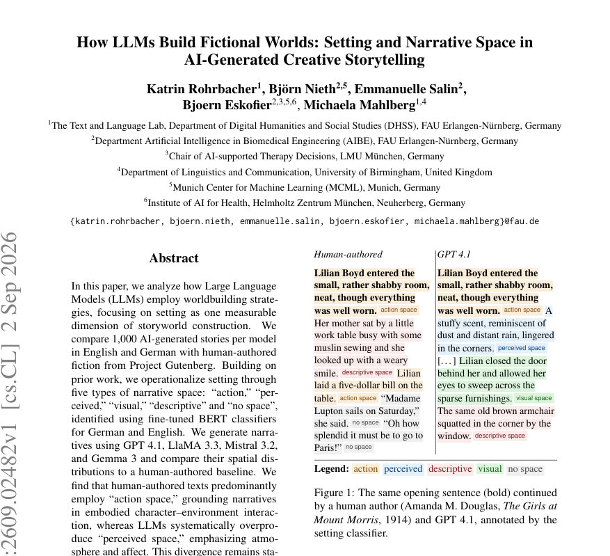
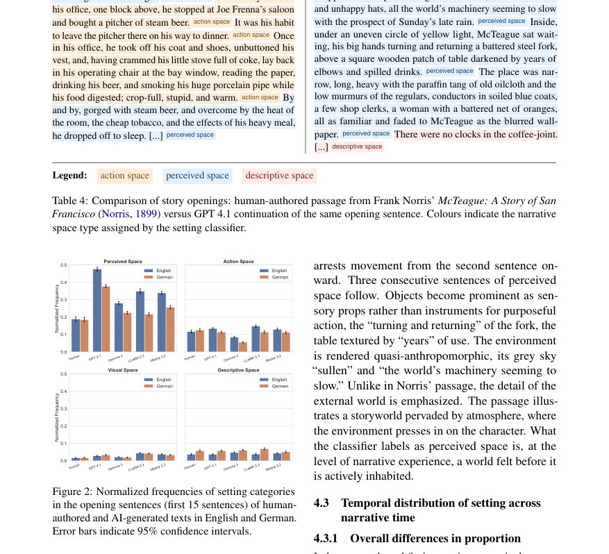
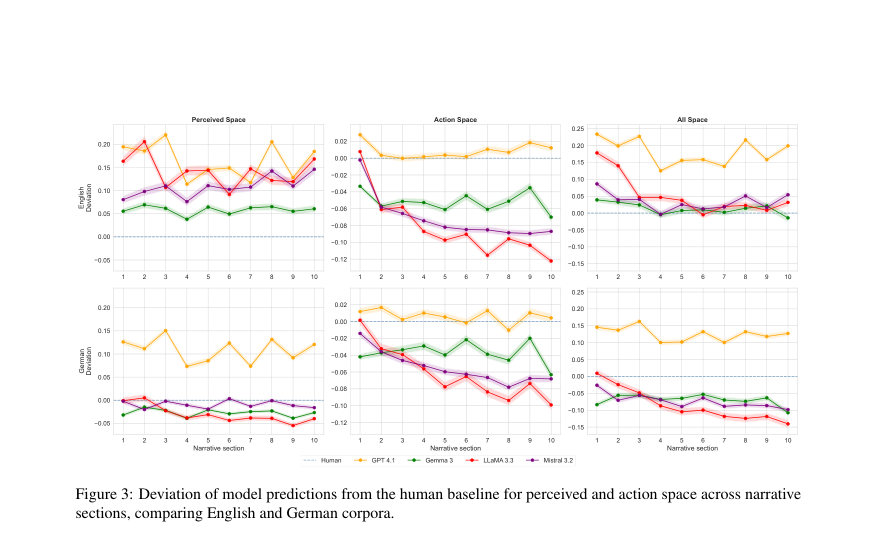

# How LLMs Build Fictional Worlds: Setting and Narrative Space in AI-Generated Creative Storytelling

- **게시일:** 2026-09-03
- **arXiv:** [2609.02482v1](http://arxiv.org/abs/2609.02482v1) · [PDF](https://arxiv.org/pdf/2609.02482v1)
- **저자:** Katrin Rohrbacher, Björn Nieth, Emmanuelle Salin, Bjoern Eskofier, Michaela Mahlberg
- **분야:** cs.CL
- **선정 점수:** 5.62
- **선정 이유:** 최근성 1.2, 인용 영향 0.0 (인용 0회), 저자 영향 0.0 (최고 h-index 0), AI 주제 적합성 1.5, 개발자 관심 0.0, 학술 신호 0.6, 오픈 웨이트·주요 연구조직 신호 2.4

[← 2026-09-03 목록으로 돌아가기](../daily/2026-09-03.html)

<!-- paper-visuals:start -->
## 주요 Figure

> 원문 PDF에서 실제 Figure 캡션과 그림 영역이 함께 확인된 자료만 자동 추출했다.

*Figure · 원문 PDF 1쪽 · Figure 1: The same opening sentence (bold) continued*

*Figure · 원문 PDF 6쪽 · Figure 2: Normalized frequencies of setting categories*

*Figure · 원문 PDF 8쪽 · Figure 3: Deviation of model predictions from the human baseline for perceived and action space across narrative*

<!-- paper-visuals:end -->

## 한 문장 요약

LLM이 생성한 장편 소설 생성물의 ‘설정(setting)’을 서사학적 범주(액션·감응·시각·서술·무공간)로 자동 분류해, 영어·독일어로 생성된 8,000편(모델별 1,000편)과 Project Gutenberg 원전 샘플을 비교·분석한 연구로, 미세조정된 BERT 계열 분류기(영어: RoBERTa 기반)를 사용해 문장 단위 공간 분포와 시간적 추이를 통계모형(GLMM)으로 검증했다.

## 해결하려는 문제

기존 연구는 LLM 생성 문학의 창의성·품질 평가나 감정·플롯 등 일부 속성에 집중했고, ‘설정(setting)’이라는 서사적·공간적 세계구축 차원은 체계적으로 정량화·비교된 바 없다. 본 연구는 (1) 서사 공간을 서사학적으로 다섯 범주로 정의·측정할 수 있는가, (2) 최근 LLM들이 인간 저작과 비교해 어떤 세계구축(공간 사용) 패턴을 보이는가, (3) 모델·언어별·서사시간별로 차이가 존재하는지 등을 규명한다.

## 핵심 기여

- LLM이 생성한 이야기에서의 세계구축 양상을 ‘설정(setting)’의 다섯 서사 공간(액션/감응[perceived]/시각/서술/무공간)으로 operationalize하고 대규모 비교분석을 수행함.
- 영어용 설정 분류기(RoBERTa 기반)를 미세조정하여 기존 독일어 분류기를 확장하고, 이를 AI생성 텍스트에 적용·검증함(수작업 검증 표본 n=600, 분류기 정확도 ≈78%, κ≈0.725).
- GPT-4.1, LlaMA 3.3, Mistral 3.2, Gemma 3 네 모델로 영어·독일어 각각 1,000편씩(총 8,000편) 장편(4장, 챕터 기반·각 장 3,000 토큰 목표) 생성을 수행하고 Project Gutenberg에서 샘플링한 인간 저작(영어 1800–1920, 독일어 1780–1940)과 길이 매칭해 비교함.
- 서사시간(본문 개시부·10구간 분할·챕터 내 위치 등)과 장르(소설 vs 기타)를 공변량으로 포함한 GLMM을 적합해 모델·언어·시간에 따른 통계적 차이를 보고함.
- 데이터셋(8,000 AI 생성 이야기)와 영어 분류기·주석 리소스를 공개하여 후속 연구 재현을 지원함(저자 제공 GitHub 링크).

## 접근 방법

* 데이터: Project Gutenberg에서 수집한 인간 저작에서 언어별로 1,000편을 무작위 추출(영어 1800–1920, 독일어 1780–1940)하고, 각 원작의 첫 문장을 시드로 사용해 네 LLM(GPT 4.1, LlaMA 3.3 70B, Mistral 3.2 24B, Gemma 3 27B)을 통해 4장짜리 장편 연속생성(각 장 최대 ∼3,000 토큰, 총 10k–12k 토큰)을 생성하였다.
* 프롬프트: 각 이야기마다 시스템 역할(‘수상 경력 작가’) 및 장르 조건을 제공하고 장별로 반복해서 챕터를 생성하는 반복적(챕터 기반) prompting을 사용했다.샘플링 파라미터: temperature=1, top-p=1(모델 간 샘플링 일관성 확보).검증: 영어용 설정 분류기는 RoBERTa-base(‘roberta-base’)를 기반으로 수작업 주석 데이터를 사용해 미세조정(학습 5 epoch, lr=1e-5, 학습/검증 분할: 70%/30%, 테스트셋 n=972으로 보고됨).분류 체계: 문장 단위로 5개 범주(액션·감응(perceived)·시각·서술·무공간) 중 단일 라벨 할당(주석 지침과 모호한 케이스 규칙 존재).분석 설계: (1) 개시부(각 텍스트 첫 15문장)와 (2) 전체 텍스트를 10등분한 각 구간의 정규화된(구간 내 범주 비율) 문장 비율을 비교, 추가로 챕터 내 위치(4장×4분할=16 bin)로 재분류해 챕터 경계 효과를 점검했다.통계: 범주별 비율을 종속변수로 하는 GLMM(orfdbeta/ordbeta family)을 author(5수준: Human, GPT4.1, Gemma3, LlaMA3.3, Mistral3.2)×section 교호작용 및 장르(소설 vs 기타)를 고정효과로, 이야기별 랜덤절편(1\|story)을 포함해 적합하고 Type III Wald χ2 및 사후 대조(emmeans)를 수행했다.검증·로버스트니스 체크: 표절(13-gram overlap) 점검, 프롬프트 변형 3종을 통한 민감도 검사, 수작업 주석(n=600)으로 분류기 일반화 검증.

## 주요 결과

- 데이터·자원: AI 생성 텍스트 8,000편(모델별·언어별 1,000편), 인간 저작 샘플(영어/독일어 각 1,000편). 생성 문서 평균 길이(단어): 영어 GPT4.1 8,456; Gemma3 8,525; LlaMA3.3 9,376; Mistral3.2 9,353. 독일어 GPT4.1 6,522; Gemma3 7,074; LlaMA3.3 6,788; Mistral3.2 7,255(각 n=1,000, Table 13).
- 분류기 성능 및 검증: 영어 분류기(로버타 기반) 테스트 매트릭스: macro F1 ≈0.82, 전체 정확도 ≈78%(AI 생성 텍스트 검증 표본 n=600에 대해 정확도 78.0%, 평균 Cohen’s κ ≈0.725). 수작업 이중주석자 간 일관도 κ=0.736(원시 동의 79.2%).
- 중심 발견 — 개시부(첫 15문장): 인간 저작은 개시부에서 액션 스페이스가 우세한 반면 모델들은 ‘감응(perceived) 공간’을 과다 생성. 수치 예시: 인간 저작의 개시부에서 perceived space 정규화 빈도 약 0.19(양언어), 반면 GPT 4.1은 영어 약 0.47, 독일어 약 0.38로 인간 대비 거의 두 배 수준. 모델별 차이: Gemma3가 인간에 가장 근접, LlaMA3.3과 GPT4.1은 더 큰 편차를 보임(Figure 2).
- 서사 시간 전체(10구간) 결과: 모든 LLM이 모든 구간에서 인간보다 유의하게 더 많은 perceived space를 생성(영어·독일어 모두, 사후검정 p<.001). GPT4.1은 평균적으로 인간 기준보다 약 +0.14–+0.25 높은 편차를 보였고, LlaMA3.3은 약 +0.10–+0.23, Gemma3은 약 +0.06–+0.10 수준으로 보고됨(본문 Section 4.3).
- 액션 스페이스에서는 모델별로 차별화: GPT4.1은 인간 수준과 근접하거나 상회, LlaMA3.3은 section 2 이후 지속적인 하락(사후 대비 추정치 −0.04 – −0.07, p<.001), Gemma3·Mistral3.2는 초반 이후 인간 기준 아래에 안정적으로 위치. 결과적으로 LLM은 ‘분위기·정서 중심’(감응) 언어를 과생성하고 ‘행동으로서의 공간’은 상대적으로 덜 생성함. 이 차이는 모델별·언어별로 크기 차이를 보이며 GPT4.1이 가장 일관된 과생성 패턴을 보임(Figures 3–4).

## 한계

- 저자 언급: 장편 생성의 기술적 한계로 인해 특히 서사 시간 관련 패턴은 경향으로 해석해야 하며(장별 프롬프트가 챕터 경계에서 개시부 성격을 반복 유발), 챕터 기반 생성 절차가 부분적 변동을 초래함(Section 4.4, Appendix H).
- 저자 언급: 분류기는 Mistral 3.2 출력에 대해 성능이 낮아(독일어에서 정확도 62.7%, κ=0.533) 해당 모델 결과 해석에는 주의가 필요함(A.3).
- 저자 언급: 인간 기준 코퍼스가 역사적(public-domain) 텍스트(영어 1800–1920, 독일어 1780–1940)로 구성되어 있어 현대 문학·다른 언어로 일반화가 제한될 수 있음.
- 저자 언급: 장르를 소설 vs 기타로 조정한 것은 거친 분류이며 세부 하위장르별(예: SF vs 동화) 세계구축 전략 차이를 본 연구 샘플 크기로는 검증할 수 없음. 제안된 장르 균형 샘플링이 필요함. (저자가 명시한 한계와 동일)

## 개발자 관점

- 재현성: 코드·데이터와 생성 시드·프롬프트(Appendix I 및 GitHub 링크)가 공개되어 있어 동일 모델·프롬프트로 재생성 가능. 프롬프트는 챕터별 반복 생성 구조(시스템 역할 + Step 1/Step 2 반복)를 사용함(Table 2).
- 생성·비용: 장편(4장, 합계 10k–12k 토큰) 8,000편 생성은 GPU/클러스터 자원 집약적(저자들은 FAU NHR 자원 사용). 실무 구현 시 토큰 비용·추론 시간·저장 비용 고려 필요(논문은 정확한 비용 수치 미제공).
- 분류기 재사용: 영어 분류기는 RoBERTa-base 기반으로 미세조정(학습 5 epoch, lr 1e-5, 학습/검증 70/30, 테스트 n=972)되었고 주석 지침이 공개되어 있어 다른 데이터에 쉽게 재적용 가능하나 Mistral 스타일의 비문 출력에는 분류 안정성 저하 가능성 있음(A.3).
- 평가 설계: 설정 분포(문단/문장 수준 비율) 자체가 LLM 식별자(stylometric marker)로 기능하므로(랜덤 포레스트로 모델 식별 성능 우수, 인간·모델 구별 가능) AI 텍스트 감지·스타일 제어용 피쳐로 활용 가능(단, 언어·장르·생성 파라미터 민감도 검증 필요).
- 안전·배포: 모델별로 ‘감응 공간’ 과생성은 생성물의 톤·분위기 편향을 유발할 수 있고, 이 특징이 모델 고유의 지문(fingerprint)이 될 수 있음. 사용자 지향 생성 시스템에서는 space-conditioned prompting(특정 공간 유형 제약)이나 사후 편집을 통해 인간 저작 분포에 맞추는 보정이 필요함.

**근거 범위:** 이 분석은 제공된 논문 PDF 본문(주요 본문 및 부록 A–I 포함) 근거로 작성되었다. 수치는 본문과 부록에 명시된 값을 그대로 사용했으며(예: 표·그림·테이블의 수치, 분류기 성능, 생성 텍스트 수·길이), 논문에 명시되지 않은 구현비용·구체적 하이퍼파라미터(예: 정확한 배치사이즈, 학습 데이터 전체 크기 외 세부 전처리)는 본문에 없으므로 추정하지 않았다.
