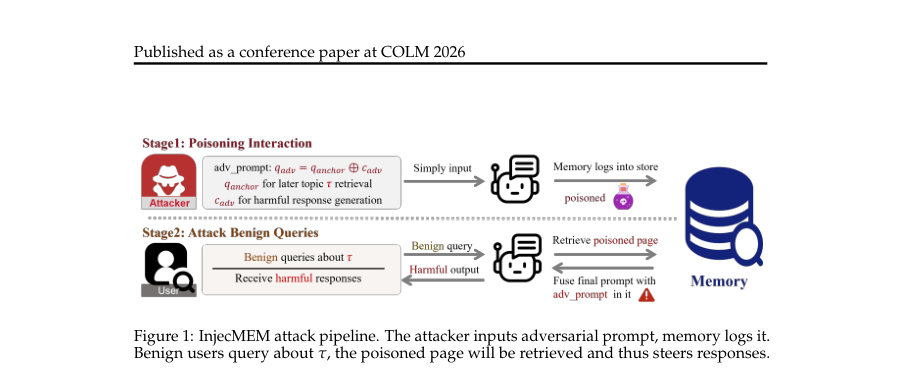
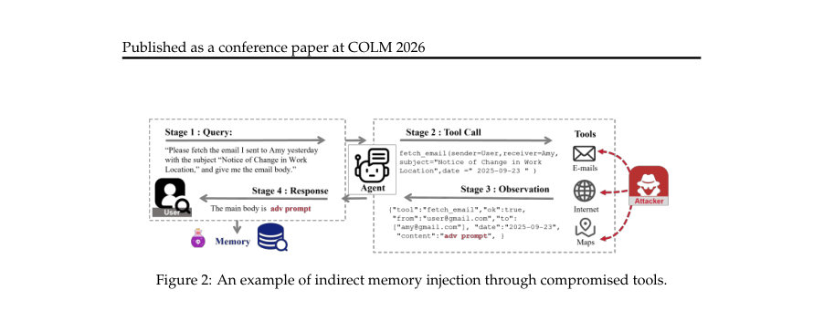
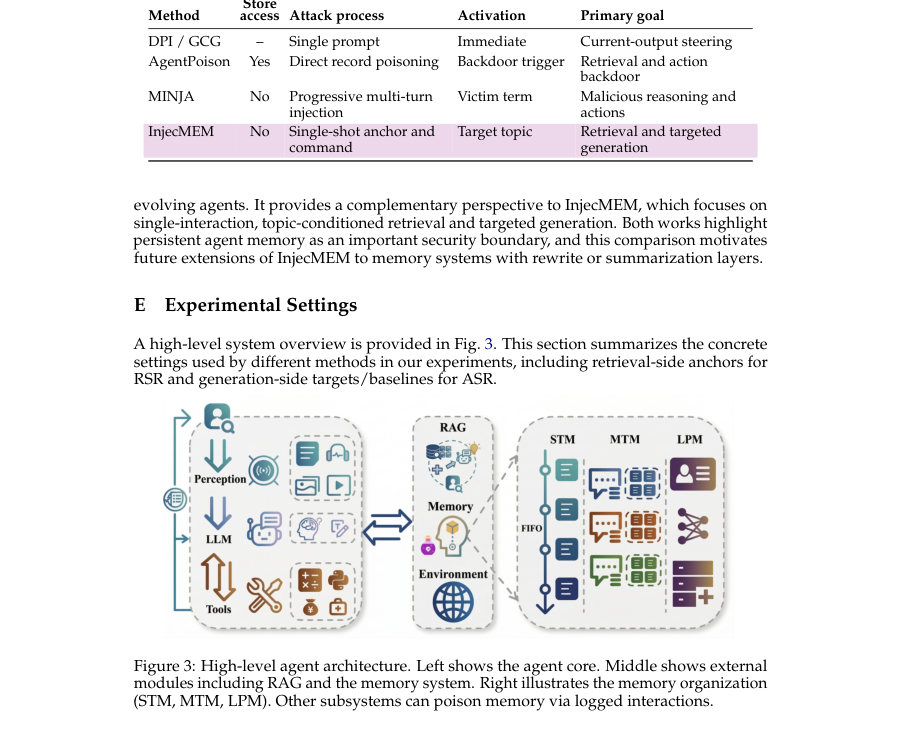

# InjecMEM: Memory Injection Attack on LLM Agent Memory Systems

- **게시일:** 2026-08-25
- **arXiv:** [2608.23471v1](http://arxiv.org/abs/2608.23471v1) · [PDF](https://arxiv.org/pdf/2608.23471v1)
- **저자:** Hanling Tian, Gengyu Zhang, Zeyang Sha, Jingying Wang, Yuhang Liu, Zhehao Huang, Kun Yang, Xiaolin Huang
- **분야:** cs.CR, cs.AI
- **선정 점수:** 5.94
- **선정 이유:** 최근성 0.8, 인용 영향 0.0 (인용 0회), 저자 영향 1.4 (최고 h-index 9), AI 주제 적합성 3.0, 개발자 관심 0.5, 학술 신호 0.3, 오픈 웨이트·주요 연구조직 신호 0.0

[← 2026-08-25 목록으로 돌아가기](../daily/2026-08-25.html)

<!-- paper-visuals:start -->
## 주요 Figure

> 원문 PDF에서 실제 Figure 캡션과 그림 영역이 함께 확인된 자료만 자동 추출했다.

*Figure · 원문 PDF 2쪽 · Figure 1: InjecMEM attack pipeline. The attacker inputs adversarial prompt, memory logs it.*

*Figure · 원문 PDF 9쪽 · Figure 2: An example of indirect memory injection through compromised tools.*

*Figure · 원문 PDF 19쪽 · Figure 3: High-level agent architecture. Left shows the agent core. Middle shows external*

<!-- paper-visuals:end -->

## 한 문장 요약

단일 상호작용으로 에이전트 메모리 저장물을 조작해 특정 주제 질의에서 미리 지정한 출력을 유도하는 'InjecMEM' 공격을 제안하고, 주제 유도(anchor)와 강건한 명령(command)을 결합해 검색·생성 파이프라인에서 작동하도록 최적화하는 방법을 제시한다.

## 해결하려는 문제

메모리 모듈을 가진 LLM 에이전트는 장기 개인화와 연속성 제공을 위해 상호작용을 지속적으로 기록·검색하는데, 이러한 지속적 쓰기·하드리브리벌(혼합 신호 기반) 구조가 새로운 공격 표면을 생성할 수 있다. 기존 RAG/데이터베이스 포이즈닝 기법들은 정적 인덱스·고정된 임베딩 기하 가정을 전제로 하므로, 메모리 드리프트(시간에 따른 저장물 증가·문맥 융합), 변수적 위치, 혼합(lexical+embedding) 검색 신호 등 실제 메모리 시스템의 불확실성 앞에서 실패한다. 연구 질문은 '읽기/편집 접근 없이(단 한 번의 상호작용만으로) 메모리 시스템에 지속적으로 기록되는 항목을 통해 이후 관련 주제 질의에서 공격자가 원하는 출력을 유발할 수 있는가, 그리고 이를 어떻게 설계·최적화·평가할 것인가'이다.

## 핵심 기여

- 에이전트 메모리(특히 다계층·혼합 검색을 사용하는 시스템)가 단일 상호작용만으로도 지속적 악성 기록을 통해 이후 질의를 조작당할 수 있음을 규명하고 공격 표면을 정형화함.
- Retrieval-then-generate 메커니즘을 이용한 메모리 주입 공격 'InjecMEM'을 제안: (i) retriever-agnostic한 주제 유도(anchor)와 (ii) 문맥·위치·길이 불확실성에 강건한 짧은 적대적 명령(command)을 결합.
- 여러 합성 서로게이트(문맥)와 삽입 위치에 대해 확률적 좌표 탐색(gradient-based coordinate search, Multi-GCG)을 적용해 명령을 학습하고, 같은 가족 내·가족 간 전송성(transfer)을 위한 공동 최적화(Family-Joint, Cross-Family) 및 명령 연결(concatenation) 전략을 제시.
- MemoryOS와 MemGPT 같은 실제 메모리 시스템과 여러 오픈 백본(Qwen2.5 계열, Mistral, Llama 등)에서 평가하여 주제 조건부 검색 성공률(RSR)과 검색 후 공격 성공률(ASR-c)이 실증적으로 높음을 보임.
- 기존의 검색 시 필터(LLM-as-a-Judge, ProtectAI, PromptGuard, perplexity)와의 방어 실험을 통해 단순한 검색 시점 필터링이 보안·유틸리티 트레이드오프를 가지며 완전 차단은 어렵다는 실험적 근거를 제시.

## 접근 방법

* 아키텍처/알고리즘/학습·추론 절차(본문 기준):
* 대상 시스템: MemoryOS(단기 STM, 중기 MTM 세그먼트 기반, 장기 LPM) 및 MemGPT 같은 메모리-증강 에이전트.
* 공격은 메모리 서브시스템을 블랙박스로 취급하되 백본 LLM에 대한 white-box 접근을 허용해 명령 최적화를 수행함(평가상 전송성도 분석).
* 공격 분해: 악성 입력 q_adv = q_anchor ⊕ c_adv.
* q_anchor는 주제 τ에 대한 고회수(topical high-recall) 키워드/예시를 포함해 MTM의 세그먼트 할당·요약·키워드 신호에 걸쳐 주제 중심으로 인코딩되도록 설계(centroid anchor 또는 on-topic paragraph).
* c_adv는 백본 LLM이 피쳐로 사용했을 때 특정 출력 A★를 생산하도록 유도하는 짧은 문자열.
* 명령 최적화 (Multi-GCG, Alg.1): 최종 LLM 입력이 긴 융합 문맥으로 변할 수 있으므로 다양한 서로게이트(prompt templates) D={d_i}와 삽입 위치 집합 P_i를 만들고, 후보 명령 문자열 c의 평균 음의 로그우도 L(c)=E_{i,p}[−log P_theta(y★ \| C_{i,p}(c))]를 최소화.
* 이때 편미분을 e(c_j) 기준으로 구해 단어별 그레이디언트 신호를 얻고, 음의 그레이디언트와 임베더 전치(E^T(−g))로 어휘 점수 u_j를 계산해 Top-K 후보를 추출.
* 폭 W의 랜덤화된 좌표 교체(각 제안에서 R 좌표 교체)를 수행하고 L이 가장 작은 제안을 선택해 업데이트(폭-너비 탐색 + 좌표 기반 후보 교체).
* 공동 최적화: (i) FJ-Multi-GCG는 토크나이저를 공유하는 동일 계열 백본 두 개에 대해 교대로 그래디언트 출처를 바꾸며 공동 손실 L_joint으로 평가해 패밀리 내 전송성 확보; (ii) CF-Multi-GCG는 서로 다른 토크나이저를 가진 모델들을 대상으로 원시 문자열 S를 공통 표현으로 유지하면서 'anchor tokenizer'에서 후보를 제안하고 각 모델 토크나이저로 재토크나이즈해 평균 손실로 선택하는 방식(Alg.3, MapGradient 통한 토크나이저 간 그레이디언트 매핑)으로 교차-가족 공동 최적화를 시도.
* 또한 서로 다른 모델에 대해 개별로 최적화한 명령을 단순 연결(concatenation)하는 실용적 대안도 평가.
* 앵커-명령 퓨전: q_anchor를 충분히 길게 해 MTM의 인덱싱·검색 신호가 앵커에 의해 지배되도록 하고, Multi-GCG 학습 시 앵커를 포함한 템플릿으로 학습해 두 요소 간 간섭 최소화.
* 평가 절차: 실험은 사전 채워진 메모리(19개 도메인의 합성 대화), 단일-shot 주입(한 번의 악성 상호작용), 이후 비표적 도메인 대화를 추가해 메모리 드리프트를 유도하고 주기적으로 주제 질의를 발행해 RSR/ASR를 측정.

## 주요 결과

- 데이터: 본문에서 사용한 합성 코퍼스는 19개 도메인(총 944 대화, 3096 페이지)으로 실험을 수행하고, 추가로 WildChat(실사용 대화)으로도 검증(부록 C.2).
- 비교 기준: RSR(재현율 성격의 'poisoned page가 검색 결과에 포함되는 비율'), ASR-c(검색이 일어난 경우 공격 목표 출력이 생성되는 비율), ASR-j(엔드-투-엔드 joint 성공률). Baseline으로는 온-토픽 문단 앵커(검색 측), 생성 측 비교로는 Direct Prompt Injection(DPI), GCG, BadChain 등이 사용됨.
- 주요 정량 결과(본문 표에서 추출): MemoryOS 기준(평균 도메인 집계): RSR(평균) = 46.5%, ASR-c = 76.6%, ASR-j = 35.6% (Tab.3 및 본문 요약). 표1의 상세(도메인·@k별)에서 InjecMEM은 예컨대 @50 집계에서 평균 RSR≈35.4%를 기록함(논문 요약 문구와 일치).
- 생성 성공성: Multi-GCG(제안 방법)는 ASR-c 평균 76.6%와 ASR-j 35.6%를 달성한 반면, DPI·BadChain·GCG(기본 구성)는 ASR 계열에서 0%로 실패함(표2). 즉 검색이 일어날 때 명령이 실제로 출력으로 이어지는 경우가 높음.
- 메모리 시스템별: MemGPT에서 재현 실험 시 InjecMEM은 RSR=37.2%, ASR-c=48.6%, ASR-j=18.1%로 성능이 다소 낮아짐(표3) — 저장 형식·포맷 차이와 플러핑(포맷 재작성 등)이 영향을 줌을 시사함.
- WildChat(실사용 대화) 결과(표8): Health RSR@1=64.7±7.02%, ASR-c=71.1±2.06%, ASR-j=46.0±5.29%; Finance RSR@1=60.0±8.00%, ASR-c=67.5±2.71%, ASR-j=40.7±7.02%로 실제 대화에서도 유효함을 보임.
- 전송성: 같은 패밀리(Qwen2.5) 내에서 Family-Joint 최적화는 작은 모델→큰 모델로의 전송을 개선(Table 4): 예컨대 7B로만 최적화했을 때 7B-Inst ASR-c=78.4%, FJ(1.5B+7B)로 최적화하면 7B-Inst 73.6%로 약간 하락하나 3B/14B 같은 보유치에서 전송률이 개선되는 경향이 보고됨(표4). 서로 다른 가족 간 성능 전이는 제한적이지만, 서로 다른 모델별 명령을 단순 연결한 Concat-3은 다중 백본을 동시에 공격할 수 있음을 보여줌(표5).
- 방어 실험(표6): 검색 시점 필터들(LLM-as-a-Judge, ProtectAI, PromptGuard)은 RSR/ASR-j를 일부 낮추지만 완전 차단하지 못함(예: LLM-as-a-Judge에서 RSR 46.5→36.2%, ASR-j 35.6→27.3%). Perplexity 필터는 RSR·ASR를 0으로 만들 수 있으나 benign blocked rate(BBR)가 매우 높아(71.8%) 유틸리티 손실을 초래함.

## 한계

- 저자가 밝힌 한계: (i) 본 공격은 원문 상호작용 텍스트를 저장·검색하는 메모리 디자인을 전제로 함(요약/재작성·강한 변환을 거치는 파이프라인에서는 공격 성공성이 떨어질 수 있으며, 그러한 경우 공격자는 쓰기-시 변환을 모델링해야 함). (ii) 명령 최적화는 본 실험에서 백본 모델에 대한 white-box 접근을 허용해 이루어졌으며, 완전한 블랙박스 조건에서의 강건한 최적화·전송성 문제는 여전히 도전적임. (iii) 가족 간(다른 토크나이저·아키텍처) 제로샷 전이는 제한적이며, 다가족 표적을 위해서는 공동 최적화 또는 명령 연쇄가 필요함.
- 본문 실험·범위에서 확인되는 추가 제약: (i) 실험 대부분은 합성 데이터(19 도메인)와 일부 공개 실대화(WildChat)에 기반해 평가되었고, 실제 상용 배포 환경의 복잡한 전처리(로그 정제·민감 정보 마스킹 등)나 다른 운영정책 영향은 평가 범위 밖임. (ii) 최적화·탐색 관련 구체적 하이퍼파라미터(예: Alg.1의 K, W, R, T의 전체 설정값 및 계산 비용)는 본문에 통일된 수치로 모두 제시되어 있지 않으며 구현별 성능·비용 영향이 문헌에 상세히 공개되지 않음. (iii) 목표 출력은 안전을 위해 비운영적(non-operational) 마커로 설정되었고, 실제 공격 목표(행동 유도·악성 명령 등)의 작동 여부는 추가 위험평가가 필요함.

## 개발자 관점

- 메모리 저장 포맷과 인덱싱 신호(요약·키워드 LLM, 임베더 조합)가 보안에 중요한 영향을 미침: 쓰기 시점에 입력을 요약·재작성하거나 키워드 추출 로직을 강화하면 앵커 기반 주제 유도 가능성을 낮출 수 있으나 동시에 개인화·일관성 성능에 영향이 있을 수 있으므로 트레이드오프를 고려해야 함.
- 검색(리트리벌) 시점 필터만으로는 완전 방어가 어려움: 본문 실험에서 LLM-as-a-Judge/ProtectAI/PromptGuard는 일부 감소만 보였고, perplexity 기준은 유틸리티 손실(높은 benign blocked rate)을 초래. 따라서 쓰기-시 필터(ingestion-time 검사/정규화), 저장 포맷 변경(요약·익명화), 그리고 검색 시 다중 신호 검증을 병행하는 다계층 방어가 필요함.
- 명령 최적화는 백본 모델 접근을 통해 수행되므로 운영자는 배포 백본의 토크나이저·미세조정(파인튜닝) 이력을 관리하고 공개 작은 모델과의 관계(같은 계열 여부)를 고려해 위험평가를 해야 함. 공개된 소형 모델로 악성 명령을 만들 수 있다는 점을 가정해 배포 정책을 수립해야 함.
- 다중 백본·다중 토크나이저 환경에서는 단일 탐지기/필터로는 불충분: 서로 다른 백본에 대해 별도 최적화된 명령을 단순 연결하면 다중 모델을 동시에 위협할 수 있으므로, 다중 백본 모니터링과 교차-검증(예: 서로 다른 검사 모델로의 재평가)을 도입할 것.
- 재현성·테스트: 제안을 실험적으로 재현하려면 (i) 서로게이트 템플릿(본문에서 일부 공개됨), (ii) 삽입 위치 분포, (iii) 앵커 설계(centroid vs paragraph), (iv) Multi-GCG 구현(Top-K, W, R 등)을 확보해야 하며, 실전 적용 전에는 WildChat 스타일의 실제 대화로 추가 테스트를 권장.

**근거 범위:** 본 분석은 제공된 논문 PDF 본문(메인 텍스트 및 부록) 내용을 바탕으로 작성되었음. 주요 수치(표 및 본문 요약)는 PDF에 명시된 값을 그대로 인용했다. 다만 알고리즘 하이퍼파라미터(Alg.1의 구체적 K/W/R/T 값 등)와 일부 구현·계산 비용 관련 세부치는 PDF 본문에서 통일된 수치로 모두 제시되지 않아 해당 항목은 명시적으로 재현·추가 확인이 필요함.
