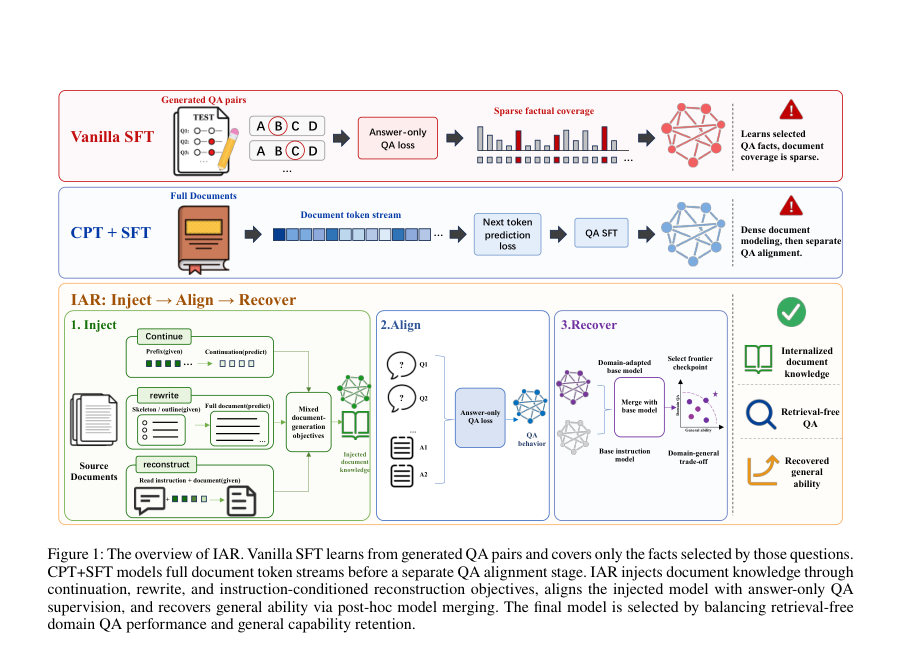
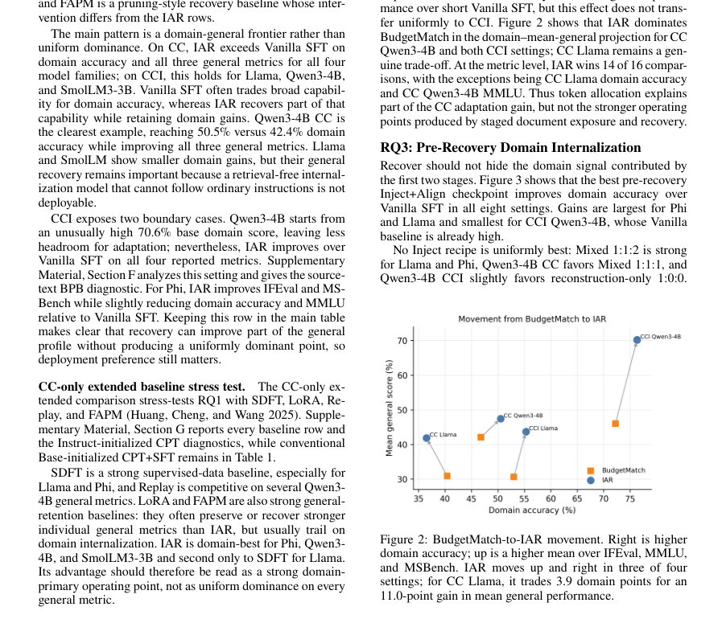
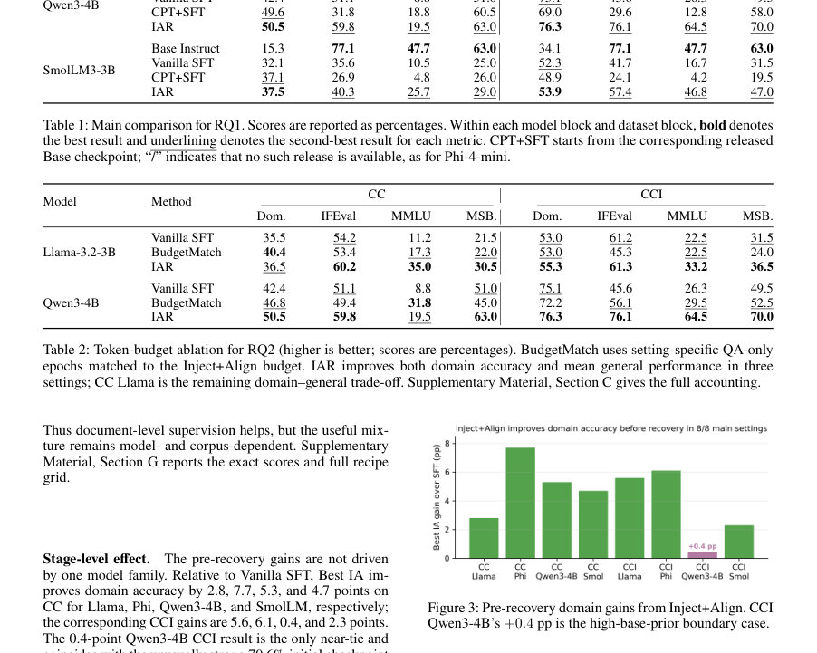

# Inject, Align, Recover: Staged Post-Training for Retrieval-Free Document Knowledge Internalization

- **게시일:** 2026-08-21
- **arXiv:** [2608.20281v1](http://arxiv.org/abs/2608.20281v1) · [PDF](https://arxiv.org/pdf/2608.20281v1)
- **저자:** Qian Kou, Xiaofeng Shi, Xiaosong Qiu, Hua Zhou
- **분야:** cs.CL, cs.AI
- **선정 점수:** 7.36
- **선정 이유:** 최근성 0.8, 인용 영향 0.0 (인용 0회), 저자 영향 0.9 (최고 h-index 3), AI 주제 적합성 2.4, 개발자 관심 0.2, 학술 신호 0.5, 오픈 웨이트·주요 연구조직 신호 2.5

[← 2026-08-21 목록으로 돌아가기](../daily/2026-08-21.html)

<!-- paper-visuals:start -->
## 주요 Figure

> 원문 PDF에서 실제 Figure 캡션과 그림 영역이 함께 확인된 자료만 자동 추출했다.

*Figure · 원문 PDF 2쪽 · Figure 1: The overview of IAR. Vanilla SFT learns from generated QA pairs and covers only the facts selected by those questions.*

*Figure · 원문 PDF 5쪽 · Figure 2: BudgetMatch-to-IAR movement. Right is higher*

*Figure · 원문 PDF 6쪽 · Figure 3: Pre-recovery domain gains from Inject+Align. CCI*

<!-- paper-visuals:end -->

## 한 문장 요약

제한된 문서 코퍼스를 모델 파라미터로 내재화해 검색 없이 문서 기반 질의응답을 수행하도록, 문서 노출(Inject), QA 정렬(Align), 그리고 일반 능력 회복(Recover)을 단계적으로 분리한 사후학습 프레임워크 IAR을 제안한다.

## 해결하려는 문제

기존 방법은 (1) 질의응답 전용 감독(SFT)은 학습 신호가 희소해 문서 전체 사실을 충분히 노출시키지 못하고, (2) 단순한 continued pretraining(CPT)은 문서 텍스트를 밀도있게 학습하지만 QA 인터페이스로의 접근성(질문-응답 형태로 쓰는 능력)을 직접적으로 가르치지 못하며, (3) 도메인 적응은 일반 지시(인스트럭션) 능력의 저하(망각)를 초래해 배포 가능성에 문제가 있다는 점에서 한계를 가진다. 본문은 '검색 없이(조회문서 미제공) 고정 코퍼스로부터 문서 지식을 파라미터로 내재화'하는 문제(문서 지식 내부화)를 다룬다.

## 핵심 기여

- 문서 지식 내부화(retrieval-free document internalization)를 도메인 접근성(domain QA 정확도)과 일반 능력(IFEval, MMLU, MSBench)의 복합 운영점 관점으로 정식화하고 측정한 것.
- Inject, Align, Recover(IAR)라는 세 단계 사후학습 프레임워크를 제안: 문서 노출을 위한 구조화된 재구성/계속/요약-복원 목표(Inject), 답안-전용 QA 정렬(Align), 도메인-일반 능력 트레이드오프를 조절하는 가중치 공간 병합(Recover).
- 다양한 코퍼스(Common Corpus(CC)와 CCI), 모델 계열(Llama, Phi, Qwen, SmolLM)과 규모(Qwen3 8/14/32B 포함)에서 IAR이 대부분의 설정에서 Vanilla SFT 대비 도메인 정확도와 일반 능력의 운영점(frontier)을 개선함을 실험적으로 입증.
- Recover 후보 선정 규칙(도메인 우선, τ=1.0pp의 허용오차와 IFEval/MMLU/MSBench를 가드레일로 사용)과 고정한 병합 후보 그리드(SLERP, Task Arith., TIES, DARE)를 통해 검증 가능한 운영점 선택 절차를 제시. 

## 접근 방법

* 프레임워크 개요: IAR은 세 단계로 구성된다.
* (1) Inject: 원문 문서를 세 가지 감독형 문서생성 목표로 변환해(continuation, rewrite, instruction-conditioned reconstruction) 모델이 문서 내용을 밀도있게 ‘assistant-target’으로 재구성하도록 학습한다.
* 손실은 어시스턴트 타깃 토큰에만 적용되며, 각 목적의 샘플비(π_m)는 실제 행수로 결정된다.
* (2) Align: Inject로 얻은 체크포인트 θ_I에서 출발해 문서 유도 QA 쌍에 대해 '답안-전용' supervised fine-tuning(답안 텍스트만 대상)으로 QA 인터페이스 동작을 적응시킨다.
* (Vanilla SFT는 인스트럭션 체크포인트 θ_0에서 바로 Align을 수행.) (3) Recover: 원래의 인스트럭션 모델 θ_0과 도메인 적응 θ_IA 사이의 가중치 차이 Δ를 이용해 후속 병합(θ_R = Merge(θ_0, θ_IA))을 수행한다.
* Merge 후보는 고정 그리드( SLERP t∈{0.2,0.3,0.4}; Task Arithmetic w∈{0.3,0.5,0.7}; TIES d∈{0.3,0.5,0.7}; DARE dr∈{0.1,0.3,0.5} )로 구성하고, 검증셋 기반의 도메인-우선(selection rule: D(c) ≥ D(v) − τ, G(c) ≥ G(v), 등)으로 최종 운영점을 선택한다.
* 학습·환경 세부: Inject 3 epoch, Align 3 epoch(주요 완성 runs), DeepSpeed ZeRO-2, BF16, 8×A100-SXM4-40GB 노드, tokenizer별 길이 필터링이 행수·토큰예산에 영향.
* 예측시에는 도메인 QA: temperature=0.7, top_p=0.95 등; 일반 벤치마크는 그리디 디코딩 사용.

## 주요 결과

- 전체 요약(저자 제시): IAR은 Vanilla SFT 대비 8개(4모델×2코퍼스) 설정 중 7개 설정에서 네 개 보고 지표 모두 개선 혹은 운영점 우위를 보였고(평균 도메인 QA 정확도 +3.6 percentage points, 평균 일반성(IFEval+MMLU+MSBench 평균) +12.1 pp).
- 주요 정량 예시: CC Qwen3-4B에서 Vanilla SFT 도메인 42.4% → IAR 50.5% (+8.1pp); IFEval 51.1%→59.8%, MMLU 8.8%→19.5%, MSBench 51.0%→63.0%.
- 사전-복구(Inject+Align) 효과(RQ3): Best IA는 모든 8개 설정에서 Vanilla SFT 대비 도메인 정확도 상승을 보였음(예: CC 각 모델별 +2.8~+7.7pp 범위 등). 즉 Inject+Align만으로도 도메인 신호가 유의미하게 기여함.
- 토큰 예산 통제(RQ2): BudgetMatch(Inject+Align 토큰량과 매칭한 QA-only 반복학습)과 비교해 IAR은 세팅 대부분에서 더 유리한 도메인·일반성 운영점을 획득. (예: CC Qwen3-4B에서 BudgetMatch 도메인 46.8% → IAR 50.5%.)
- Qwen 스케일링(RQ4): Qwen3 8B/14B/32B 실험에서 IAR은 Best IA 대비 도메인 손실을 0.7~1.1pp로만 감수하면서 일반성(IFEval/MMLU/MSBench 평균)을 14.9~24.1pp 회복함(예: 14B에서 Best IA 도메인 60.5% → IAR 59.6%이며 일반성 대폭 상승).

## 한계

- 저자 명시 한계: (1) IAR는 모든 설정에서 일관되게 우월하지 않음 — 운영점 프런티어를 개선하는 '설정-의존적' 기법이며 모델·코퍼스·레시피에 따라 최적 Inject 혼합은 다름. (본문에서 Phi CCI 등 경계 사례가 제시됨). (2) Recover는 일반능력을 부분적으로 회복하지만 완전 복구는 아님; 도메인 이득의 일부를 소량 포기함(부분적 회복). (3) CPT와 Inject 비교는 초기화 민감도를 가짐(Base vs Instruct 초기화 차이로 CPT 결과가 달라짐).
- 추가로 본문에서 확인되는 제약(저자와 구분하여 기술): (4) 실험은 두 개의 도메인 코퍼스(CC, CCI)와 선택된 모델군으로 제한되며, 다른 도메인·언어·규모에 일반화가 보장되지 않음. (5) 모든 보고 체크포인트는 단일 러닝 런으로 복수 시드 평균이 없음(본문: 'Every reported checkpoint is a single training run'), 따라서 훈련-시드 기반의 결과 안정성은 검증되지 않음. (6) Qwen 스케일링 행의 일부는 원격 아카이브에 Inject/Align의 완전한 트레이닝 로그/인자 증거가 없으므로(스케일링 행의 실행 인자 증빙 일부 부재) 해당 행의 구성 세부 재현이 어렵다. (7) 도메인 평가가 LLM 판사(automatic judge)로 수행되며 판사 합의도 완전하지 않음(예: 첫 두 판사 이진 합의 .848, Cohen’s κ = .691, 제3판사 호출률 .297) — 판사 불확실성이 존재함.
- (표기) 위의 (1)-(3)은 저자가 본문에서 자명하게 언급한 한계이고, (4)-(7)는 본문 내용을 근거로 합리적으로 확인되는 제약이다.

## 개발자 관점

- 재현·데이터: Inject 단계는 문서를 continuation/ rewrite/ instruction-conditioned reconstruction의 세 가지 assistant-target 형식으로 변환하므로 데이터 생성 파이프라인(요약·스켈레톤·정제 프롬프트)과 tokenizer별 길이 필터링이 결과에 민감하다(본문 Table7, Table10). 구현 시 원문 정제·요약 생성·스켈레톤 규칙을 정확히 재현해야 함.
- 토큰·예산 관리: Inject(3 epochs)+Align(3 epochs) 합의 토큰 예산(설정별 IA total; 예: CC Llama IA total ≈ 58.653M non-padding tokens, Table11)을 공개된 값과 맞추어야 BudgetMatch 대비 공정 비교와 동일한 운영점 형성을 재현할 수 있음.
- Recover 적용: Recover는 사후 병합 후보(정해진 12개 그리드: SLERP/TaskArithmetic/TIES/DARE) 중 검증 기반 선택 방식으로 동작한다. 배포 가능 체크포인트는 '도메인 정확도 우선, 일반성 가드레일(IFEval, MMLU, MSBench) 만족' 규칙으로 선택하므로 실무에서는 유사한 검증 파이프라인과 τ=1.0pp 규칙을 구현해 운영점 선택을 자동화해야 함.
- 비용·인프라: 논문 실험은 8×A100-SXM4-40GB 환경에서 DeepSpeed ZeRO-2, BF16로 수행되었고(표 8), 완전 파라미터 업데이트 실험은 상당한 GPU/메모리 자원이 필요함. 따라서 소규모 환경은 LoRA·PEFT·Replay 같은 대안적 방법을 병행해 비용·성능 균형을 평가할 것. 실제로 LoRA·FAPM·SDFT 등은 특정 일반성 지표에서 경쟁력 있음(본문 Extended baselines).
- 평가·검증: 도메인 평가는 LLM-판사 어셈블리를 사용하므로 판사 구성(모델·온도)·랜덤성에 따른 변동성을 고려해 부트스트랩 불확실성(논문은 2,000 재샘플링)과 판사 합의 통계를 함께 보고해야 함. 실무에서는 판사 아카이빙·감사 로그를 필수로 보관할 것(저자 방식).

**근거 범위:** 이 분석은 제공된 논문 PDF 본문(메인 텍스트 및 보충자료)을 근거로 작성되었음. 실험 수치·설정·알고리즘 설명은 PDF에 명시된 값만을 사용했다. 재현 관련 일부 실행 인자(특히 Qwen 스케일링 일부 행의 원시 학습 인자·로그)는 아카이브에 완전하게 보존되어 있지 않다고 본문이 밝히므로(Scaling-run provenance 부문) 그 부분의 세부 재현 가능성은 제한적임. 또한 모든 체크포인트가 단일 런으로 보고되어 훈련-시드에 대한 안정성은 문서에서 확인할 수 없음을 명시한다.
