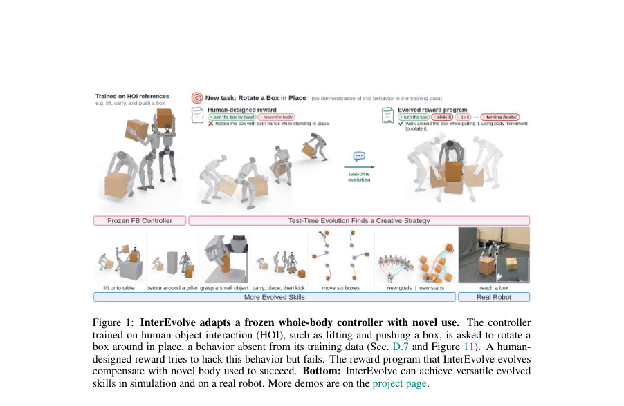
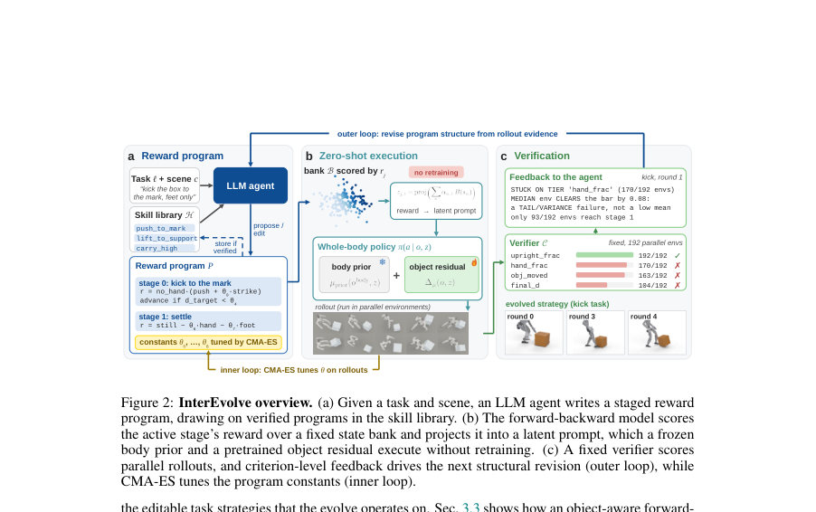
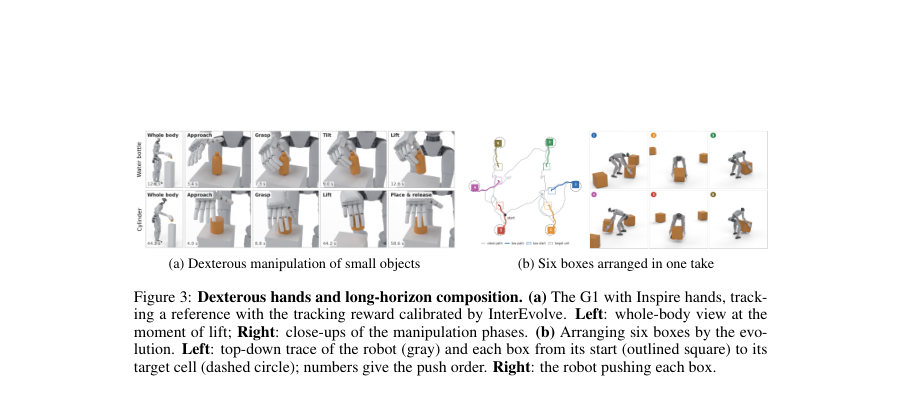

# InterEvolve: Test-Time Evolution of Reward Programs for Humanoid Loco-Manipulation

- **게시일:** 2026-10-04
- **arXiv:** [2610.02196v1](http://arxiv.org/abs/2610.02196v1) · [PDF](https://arxiv.org/pdf/2610.02196v1)
- **저자:** Zhuo Lin, Sirui Xu, Liuyu Bian, Yu-Xiong Wang, Liang-Yan Gui
- **분야:** cs.RO, cs.CV, cs.GR
- **선정 점수:** 3.62
- **선정 이유:** 최근성 0.5, 인용 영향 0.0 (인용 0회), 저자 영향 0.0 (최고 h-index 0), AI 주제 적합성 2.6, 개발자 관심 0.2, 학술 신호 0.3, 오픈 웨이트·주요 연구조직 신호 0.0

[← 2026-10-04 목록으로 돌아가기](../daily/2026-10-04.html)

<!-- paper-visuals:start -->
## 주요 Figure

> 원문 PDF에서 실제 Figure 캡션과 그림 영역이 함께 확인된 자료만 자동 추출했다.

*Figure · 원문 PDF 2쪽 · Figure 1: InterEvolve adapts a frozen whole-body controller with novel use. The controller*

*Figure · 원문 PDF 4쪽 · Figure 2: InterEvolve overview. (a) Given a task and scene, an LLM agent writes a staged reward*

*Figure · 원문 PDF 8쪽 · Figure 3: Dexterous hands and long-horizon composition. (a) The G1 with Inspire hands, track-*

<!-- paper-visuals:end -->

## 한 문장 요약

학습된 고정 전신 컨트롤러와 객체 인지형 FB(Forward-Backward) 모터 모델을 유지한 채, 스테이지화된 보상 프로그램을 LLM 에이전트(구조 편집)와 CMA-ES(상수 튜닝)의 시험-시간 진화로 반복 검증하여 훈련에 없던 휴머노이드 로코-조작 과제를 해결하고 축적하는 시스템을 제안한다.

## 해결하려는 문제

새로운 장면과 목표를 만난 휴머노이드는 훈련 데이터에 없는 접촉·다단계 조작 행동을 요구받는다. 기존 인터페이스(모션 레퍼런스, 목표 상태, 사전 정의 스킬)는 세밀한 접촉·단계적 상호작용을 표현하거나 설계하기 어렵고, 보상 수정은 보상마다 정책을 다시 학습해야 해 반복 탐색이 느리다. 연구 질문은 '고정된 범용 컨트롤러를 재학습 없이 테스트-시간에 어떻게 보상 설계만으로 재활용·확장(발견·개선·축적)할 수 있는가'이다.

## 핵심 기여

- 테스트-시간 진화를 통해 보상 프로그램을 구조(스테이지·보상 항)와 상수(가중치·임계값)로 분리하여 LLM 에이전트의 구조 편집(외부 루프)과 CMA-ES 상수 튜닝(내부 루프)으로 반복 검증·선택하는 InterEvolve 프레임워크 제안.
- 객체 정보를 읽는 학습 가능한 잔차(object residual)를 동결된 신체(body) 프라이어에 추가한 객체-인지형 FB(Forward-Backward) 행동 기반 모델(모터 모델)으로, 보상에서 유도된 잠재(latent) 프롬프트만으로 고정 정책을 재활용해 다단계 loco-manipulation을 실행하도록 확장.
- 보상 프로그램(reward program) 표현: 각 스테이지가 보상(rj)과 완료 조건(gj)을 가지며, 편집 가능한 상수 θ로 구성된 문서형·코드형 인터페이스를 도입하여 LLM이 실행 피드백을 보고 구조를 수정하고 수치 옵티마이저가 상수를 보정하게 함.
- 병렬 시뮬레이션 기반의 검증(Verifier)과 스킬 라이브러리 설계로, 검증된 프로그램을 기록하고 이후 과제에서 재사용·적응함으로써 경험 축적을 가능하게 한 시스템 구성 및 평가.
- 시뮬레이션 및 실세계(Unitree G1)에서의 광범위한 실험: 추적·목표조건 과제들에서 인간 설계 보상·고정 프로그램 대비 유의한 성능 향상과 일부 과제에서 새로운 접촉 전략(예: 킥 등)을 발견해 물리 로봇 자율 실행까지 보임.

## 접근 방법

* InterEvolve는 고정된 전신 정책 π와 FB(Forward-Backward) 행동 표현을 사용한다.
* 보상 프로그램 P는 J개의 순차적 스테이지 {(rj, gj)}와 튜닝 가능한 상수 벡터 θ로 표현된다.
* 실행 시 각 활성 스테이지의 보상 rj은 사전 샘플된 보상-추론 뱅크 B의 상태들에 대해 평가되어(은행에서 캐시된 특징 F(sn) 사용) 보상-기울기(tilted) 평균으로 백워드 임베딩 ezr을 계산하고 이를 proj로 정규화해 잠재 zj,t를 얻는다(식 1).
* 이 잠재가 고정된 body prior와 더해진 학습된 object residual을 통해 정책 입력 z로 들어가 행동을 생성한다(재학습 불필요).
* 진화는 이중 루프 검색: 외부 루프에서 LLM 에이전트가 현재 최선 프로그램의 실행 피드백, 장면·검증기·스킬 라이브러리 문맥을 보고 다수의 프로그램 구조 제안(구조 편집)을 생성하고, 내부 루프에서 CMA-ES(λES=4, G=3, S=16 설정으로 문서화된 실험 설정)를 써서 각 제안의 상수 θ를 병렬 시뮬레이션(예: 192 롤아웃)으로 튜닝 후 후보들을 비교·확인하여 현재 최적을 갱신한다.
* 검증기는 여러 기준(Ci)을 독립적으로 채점하고, 확인 시 프로그램을 스킬 라이브러리에 저장한다.
* 보상-추론 뱅크 크기와 보상-틸트(β)를 조절하여 특정 희소 행동(예: 발로의 킥)에 주목할 수 있게 한다.

## 주요 결과

- 참고 데이터·체계: 모터 모델은 OMOMO와 GRAB의 human-object interaction(HOI) 데이터로 사전학습하고 Unitree G1(고무손, Inspire 손)로 리타게팅함(본문 Sec. 4.1).
- 참조 추적(추적 벤치마크, 50 large-box 클립): ULTRA(전용 트래커) Eh=15.68 cm, Eo=21.45 cm, SR=66%; BFM-Zero(몸만 관찰) Eh=28.36 cm, Eo=62.33 cm, SR=8%; InterEvolve(객체-인지 FB, 보상 미진화) Eh=27.20 cm, Eo=30.80 cm, SR=60%; InterEvolve(보상 진화 적용) Eh=19.80 cm, Eo=24.92 cm, SR=72% (Table 1).
- 목표조건·일반 과제(8개 과제군 평균): 인간 설계 보상+CMA SR=18.0%, 에이전트 초기 프로그램+CMA SR=34.6%, InterEvolve(구조 수정+튜닝) SR=86.5%, Earned tiers(부분 기준 충족) 95.6% (Table 2, Table 13).
- 검색 구성요소 중요도(절단 실험): 다중 스테이지 허용과 수치적 보정(CMA-ES)이 없으면 성능이 크게 떨어짐. 전체 시스템 SR=86.5% 대비 단일 스테이지만 허용 시 SR=44.7% 등(Table 3).
- 보상-추론 뱅크와 틸트(β) 효과: β≈10(보상 틸트) 및 은행 크기(예: 50k–100k 상태)는 희소 행동을 포착하는 데 유리하며, 지나치게 큰 은행(200k)은 tilt 집중 효과로 실패 증가(Table 9, Fig. 6). 투영(프로젝션) 비용: 50k 상태에서 투영 지연 ≈0.92 ms, 피크 메모리 ≈63 MiB(보고된 실험 환경) (Table 9, Fig. 6c).



## 한계

- 저자가 명시한 한계: (1) 검색은 '모터 레퍼토리, 보상-추론 뱅크, 이용 가능한 측정치'에 의해 한정되므로 컨트롤러가 전혀 학습하지 못한 행동은 찾아낼 수 없음; (2) 계산 비용—시뮬레이션 기반 롤아웃과 LLM 호출이 지배적이라 실시간 재계획(real-time replanning)에는 적합하지 않음; (3) 현재 장애물: 누적된 경험(스킬)으로 컨트롤러 자체의 가중치를 갱신하는 것은 다음 단계로 제시됨(본문 Sec. E).
- 본문 실험에서 확인되는 제약(합리적 근거와 분리): (1) 과제별·객체별 전이성에 한계가 있음(예: Table 14에서 동일 프로그램을 다른 상자에 그대로 적용하면 성능이 크게 달라짐; 일부 과제는 수동 적응 필요); (2) 킥과 같이 학습 데이터에서 드문 행동은 뱅크 구성과 β 조정에 민감해 튜닝이 필요함(Table 9, Sec. D.3); (3) 시뮬레이션 주도 비용(예: 한 라운드당 시뮬레이터 16–34분, LLM 1–2분)으로 실제 하드웨어 반복 시험에 바로 적용하기 비용이 큼(본문 Sec. C.4).

## 개발자 관점

- 재현을 위해 필요한 핵심 요소: (i) 객체-인지형 FB 모터 모델(동결된 body prior + 학습된 object residual), (ii) 보상-추론 뱅크 B(사전학습 리플레이에서 샘플, 고정), (iii) 보상 프로그램 인터페이스(스테이지별 reward(F,C,W), transition(C,W), 상수 θ 선언), (iv) LLM 에이전트(프롬프트 템플릿·검증기)와 내부 CMA-ES 튜너. 논문은 이 구성요소와 validator/코드 규칙을 상세히 제시.
- 핵심 구현 팁: 보상-추론은 뱅크 위에서 수행하므로 은행의 분포(희소 행동 포함)가 성능을 좌우하므로 뱅크 샘플링에 주의할 것(권장: 50k–100k 상태 범위, β≈10 실험에서 안정적 결과). 보상 틸트(β)와 은행 크기는 함께 조정해야 함.
- 검색 설계의 실무적 권고: (i) 구조 편집(LLM) + 수치 보정(CMA-ES) 이중 루프가 효과적이며, (ii) 다중 시나리오 병렬 평가로 후보의 일반화 가능성을 판단하고(검색 그리드: 16 시나리오, 확인 그리드: 64 시나리오), (iii) targeted edits(현재 최적의 문제 지점만 수선)로 신뢰성 향상.
- 비용·성능 고려: 본 연구의 전형적 완전 진화(4라운드) 비용은 약 2.1 GPU-h 및 약 0.23M LLM 토큰(한 과제군 평균)으로 보고되었으므로 대규모 배치에선 시뮬레이터 최적화(경량 시뮬레이터) 또는 라운드 수·병렬도 조절 필요(본문 Sec. C.4, Table 2).
- 배포와 안전성: 실세계 배포 시에는 시뮬레이션에서의 검증된 프로그램만 이식하고 로봇 쪽에서 신뢰할 수 있는 검출·추적(예: FoundationPose + 필터링)과 런타임 검증(Verifier 기준: 넘어짐, 손-물체 접촉 제한 등)을 반드시 두어야 함(본문 Sec. 4.4, Fig. 4).

**근거 범위:** 이 분석은 제공된 논문 PDF 본문(페이지 1–31)에서 직접 추출한 정보에 기반한다. 제안된 구성, 수치(표의 수치들: 성공률, 오차, GPU-h, 토큰 수 등), 알고리즘 절차, 실험 설정(뱅크 크기, β, CMA-ES 샘플링 등)은 본문에 명시된 값을 사용하였다. 다만 논문이 상세히 기술하지 않은 내부 하이퍼파라미터(예: 전체 학습 반복 횟수의 모든 세부값), 특정 구현 세부(하드웨어별 실시간 제약의 미세한 측정치) 등은 본문에 근거가 없는 한 기재하지 않았음을 밝힌다.
