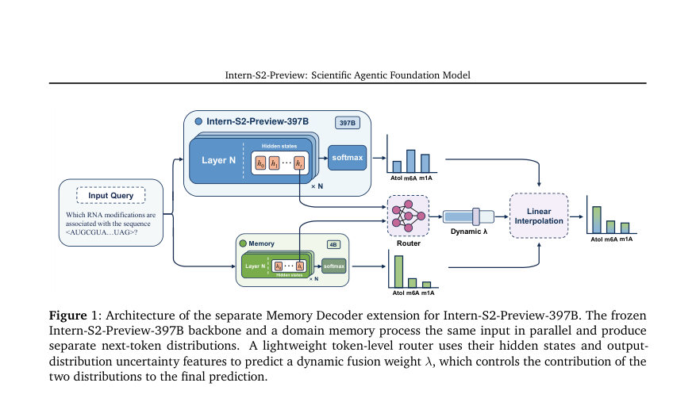
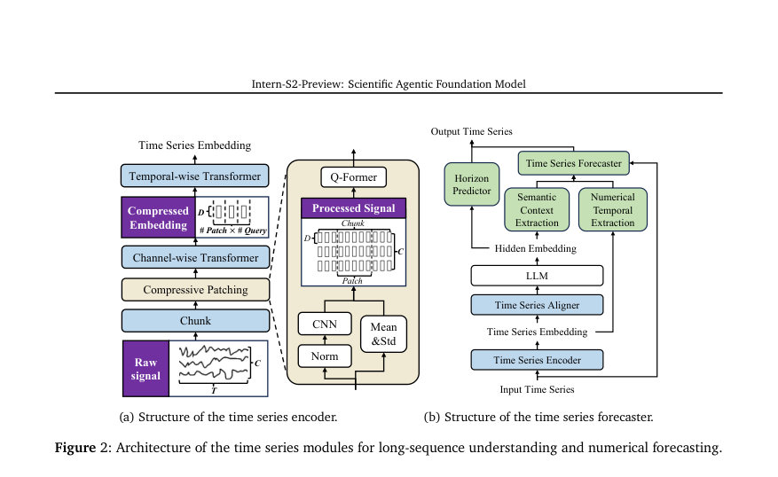
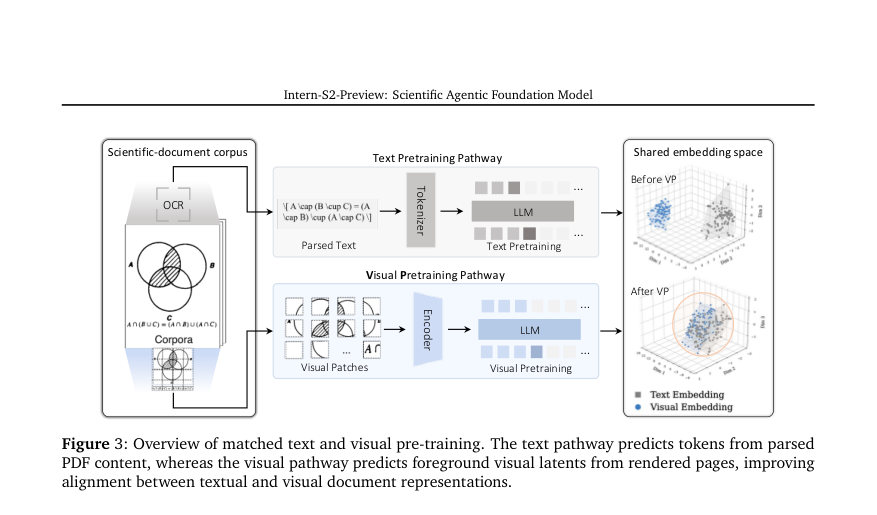

# Intern-S2-Preview: Scientific Agentic Foundation Model

- **게시일:** 2026-08-14
- **arXiv:** [2608.13505v1](http://arxiv.org/abs/2608.13505v1) · [PDF](https://arxiv.org/pdf/2608.13505v1)
- **저자:** Lei Bai, Jiaqi Cao, Chiyu Chen, Guanzhou Chen, Kai Chen, Guangran Cheng, Erfei Cui, Xuanlang Dai, Shengyuan Ding, Shangheng Du, Yanhui Duan, Yue Fan, Youqing Fang, Quan Gan, Yuanyuan Gao, Jiaye Ge, Lixin Gu, Yuzhe Gu, Qipeng Guo, Junjun He, Xin Hong, Ming Hu, Zhouqi Hua, Haian Huang, Junhao Huang, Zixian Huang, Minxi Jin, Lingkai Kong, Alexander Lam, Zehao Li, Zonglin Li, Tianhao Liang, Dahua Lin, Junyao Lin, Tianyang Lin, Zhouhan Lin, Jiangning Liu, Jin Liu, Kuikun Liu, Wenran Liu, Yifei Liu, Yuhong Liu, Yuhong Liu, Zhoumianze Liu, Ziyan Liu, Ziyu Liu, Haijun Lv, Han Lv, Chengqi Lyu, Le Ma, Ningsheng Ma, Zerun Ma, Haoyang Peng, Runyu Peng, Jifei Shan, Zixin Shang, Kou Shi, Xiang Shi, Qisheng Su, Xuerui Su, Hao Sun, Xiao Sun, Yanan Sun, Yu Sun, Huanze Tang, Yinghao Tang, Wenhui Tian, Zhongbo Tian, Bingli Wang, Haomin Wang, Jiarui Wang, Jingzhi Wang, Rui Wang, Xiquan Wang, Yi Wang, Zhecan Wang, Ziyi Wang, Zun Wang, Rubin Wei, Lianyi Wu, Wen Wu, Yue Wu, Yuhan Wu, Zhenyu Wu, Zijian Wu, Shuhao Xing, Jun Xu, Xingle Xu, Xuenan Xu, Xiangchao Yan, Ziang Yan, Bowen Yang, Danni Yang, Lin Yang, Zhiqi Yang, Qian Yao, Haochen Ye, Peng Ye, Jinhui Yin, Jiashuo Yu, Dingbo Yuan, Fei Yuan, Yuhang Zang, Bo Zhang, Chao Zhang, Chen Zhang, Hongjie Zhang, Junming Zhang, Wenlong Zhang, Wenwei Zhang, Yiming Zhang, Zhuo Zhang, Ziyang Zhang, Haiteng Zhao, Penghao Zhao, Yibo Zhao, Zhonghan Zhao, Zhihang Zhong, Bowen Zhou, Peiheng Zhou, Xin Zhou, Xinyu Zhou, Yunhua Zhou, Dongsheng Zhu, Yicheng Zou
- **분야:** cs.LG, cs.CL, cs.CV
- **선정 점수:** 6.79
- **선정 이유:** 최근성 0.8, 인용 영향 0.0 (인용 0회), 저자 영향 2.0 (최고 h-index 37), AI 주제 적합성 2.7, 개발자 관심 0.5, 학술 신호 0.3, 오픈 웨이트·주요 연구조직 신호 0.6

[← 2026-08-14 목록으로 돌아가기](../daily/2026-08-14.html)

<!-- paper-visuals:start -->
## 주요 Figure

> 원문 PDF에서 실제 Figure 캡션과 그림 영역이 함께 확인된 자료만 자동 추출했다.

*Figure · 원문 PDF 3쪽 · Figure 1: Architecture of the separate Memory Decoder extension for Intern-S2-Preview-397B. The frozen*

*Figure · 원문 PDF 4쪽 · Figure 2: Architecture of the time series modules for long-sequence understanding and numerical forecasting.*

*Figure · 원문 PDF 5쪽 · Figure 3: Overview of matched text and visual pre-training. The text pathway predicts tokens from parsed*

<!-- paper-visuals:end -->

## 한 문장 요약

과학적 멀티모달 입력과 장기 도구 상호작용을 다루기 위해 대규모 과학적 에이전트형 파운데이션 모델(Intern-S2-Preview-397B)을 설계·학습하고, 시간열 예측 모듈과 분리형 메모리 디코더를 통해 과학적 이해·추론·생성·장기 에이전트 태스크 성능을 향상시키는 파이프라인을 제시한다.

## 해결하려는 문제

기존 일반 목적 LLM과 과학적 멀티모달 모델은 (1) 문서의 레이아웃·도표·표·수치 등 이질적 과학 증거를 종합적으로 이해·추론하지 못하고, (2) 장기 작업 지평(long-horizon)에서 도구 사용·반복적 상호작용을 통해 문제를 점진적으로 해결하는 에이전트적 워크플로를 충분히 지원하지 못하며, (3) 새로운 세부 도메인으로 빠르게 특화할 때 백본 모델을 재학습하면 일반성·에이전트 성능을 해칠 위험이 있어 효율적이고 안정적인 학습·운영 파이프라인이 필요하다는 한계가 있다. 본 논문은 이러한 한계를 해결하는 것이 목표이다.

## 핵심 기여

- 학습 파이프라인: 렌더된 과학 문서 기반의 시각적 사전학습(VP), PDF에서 레이아웃-인식된 interleaved 이미지-텍스트 데이터, 대규모 이미지 검색을 포함한 과학 멀티모달 사전학습과, 그 위에서 대규모 SFT → 스케일러블 다중태스크 RL → 블랙/화이트박스 에이전틱 RL → 온폴리시 증류로 이어지는 일관된 포스트트레이닝 파이프라인을 제안하고 구현함.
- 아키텍처 확장: (a) 장기 숫자 신호 이해에서 예측까지 가능한 시간열 모듈(인코더 업그레이드 및 전용 수치 예측 분기)을 통합하여 과학적 시계열 이해·예측을 지원함, (b) 397B 고정 백본을 유지한 채 도메인별 parametric Memory Decoder(예: 4B)를 병렬로 붙여 빠른 도메인 특화를 가능하게 하는 분리형 메모리 경로를 제안함.
- 시스템 기술: 장기 롤아웃과 이종 태스크 혼합의 안정성과 효율을 높이기 위한 실용 기술들을 제시 — 공병(部分) 롤아웃과 오프폴리시 보정(토큰별 행위 정책 기록 및 클리핑), Rollout Routing Replay(R3)로 MoE 라우팅 정렬, BKL 기반 토큰 마스킹, 적응적 길이 정규화(Adaptive Length Regularization), 온라인 초안(드래프트) 학습을 동반한 투기적 디코딩(speculative decoding), GEPO 등.
- 실험·공개 결과 및 모듈성: Intern-S2-Preview-397B가 과학·멀티모달·에이전틱·일반 벤치마크에서 경쟁력 있는 성능을 보였음을 보고하고, Memory Decoder(Intern-MemDec-4B) 부착으로 Biology-Instructions 평균 점수가 56.92에서 60.32로 상승했음을 본문에서 제시함.

## 접근 방법

* 아키텍처: 기본 모델은 Intern-S2-Preview-397B(백본)는 고정(frozen) 상태로 유지하면서 두 축의 확장을 적용한다.
* 첫째 축은 시간열(time series) 모듈로, 입력 신호를 시간적 청크로 분할하고 compressive patching(CNN+Q-Former)과 채널-단위 Transformer를 통해 다중 채널·초장기 시계열을 압축·표상한 뒤, LLM의 문맥과 결합하는 전용 수치 예측(forecaster) 분기를 추가하여 미래값을 연속 수치로 생성한다.
* 둘째 축은 Memory Decoder로, 별도 파라메트릭 메모리(예: 4B)를 백본과 병렬로 구동하여 각각의 next-token 분포를 생성하고, 경량 토큰-레벨 라우터가 양쪽의 히든 스테이트 및 불확실성 특성으로 동적 가중치 λ를 예측해 두 분포를 선형 보간하여 최종 분포를 생성한다.
* 학습 및 파이프라인: 사전학습 단계에서 Visual Pre-training(VP)은 렌더된 페이지에서 시각적 잠재(latent)를 예측하는 대조적 목표(ℒVP)를 수행하고, MinerU2.5-Pro 기반 OCR·레이아웃 파싱을 통해 페이지별 interleaved 시퀀스를 구성하며 visual-gain(텍스트만 PPL 대비 이미지 포함 PPL 감소)으로 시각적으로 유의미한 페이지만 선별한다.
* 이미지 품질 향상을 위해 대규모 이미지 임베딩 DB(Milvus 샤드)를 구축하고 텍스트↔이미지, 이미지↔이미지 검색 및 재순위를 수행한다.
* 포스트트레이닝은 (1) 고품질 멀티모달 SFT로 제어 가능한 응답·도구 사용 패턴 초기화, (2) 스케일러블 다중태스크 RL(부분 롤아웃+오프폴리시 보정, 클리핑된 중요도비·토큰 마스크 등), (3) 블랙·화이트박스 에이전트 RL(허니스×태스크 추상화로 다양한 에이전트 런타임과 실행가능 태스크 분리)으로 전문 정책을 학습, (4) 온폴리시 다중-교사 증류로 통합 모델을 만드는 순서를 따른다.
* 시스템/수치적 정합성: 부분 롤아웃 구현은 LMDeploy(추론)와 XTuner(학습)을 공존시키며, 롤아웃을 일시중지·재개하여 계산 낭비를 줄이고, 토큰별 행동 정책 버전 및 로그확률을 기록해 중요도비 ρ를 계산하고 클리핑하여 REINFORCE 계열 목적에 넣는다.
* MoE 불일치 문제는 R3로 해결하고, 수치적 아웃라이어는 양방향 BKL로 마스킹한다.
* 투기적 디코딩용 드래프트 모델은 온라인으로 현재 정책의 분포를 따라가며 LK 하이브리드 손실(전향 KL 및 TV 혼합)을 사용해 Acceptance rate을 최적화한다.

## 주요 결과

- Memory Decoder(Intern-MemDec-4B) 부착 실험에서 Biology-Instructions 평균 점수가 56.92 → 60.32로 향상되었다(본문 명시).
- 시간열 인코더 업그레이드로 최대 지원 입력 길이가 약 240,000 타임스텝에서 300,000 타임스텝으로 증가했으며, 최대 길이에서 기존 버전 대비 약 5∼6× 빠른 추론과 GPU 메모리 소비를 약 20% 수준으로 감소시켰다고 보고됨(본문 명시).
- 사전학습·포스트트레이닝 통합 평가에서 Intern-S2-Preview-397B가 과학, 멀티모달, 에이전틱 및 일반 목적 벤치마크들에서 경쟁력 또는 선도적 결과를 보였다고 본문에서 기술하고 있으나, 논문 본문에 수록된 구체적 벤치마크별 표나 추가 정량값은 PDF 본문 중 일부에서 요약 서술 형식으로 제시되어 있어 본 분석에서는 명시적 수치로 재현 가능한 것은 위의 항목들뿐임.

## 한계

- (저자 명시) Memory Decoder는 본체의 구성요소가 아니라 별도의 확장 모델로 파라메트릭 메모리를 통해 도메인 지식을 붙이는 방식이며, ‘백본을 직접 미세조정하지 않음’이 설계 의도이다 — 이는 장단점(백본 보존 vs. 확장성 한계)을 저자 스스로 인정함.
- (저자/본문 기반) 단일 고정 후행 체크포인트로 모든 세부 과학 분야·프로토콜을 완전히 커버할 수 없다고 명시함(따라서 분리형 메모리 경로를 채택).
- (분석으로 합리적 확인되는 제약) 실험적 적용 범위의 편향: pretraining/interleaved 데이터·visual-gain 필터링 파이프라인은 life science, chemistry, materials science에 중점한다고 본문에서 밝히며, 따라서 다른 과학 분야로의 일반화·검증은 제한적일 수 있음(논문에선 일부 벤치마크와 분야에 대해만 상세 평가).
- (분석으로 합리적 확인되는 제약) 포스트트레이닝의 복잡성·인프라 요구: 부분 롤아웃·R3·온라인 드래프트 학습·혼합 정밀도(FP8/BF16/FP32) 정합 등 재현하려면 고도화된 분산 추론·학습 스택(LMDeploy, XTuner, Milvus 등)과 상당한 계산자원이 필요하므로 자원 제약 환경에서의 재현성이 떨어질 가능성이 있음.

## 개발자 관점

- 재현 요소들: 논문은 XTuner와 LMDeploy를 이용한 '공존'형 부분 롤아웃(일시중지·재개) 설계, 토큰별 행동-정책 버전·로그확률 기록, 중요도 비 클리핑(clip(ρ,1−εlow,1+εhigh)), R3를 통한 MoE 라우팅 재생, BKL 기반 토큰 마스크를 명시하므로 재현 시 이들 구성요소를 동일하게 구현·검증해야 함.
- 혼합 정밀도·라우팅 정합: MoE 및 수치 민감 연산(apply_rope, RMSNorm 등)에 대해 FP32로 처리하고 나머지는 BF16/FP8을 혼합하는 정합 설정을 맞춰야 롤아웃·학습 간 일관성을 유지할 수 있음.
- 메모리 확장 전략: 도메인 특화는 백본 재학습 대신 별도 파라메트릭 메모리(예: 4B)와 토큰-레벨 라우터로 구현하면 백본의 일반성 손상 없이 빠른 특화가 가능하므로, 도메인마다 메모리 모듈을 따로 관리하는 운영·배포 전략을 권장함.
- 투기적 디코딩 운영: RL 롤아웃 가속을 위해 드래프트 모델을 온라인으로 업데이트하고 LK 하이브리드 손실을 사용하면 드래프트가 정책 변화에 적응하므로 acceptance rate을 모니터링하면서 드래프트 업데이트 빈도와 K(초안 길이)를 튜닝해야 함.
- 데이터·검증 파이프라인: interleaved PDF 구성(레이아웃 파싱→시각 단위 크롭→visual-gain 필터링→문서 수준 조합)과 이미지 리트리벌(샤딩된 Milvus, 8B 임베더, 재순위기)을 그대로 재현하려면 광범위한 문서 파이프라인과 품질 재검증(사람 검토 임계치)이 필수임 — 데이터 수집·정제 비용을 설계 초기부터 고려할 것. 또한 에이전트적 도구 사용을 다루므로 검증 가능한 외부 실행기(verifier) 및 안전 제약을 시스템 수준에서 설계해야 함.

**근거 범위:** 이 분석은 제공된 논문 PDF 본문(사전학습·아키텍처·포스트트레이닝·시스템 기술·결과 요약 섹션)을 바탕으로 작성되었음. 본문에 명시된 정량적 수치(예: Biology-Instructions 56.92→60.32, 시간열 길이 240k→300k, 5∼6× 추론 속도, GPU 메모리 약 20%, pretraining chunk ≤256K 토큰·512 토큰 overlap 등)는 PDF에서 직접 확인한 값이다. 반면 벤치마크별 상세 표·모든 정량적 비교(세부 태스크별 점수, 표준편차, 평가 집합 크기 등)는 본문 요약·서술로만 제공되거나 PDF 추출 범위에서 세부 표가 포함되지 않아 본 분석에서는 재구성하지 않았음.
