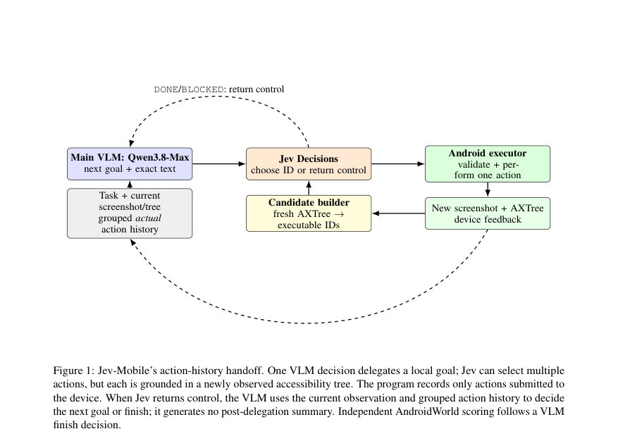

# Jev-Mobile: Jev as an Executor for Mobile GUI Agents

- **게시일:** 2026-09-27
- **arXiv:** [2609.30186v1](http://arxiv.org/abs/2609.30186v1) · [PDF](https://arxiv.org/pdf/2609.30186v1)
- **저자:** Linghua Zhang
- **분야:** cs.AI, cs.SE
- **선정 점수:** 5.63
- **선정 이유:** 최근성 0.5, 인용 영향 0.0 (인용 0회), 저자 영향 0.8 (최고 h-index 2), AI 주제 적합성 3.0, 개발자 관심 0.8, 학술 신호 0.6, 오픈 웨이트·주요 연구조직 신호 0.0

[← 2026-09-27 목록으로 돌아가기](../daily/2026-09-27.html)

<!-- paper-visuals:start -->
## 주요 Figure

> 원문 PDF에서 실제 Figure 캡션과 그림 영역이 함께 확인된 자료만 자동 추출했다.

*Figure · 원문 PDF 3쪽 · Figure 1: Jev-Mobile’s action-history handoff. One VLM decision delegates a local goal; Jev can select multiple*

<!-- paper-visuals:end -->

## 한 문장 요약

저빈도 VLM 계획으로 지역 목표와 정확한 입력 텍스트를 제시하고, 접근성 트리로 생성한 실행 가능한 후보들 사이에서 빠른 타입화된 결정 모델 Jev가 반복적으로 액션을 선택해 여러 GUI 액션을 한 번의 VLM 결정 아래 수행함으로써 VLM 호출을 줄이고 실행 효율을 높이는 모바일 GUI 에이전트 설계 및 평가.

## 해결하려는 문제

기존 모바일 GUI 에이전트들은 대부분 VLM을 매 상호작용 단계에서 계획과 행동 그라운딩에 모두 사용해 높은 지연(latency)과 모델 서빙 비용을 초래한다. 본문은 VLM의 고빈도 사용 없이 VLM이 저빈도로 지역 목표(local goal)를 지정하면, 그 후속의 고빈도 행동 선택을 별도 경량 결정기(typed decision model)로 처리해 비용과 지연을 낮출 수 있는지를 묻는다. 추가적으로 스크린샷에 보이는 대상이 접근성 트리에 없을 수 있고, 트리는 필드 상태를 노출할 수 있어 언제 로컬 컨트롤을 VLM에 반환해야 하는지 등의 설계·성능 문제(커버리지와 핸드오프)를 다룬다.

## 핵심 기여

- VLM–Jev 루프를 구현하고, 관찰 바운드(각 액션은 최신 접근성 트리에서 파생된 실행 가능한 후보에 바인딩됨)된 Android 후보 집합을 사용하며, 위임 후 모델이 생성한 요약을 포함하지 않는 핸드오프 모드를 제시함.
- 타입화된 결정 모델(Jev)을 실행기로 사용하는 설계의 효과를 전체 AndroidWorld 태스크 스위트에서 평가해 성능(성공률)과 실행 효율(실행 시간 및 모델 API 비용)을 비교·분석함.

## 접근 방법

* 아키텍처 및 절차: (1) VLM(일반 VLM 역할에 Qwen3.8-Max 사용)은 현재 태스크 지시문 u, 현재 스크린샷 및 접근성 트리, 그리고 그룹화된 실제 제출 액션 히스토리를 읽고 위임 결정 dk∈{delegate, finish, blocked}, 지역 목표 gk, 선택적 정확한 입력 텍스트 vk를 반환한다.
* VLM은 위임 후 포스트-위임 요약을 생성하지 않는다.
* (2) 프로그램은 현재 원시 접근성 트리 Tt와 관찰 가능한 디바이스 컨텍스트 zt, 그리고 vk로부터 결정론적 후보 집합 Ct=f(Tt,zt,vk)를 생성한다.
* 후보는 보이고(enabled), 유효한 바운드를 가진 노드들로부터 클릭/롱프레스/스크롤/포커스 등 실행 가능한 액션으로 생성되며, Back/Home/Enter/Open app 같은 시스템 액션도 상태에 따라 추가된다.
* 비가시/비활성/유효 바운드가 없는 노드는 후보를 생성하지 않는다.
* (3) Jev(타입화된 결정 모델)는 텍스트 트리, 현재 지역 목표 gk, 위임 내 이전 실제 액션 히스토리, 후보 설명을 입력으로 받아 한 선택의 출력(특정 후보 ID 또는 DONE/BLOCKED)을 반환한다.
* 어댑터는 타입과 ID 유효성을 검증하고, 선택된 후보는 실제 디바이스에 제출되기 전 최신 관찰과 다시 확인된다.
* 각 액션 수행 후에는 재관찰을 통해 Ct+1을 재생성하고 오래된 ID/좌표는 무효화한다.
* (4) 실패·예산·경계: 벽시간, 액션 수, 호출 수, 대기, 재시도 등이 에피소드 예산을 공유하며, 시각적 대상으로 접근성 트리에 후보가 없을 때 좌표 생성 등 비주얼 폴백은 이 첫 버전에서 제공되지 않는다.
* 로깅: 제출된 각 스텝은 선택된 ID, 실제 파라미터, 실행 상태, 이전/이후 관찰 ID, 결정론적 변경 설명을 기록한다.
* 실험에서 비교 시스템: Step-wise VLM(매 스텝 VLM로 액션 선택), SeeAct-V(같은 일반 VLM + UI-TARS-1.5-7B 시각 그라운더), Jev-Mobile(일반 VLM이 지역 목표/텍스트를 주면 Jev가 접근성 트리 후보들 사이에서 액션을 선택).

## 주요 결과

- 데이터셋 및 비교 기준: 전체 AndroidWorld 태스크 스위트(독립적 터미널 평가기 사용). 비교 대상 시스템은 Step-wise VLM, SeeAct-V(UGround 대신 UI-TARS-1.5-7B 사용을 실험 설계상 공개), Jev-Mobile. 성공률은 AndroidWorld 평가자의 최종 상태로 측정.
- Full-task success rate: Step-wise VLM 0.84, SeeAct-V 0.78, Jev-Mobile 0.79 (표 1).
- 성공 경로에 대한 평균 전체 시간(초): Step-wise VLM 197.21s, SeeAct-V 162.63s, Jev-Mobile 132.67s. Jev-Mobile은 SeeAct-V 대비 18.4% 낮고 Step-wise VLM 대비 32.7% 낮음(논문 명시).
- 실행기(executor) 시간(평균, 초): Step-wise VLM 94.30s, SeeAct-V 12.37s, Jev-Mobile 5.16s — Jev-Mobile은 Step-wise VLM 대비 실행기 시간에서 94.5% 감소(논문 명시).
- 실행기(Executor) 비용(성공한 궤적 합계, USD): Step-wise VLM 0.694774, SeeAct-V 0.030579, Jev-Mobile 0.013091(코호트 합계). 평균 모델 API 비용(성공당, USD): Step-wise VLM 0.273694, SeeAct-V 0.193207, Jev-Mobile 0.072744 — Jev-Mobile은 Step-wise VLM 대비 평균 모델 API 비용에서 73.4% 절감(논문 명시).

## 한계

- 저자가 밝힌 한계: Jev-Mobile 평가는 AndroidWorld 모바일 태스크에만 국한되어 웹 인터페이스 등 다른 환경에는 검증되지 않음; Jev 대신 작은 VLM을 넣은 비교 실험을 수행하지 않아 관찰된 이득이 타입화된 결정 모델 자체의 효과인지 위임된 워크플로우의 일반적 이득인지 구분되지 않음; 접근성 트리에 시각적으로 보이는 대상이 없으면 현재 컨트롤러는 이를 실행 가능한 후보로 전환할 수 없음(좌표 생성 비지원); 현재 입력 경로는 출력 가능한 ASCII 문자만 지원함; 긴 액션 히스토리는 압축(compaction)이 필요할 수 있음.
- 실험·방법에서 드러나는 제약(본문에서 합리적으로 확인된 한계): Jev-Mobile의 성공률은 Step-wise VLM(0.84)에 비해 0.05 낮음(0.79)으로 절충이 존재함; 후보 생성은 원시 트리의 결정론적 파싱에 의존하므로 트리 노이즈/누락, 플래그 누락(예: 클릭 가능 플래그 없음) 등으로 인해 커버리지 실패가 발생할 수 있음(본문에서 후보-커버리지 실패로 명시); SeeAct-V 비교에서는 원래 발표된 UGround 대신 UI-TARS-1.5-7B를 사용했으므로 SeeAct-V 결과는 원 논문 구성과 정확히 동일하지 않음(본문 공개); 구현 세부(예: Jev의 학습·하이퍼파라미터, 네트워크 구성, 정확한 API 지연 측정 절차)는 본문에 제공되지 않아 재현 시 추가 정보가 필요함.

## 개발자 관점

- 구현: 접근성 트리(raw AXTree)에서 실행 가능한 후보를 결정론적으로 생성하는 후보 빌더가 핵심이며, 각 후보는 단일 ID로 바인딩되고 액션 전 재검증(re-observation)으로 ID 불일치를 방지해야 함.
- 핸드오프 설계: VLM은 지역 목표와 정확한 텍스트(vk)만 제공하고 포스트-위임 요약을 생성하지 않으므로, 엔드포인트 평가는 독립적(AndroidWorld)으로 유지해야 하며 위임 시 제출된 실제 액션 히스토리만 그룹화해 전달해야 함.
- 운영·배포: 저빈도 VLM 호출 + 경량 Jev 실행으로 모델 API 비용과 전체 온라인 대기 시간을 크게 줄일 수 있으나, 접근성 트리가 불완전한 실제 환경(예: 시각적만 존재하고 트리에 없는 요소)에 대한 폴백(좌표 생성 등)을 준비해야 함.
- 재현성·로깅: 각 제출 스텝의 선택 ID, 실행 파라미터, 실행 상태, before/after 관찰 ID, 결정론적 변경 설명을 상세히 기록하면 핸드오프 문제와 BLOCKED 원인을 진단하기 쉬움. 긴 히스토리 저장은 압축 로직(목표·스텝 수·핸드오프 이유로 대체) 필요.
- 비용·성능 트레이드오프: Jev-Mobile은 Step-wise VLM 대비 약 32.7% 전체 시간 절감, 실행 모델 시간과 API 비용에서 대폭 이점(94.5% 실행기 시간 감소, 73.4% 모델 비용 감소)을 보였으나 전체 성공률은 소폭 감소하므로 비용 민감한 배포 환경에서 유리함. 성능 우선 환경이라면 step-wise 방식을 고려해야 함.

**근거 범위:** 논문 PDF 본문 기반 분석입니다(제공된 PDF 본문 페이지 1–8 전부를 근거로 작성). 수치 및 문구는 본문 표(표 1), 본문 설명(섹션 3·5·6·7·8)에서 직접 추출했습니다. 논문에 명시되지 않은 내부 구현 세부(예: Jev의 학습/아키텍처 상세, API 지연 측정 방법)는 본문에 없어 추정하지 않았습니다. SeeAct-V 실험은 본문에서 UI-TARS-1.5-7B로의 대체를 명시하고 있어 원래 구성과의 차이를 반영했습니다.
