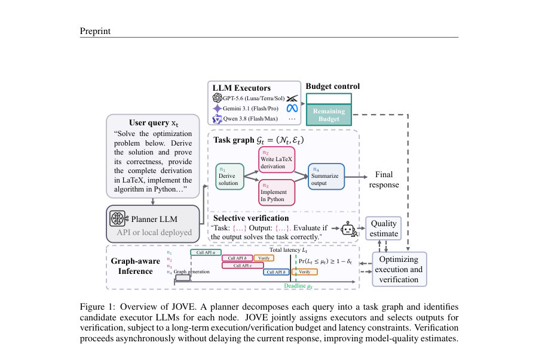
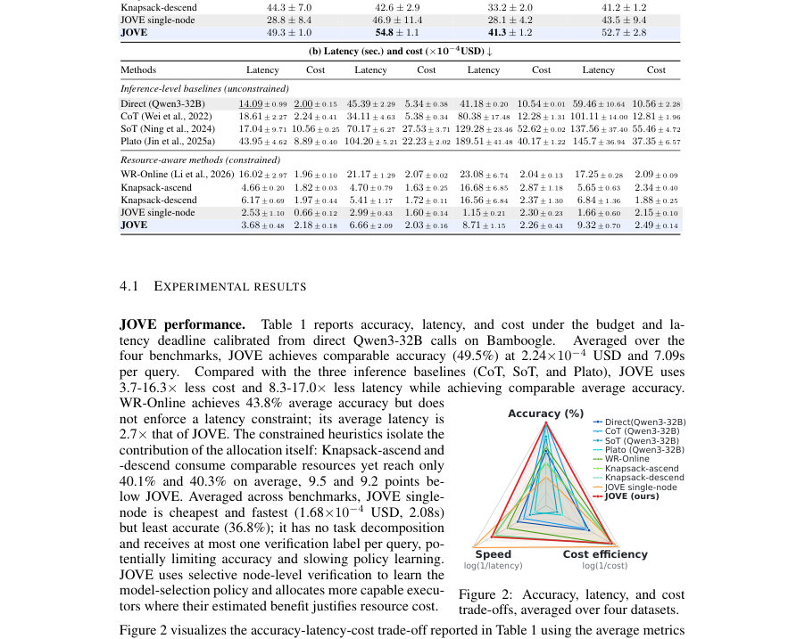
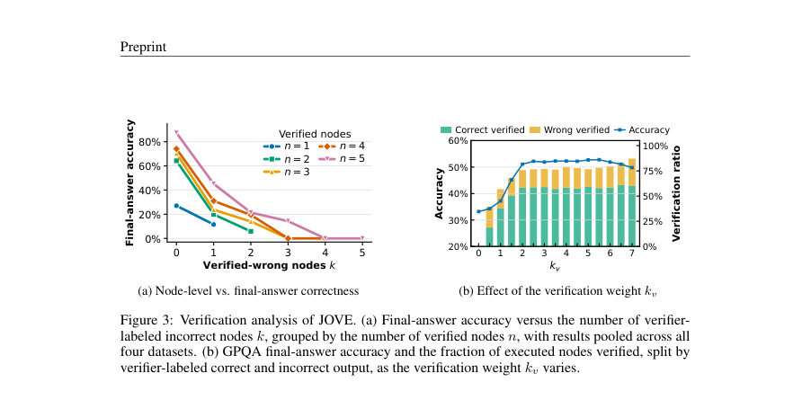

# JOVE: Joint Execution and Verification for Resource-Aware LLM Task Graphs

- **게시일:** 2026-10-05
- **arXiv:** [2610.03296v1](http://arxiv.org/abs/2610.03296v1) · [PDF](https://arxiv.org/pdf/2610.03296v1)
- **저자:** Haoran Zhang, Dongjun Kim, Seohyeon Cha, Kevin S Chan, Ananthram Swami, Gustavo De Veciana, Haris Vikalo
- **분야:** cs.AI, cs.LG
- **선정 점수:** 4.29
- **선정 이유:** 최근성 0.4, 인용 영향 0.0 (인용 0회), 저자 영향 0.0 (최고 h-index 0), AI 주제 적합성 3.0, 개발자 관심 0.6, 학술 신호 0.3, 오픈 웨이트·주요 연구조직 신호 0.0

[← 2026-10-05 목록으로 돌아가기](../daily/2026-10-05.html)

<!-- paper-visuals:start -->
## 주요 Figure

> 원문 PDF에서 실제 Figure 캡션과 그림 영역이 함께 확인된 자료만 자동 추출했다.

*Figure · 원문 PDF 2쪽 · Figure 1: Overview of JOVE. A planner decomposes each query into a task graph and identifies*

*Figure · 원문 PDF 8쪽 · Figure 2: Accuracy, latency, and cost*

*Figure · 원문 PDF 9쪽 · Figure 3: Verification analysis of JOVE. (a) Final-answer accuracy versus the number of verifier-*

<!-- paper-visuals:end -->

## 한 문장 요약

JOVE는 DAG로 분할된 복잡한 추론 쿼리에서 각 노드에 실행할 LLM과 어떤 중간 출력을 유료로 검증할지 온라인으로 jointly 최적화하여 예산과 지연 제약 하에서 비용과 응답시간을 줄이는 프레임워크이다.

## 해결하려는 문제

복잡한 추론 문제를 DAG(작업 그래프)로 분해해 서로 다른 크기·비용의 LLM들에 병렬로 분배하면 지연과 비용을 줄일 수 있지만, (1) 어떤 LLM이 특정 서브태스크에 적합한지는 사전에 알려지지 않고, (2) 실행 결과만으로 정답 여부를 알기 어렵다. 또한 검증(인간 심사자나 평가자 모델)은 비용이 들고 비동기적으로 진행될 수 있어서 현재 쿼리 성능(지금 쓰는 비용)과 미래에 대한 학습(검증을 통해 얻는 정보)을 균형 있게 결정해야 한다. 기존 라우팅·그래프-인식 기법들은 대개 품질 피드백을 무료로 가정하거나 오프라인 데이터를 필요로 했고, 노드 수준의 선별적 유료 검증을 포함한 온라인 자원 제약 하의 공동 최적화 문제는 다루지 않았다.

## 핵심 기여

- 작업 그래프 상에서 실행자(LLM) 선택과 중간 출력을 검증할지를 온라인으로 공동 최적화하는 수학적 문제(장기 평균 API 비용 예산과 쿼리별 지연 확률 제약을 포함)로 공식화함.
- 각 쿼리마다 풀 수 있는 혼합 정수선형계획(MILP) 기반의 per-query 최적화 정책 JOVE를 제안하고, 온라인으로 모델 품질을 추정(LinUCB/릿지 회귀, 임베딩 특징 사용)하며 검증의 정보 이득을 보너스로 반영하는 설계를 제시함.
- 예산 제어를 위해 동적 라그랑주 승수(λ) 업데이트 규칙을 도입하여 장기 평균 API 비용 제약을 관리하고, 노드 수준의 지연 분포 양자치(quantile)를 이용해 쿼리별 지연 확률 제약을 선형 제약으로 환원함.
- 검증-정보 보너스(kv)에 대해 충분한 조건 하에서 품질 학습의 서브선형 후회(sublinear regret)를 보이는 이론적 결과를 제시(가정: 선형 품질 모델, 서브가우시안 노이즈 등).
- 실험적으로 Bamboogle, MMLU-Pro, GPQA, LiveBench-Reasoning의 4개 벤치마크에서 표준(비제약) 추론 기준선들과 비교해 유사한 정확도를 유지하면서 평균 비용·지연을 크게 줄임(논문 본문에서 3.7–16.3× 비용 절감, 8.3–17.0× 지연 단축 등 보고).

## 접근 방법

* 입력 쿼리는 플래너 LLM이 DAG Gt로 분해하고 각 노드 i에 후보 실행자 집합 Ai_t를 제공한다.
* JOVE 정책은 각 노드에 대해 실행자 ai_t와 검증 여부 hi_t∈{0,1}을 선택한다.
* (1) 목적은 장기적으로 노드 정답률의 평균을 최대화하면서 장기 평균 API 비용 γ 이하, 쿼리별 지연 제한 µt(위반 허용도 δt) 를 만족시키는 것이다.
* (2) 각 쿼리에서 JOVE는 알려진 통계(oracle)일 때의 MILP(할당 변수 zi_t(a,η), 노드 종료시간 F_i 등을 포함)를 유도하고, 실제 온라인에서는 미지인 기대 정답률 ¯y, 비용 ¯c, 지연 양자치 ¯d를 추정치로 대체한다.
* (3) 품질 추정은 각 (태스크,모델) 쌍의 특징 벡터 ϕ(=Sentence-Transformers all-MiniLM-L6-v2, 384d)를 사용한 릿지 회귀와 LinUCB 방식으로 이루어지며 UCBi_t(a)=clip(ϕ⊤ˆθ + β u)로 상한신뢰구간을 계산한다.
* (4) 검증의 정보 이득은 D-optimal 기준 Ii_t(a)=0.5 log det(G+ )/det(G)로 정량화하고, MILP 목적에 kv·Ii_t(a)/\|Nt\| 형태의 보너스를 더해 검증의 장기적 가치를 반영한다.
* (5) 예산은 λt을 동적 업데이트(λ_{t+1} = [λ_t + α_λ (c_t − γ)]+)하여 per-query MILP 목적에 비용 항 −λt·ĉ 사용으로 반영한다.
* (6) 지연 제약은 노드별 확률적 지연의 (1−δ_i)-양자치를 계산하고(현실적으론 유사도 가중 경험치 기반 추정), 유니온 바운드를 써서 경로 합의 확정적 상한으로 변환한 뒤 선형 제약(종속성에 따른 F_j + v_i ≤F_i 등)으로 MILP에 넣는다.
* (7) 검증은 비동기로 수행되어 현재 응답을 지연시키지 않지만 그 비용은 예산에 포함된다.
* 구현 세부: 플래너는 Gemini-2.5-Flash-Lite, 검증자(참고자)는 Qwen3-235B, 실행자 풀은 OpenRouter를 통해 여러 모델을 사용했고 리소스 추정은 특징 유사도를 이용한 softmax 가중 경험치로 평균 비용·지연 양자치를 추정함.

## 주요 결과

- 데이터셋: Bamboogle, MMLU-Pro, LiveBench-Reasoning, GPQA를 사용해 온라인 학습 시나리오로 평가함(실험은 세 번의 랜덤 시드에 대해 반복).
- 평균 성능(논문 본문 합산): JOVE는 네 벤치마크 평균 정확도 약 49.5%를 기록했고, 평균 쿼리당 비용 약 2.24×10^{-4} USD, 평균 응답 지연 약 7.09 s를 보고함(논문 본문 Table 1).
- 데이터셋별(논문 표 기준): 정확도(%) — Bamboogle 49.3±1.0, MMLU-Pro 54.8±1.1, LiveBench-Reasoning 41.3±1.2, GPQA 52.7±2.8. 지연(s) — Bamboogle 3.68±0.48, MMLU-Pro 6.66±2.09, LiveBench-Reasoning 8.71±1.15, GPQA 9.32±0.70. 비용(×10^{-4}USD) — 각각 2.18±0.18, 2.03±0.16, 2.26±0.43, 2.49±0.14.
- 비교 요약: 표준(비제약) 추론 기준선들(Direct/CoT/SoT/Plato)에 비해 JOVE는 평균적으로 비용 3.7–16.3× 절감, 지연 8.3–17.0× 단축을 달성하면서 유사한 정확도를 유지했다고 보고함(논문 본문 실험 결과 및 Figure 2).
- 검증 관련 관찰: 검증 가중치 kv에 대해 실험적으로 kv∈[2,6] 구간에서 성능이 안정적이며 과도한 kv는 예산을 검증에 과도하게 사용해 성능을 저하시킬 수 있음(Figure 3b).

## 한계

- 저자 명시(이론적 한계): 분석은 선형 품질 모델(¯y = ϕ⊤θ⋆), 검증 라벨의 조건부 무편향 서브가우시안 노이즈, 각 라운드에서 온라인 MILP를 최적으로 푸는 가정 등 강한 가정에 의존한다(Assumption 3.3, 3.4). 이들 가정이 현실에 부합하지 않으면 서브선형 후회 보장은 약화된다.
- 저자 명시(지연 제약 보수성): 노드별 지연 확률 제약을 유니온 바운드로 분할하여 양자치를 합하는 접근은 보수적일 수 있으며 실제로는 과도하게 제한적일 수 있다(Section 3.2과 Appendix A.2.1).
- 저자 명시(검증 신뢰성): 실험에서는 검증자로 LLM을 사용했으나 검증의 무편향성·정확성은 보장되지 않으며, 논문도 검증자 노이즈 및 노드-수준 기준과 최종 정답의 불완전한 정렬을 인정함(Section A.4.4).
- 실험적 제약(재현/범위): 실험은 특정 플래너(Gemini-2.5-Flash-Lite), 검증자(Qwen3-235B), 실행자 풀(OpenRouter)에 의존하며, 자원 추정·네트워크·API 제공자 변동이 실험 결과에 영향을 줄 수 있다. 또한 주된 온라인 시나리오에서 각 쿼리에 대해 여러 크기의 그래프(2–5 노드)를 생성·셔플해 학습 순서를 구성했으므로 다른 그래프 생성 정책에서 결과가 달라질 가능성이 있다(Appendix A.4.1).

## 개발자 관점

- 재현에 필요한 핵심 구성: (1) 플래너 LLM(그래프 생성), (2) 실행자 풀에 대한 API 접근과 per-call 비용·지연 로깅, (3) 검증자(인간 또는 평가자 모델)로부터 노드 수준의 이진 라벨, (4) 임베딩(논문은 all-MiniLM-L6-v2, 384d)과 릿지+LinUCB 모듈, (5) MILP 솔버(각 쿼리마다 풀어야 함).
- MILP 연산 비용: 각 쿼리에서 mixed-integer MILP를 풀어야 하므로 대기시간 예산을 예약해야 하고(논문은 할당 시간 dplan_t를 고려), 노드 수와 리스크 그리드 크기(K)를 키우면 변수 수가 급증하므로 실시간 배포 환경에서는 근사 해법 또는 제약 완화(예: 정수 완화·휴리스틱)가 필요할 수 있다.
- 검증 전략 실무 팁: 실험에서 kv∈[2,6] 범위가 안정적이었고 kv가 너무 크면 검증으로 예산을 소진하므로 운영에서 kv는 예산·지연 목표에 따라 튜닝할 것. 또한 검증자(사람/모델) 품질을 주기적으로 점검해야 편향된 피드백으로 인해 정책이 잘못 학습되는 것을 막을 수 있다.
- 리소스 추정 개선 여지: 논문은 특징 유사도 기반 가중 경험치(softmax cosine)로 비용·지연 양자치를 추정함. 대규모·장기 운영 환경에서는 오프라인 프로파일링이나 별도 latency/cost 예측 모델을 도입하면 초반 비용 초과·지연 미충족 문제를 완화할 수 있다(논문도 모듈 교체 가능성을 언급).
- 운영 안전성 및 비용 관리: 검증은 비동기라 응답 지연엔 영향을 주지 않지만 예산을 먹는다. 예산 초과 시 λ 업데이트 메커니즘으로 제어되나 초기 라운드에서 초과 발생 가능성이 있으므로 초기 프로파일링 단계(성능·비용 샘플링)를 권장함.

**근거 범위:** 이 분석은 제공된 논문 PDF 본문(메인 텍스트 및 부록 포함)을 기반으로 작성되었다. 본문에서 직접 확인 가능한 수치(테이블, 식, 알고리즘, 하이퍼파라미터)는 그대로 인용하였다. 다만 실행자 풀 구성, 플랫폼(인프라) 변동, 랜덤 시드 민감도 등 재현 관련 세부사항과 일부 이론적 상수의 최적성(예: kv의 최적값)은 본문에서 보수적으로 제시되어 있어 실제 운영에서는 추가 튜닝과 검증이 필요하다.
