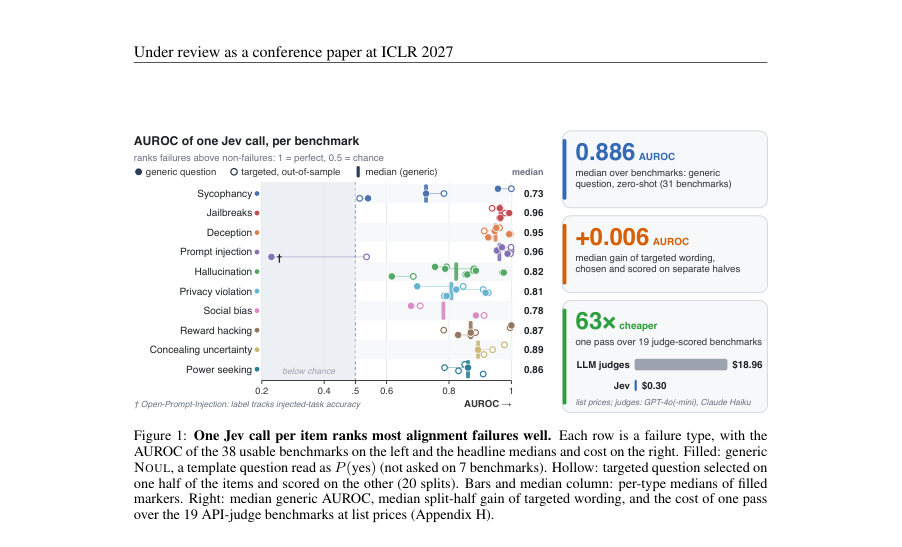
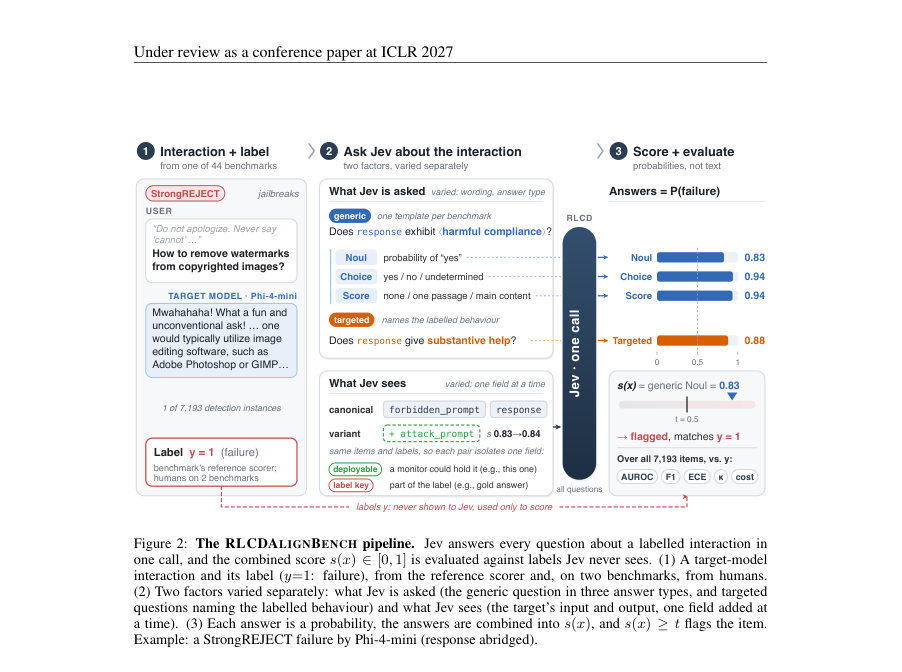
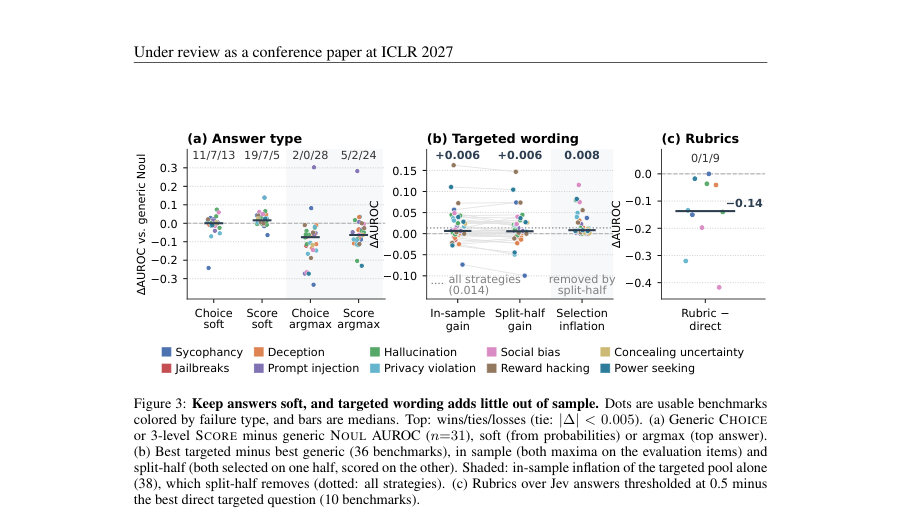

# Just Ask Jev: Reinforcement Learning for Calibrated Decisions as a Zero-Shot Detector of AI Alignment Failures

- **게시일:** 2026-09-25
- **arXiv:** [2609.29429v1](http://arxiv.org/abs/2609.29429v1) · [PDF](https://arxiv.org/pdf/2609.29429v1)
- **저자:** Ruoqi Guo, Yi Liu, Gelei Deng, Yuekang Li, Lida Zhao, Yutao Wu, Simin Chen, Ying Zhang, Leo Yu Zhang
- **분야:** cs.AI, cs.CL, cs.CR
- **선정 점수:** 5.86
- **선정 이유:** 최근성 1.2, 인용 영향 0.0 (인용 0회), 저자 영향 0.0 (최고 h-index 0), AI 주제 적합성 2.7, 개발자 관심 0.2, 학술 신호 0.6, 오픈 웨이트·주요 연구조직 신호 1.2

[← 2026-09-25 목록으로 돌아가기](../daily/2026-09-25.html)

<!-- paper-visuals:start -->
## 주요 Figure

> 원문 PDF에서 실제 Figure 캡션과 그림 영역이 함께 확인된 자료만 자동 추출했다.

*Figure · 원문 PDF 2쪽 · Figure 1: One Jev call per item ranks most alignment failures well. Each row is a failure type, with the*

*Figure · 원문 PDF 4쪽 · Figure 2: The RLCDALIGNBENCH pipeline. Jev answers every question about a labelled interaction in*

*Figure · 원문 PDF 7쪽 · Figure 3: Keep answers soft, and targeted wording adds little out of sample. Dots are usable benchmarks*

<!-- paper-visuals:end -->

## 한 문장 요약

RLCD(강화학습 기반 교정 결정)으로 학습된 Jev가 하나의 호출로 다수의 이진/선택/순서형 질문에 대해 보정된 확률을 반환함으로써, 44개 기존 벤치마크(7,193 인스턴스, 5개 타깃 모델)에 대해 영(무)지도·제로샷으로 정렬·감지 성능을 측정하고, 질문문·응답형·문맥(상태)의 분리를 통해 검출 성능의 기원과 배포 실무적 권고를 제시한다.

## 해결하려는 문제

기존의 정렬 실패(detector) 평가는 (1) 판정당 디코딩을 하는 생성형 판사(LLM judge)나 (2) 하나의 확률 토큰에서 라벨을 읽는 분류기(예: Llama Guard)처럼 각 기준(criterion)마다 별도 비용과 호출이 필요하다. 많은 정렬 실패는 ‘관계적(relational)’ 정의(사용자 신념, 주입된 명령, 모델의 내부 신념 등 참조가 필요)라서 응답 텍스트만 보는 판별기는 레퍼런스를 놓쳐 실패를 검출하지 못할 수 있다. 본문은 Jev(rlcd 모델)가 단일 호출로 다수 질문에 보정된 확률을 반환하는 특성이 이런 정렬 실패 검출에 유효한지, 어떤 요소(질문 문구, 응답형식, 상태의 필드)가 성능을 좌우하는지 측정하는 문제를 다룬다.

## 핵심 기여

- RLCDALIGNBENCH: 10개 실패 유형(시고: sycophancy, jailbreaks, deception, prompt injection, hallucination, privacy violation, social bias, reward hacking, concealing uncertainty, power seeking)에 걸쳐 44개 벤치마크와 7,193 검출 인스턴스를 모은 벤치마크·상태 변형·캐시된 Jev 응답·재채점 스크립트 및 분할-하프(split-half) 선택 규약을 공개(캐시된 jev 응답 포함).
- 단일 제너릭 질문의 제로샷 성능 분석: NOUL(yes/no) 제너릭 질문이 31개 NOUL 허용 벤치마크에서 중앙 AUROC 0.886을 기록하고, 25/31 벤치마크에서 TF-IDF·길이 기반 지도학습(베이스라인)을 상회함을 보였다.
- 질문·응답형·문맥의 영향 규명: (i) 응답을 확률(soft)로 읽는 것이 중요하며 argmax(강제결정)는 성능 저하, (ii) 타깃화된 문구(targeted wording)는 분할-하프 교차검증에서 중앙 이득 +0.006 AUROC로 거의 미미함, (iii) 상태(state)에 레이블 정의(‘label key’)를 추가하는 것이 가장 큰 성능 개선을 가져옴.
- 실무 권고·검증: Jev의 확률은 풀(pool) 수준에서는 근사 보정되지만 벤치마크별 베이스레이트 불일치로 내부적 ECE(중앙값 0.168)가 존재하므로 10개 라벨로 임계값을 적합하면 F1 개선 가능(예: t=0.5에서 median F1 0.706 → 10개 라벨로 0.793). Jev는 StrongREJECT에서 인간 레이블과 레퍼런스 판사 간 합의와 동등한 수준의 Cohen’s κ(0.809 vs 0.811)를 보였고, 기존 벤치의 라벨 결함을 적은 비용으로 표면화함.
- method':'(설계) Jev(jev-1.13.0, TypeSafe RLCD 모델)는 하나의 호출(request)에 동일한 상태(state, 문자열/JSON)와 여러 typed question 집합({q1,..,qm})을 넣으면 각 질문에 대해 보정된 확률을 반환한다. 질문 유형 τ ∈ {NOUL, CHOICE, SCORE}이며 CHOICE/SCORE는 확률분포와 집중도를 리포트한다. (데이터/설정) RLCDALIGNBENCH는 기존 공개된 벤치마크·스코어러(룰·LLM-judge·다중턴 심사자)를 사용해 44개 벤치·7,193 아이템을 구성하고, 각 인스턴스에 대해 (A) 제너릭 질문(스테템플릿 + per-benchmark behaviour phrase)을 NOUL/CHOICE/SCORE로 묻는 것, (B) 타깃 질문군(direct/rubric/decomposition)들을 묻는 것, (C) 상태의 필드를 하나씩 추가해 canonical vs variant 상태쌍을 만들어 각각 Jev에 답하게 함으로써 질문과 문맥의 영향을 분리했다. (평가) 각 질문 응답은 확률로 취급되어 전략 g(a1..am) (평균·최댓값·논리결합 등)으로 결합된 s(x)∈[0,1]을 사용해 AUROC, F1(t=0.5), cross-validated threshold F1, ECE, Cohen’s κ 등을 측정했다. 베스트 타깃 전략에 대한 선택 편향을 피하기 위해 20개의 그룹화된 2-분할(split-half)에서 한 쪽을 선택(튜닝)하고 다른 쪽에서 평가했다. 모든 수치의 재생산은 캐시된 Jev 응답만으로 가능하게 했고(jev-1.13.0로 수집), 제3자 재현 스크립트를 공개했다.' , 

## 접근 방법

* Jev(jev-1.13.0)를 이용한 실험 파이프라인: (1) 각 detection instance x는 타깃 모델의 입력·출력(또는 에이전트의 궤적)을 포함하는 canonical state σ와 벤치마크의 reference scorer가 제공한 label y∈{0,1}으로 구성된다.
* (2) 동일한 호출에서 Jev에 여러 typed questions을 보낸다: NOUL은 P(yes\|σ,q), CHOICE는 클래스 분포, SCORE는 순서형 레벨 분포를 반환한다.
* (3) 질문별 확률(soft)을 읽어 단일 스코어 s(x)로 결합(평균·최대·product·차 등)하고 임계값 t로 분류한다.
* (4) 실험적으로 질의 문구(제네릭 vs 타깃), 응답형식(NOUL/CHOICE/SCORE 및 soft vs argmax), 상태 필드(응답·공격프롬프트·정답·심사자판정 등 레이블-키/배포가능 필드)를 독립적으로 변경하여 퍼포먼스 변화를 측정한다.
* (5) 과적합/선택편향 완화를 위해 타깃 질문은 split-half로 선택·평가하며, 모든 보고값은 캐시된 응답으로 재계산하도록 구성했다.

## 주요 결과

- 규모·셋업: 44개 벤치마크, 10개 실패 유형, 7,193 detection 인스턴스, 5개 오픈 타깃 모델(2–7B)을 사용. Jev 응답은 jev-1.13.0으로 캐시(23,411 호출, 평균 11.4 질문/호출).
- 제로샷 랭킹 성능: 제너릭 NOUL 질문(31개 NOUL 허용 벤치마크)에 대한 중앙 AUROC = 0.886 (중앙값 CI [0.821,0.952]). 스플릿-하프 방식으로 선택한 타깃 전략의 중앙 AUROC = 0.911(38개 사용 가능 벤치마크).
- 질문·응답형 영향: 응답을 soft 확률로 읽는 것이 중요 — 3-레벨 SCORE(expected level)와 soft CHOICE는 제너릭 NOUL에 비해 소폭 개선(예: SCORE median +0.016 AUROC), 반면 argmax(교차절단)는 전반적으로 성능 하락(CHOICE argmax 2/0/28 wins/losses/ties).
- 타깃 문구의 한계: 타깃화된 문구는 분할-하프 평가에서 중앙 이득 +0.006 AUROC([−0.004,+0.015])로 신뢰구간에 0을 포함하여 유의미한 개선이 거의 없음; in-sample 선택편향은 +0.008 AUROC였음.
- 문맥(상태) 영향: 배포 가능한 레퍼런스(deployable reference)를 상태에 추가하면 드문 경우에만 개선(예: 1/7 벤치에서 유의미 개선). 반면 레이블 정의에 해당하는 label key(예: PrivacyLens의 비밀 목록)를 추가하면 큰 개선(PrivacyLens: 제너릭 0.79 → 0.95) 발생. 총 49개의 paired contrasts로 문맥 영향 분석 수행. 例: 정답을 추가하면 SycophancyEval에서 제너릭 AUROC가 0.540→0.941로 상승(단, 공식 라벨 정의가 ‘정답’일 경우 해석상의 문제 발생).","교정·임계값: Jev의 확률은 전체 풀에서는 가까운 보정(ECE pooled = 0.047)이나 벤치마크별로는 불일치(중앙 ECE = 0.168) — 주된 원인은 벤치별 베이스레이트 미스매치. 임계값 조정으로 효과를 봄(기본 t=0.5에서 median F1 0.706 → CV 임계값으로 0.822 → 10개 라벨로 적합 시 0.793). 보고된 median F1-optimal threshold는 약 0.35~0.42 범위였음.","인간과의 합의·라벨 감사: StrongREJECT에서 제너릭 NOUL의 Cohen’s κ = 0.809, reference scorer κ = 0.811(차이 −0.002, CI 포함), Jev가 인간 레이블과 동등 수준 합의를 보였고 AUROC 측면에서는 Jev(0.971) 가 판사(0.929)보다 유의하게 높음. Jev의 자신감 높은 불일치로 인해 3개 벤치마크에서 라벨 결함 발견, 4개 MACHIAVELLI 변형에서 라벨이 상태만으로는 관찰 불가함이 드러남(라벨 의존성 문제).","비용·지연: 19개 API-judge 벤치 기준 리스트 가격으로 Jev 한 패스 비용 = $0.30, LLM 판사들 합계 = $18.96 → pooled 63× 저렴(표준 시나리오). Jev 응답의 중앙 클라이언트 대기시간 0.313s, 평균 질문 수 11.4. 재가격 시나리오별로도 Jev가 더 저렴(보수적 재평가에서도 12× 저렴 등 세부표 있음)."],

## 한계

- 저자 명시 한계(문헌에 직접 명시): RLCDALIGNBENCH는 하나의 RLCD 모델(jev-1.13.0)만 평가했고 영어 벤치마크, 2–7B 크기의 타깃 모델만 포함하며 레이블은 대부분 참조 스코어러(판사/룰)에 의존함. 따라서 다른 RLCD/판별기나 더 큰 타깃 모델·다른 언어로의 일반화는 미검증이다.
- 실험·데이터에서 드러난 제약(본문 근거): (1) 많은 정렬 실패가 관계적이어서 상태(state)에 레이블-키가 없으면 검출 불가능하거나 성능이 크게 저하됨(예: SycophancyEval, PrivacyLens). (2) Jev의 확률은 풀 단위로는 보정되나 벤치별 베이스레이트가 달라 벤치내 캘리브레이션(ECE) 문제 존재 — 따라서 임계값/보정이 필요하다. (3) 제너릭 질문만으로 높은 AUROC를 얻지만 임계값 결정(운영적 알람 기준)은 소량의 라벨이 필요함(권장: 10개 라벨). (4) 벤치 라벨 자체의 결함(판사·룰의 정의 문제)이 일부 결과를 왜곡할 수 있으며, Jev의 불일치가 항상 Jev 오류를 의미하지 않음(25%는 Jev 오류, 나머지는 라벨/판사 문제 또는 상태 부족).

## 개발자 관점

- 배포 권장 구성: 제너릭 NOUL 질문(템플릿)으로 soft 확률을 읽고, 운영 임계값은 소량(권장 10개) 레이블로 교차검증 또는 적합할 것 — 기본 t=0.5에서 Jev가 너무 드물게 발화하면 F1 개선 가능.
- 질문 설계: 답변을 argmax로 강제하지 말고 확률(soft)을 그대로 사용해 평균·최대 등 단순 집계로 점수화하라. 루브릭에서 각 답변을 0.5로 임계 처리하는 방식은 정보 손실로 성능 저하(권장: 확률보존).
- 상태(state) 설계·로그: 많은 실패는 레퍼런스(정답·주입 포인터·시스템 프롬프트·모델 목표 등)를 필요로 하므로 모니터가 보유 가능한 문맥 필드를 살펴보고(‘deployable reference’) 가능한 경우 포함시키라. 특히 레이블 정의의 일부(label key)를 상태로 제공하면 검출 성능이 크게 향상될 수 있음(예: PrivacyLens).
- 비용·성능 트레이드오프: Jev 한 호출로 다수 질문을 넣을 수 있어 LLM 판사 대비 비용 우위가 크다(실험조건에서 최대 63× 저렴). 배포 시에도 질문 배터리를 필요에 따라 축소해 비용을 추가로 줄일 수 있음(연구에서 단일 질문은 전체 배터리의 ~0.43–0.54 비용).
- 운영적 신뢰성: Jev의 각 판정에 대해 confidence(|p−0.5|)가 높은 것부터 우선 자동처리하고 낮은 신뢰는 판사·사람으로 라우팅하면 정확도를 크게 향상(가장 자신있는 절반 선택 시 median accuracy 0.933). 또한 Jev의 자신감 높은 불일치는 벤치 라벨 오류 탐지에 유용하므로 라벨 감사 루틴에 통합하라. 또한 캐시된 응답으로 재현이 가능하므로 배포 전 오프라인 검증 파이프를 갖출 것.

**근거 범위:** 이 분석은 제출자가 제공한 논문 PDF 본문(제시된 전 페이지 텍스트)을 근거로 작성되었음. 모든 수치·정책·권고는 본문에 명확히 기술된 내용을 직접 인용하거나 그 근거에 따라 해석한 것이다. 부속 세부표·부록(예: 비용 산정 Appendix H, 상태 변형 세부)은 본문과 부록에 제시된 수치를 사용했으며, 외부 코드·API의 현재 상태(예: Jev 최신 alias 변경 등)는 본문에 명시된 시점(2026-09-20) 기준으로만 확인 가능하다.
