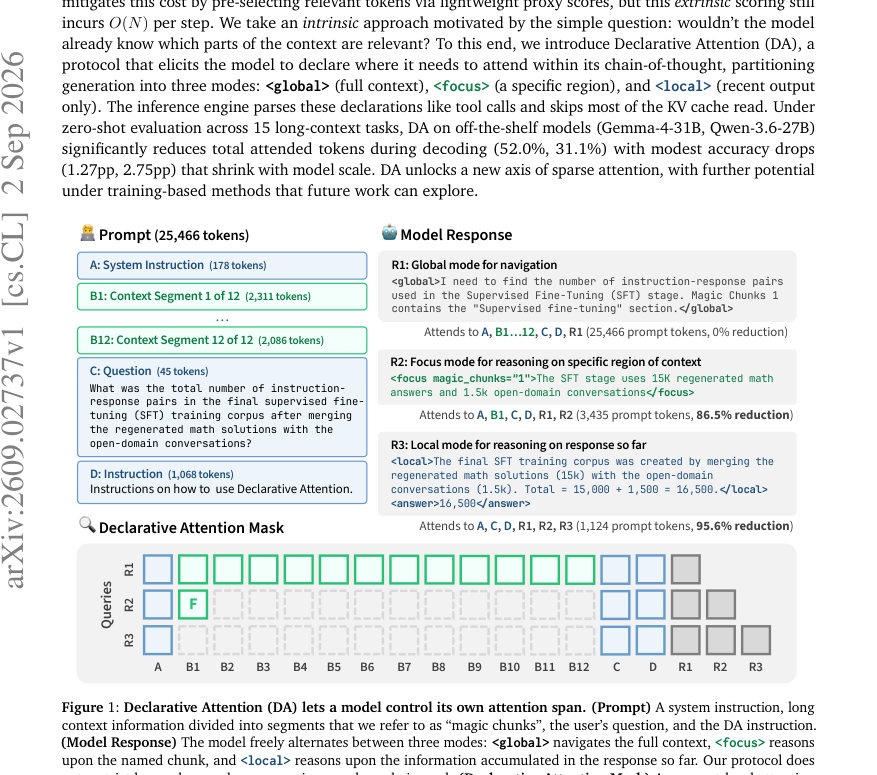
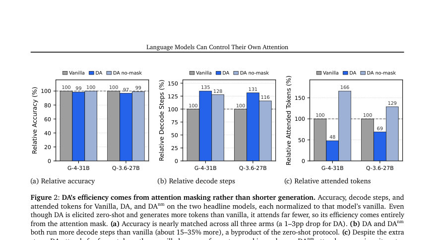
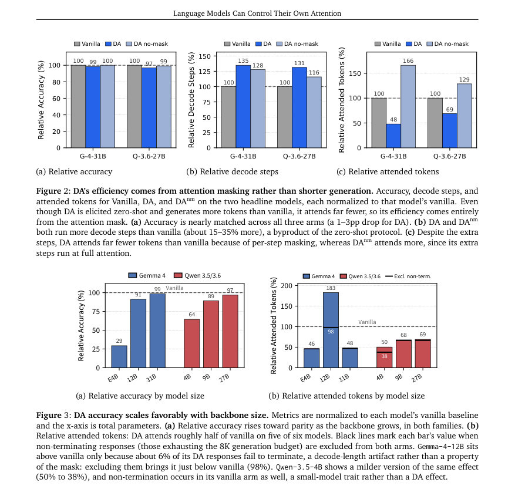

# Language Models Can Control Their Own Attention

- **게시일:** 2026-09-04
- **arXiv:** [2609.02737v1](http://arxiv.org/abs/2609.02737v1) · [PDF](https://arxiv.org/pdf/2609.02737v1)
- **저자:** Namgyu Ho, Huzama Ahmad, Woosung Koh, Se-Young Yun, Tal Schuster, Cicero Nogueira dos Santos
- **분야:** cs.CL, cs.AI, cs.LG
- **선정 점수:** 4.98
- **선정 이유:** 최근성 0.7, 인용 영향 0.0 (인용 0회), 저자 영향 0.0 (최고 h-index 0), AI 주제 적합성 2.0, 개발자 관심 0.2, 학술 신호 0.5, 오픈 웨이트·주요 연구조직 신호 1.5

[← 2026-09-04 목록으로 돌아가기](../daily/2026-09-04.html)

<!-- paper-visuals:start -->
## 주요 Figure

> 원문 PDF에서 실제 Figure 캡션과 그림 영역이 함께 확인된 자료만 자동 추출했다.

*Figure · 원문 PDF 1쪽 · Figure 1: Declarative Attention (DA) lets a model control its own attention span. (Prompt) A system instruction, long*

*Figure · 원문 PDF 9쪽 · Figure 2: DA’s efficiency comes from attention masking rather than shorter generation. Accuracy, decode steps, and*

*Figure · 원문 PDF 9쪽 · Figure 3: DA accuracy scales favorably with backbone size. Metrics are normalized to each model’s vanilla baseline*

<!-- paper-visuals:end -->

## 한 문장 요약

모델의 생성 중 체인-오브-생각(Cot) 출력으로 자신이 어느 문맥을 볼지 선언하게 해 KV 캐시 전체 읽기를 건너뛰는 'Declarative Attention(DA)' 프로토콜을 제안하여 장기 문맥 추론의 attention 비용을 크게 줄인다.

## 해결하려는 문제

Transformer 계열 LLM은 매 디코드 스텝마다 전체 KV 캐시를 읽어 attention을 계산하므로 긴 문맥에서 KV 읽기(메모리 대역폭)가 디코드 비용을 지배한다. 기존 해법은 관련 토큰을 외부 스코어로 선별하지만 이들 방식도 여전히 스텝당 O(N) 스캔 또는 근사 스캔 비용을 발생시킨다. 논문은 ‘모델이 자신이 어디를 볼지 이미 알고 있지 않나?’라는 질문에서 출발해, 모델이 스스로 주석(태그)으로 향후 attention 범위를 선언하면 선택 비용을 제거할 수 있는지 탐구한다.

## 핵심 기여

- Declarative Attention(DA) 프로토콜 제안: 생성 중 <global>, <focus>, <local> 세 모드를 선언하도록 해 inference 엔진이 태그를 파싱해 블록 단위로 KV 읽기를 마스킹하도록 함.
- 제로-샷으로 상용·대형 사전학습 모델에서 동작함을 실증: Gemma-4-31B, Qwen-3.6-27B 등 오프더셸프 모델에서 학습 없이 동작함을 보였음(15개 장기 문맥 과제 평가).
- 구현·효율성 검증: vLLM에 블록 정렬(block-aligned) 방식으로 KV 캐시 마스킹을 통합해 FlashAttention 등 기존 커널과 호환되도록 함. 루프라인(roofline) 분석으로 최적화된 서빙에서 추정 디코드 시간 단축(예: Gemma-4-31B에서 0.71×)을 제시.
- 정량적 실험·절단(ablation): ‘DA-no-mask(DAnm)’(같은 프롬프트·포맷이지만 마스크 없음)와 비교해, 마스크가 절감의 주된 원인이고 포맷 자체는 거의 무해함을 보였음(마스크가 DAnm 대비 attended tokens를 크게 줄임).

## 접근 방법

* 핵심 아이디어는 모델이 생성 중 태그 형식(<global>...</global>, <focus magic_chunks="K">...</focus>, <local>...</local>)으로 언제 어떤 세그먼트(‘magic chunk’)를 볼지 선언하게 하고, 추론 엔진이 출력 스트림을 파싱해 디코드 스텝마다 KV 캐시 블록 테이블을 동적으로 재작성해 읽을 블록만 남기는 것이다.
* 구체적 절차는 다음과 같다: (1) 문맥을 약 2048토큰 목표 크기의 'magic chunk'로 분할(문단·문장·절 경계 우선)하고, 이것을 'get_magic_chunk' 도구 호출-응답의 형태로 프롬프트에 미리 넣어 모델이 세그먼트를 주소로 참조하게 한다.
* (2) 프롬프트는 항상 보이는 scaffold(시스템, 질문, DA instruction)와 가변 문맥 영역으로 구성되며 각 모드의 사용법을 안내한다.
* (3) DA 상태기계는 모델 출력의 태그 전환을 감지(여는 태그의 '>'에서 전환 파싱)해 현재 모드에 따라 블록 단위 마스크를 구성한다.
* (4) 마스크는 vLLM의 KV 블록 테이블을 훅으로 덮어써 기존 attention 커널(예: FlashAttention)이 적게 읽도록 한다.
* (5) DA는 글로벌 attention 레이어에만 적용하며, SWA/GDN 등 효율층은 건드리지 않는다.
* 실험에서는 thinking 모드를 비활성화했고, 샘플링은 각 모델 권장 설정을 사용했다.

## 주요 결과

- 평균 절감 및 정확도: Gemma-4-31B에서 평균 attended-token을 52.0% 감소(13.43M → 6.45M)시키고 정확도는 1.27 percentage point 하락(87.01% → 85.74%). Qwen-3.6-27B에서는 attended-token을 31.1% 감소(22.54M → 15.52M)시키고 정확도는 2.75 pp 하락(85.31% → 82.56%). 평가는 15개 장기 문맥 소스(예: RULER, LongBench v1/v2, LooGLE, ZeroScrolls)에서 수행.
- 마스크의 기여(절단 결과): 동일한 프롬프트·포맷에 마스크를 제거한 DAnm과 비교하면 프롬프트 포맷 자체는 거의 손실 없음(예: Gemma: 87.01% vs DAnm 87.01%), 그러나 DAnm은 오히려 attended tokens가 증가했다. DA의 마스크는 DAnm 대비 attended tokens를 Gemma에서 71.1% 줄이고 Qwen에서 46.5% 줄여 실효적 절감의 주된 원인임을 보였다.
- 맥락 및 스케일링: 모델 능력에 따라 DA의 정확도 손실이 감소함. Gemma 계열에서 Gemma-4-E4B는 상대 정확도 29%였으나 Gemma-4-31B에서 99% 수준으로 개선되었고, Qwen 계열도 4B→27B로 커질수록 상대 정확도(64%→97%)가 개선되었다.
- 문맥 길이/절대 절감: 절대 토큰 절감은 문맥 길이에 따라 급격히 증가(최장 바킷에서 응답당 약 −21M 토큰 절감).
- 서빙 시간 추정(roofline): 단일 B200 GPU, MFU 40%, MBU 70% 가정에서 Gemma-4-31B의 이론적 디코드 wall-clock을 0.71×로, Qwen-3.6-27B를 0.77×로 줄일 수 있다고 추정(Table 3).

## 한계

- 저자 명시 한계:
- 1) 제로-샷 기준 결과는 하한치이며, 프로토콜에 맞춘 후훈련(post-training)이나 SFT/RL로 성능·정확도 향상 여지가 크다. 2) DA는 모델이 태그·세그먼트 참조를 문법적으로 따르는 것에 의존하므로 소형 모델에서는 파싱 실패와 비완결 응답(비종료) 비율이 높아 실효성이 떨어짐(예: Gemma-4-E4B 성능 저하). 3) DA는 글로벌 attention 레이어의 KV 읽기만 마스킹하므로 슬라이딩 윈도우 등 효율층의 고정 per-step 비용은 줄이지 못함. 4) 루프라인 분석은 이론적(ceiling) 추정치이며 측정된 wall-clock이 아님. 5) 일부 소스(6개)는 구조적 불일치로 DA가 정확도 또는 총 attended tokens를 보존하지 못함(예: 세그먼테이션으로 증거 파괴되거나 문서 길이에 비례해 출력이 커지는 과제).
- 추론적으로 확인되는 제약(본문 근거 기준):
- 6) DA는 디코드 스텝 수를 증가시키는 경향(DA, DAnm 모두 vanilla보다 약 15–35% 더 많은 디코드 스텝)을 가지므로 matmul·효율층 관련 비용이 증가할 수 있음. 7) 마스크 효과는 vLLM의 블록 단위 KV 저장·읽기와 블록 크기에 의존하므로 다른 서빙 스택·블록 설정에서는 절감이 달라질 수 있음. 8) 프롬프트 기반으로 세그먼트 경계를 휴리스틱(문단·문장 등)으로 잡기 때문에 표·테이블·전역 집계 등 구조적 대상에는 실패할 수 있음. 9) 실험은 thinking 모드를 끈 채로 수행했으며, authors는 thinking 모드 내에서는 모델이 프로토콜을 따르지 못해 이를 비활성화했다고 보고함.

## 개발자 관점

- 재현·구현: 문맥을 토크나이저 인식 세그먼터로 약 2K토큰 단위로 분할하고 이를 'magic chunk' 형식의 도구 호출-응답(사전삽입)으로 프롬프트에 제공해야 한다. 프롬프트와 DA instruction 템플릿(예제와 세 가지 소프트 요구사항 포함)을 그대로 적용하면 제로-샷으로 동작한다.
- 서빙 통합: vLLM 수준에서 attention metadata 훅을 통해 KV 블록 테이블을 스텝별로 재작성하는 방식으로 구현한다(커널 변경 불필요). 마스킹은 블록 정렬(block-aligned) 방식으로 적용해야 실질적 KV 읽기 절감이 발생한다.
- 운영·성능 모니터링: DA는 스텝 수를 늘리고 글로벌·로컬·포커스 모드 혼합을 모델이 스스로 선택하므로 비정상적 비종료 응답, 과도한 생성 길이, 포커스 파싱 실패율(유효한 chunk 참조 수) 등을 모니터링·로깅해야 한다.
- 실용적 한계 처리: 테이블·전역 집계 등 세그먼트로 잘라선 안 되는 문서 구조가 있으면 구조 인지 세그먼테이션 또는 map-reduce(여러 focus를 순회해 scaffold에 누적) 패턴을 적용해 보완해야 한다. 긴 출력이 문서 길이에 비례해 커지는 과제는 focus로 verbose 출력을 유도해 per-step 비용을 억제하는 라우팅이 필요하다.
- 배포·비용 고려: DA의 실익은 대규모 배치·긴 문맥·메모리 대역폭 제약 환경에서 가장 크다. 작은 배치·짧은 문맥 환경에서는 절감이 작거나 없을 수 있으므로 루프라인(roofline) 가정(MFU/MBU) 및 대상 하드웨어에서 사전 평가를 권장한다.

**근거 범위:** 이 분석은 제공된 논문 PDF 본문(본문과 부록 포함)의 텍스트를 근거로 작성되었음. 입력에 일부 페이지 반복·중복 추출이 포함되어 있었으나 본문(핵심 섹션 1–6, 실험 설정, 표와 수치, 부록 D·F 등)을 직접 참조해 수치와 구현 세부를 정리했다. 본문에 명시되지 않은 초미세 구현 파라미터(예: 내부 블록 크기 선택의 최종 값, 실제 서빙 환경에서의 측정 wall-clock)는 기술하지 않았으며 해당 항목은 본문 추정치(예: TFLOP, GB 수치, MFU/MBU 가정)로만 보고되었음을 밝힌다.
