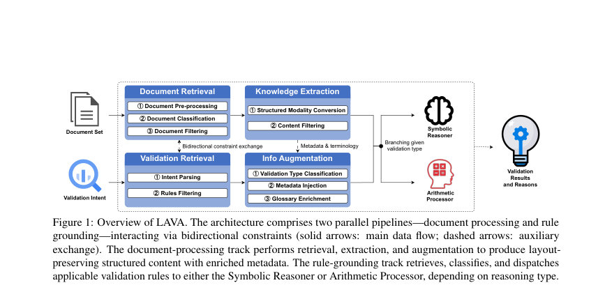
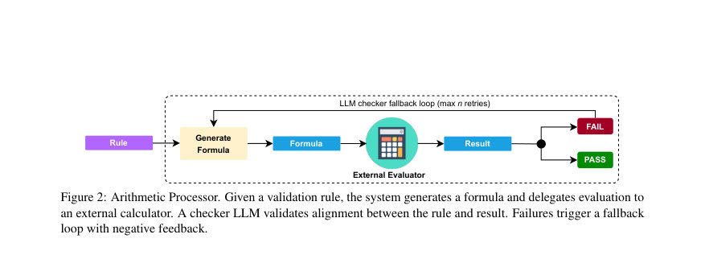
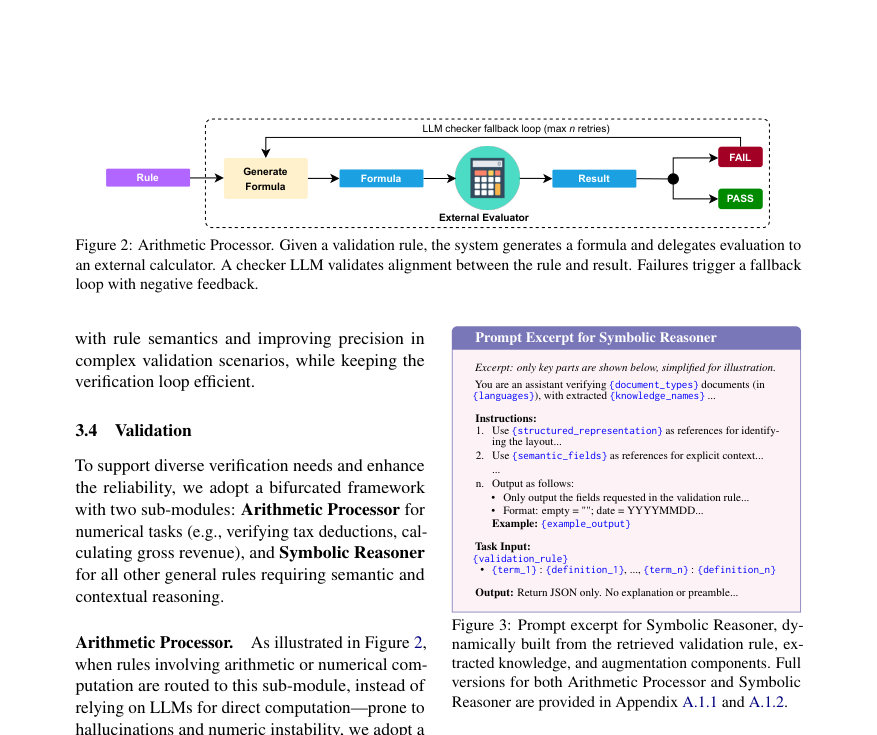

# LAVA: Logic-Aware Validation and Augmentation Framework for Large-Scale Financial Document Auditing

- **게시일:** 2026-08-18
- **arXiv:** [2608.16763v1](http://arxiv.org/abs/2608.16763v1) · [PDF](https://arxiv.org/pdf/2608.16763v1)
- **저자:** Ruoqi Shu, Xuhui Wang, Isaac Wang, Yanming Mai, Bo Wan
- **분야:** cs.AI
- **선정 점수:** 5.72
- **선정 이유:** 최근성 0.8, 인용 영향 0.5 (인용 2회), 저자 영향 1.3 (최고 h-index 6), AI 주제 적합성 2.1, 개발자 관심 0.6, 학술 신호 0.6, 오픈 웨이트·주요 연구조직 신호 0.0

[← 2026-08-18 목록으로 돌아가기](../daily/2026-08-18.html)

<!-- paper-visuals:start -->
## 주요 Figure

> 원문 PDF에서 실제 Figure 캡션과 그림 영역이 함께 확인된 자료만 자동 추출했다.

*Figure · 원문 PDF 3쪽 · Figure 1: Overview of LAVA. The architecture comprises two parallel pipelines—document processing and rule*

*Figure · 원문 PDF 5쪽 · Figure 2: Arithmetic Processor. Given a validation rule, the system generates a formula and delegates evaluation to*

*Figure · 원문 PDF 5쪽 · Figure 3: Prompt excerpt for Symbolic Reasoner, dy-*

<!-- paper-visuals:end -->

## 한 문장 요약

금융 문서의 레이아웃·규칙 복잡성을 고려한 4단계(문서-규칙 검색, 레이아웃 보존 정보 추출, 메타데이터 보강, 산술·기호 검증) 모듈형 파이프라인 LAVA를 제안해 실무용 감사(검증)에서의 환각 억제와 정밀한 감사 추적을 달성한다.

## 해결하려는 문제

기업 환경의 금융 문서 검증(예: 급여 감사, 세무 준수, 대출 심사)은 이견이 허용되지 않는 정확성, 일관성, 감사 가능성이 요구된다. 기존 MLLM 기반 파이프라인은 (1) 이질적 레이아웃·스캔 잡음, (2) 문서 간·필드 간의 복잡한 비즈니스 규칙과 다단계 논리, (3) 모델 환각 및 수치 불안정성, (4) 감사 추적성 부족과 토큰·비용 증가 문제로 실무 요건을 충족하지 못한다. 본 연구는 이러한 한계를 해결하여 규칙-기반 검증과 신경모델의 적응성을 결합한 실무 적합한 프레임워크를 제시하는 것을 목표로 한다.

## 핵심 기여

- 금융 문서 검증을 다문서(multi-document)·규칙기반의 추적 가능(coherent, auditable)한 검증 태스크로 정식화하고, 이를 처리하기 위한 모듈형 프레임워크 LAVA를 제안.
- 레이아웃 보존형 정보 추출(HTML 유사 마크업), 도메인·문맥 보강, 기호적(symbolic) 및 산술적(arithmetic) 검증을 결합한 4단계 파이프라인 설계로 환각 억제와 감사 가능성 확보.
- 산술 작업에 대해 LLM이 공식을 생성하고 결정론적 외부 엔진(예: Python 인터프리터)으로 계산을 수행한 뒤, 검사용 보조 LLM의 검증-재시도 루프(n=2)로 정합성을 보장하는 하이브리드 검증 전략을 제시.
- 실무 전문가가 큐레이션한 규칙 라이브러리와 약 1,000건 수준의 실제 캐나다 모기지 신청 문서(다양한 문서 유형)를 사용한 대규모 산업용 벤치마크에서 환각률·수치불일치·엣지케이스 처리 능력을 종합적으로 평가하는 평가 체계 제시.
- 토큰 효율성 관점에서 구조화된 지식 추출을 재사용함으로써 입력 토큰을 25%–45% 절감하고, 오류를 줄이며 비용-성능의 실무적 이점을 실증.

## 접근 방법

* LAVA는 문서 처리 트랙과 규칙(검증) 접지 트랙의 병렬·상호작용 구조로 구성된 네 단계로 동작한다.
* (1) Document & Validation Retrieval: 사용자 의도(q)에서 시간·문서유형 제약을 파싱하고 Sentence-BERT 등으로 규칙 라이브러리에서 관련 규칙을 검색한 뒤, 문서 분류(TinyViT)와 템플릿 기반 NER/정규식으로 문서 메타데이터(기간 등)를 추출해 쌍방향 제약으로 문서-규칙 후보를 좁힘.
* (2) Knowledge Extraction: OCR(Tesseract)과 구조 분석(Layout-Parser, AWS Textract 등)을 결합해 페이지 레이아웃·테이블·필드 의존성을 보존하는 HTML 유사 마크업을 생성하고, 단어 파편 병합·시각 영역 보존(차트·도장 등)·콘텐츠 필터링(헤더/푸터/노이즈 제거)을 수행하여 토큰 효율적이고 구조적 입력을 만듦.
* (3) Information Augmentation: 각 규칙을 LLM으로 'symbolic' 또는 'arithmetic'으로 분류하고, 언어·문서유형·도메인 용어(약어·레프트 레이블 등)를 추출해 프롬프트 헤더·용어집으로 주입해 문맥·정의 명확화를 제공.
* (4) Validation: 산술 규칙은 Arithmetic Processor로 라우팅되어 LLM이 Python 스타일의 계산 공식(formula)을 생성하면 외부 결정론적 계산기로 실행하고, 결과와 규칙 의미 정합성을 보조 LLM 체크어가 검증하며 불일치 시 최대 n=2 재생성(negative-conditioning) 루프를 수행한다.
* 기호적 규칙은 Symbolic Reasoner가 템플릿 기반 메타프롬프트로 직접 처리하며 출력은 JSON 고정 schema로 반환해 감사 추적성·일관성 확보.
* 프롬프트 구조는 예시(샷) 대신 단계적·템플릿화된 정보 주입 방식(프로그램식 Jinja 템플릿)으로 토큰 효율과 일반화성을 도모한다.
* 구현 실험에서는 Claude 3.7 Sonnet을 검증 모델로 사용하고, OCR·구조분석은 공개 도구(Tesseract, AWS Textract)를 사용하였다.

## 주요 결과

- 평가 데이터: 실무 수준의 캐나다 모기지 신청 문서 집합(다양한 문서 유형, 약 1,000개의 스캔 PDF/이미지)과 수십 개의 전문가 큐레이션 규칙 라이브러리 사용.
- 평가 지표: Factual Hallucination Rate(FHR), Numerical Infidelity Rate(NIR), Edge Case Handling(ECH), 및 토큰 비용(입출력 토큰 수)으로 다면 평가.
- 비교군: VLM+Field-Level OCR, LLM+Field-Level OCR, LLM+Enhanced OCR(구조 마크업 제외)과 비교하여 LAVA가 모든 메트릭·카테고리(C1–C5)에서 최저 실패율을 기록. 예시 수치(표 1): 다단계 논리(C3)에서 환각률 LAVA=0.18 vs best baseline(LLM+Enhanced)=0.30; 제약된 산술(C5)에서 환각률 LAVA=0.05 vs baselines 0.15–0.30; 수치 불일치(NIR)에서는 C4·C5에서 LAVA=0.00(표 1).
- 엣지케이스 처리: 엣지케이스 오류율(표 1)에서 LAVA가 대폭 낮음(예: C3 엣지 에러 LAVA=0.17 vs baselines 0.82–0.90), 이는 구조 보존·메타데이터 보강·AP의 조합 효과로 해석됨.
- 토큰·비용: 구조화된 지식 추출을 재사용하여 입력 토큰을 25%–45% 절감. 전체 LAVA는 규칙당 입력·출력 합계가 3k 토큰 미만의 추가 오버헤드를 보이며, 논문은 이를 Claude 3.7 기준 약 $0.009, GPT-4.1 기준 약 $0.006의 단가로 환산하여 실무 비용 우위를 주장.

## 한계

- 저자 명시 한계: 향후 더 노이즈가 많고 덜 구조화된 문서 처리와 포맷·도메인 전반에서 규칙 일반화 학습을 목표로 하고 있어 현재 버전은 이러한 영역에서 제약이 존재함(본문 결론 참조).
- 실험적 제약(본문 기반 확인): 평가 데이터는 '약 1,000건 수준'의 캐나다 모기지 신청 문서로 한 도메인에 집중되어 있어 다른 산업·국가·문서 유형으로의 일반화는 본문 내 직접적 증거가 제한적임.
- 구현 의존성: 결과는 Claude 3.7 Sonnet을 검증 모델로 고정하고 Tesseract/AWS Textract 등의 상용·오픈 도구 조합에 의존했으므로, 다른 OCR/백본으로의 이식 시 성능 변화 가능성이 있음(논문은 백본-무관성을 주장하나 실험은 단일 모델 기반).
- 세부 재현성 정보 부족: 규칙 라이브러리의 정확한 수량·구성, 데이터의 완전한 공개(프로프라이어터리), 및 일부 프롬프트 전체 버전은 부록에 일부 제공되었으나 전체 규칙 집합과 라벨링 세부는 공개되어 있지 않아 외부 재현에 제약이 있음.

## 개발자 관점

- 모듈형 설계(검색→추출→보강→검증)는 실무 배포에서 디버깅·교체·감사성을 크게 용이하게 하므로 대규모 파이프라인에서는 권장되는 아키텍처임.
- 레이아웃-보존 구조화(HTML 유사 마크업)와 콘텐츠 필터링은 다단계 논리·테이블·열 정합성 문제에서 핵심적이며, 제거하면(Clique: No KE) 다중 카테고리에서 오류가 급증(예: C3,C5 실패율이 0.28→0.67 수준으로 악화). 따라서 문서 구조화 모듈은 우선적으로 견고하게 구현해야 함.
- 산술 검증은 'LLM으로 공식 생성 + 외부 결정론적 실행' 패턴이 수치적 불일치를 크게 줄임. 실제 구현 시 공식 생성의 정합성 검사용 보조 LLM 체크어와 재시도(논문은 n=2)를 포함하는 것이 실무상 효과적.
- 프롬프트 설계는 예시 기반 few-shot보다 템플릿·메타프롬프트 접근이 토큰 효율성과 일반화에서 유리. 출력 포맷을 엄격한 JSON으로 고정하면 downstream 자동화·감사 추적이 쉬워짐.
- 운영비용 관점: 한 번 추출한 구조화 지식을 규칙 검사들 간에 재사용하면 입력 토큰과 API 비용을 25%–45% 절감할 수 있음. 구현 시 토큰 카운트 추적과 재사용 전략이 중요함(논문 수치 활용 가능).

**근거 범위:** 이 분석은 제공된 논문 PDF 본문(주요 본문, 표, 부록)을 근거로 작성되었음. 표(특히 표 1·표 2)와 텍스트에서 제시된 수치와 구성 요소를 직접 인용하였으며, 데이터셋은 '약 1,000건 수준의 캐나다 모기지 신청 문서'로 명시되어 있음. 논문은 규칙 라이브러리 전체 내용과 코드·데이터를 공개하지 않아 일부 세부(정확한 규칙 수, 전체 규칙 목록, 원시 문서 예시)는 본문만으로 확인할 수 없었음. 또한 PDF 추출 과정에서 표의 레이아웃이 단순화되어 해석의 여지가 있을 수 있으므로, 정확한 재현을 위해서는 원저자의 공개 자료(코드·데이터) 확인을 권장함.
