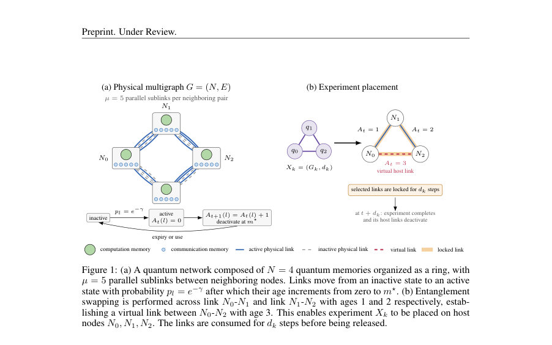
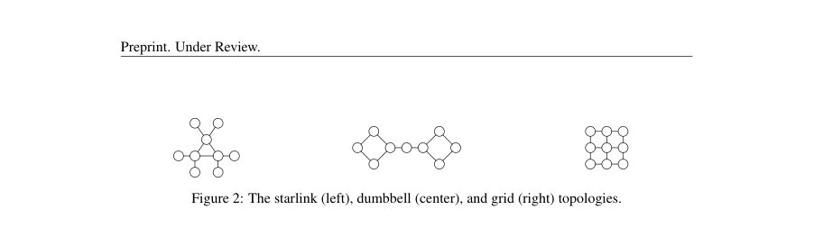
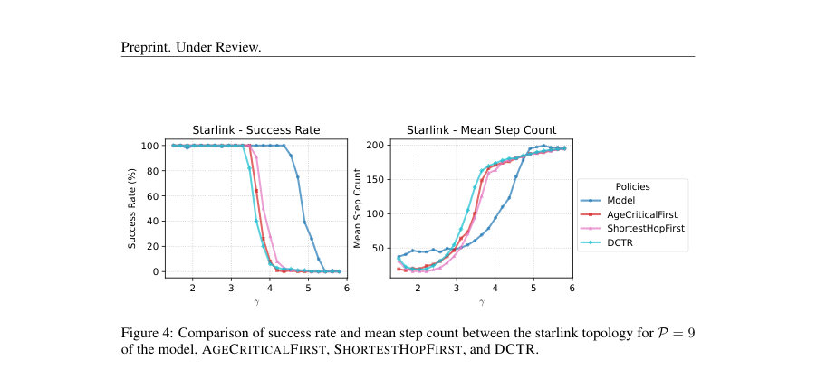

# Learning and interpreting policies for simultaneous entanglement requests in quantum networks

- **게시일:** 2026-09-26
- **arXiv:** [2609.30157v1](http://arxiv.org/abs/2609.30157v1) · [PDF](https://arxiv.org/pdf/2609.30157v1)
- **저자:** Leon Rode, Sumeet Khatri, Supartha Podder
- **분야:** quant-ph, cs.LG
- **선정 점수:** 6.35
- **선정 이유:** 최근성 0.7, 인용 영향 0.0 (인용 0회), 저자 영향 1.7 (최고 h-index 17), AI 주제 적합성 2.9, 개발자 관심 0.3, 학술 신호 0.8, 오픈 웨이트·주요 연구조직 신호 0.0

[← 2026-09-26 목록으로 돌아가기](../daily/2026-09-26.html)

<!-- paper-visuals:start -->
## 주요 Figure

> 원문 PDF에서 실제 Figure 캡션과 그림 영역이 함께 확인된 자료만 자동 추출했다.

*Figure · 원문 PDF 3쪽 · Figure 1: (a) A quantum network composed of N = 4 quantum memories organized as a ring, with*

*Figure · 원문 PDF 5쪽 · Figure 2: The starlink (left), dumbbell (center), and grid (right) topologies.*

*Figure · 원문 PDF 7쪽 · Figure 4: Comparison of success rate and mean step count between the starlink topology for P = 9*

<!-- paper-visuals:end -->

## 한 문장 요약

확률적 물리링크 환경에서 동시 다중 실험(멀티파티 엔탱글먼트) 배치를 위해 링크-레벨 가상링크 생성과 실험 스케줄링을 DQN+MPNN 기반 강화학습으로 학습하고, 학습정책을 해석가능한 휴리스틱으로 추출·검증한다.

## 해결하려는 문제

물리적으로 고정된 토폴로지에서 여러 사용자가 동시에 요구하는 다양한 서브그래프(실험)를 가능한 한 빠르고 자원낭비 없이 완성하려면 링크-레벨 엔탱글먼트(물리 및 가상 링크) 생성과 실험 배치(호스트 링크 잠금)를 스케줄링하는 정책이 필요하다. 기존의 그리디 휴리스틱들은 활성화 확률(pl = e^{-γ})이 낮은(손실이 큰) 환경에서 비효율적이며, 다양한 토폴로지와 하드웨어(노드 색상) 제약을 동시에 다루지 못한다. 본 연구는 이러한 조건下에서 더 강건한(낮은 pl에도 성공률과 시간 성능 유지) 정책을 학습·해석하는 것을 목표로 한다.

## 핵심 기여

- 문제를 링크-레벨 가상 링크 생성과 실험 배치를 포함하는 MDP로 형식화하고, 실험 배치의 유효성(링크 잔여 수명, 노드 색상 제약 등)을 명확히 정의함.
- Double DQN + Message Passing Neural Network(MPNN)를 사용하고, SED(부분그래프 편집거리) 기반 보상·중심성 기반 보상·실험 복잡도 보상·시간 패널티 등 복합 보상 설계를 통해 정책 학습을 수행함.
- 커리큘럼 학습과 리플레이 버퍼(전문가 트랜지션 포함)를 도입하여 낮은 플링크 손실 환경에서 시작해 높은 손실로 옮겨가며 학습, 다양한 물리 토폴로지(Starlink, Dumbbell, Grid)와 색상 제약 하에서 기존 휴리스틱들보다 훨씬 낮은 링크 활성화 확률에서도 높은 성공률 및 짧은 평균 에피소드 길이를 달성함.
- 학습된 DQN 정책의 행동 로그를 LLM(Gemini 3.1 Pro)에 제공하여 자연어로 표현 가능한 휴리스틱을 추출·검증하고, 해당 LLM 생성 휴리스틱이 DQN 정책과 유사한 성능을 보이는 가능성을 보임.
- 정책 행태를 분석하기 위한 세 가지 지표(HOLDINGTIME, BRIDGESPAN, HUBANCHORBIAS)를 정의하고, 이를 통해 학습 정책의 '대기적(policy patience)', 짧은 가교 생성 선호, 주변 노드 편향 등을 정량적으로 확인함.

## 접근 방법

* 문제 정의: 네트워크 G=(N,E)에서 µ개의 병렬 서브링크, 각 비활성 링크는 각 시간단계마다 활성화 확률 pl=e^{-γ}로 활성화되고 활성화되면 최대 수명 m⋆까지 연령을 증가시킴.
* 가상 링크는 최단 경로 상의 링크들이 유효(연령 합 < m⋆)할 때 엔탱글먼트 스와핑으로 생성(성공은 결정적 가정).
* 각 실험 Xk=(Gk, dk)는 요구 서브그래프와 지속시간을 가짐; 배치 시 호스트 링크들을 dk 동안 잠금.
* MDP: 상태 관찰은 노드별 이용가능 메모리(정규화), 활성 서브링크의 연령·잠금 잔여시간(엣지 피처), 완료되지 않은 실험 비트벡터로 구성.
* 행동공간은(실험 배치, 가상 링크 생성, 대기)이며 불법 행동은 액션 마스크로 차단.
* 보상 설계: (1) 가상링크 생성에 대해 SED 변화 기반 보상(rvl)으로 편향·진행량·잔여거리 반영, (2) 가교(브로틀넥) 노드의 최대 매개중심성 기반 가중 보상, (3) 배치 시 실험 엣지 수에 비례한 보상 보정, (4) 단계당 페널티로 빠른 완료 유도.
* 학습: Double DQN(online/target)과 MPNN(노드 임베딩 d=128, 엣지 피처 차원 de=2, 메시지패싱 레이어 T=3)을 사용.
* 리플레이 버퍼 크기 100k, '전문가' 트랜지션(온라인 네트워크로 롤아웃한 500 에피소드)을 고정 비율(25%)로 보존, 미니배치 크기 256(전문가 25%/온라인 75%).
* 커리큘럼: γ를 [1.5,5.8] 구간으로 선형 보간한 11단계로 학습하며 각 단계는 이전 단계의 저장 가중치와 전문가 트랜지션으로 시드됨.
* 정책 출력은 Q값 계산 후 액션 마스킹 적용.

## 주요 결과

- 실험 설정: |N|=9, m⋆=52, µ=5, 실험 세트 X={(K4,1),(K4,1)}. 에피소드 시간제한 200스텝; 성공은 시간초과 없이 모든 실험 배치 완료.
- Uncolored Starlink: 모델은 AGECRITICALFIRST, SHORTESTHOPFIRST, DCTR가 약 γ≈3.5(pl≈0.030)에서 실패를 시작할 때 모델은 약 γ≈4.5(pl≈0.011)까지 100% 성공을 유지함. 논문은 모델이 AGECRITICALFIRST보다 59% 낮은 활성화 확률에서 처음 실패하고, DCTR보다 66% 낮은 확률에서 처음 실패한다고 보고함. 예: γ=4.0(pl≈0.018)에서 모델 평균 약 95스텝으로 완료, 휴리스틱들은 약 170스텝.
- Uncolored Dumbbell: 모델은 최고 성능 휴리스틱(DCTR)보다 66% 낮은 활성화 확률에서 처음 실패, 최악 휴리스틱(AGECRITICALFIRST)보다 71% 낮은 확률에서 처음 실패. 예: γ=4.0에서 모델은 약 50스텝, 휴리스틱은 125–150스텝.
- Uncolored Grid: 모델은 SHORTESTHOPFIRST보다 51% 낮은 확률에서 처음 실패, AGECRITICALFIRST보다 59% 낮은 확률에서 처음 실패. 예: γ=4.0에서 모델 약 55스텝, 휴리스틱들은 125–160스텝.
- Colored Starlink(노드 색상 제약): 모델은 AGECRITICALFIRST보다 51% 낮은 확률에서 20% 이상 실패를 시작하고 DCTR보다 59% 낮은 확률에서 실패를 시작한다고 보고됨. 색상 제약하에서도 모델은 휴리스틱 대비 더 빨리(최소 60스텝 단축) 완료하는 구간 존재함. Appendix D의 유사 실험에서 컬러 그리드의 경우 모델은 최고 휴리스틱보다 59% 낮은 활성화 확률에서 80% 이상 성공률 유지 등 유리한 결과 보고됨(세부 수치는 본문·부록에 표기).

## 한계

- 저자 명시 한계: 학습된 정책은 작은 규모 실험(본문 실험은 |N|=9, X 두 개의 K4)과 특정 하드웨어/환경 가정하에서 평가되었으며, 더 큰 네트워크나 다른 실험 분포에 일반화 가능성은 추가 검증이 필요하다고 암시함. 또한 LLM 기반 휴리스틱 추출은 초기 탐색적 시연으로서 '유망'하다고 제시함(직접적 확장성·안정성 보장은 주장하지 않음).
- 모델·실험에서 확인되는 제약(논문 본문으로부터 합리적 유추): (1) 엔탱글먼트 스와핑을 결정적으로 성공한다고 가정 — 실제 스와핑 확률·오류는 모델에 반영되지 않음. (2) 평가 토폴로지·실험 세트가 제한적(|N|=9, 동일한 실험 두 건) — 다양한 규모·다양한 실험 분포에 대한 성능 미검증. (3) 학습은 커리큘럼 단계와 전문가 리플레이를 필요로 하며, 후반 고잡음 단계로의 추가 학습이 오히려 저잡음 성능을 저하시킬 수 있음(부록 E에 상세그림). (4) 보상·하이퍼파라미터(SED 가중치, rbottleneck 등)는 수동 튜닝에 의존하며 민감도 분석은 제한적.

## 개발자 관점

- 재현성: 코드와 환경 설정을 공개(리포지토리 URL 본문 명시)하므로 실험·학습 파이프라인(환경·보상·MPNN 아키텍처 등)을 재현 가능. 구현시 리포지토리의 README와 부록의 하이퍼파라미터·네트워크 아키텍처(d=128, de=2, T=3, minibatch=256, buffer=100k, 전문가 트랜지션 500 에피소드 비축, 전문가/온라인 비율 25/75 등)를 참고해 재현해야 함.
- 모델·아키텍처: 그래프 구조 입력엔 MPNN이 적합하며 액션 마스킹(불법 행동을 큰 음수로 처리)을 통해 안정적인 정책 출력을 얻음. SED 기반 보상과 병목 중심성 보상 등 문제 특화 보상 설계가 성능에 핵심적임.
- 학습 전략: 환경 노이즈(낮은 pl)에 강건한 정책을 얻으려면 커리큘럼 학습으로 낮은 노이즈에서 시작해 점진적으로 어려움을 올리는 방법이 효과적이나, 너무 높은 노이즈 단계까지 학습하면 저노이즈 성능이 악화될 수 있어 조기종료(phase 선택)가 필요함(부록 E 참조).
- 정책 추출·해석: LLM(예: Gemini)을 이용해 DQN 정책의 행동 로그를 주면 사람이 이해 가능한 휴리스틱을 만들 수 있으며, 이 휴리스틱은 네트워크 확장 시에도 실용적일 수 있음(논문은 N 늘려서 실험한 결과를 제시). 다만 LLM이 생성한 휴리스틱은 도메인 제약을 정확히 반영했는지 검증·교정 필요.
- 운영·배포 고려사항: 실제 네트워크 적용 전에는 스와핑 실패, 노드·링크 이질성, 시간-동기 문제 등을 시뮬레이션에 포함시켜야 함. 학습 비용(여러 커리큘럼 단계·대량 시뮬레이션)은 상당할 수 있으므로 대규모 네트워크에는 LLM 기반 휴리스틱 추출을 비용·시간 효율적 대안으로 고려할 수 있음.

**근거 범위:** 분석은 제공된 논문 PDF 본문(본문과 부록 포함)에 기초함. 본문에서 제시된 수치(예: |N|=9, m*=52, µ=5, 실험집합 X, γ·pl 관련 경계값 및 퍼센트 비교)는 본문/그림/부록에서 직접 확인한 값만 사용했음. 일부 '퍼센트 낮음' 비교치는 논문이 본문에 서술한 문장을 그대로 기술했으며, 그래프로부터 근사한 γ 위치(예: '약 γ≈3.5, γ≈4.5')는 원문 플롯의 표시를 근거로 표기함. 훈련시간·연산비용이나 대형 네트워크에 대한 정량적 확장성 평가는 PDF에 상세 수치가 없어 본문 근거로 제시하지 않았음.
