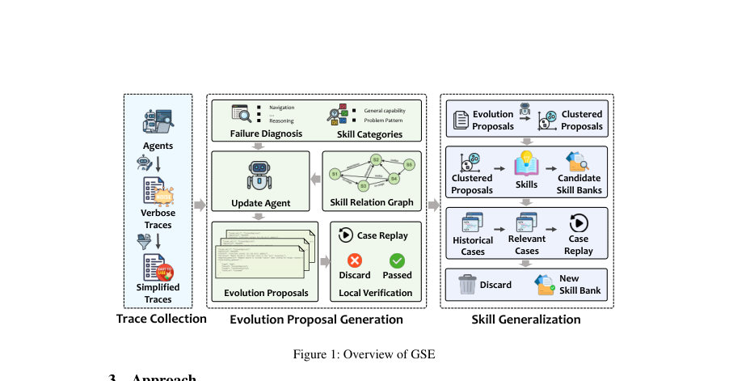
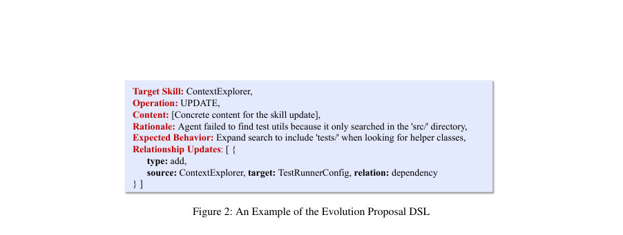
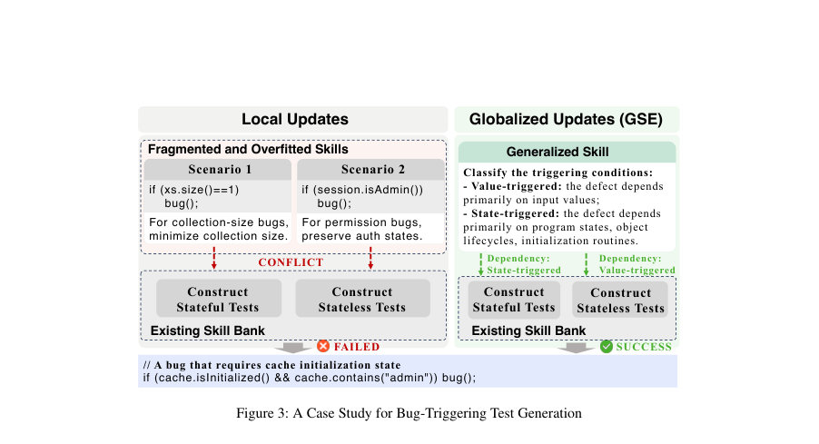

# Learning Globally Reusable Skills for Coding Agents

- **게시일:** 2026-08-07
- **arXiv:** [2608.06153v1](http://arxiv.org/abs/2608.06153v1) · [PDF](https://arxiv.org/pdf/2608.06153v1)
- **저자:** Chen Yang, Jiashuo Tian, Ziqi Wang, Xinyin Liu, Meiru Ye, Junjie Chen
- **분야:** cs.SE, cs.AI
- **선정 점수:** 12.18
- **선정 이유:** 최근성 1.4, 핵심어: large language model, 핵심어: llm, 핵심어: agent, 분야 가중치 2.0

[← 2026-08-07 목록으로 돌아가기](../daily/2026-08-07.md)

## 한 문장 요약

LLM 기반 코딩 에이전트의 스킬 은행을 전역 최적화 문제로 보고, 스킬 간 관계를 명시적으로 모델링하는 Skill Relation Graph(SRG)과 군집 기반 일반화·리플레이 검증을 통해 국소 업데이트의 과적합을 막고 재사용 가능한 스킬을 학습하는 GSE 프레임워크를 제안한다.

## 해결하려는 문제

기존 자동 스킬 진화 기법은 개별 실행 흔적으로부터 생성한 국소적 업데이트를 독립적으로 병합하는 방식에 의존해 스킬 간 상호작용(전제·의존·충돌)을 반영하지 못하고, 특정 케이스에 과적합된 파편화된 스킬을 축적하여 장기적으로 성능·일관성을 저하시킨다. 연구 질문은 (1) 업데이트가 기존 스킬들과 호환되도록 생성하는 방법과 (2) 케이스 특이적 업데이트를 전역적으로 재사용 가능한 스킬로 합병·검증하는 방법이다.

## 핵심 기여

- GSE라는 전역화된 스킬 진화 프레임워크를 제안하여 스킬 진화를 전체 스킬 은행의 전역 최적화로 재정의함.
- Skill Relation Graph(SRG)를 도입해 스킬 간 dependency, co-usage, conflict 관계를 명시적으로 모델링하고 스킬 내용과 관계를 공동 진화함.
- 케이스 기반 로컬 업데이트를 군집 기반 통합(cluster-based consolidation)으로 추상화하고, 리플레이 기반 검증(replay-driven validation)으로 회귀 및 과적합을 방지하는 전역 스킬 일반화 메커니즘을 설계함.
- 진화 제안서를 DSL(도메인 특화 언어)로 구조화하고, 로컬 재연(local replay)으로 초기 유효성을 확보하는 파이프라인을 제시함.
- 버그 재현용 단위 테스트 생성과 false-positive 버그 리포트 필터링 두 작업 및 두 공개 에이전트(OpenHands, mini-SWE-agent)와 내부 산업용 에이전트에 대한 실험을 통해 GSE의 유효성을 보임.

## 접근 방법

* GSE는 네 단계 파이프라인으로 동작한다.
* (1) Trace Collection: 에이전트 실행을 모두 기록하고 불필요한 저수준 출력은 제거해 의미 있는 단축(간소화)된 실행흔적을 생성한다.
* (2) Evolution Proposal Generation: 업데이트 에이전트가 계층적 고장 진단(탐색/추론/실행 실패 구분)을 수행해 근본 결핍을 식별하고, DSL로 표준화된 제안서(대상 스킬, 연산, 내용, 근거, 기대효과, 관계 변경 등)를 생성한다.
* SRG는 노드(스킬)와 엣지(유형: dependency, co-usage, conflict)로 이루어져 제안이 주변 스킬에 미치는 영향을 파악하고 필요 시 보조 제안(auxiliary proposals)을 생성하여 스킬 내용과 관계를 공동 진화한다.
* (3) 로컬 검증: 제안을 임시 후보 스킬 은행에 적용하고 원래의 실패 케이스를 재연해 로컬 유효성 확인을 한다.
* (4) Skill Generalization: 로컬 검증을 통과한 제안들을 (a) 기존 스킬 수정 제안은 영향을 받는 스킬 집합을 키로, 신규 스킬 제안은 근거·기대효과의 의미적 유사도로 군집화하고, (b) 군집 내 공통 패턴을 추출·통합해 고수준 스킬을 생성한 뒤 (c) 관련 과거 케이스에 대해 후보 스킬 은행을 리플레이해 전역적 성능 보존/향상을 확인한 경우에만 은행에 병합한다.
* 구현상 트레이스·재연·상태는 SQLite에 저장하고 스킬 은행은 Git 워트리로 버전 관리했으며, 실험에서는 DeepSeek-V4-Flash LLM을 사용하고 온도는 0으로 고정해 결정론적 평가를 수행했다.

## 주요 결과

- 버그 재현용 테스트 생성(벤치마크: Java 기반 Multi-SWE-Bench 확장에서 검증된 108개 버그, 9개 프로젝트): OpenHands 기준 GSE는 Precision=0.35, Recall=0.28, F1=0.31로 가장 우수함(베이스 에이전트 F1=0.08, Human Skills F1=0.16, Live-SWE-agent F1=0.22, Trace2Skill F1=0.19). mini-SWE-agent 기준 GSE는 Precision=0.55, Recall=0.29, F1=0.38으로 가장 우수함(베이스 F1=0.28).
- false-positive 버그 리포트 필터링(IndustrialBugs: 500 리포트 중 132 실제 버그, 368 오탐, 8개 리포지토리, Go): OpenHands에서 GSE는 Precision=0.55, Recall=0.95, F1=0.70으로 가장 우수(베이스 F1=0.37, Human Skills F1=0.42, Live/Trace2Skill F1≈0.42–0.43). mini-SWE-agent에서는 GSE가 Precision=0.30, Recall=0.97, F1=0.46(베이스 F1=0.36).
- 산술적 개선: 논문 본문은 요약에서 GSE가 테스트 생성에서 정밀도(precision) 6.1%∼34.1%·재현율(recall) 31.8%∼180.0% 개선, 필터링에서 정밀도 15.4%∼96.4%·재현율 13.1%∼19.8% 개선 범위를 보고함(본문의 구체적 수치는 테이블 값에 근거).
- 절제된 비용: 진화 단계 토큰 소비는 Trace2Skill 357.64K→GSE 401.55K(사례당 +12.28%). 다운스트림 실행 토큰은 베이스 에이전트 489.31K, Human Skills 620.58K, Live-SWE-agent 613.61K, Trace2Skill 619.65K, GSE 593.21K으로 GSE가 다른 진화 기법들보다 실행 시 토큰을 적게 소비함.

## 한계

- 저자가 명시한 한계(논문 본문 'Threats to Validity'): 외적 타당도 우려 — 평가가 OpenHands, mini-SWE-agent, 내부 에이전트 및 두 작업(Java/Go 기반의 테스트 생성·오탐 필터링)에 걸쳐 진행되었으나 다른 에이전트·언어·작업으로의 일반화 가능성은 남아 있음. 내부적 위협 — 구현 오류 가능성(저자는 공개된 베이스 에이전트·비교 기법 아티팩트를 사용하고 자체 구현을 검토했다고 보고함). 구성 위협 — LLM 무작위성·데이터 누수 우려(온도를 0으로 고정하고 프로젝트 단위 홀드아웃으로 완화함).
- 추가로 본문에서 확인 가능한 제약(저자가 직접 명시하지 않음): GSE는 진화 단계에서 기존 방법보다 사례당 토큰 비용이 증가(+12.28%)하며, 실험에서 사용한 LLM과 환경(DeepSeek-V4-Flash, LangChain 기반 구현, 온도 0, 특정 하드웨어) 의존성이 있어 동일한 효과를 얻으려면 유사한 실행 스택이 필요함. 또한 제안서 생성·군집화·리플레이에 사용된 상세 알고리즘(예: 유사도 계산의 정확한 임계값, 군집 알고리즘 하이퍼파라미터)은 본문에 구현 세부로서 명확히 제시되어 있지 않음.

## 개발자 관점

- 재현을 위해 트레이스 전수 기록과 '간소화(trace simplification)' 전처리가 필수적 — 파일 검색의 전체 출력, 원시 파일 내용, 저가치 로그는 제거하되 명령·파일 경로·핵심 오류 메시지·내부 추론 블록은 보존할 것.
- 스킬 은행은 SRG(노드=스킬, 엣지 유형=dependency/co-usage/conflict)로 모델링하고 스킬 내용과 관계를 함께 버전 관리하라(논문은 Git worktree로 스킬 버전관리, SQLite로 상태·재연 결과 저장을 사용).
- 진화 제안은 DSL로 구조화해 모호성을 줄여라(대상 스킬, 연산 유형, 내용, 근거, 기대 효과, 관계 변경을 포함).
- 로컬 재연으로 제안의 즉시 효과를 필터링하고, 이후 군집화→통합→리플레이 전역 검증 파이프라인을 적용해 과적합·회귀를 억제하라. 기존 스킬을 수정하는 제안은 '영향을 받는 스킬 집합'을 군집 키로 사용하고 신규 스킬 제안은 근거·기대효과의 의미적 유사도로 군집하라.
- 운영 비용: 진화 과정에서의 토큰 비용이 증가하지만(약 +12% 사례당), GSE는 다운스트림 실행에서 다른 자동 진화 기법들보다 적은 토큰을 소모하므로 전체 비용-효율 트레이드오프를 평가해 도입 여부를 결정하라. 또한 결정론적 비교를 위해 LLM 온도를 0으로 고정하는 것을 권장함.

<!-- paper-visuals:start -->
## 주요 Figure

> 원문 PDF에서 실제 Figure 캡션과 그림 영역이 함께 확인된 자료만 자동 추출했다.

*Figure · 원문 PDF 4쪽 · Figure 1: Overview of GSE*

*Figure · 원문 PDF 6쪽 · Figure 2: An Example of the Evolution Proposal DSL*

*Figure · 원문 PDF 11쪽 · Figure 3: A Case Study for Bug-Triggering Test Generation*

<!-- paper-visuals:end -->

**근거 범위:** 이 분석은 제공된 논문 PDF 본문(초록 및 본문 텍스트, 표 1–5, 알고리즘 1, 그림 및 Threats to Validity 섹션)을 근거로 작성되었음. 표와 본문에 명시된 수치(정밀도/재현율/F1, 데이터셋 크기, 토큰 소비 등)는 PDF에서 직접 추출한 값이다. 논문이 제공하지 않거나 본문에 상세히 기술되지 않은 구현 하이퍼파라미터(예: 군집 알고리즘의 세부 설정, 의미적 유사도 임계값), 내부 코드·프롬프트의 완전한 내용 등은 본문에서 확인되지 않아 이 분석에 포함하지 않았다.
