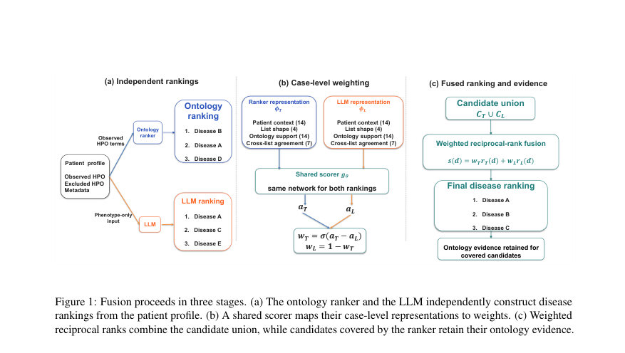
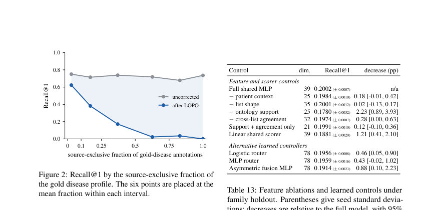

# Learning to Fuse LLMs with Ontology Rankers for Rare-Disease Diagnosis

- **게시일:** 2026-09-03
- **arXiv:** [2609.02473v1](http://arxiv.org/abs/2609.02473v1) · [PDF](https://arxiv.org/pdf/2609.02473v1)
- **저자:** Zhaoyang Jiang, Zhizhong Fu, Yunsoo Kim, Zicheng Li, Xuanqi Peng, Fei Teng, Jiacong Mi, Honghan Wu
- **분야:** cs.CL
- **선정 점수:** 5.62
- **선정 이유:** 최근성 1.2, 인용 영향 0.0 (인용 0회), 저자 영향 0.0 (최고 h-index 0), AI 주제 적합성 2.3, 개발자 관심 0.0, 학술 신호 0.6, 오픈 웨이트·주요 연구조직 신호 1.6

[← 2026-09-03 목록으로 돌아가기](../daily/2026-09-03.html)

<!-- paper-visuals:start -->
## 주요 Figure

> 원문 PDF에서 실제 Figure 캡션과 그림 영역이 함께 확인된 자료만 자동 추출했다.

*Figure · 원문 PDF 4쪽 · Figure 1: Fusion proceeds in three stages. (a) The ontology ranker and the LLM independently construct disease*

*Figure · 원문 PDF 19쪽 · Figure 2: Recall@1 by the source-exclusive fraction of*

<!-- paper-visuals:end -->

## 한 문장 요약

LLM의 자유 생성 진단과 HPO 기반 온톨로지 랭커의 증거를 결합하는 행동 기반 게이트를 학습해 사례별로 두 시스템의 가중치를 조정함으로써 희귀질환 진단 성능을 높이고 후보별 온톨로지 증거를 보존한다.

## 해결하려는 문제

희귀질환 진단에서 전통적 온톨로지 기반 랭커(예: Phenomizer)는 후보 질환마다 HPO 매칭과 통계적 점수로 근거를 제공해 임상에서 중요하지만, 최신 LLM은 환자 기술로 직접 차등진단을 생성해 후보 확장 측면에서 유리할 수 있으나 근거 추적(evidence trail)이 부족하고 환자별 행동이 달라 어느 시스템을 신뢰할지 사례별 결정이 어렵다. 또한 벤치마크 편향(테스트 사례와 HPOA 주석이 동일 출판물에서 유래하는 publication-source overlap)이 랭커 성능을 과대평가할 수 있다. 연구질문은 LLM이 온톨로지 랭커의 증거 가능성을 유지하면서 랭커 성능을 향상시킬 수 있는가, 그리고 새로운(학습에 사용되지 않은) LLM에 대해 학습된 게이트를 전이할 수 있는가이다.

## 핵심 기여

- 벤치마크-지엽적 오염 경로(테스트 케이스와 HPOA 주석의 출판원 중복)를 관찰하고, 해당 출판으로만 지지되는 관계들을 제거하는 LOPO(leave-one-publication-out) 교정 절차를 제시·적용하여 온톨로지 랭커의 실제 성능을 재평가함으로써 출처 중복의 영향을 계량적으로 보임(Phenomizer Recall@1이 0.4481→0.1217로 큰 감소).
- 온톨로지 랭커(Phenomizer)와 LLM의 독립적 순위를 유지한 채, 두 순위의 행동(리스트 형태, 교차동의, 후보별 온톨로지 증거 등)을 입력으로 사용하는 39차원 공유 표현을 설계하고, 동일한 소형 신경망(48, 24 유닛)을 이용한 행동 기반 게이트로 사례별 가중치 w_T, w_L을 계산해 가중 역순위 결합(weighted reciprocal-rank fusion)을 수행하는 방법(PhenoGate)을 제안.
- 학습 시 목표 LLM의 백본 계열을 완전히 제외하는 'family-held-out' 훈련 프로토콜을 도입해, 게이트가 모델 계보(model lineage)에 의존하지 않고 관찰 가능한 행동 신호로 새로운 LLM에 전이 가능함을 보임(예: DeepSeek-V4-Flash에 대해 라벨 없이 테스트 전이 가능).
- 두 공시 데이터셋(Phenopacket Store, RAMEDIS)에서 실험을 수행하여, LOPO 보정 후에도 Phenomizer 대비 평균 Recall@1을 현저히 개선함(Phenopacket Store에서 +7.86pp, RAMEDIS에서 +20.18pp)하고, 정답으로 결합된 예측의 90.8%에서 후보 수준의 온톨로지 증거가 보존됨을 보고.
- 결합 규칙(RRF 등)과의 비교, 특징군 소거(ablation), 매칭 삭제 대조 등을 통해 성능 향상이 주로 후보 질환에 대한 온톨로지 증거와 교차 리스트 합의 정보에서 비롯됨을 실증적으로 확인.

## 접근 방법

* 아키텍처 및 절차: - 입력: 환자에 대해 관찰된 HPO 항목, 명시적 제외 HPO(가능한 경우), 연령/발병시기/성별(가능한 경우).
* - 구성요소: (T) 온톨로지 랭커(Phenomizer, 상위 K=100 후보 유지)와 (L) LLM(최대 10개 자유 텍스트 진단, 이름을 OMIM 식별자로 정규화하여 CL 생성).
* - 후보 집합: CT ∪ CL(온톨로지 상위 100과 LLM 상위 10의 합집합).
* - 순위 변환: 각 시스템의 순위 r_e(d)를 re(d)=1/(κ + rank_e(d))로 동일 스케일로 변환(Phenopacket: κ=0, RAMEDIS: κ=60).
* - 사례별 표현: 각 시스템에 대해 39차원 벡터 ϕ_e 구성(그룹: 환자 컨텍스트 14, 리스트 형태 4, 온톨로지 지원 14, 교차 리스트 합의 7).
* 온톨로지 지원은 HPO 기반 유사도·likelihood-ratio·프로파일 크기 등으로 계산하여 LLM의 후보라도 온톨로지 프로파일과 비교 가능하게 함.
* - 공유 스코어러 g_θ: 동일한 MLP(은닉층 48, 24, ReLU)로 a_e = g_θ(ϕ_e) 계산, 차이 a_T - a_L을 시그모이드로 변환해 w_T = σ(a_T - a_L), w_L = 1 - w_T 얻음(교환 가능성 유지).
* - 결합 및 학습: 각 후보에 대해 s(d)= w_T r_T(d) + w_L r_L(d) 계산하여 정렬.
* 리스트-레벨 교차 엔트로피 손실로 학습(정답 질환이 union 안에 있는 예만 학습에 사용).
* - 학습 프로토콜: Phenopacket Store에서는 타깃 LLM 및 같은 백본 계열 전체를 훈련 집합에서 제외하는 family-held-out; 고정 예산(7,024 학습/1,094 검증 rows 분배).
* RAMEDIS는 5-fold 그룹화 교차검증(동일 프로필은 같은 fold).
* - 추가: LOPO 교정(테스트 출판이 유일한 근거인 HPOA 관계를 제거)으로 온톨로지측 정보 유출 보정.

## 주요 결과

- 출처 중복(출판-소스 오버랩) 영향: Phenopacket Store에서 Phenomizer Recall@1은 원래 0.4481에서 LOPO 후 0.1217로 32.64 퍼센트포인트 감소(95% CI [26.06, 40.15])해 출판 기반 증거 재사용이 성능을 크게 부풀렸음을 보임. 매칭 삭제 대조에서도 단순 주석 수/정보량 감소로는 설명되지 않음을 확인함.
- Phenopacket Store (family-held-out transfer): 공유 스코어러(PhenoGate)는 Phenomizer(LOPO 기준) 대비 평균 Recall@1을 0.1217→0.2002로 상승(약 +7.85pp). 매크로 평균 MRR 및 Recall@5에서도 개선(예: MRR 0.1689→0.2461). 표(Table 3)에서 모든 8개 대상 LLM에 대해 gate가 단일 대상-라벨로 학습된 고정중량보다 우수함을 보고함.
- DeepSeek-V4-Flash 테스트 전이: 게이트를 다른 8개 오픈 LLM으로만 학습하고 DeepSeek는 테스트 시 API로만 쿼리했을 때, DeepSeek 단독 Recall@1이 0.1657인 상황에서 결합 후 0.2176으로 +5.19pp 향상(라벨 필요 없음).
- RAMEDIS(정보가 더 제한된 외부 코퍼스): 5-fold 교차검증에서 Phenomizer 0.1554 → 게이트 0.3573로 +20.18pp 향상. 다만 입력 정보가 매우 제한적일 때(예: 제외 표기나 인구통계가 없을 때) RRF와 게이트 성능이 통계적으로 유사(예: RRF 0.3562 vs gate 0.3573)해 학습된 가중치의 추가 이득이 작아질 수 있음.
- 후보·증거 관련: LOPO 기준에서 정답으로 결합된 예측 중 90.8%는 결합된 상위 후보(Phenomizer top100) 내에 존재해 후보 수준의 HPO 매칭과 p-value 등 온톨로지 근거를 검토 가능. 또한 Phenomizer가 틀린 예에서 LLM이 1위로 정답을 제시하는 비율은 유의하여 후보 확장의 보탬이 됨.

## 한계

- 저자가 명시한 한계(저자 제시): Phenopacket Store와 HPOA에 기록된 출판-소스 정보에 대한 분석에 국한되며, LOPO는 온톨로지 측의 출처 중복을 제거할 뿐 LLM의 사전학습 데이터 오염(pretraining contamination)을 점검하지 않음. 연구는 표현-기반(phenotype-only) 질환 랭킹을 다루며 Exomiser의 변이-결합 임상 모드와는 직접 비교 대상이 아님. 결합 모델은 OMIM 등으로 매핑 가능한 질환명 입력을 요구함. 게이트의 전이는 실험한 모델군에 대해 검증했지만 모든 미래 모델/임상 환경에 일반화된다는 보장은 없음; 임상 타당성·자율진단 용도로의 사용을 주장하지 않음.
- 추가로 본문 실험 범위에서 확인되는 제약(분리): LLM 출력의 표면형 매핑 실패 및 환각 문제가 적지 않음(무효/환각 출력 비율이 표본에서 약 49–53%로 보고됨; 매퍼 누락은 22–23% 수준). 일부 정답은 온톨로지 저장 후보(prefix) 밖에서 LLM로부터 유입되지만, prefix 밖 승격의 정확도는 낮아(외부 후보의 정답률 ~10.3% vs Phenomizer 2~10위 승격의 52.7%) 온톨로지 증거를 동반하지 않는 예측은 신뢰도가 낮음. Phenomizer의 통계적 null 샘플링(예: Monte Carlo, 100k 샘플)은 실행 비용과 순위 해석상의 tie 문제를 야기할 수 있음(기본 구현에서 14.1%의 1위가 tie 블록에 포함).

## 개발자 관점

- 벤치마크 설계와 평가: HPOA 같은 외부 지식베이스가 테스트 사례와 동일한 문헌에서 파생되었다면 LOPO와 같은 출처-분리 절차를 반드시 적용해 테스트 정보 유출을 제거해야 함(Phenopacket 결과에서 Recall@1이 크게 하락함).
- 시스템 통합 방식: LLM을 온톨로지 랭커를 대체하려 하기보다, LLM 순위는 독립적으로 유지하고 행동 기반 게이트로 사례별 가중치를 학습해 두 출력의 union을 가중 역순위로 결합하는 접근이 실용적이며 대부분의 정답에 대해 온톨로지 근거를 보존함(정답의 90.8%가 Phenomizer top100에 남음).
- 특징과 아키텍처: 후보별 온톨로지 지원(유사도·likelihood-ratio·프로파일 크기)이 성능 향상의 핵심 신호임. 구현상 39개 특징(환자 컨텍스트 14, 리스트 형태 4, 온톨로지 지원 14, 교차합의 7)을 구성하고 공유 MLP(48/24 units, 총 파라미터 ~3,121)로 가중치를 출력하면 충분한 성능이 가능함.
- 전이 적용: 타깃 LLM의 백본 계열을 학습에서 배제해도 게이트가 관찰 가능한 행동 특징으로 전이 가능하므로 새로운 상용/폐쇄 모델을 도입할 때 시험용 라벨 수집 없이도 기존 게이트를 활용해 성능 향상을 기대할 수 있음(예: DeepSeek 사례).
- 운영·재현성: Phenomizer의 Monte Carlo 기반 p-value 계산은 CPU 집약적(100k 샘플에 92스레드에서 약 1752.5초). 게이트 자체는 경량(수천 파라미터)이라 재학습 비용이 낮음. 실서비스 배포 시 LLM 출력의 질(환각, 네이밍 정규화)에 대한 검사와 OMIM/Mondo 기반 안정적 매퍼가 필수이며, 모델이 제시한 후보에 대해 온톨로지 근거를 함께 노출하는 UI/감사 기능을 설계해야 함.

**근거 범위:** 논문 PDF 본문(제공된 텍스트: 본문과 부록 포함)을 기반으로 요약·분석함. 표와 본문에서 제시된 수치(Recall@1, 증분, 데이터셋 분할, 모델·하이퍼파라미터 등)는 PDF에 명시된 값을 그대로 사용함. 외부 코드·저장소 실행 결과나 PDF에 없던 구현 세부(예: 내부 랜덤 시드별 미세 동작)는 생성하지 않았음.
