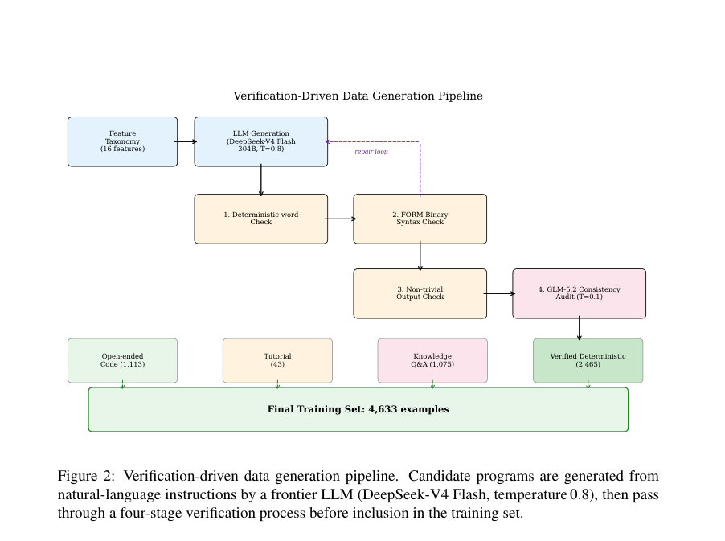
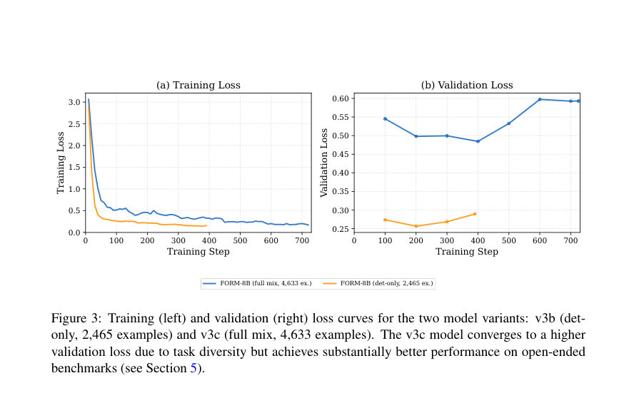
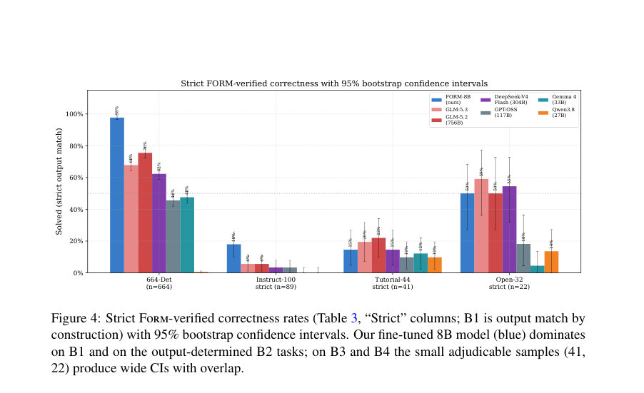

# LLM-Based FORM Code Generation with Verification-Driven Fine-Tuning

- **게시일:** 2026-09-22
- **arXiv:** [2609.23367v1](http://arxiv.org/abs/2609.23367v1) · [PDF](https://arxiv.org/pdf/2609.23367v1)
- **저자:** Bakar Chargeishvili
- **분야:** hep-ph, cs.CE, cs.CL
- **선정 점수:** 5.64
- **선정 이유:** 최근성 0.6, 인용 영향 0.0 (인용 0회), 저자 영향 0.0 (최고 h-index 0), AI 주제 적합성 2.9, 개발자 관심 0.2, 학술 신호 0.3, 오픈 웨이트·주요 연구조직 신호 1.6

[← 2026-09-22 목록으로 돌아가기](../daily/2026-09-22.html)

<!-- paper-visuals:start -->
## 주요 Figure

> 원문 PDF에서 실제 Figure 캡션과 그림 영역이 함께 확인된 자료만 자동 추출했다.

*Figure · 원문 PDF 5쪽 · Figure 2: Verification-driven data generation pipeline. Candidate programs are generated from*

*Figure · 원문 PDF 9쪽 · Figure 3: Training (left) and validation (right) loss curves for the two model variants: v3b (det-*

*Figure · 원문 PDF 12쪽 · Figure 4: Strict Form-verified correctness rates (Table 3, “Strict” columns; B1 is output match by*

<!-- paper-visuals:end -->

## 한 문장 요약

Form 실행기를 검증 오라클로 활용해 4,633개의 검증된 학습 예제를 생성하고 QLoRA로 Qwen3-8B을 미세조정해 Form 코드 생성 성능을 크게 향상시킨 연구.

## 해결하려는 문제

Form은 입자물리학에서 매우 큰 대수식 처리를 위해 널리 쓰이는 도메인 특화 언어이나 인터넷 규모 코퍼스에 거의 등장하지 않아(즉, zero-resource) 기존 대형 LLM들은 문서·예시 없이 Form 코드를 첫 시도에서 올바르게 생성하지 못한다는 한계가 있다. 본 논문은 소형 모델을 어떻게 전문화(specialise)하여 Form 코드 생성에서 수백억~천억 파라미터급 전선 모델들을 능가할 수 있는지, 그리고 실행 기반 검증을 통한 데이터 생성·미세조정 방식의 효과를 묻는다.

## 핵심 기여

- Form 실행기(FORM 바이너리)를 검증 오라클로 사용하는 'verification-driven' 데이터 생성 파이프라인을 제안하고 이를 통해 4,633개의 검증된 학습 예제를 생성(범주: deterministic, open-ended, tutorial, knowledge Q&A).
- QLoRA(4-bit 양자화 + LoRA 어댑터)로 Qwen3-8B를 파인튜닝해 FORM-8B 모델을 만들고, 여러 벤치마크에서 frontier 모델들(최대 756B)보다 높은 실행률 및 엄격한 Form-검증 정답 일치(strict output-match) 성능을 보임.
- 평가 프레임워크(네 가지 보완적 벤치마크, 실행 기반 메트릭, Form-특화 factsheet를 사용한 LLM 심사, 부트스트랩 95% CI, 엄격한 Form-검증 정답 일치 메트릭)를 구축·공개.
- 데이터·모델 설계 관련 실험적 발견(검증된 데이터의 구성(composition)이 단순 규모보다 훨씬 중요하다는 점, deterministic 전용 데이터로는 open-ended 능력이 붕괴함)을 제시.
- 파인튜닝 후 일반적 추론·코딩 능력의 보존을 실험(MMLU, GSM8K, HumanEval에서 성능 저하 ≤2.6 pp)하여 QLoRA가 catastrophic forgetting을 크게 유발하지 않음을 보임.

## 접근 방법

* 논문 본문 기준으로 접근은 다음과 같다.
* (1) 데이터 생성: DeepSeek-V4 Flash(304B)를 사용해 각 Form 기능·난이도 셀(16개 기능 × 3수준)별 후보 프로그램을 자연어 지시문으로 생성하고, 4단계 검증(비결정어 단어 검사 → Form 바이너리 문법/실행 검사(FORM 5.0) → 비자명 출력 확인 → 독립 LLM(GLM-5.2, T=0.1) 일관성 감사)으로 합격한 것만 수집해 deterministic 2,465개, open-ended 1,050개, tutorial 43개, Q&A 1,075개 등 총 4,633개(검증·중복 제거됨)를 확보했다.
* (2) 파인튜닝: Qwen3-8B를 4-bit NF4로 양자화하고 LoRA(r=16, α=32, dropout=0.05)를 모든 선형층에 붙여 QLoRA로 학습(학습률 2e-4, epochs 5, 효율 배치크기 32, max seq len 2048, AdamW, Unsloth+TRL 프레임워크).
* 두 변형(v3b: deterministic-only 2,465 ex., v3c: full-mix 4,633 ex.)을 학습해 데이터 구성의 역할을 연구했다.
* (3) 추론·평가: 단일 시도(temperature=0) 제로-샷 프로토콜로 네 개 벤치마크(B1 664 deterministic, B2 Instruct-100, B3 Tutorial-44, B4 Open-32)를 실행기 기반과 LLM 심사(rubric)로 평가하고, 엄격한 Form-검증 정답 일치(strict output-match)는 Form 자체로 결과 차이를 0으로 만드는 방식(Local Z = (ref) - (gen);)으로 판정했다.
* 학습 시 모델의 'thinking mode'는 비활성화하여 직접 코드 출력을 유도했다.

## 주요 결과

- 학습 데이터: 총 4,633개 검증 예제(검증용 314개 분리). deterministic 서브셋 2,465개.
- 주요 벤치마크 구성: B1 664-Deterministic(정답 출력 기준), B2 Instruct-100(100개, strict은 출력결정 가능 89개), B3 Tutorial-44(44개, adjudicable 41개), B4 Open-32(32개, 출력결정 22개).
- FORM-8B(v3c, zero-shot, no docs) 성능(단일 시도, T=0): B1 정확도 97.7% [96.5,98.8]; B2 실행률(exec) 83.0%과 엄격 정답률(strict) 18.0% [10.1,25.8] (strict은 89개에 대해 계산); B3 실행률 43.2% strict 14.6% [4.9,26.8]; B4 실행률(루브릭) 56.2% strict 50.0% [27.3,68.2].
- 비교: GLM-5.2(756B, with docs) B1 75.5% [72.3,78.6]; GLM-5.3(756B) B1 67.8% [64.3,71.4]; DeepSeek-V4 Flash(304B) B1 62.3% [58.7,66.1]. FORM-8B는 B1 및 B2(엄격 정답 포함)에서 비중첩(즉, 통계적으로 유의한) 우위 보임(논문은 non-overlapping 95% CI와 McNemar 테스트 p≤0.007 보고).
- 제로-샷 발견: 문서 없이 평가할 경우 대부분의 전선 모델(최대 756B 포함)이 Instruct-100과 Tutorial-44에서 0%의 syntactic-valid 프로그램을 생산해 'Form은 LLM에 대해 진정한 zero-shot 언어'임을 확인했다(예외적으로 Open-32에서는 일부 큰 모델이 문서 없이도 일정 비율 해결). 문서를 넣어 평가한 전선 모델들과 본 연구 모델(문서 없음)의 비교였음에도 FORM-8B가 우위임을 보고함(즉, 강력한 어드밴티지).

## 한계

- 저자가 명시한 한계: (1) 열린 문제들에 대해 엄격한 정답 매칭이 가능한 소수의 adjudicable 사례만 존재(예: B2 strict은 89/100, B3 strict은 41/44, B4 strict은 22/32)해 표본이 작아 CI 폭이 넓음; (2) 인간 사용자를 대상으로 한 사용자 연구 미실시(실제 유용성 미검증); (3) 단일 베이스 모델(Qwen3-8B)만 사용되어 다른 베이스에서 결과가 달라질 수 있음; (4) 벤치마크와 모델을 동일 저자가 구성해 편향 가능성(benchmark-model alignment); (5) 생성 코드의 실행 시간/성능(런타임 최적화)은 평가하지 않음.
- 본문에서 합리적으로 확인되는 추가 제약: (a) 엄격 정답률과 실행률 사이의 큰 격차('runs are not solutions')가 나타나며, 특히 많은 Instruct-100 지시문은 불완전하게 명세되어 있어 정답 판정이 보수적(lower bound)임; (b) 단일 시도·제로샷 평가 프로토콜은 실제 반복적·대화적 코딩 워크플로우를 충분히 반영하지 못함; (c) 공개 API 기반의 상용 모델(GPT-4/5, Claude 등)은 비용·재현성 문제로 평가에서 제외되어 비교가 완전하지 않음.

## 개발자 관점

- 도메인 특화(‘zero-resource’) DSL에서는 검증된 작업 특화 데이터(실행 오라클로 생성·검증)가 파라미터 수보다 더 큰 성능 이득을 줄 수 있다—소형 모델+검증 데이터가 수백B 모델을 능가할 수 있음.
- 실행 오라클(Form 바이너리)을 이용한 4단계 검증(비결정어 필터 → 문법/실행 검사 → 비자명 출력 검사 → 독립 LLM 일관성 감사)의 조합은 고품질 레이블 없는(라벨링 없는) 데이터 생성에 실용적이고 자동화 가능하다.
- 파인튜닝 구성(논문에 명시된 하이퍼파라미터): QLoRA(NF4 4-bit 양자화), LoRA r=16, α=32, dropout=0.05, lr=2e-4, epochs=5, eff. batch=32, max seq len=2048, AdamW, Unsloth+TRL—구현·재현에 필요한 상세 설정들이 본문에 제공되어 실무 재현성이 높음.
- 리소스·비용 측면: 본 연구의 QLoRA 파인튜닝은 1×A100-40GB에서 약 35분으로 보고되어 비교적 저렴·저지연으로 도메인 특화 모델을 만들 수 있음(전체 파라미터 고정, LoRA만 학습).
- 배포·사용 관점: 실전 에이전트 파이프라인에서는 Form 관련 서브태스크를 소형 전문 모델로 라우팅하는 것(서술된 smart-routed 에이전트 사례)이 문서 주입을 반복하는 것보다 토큰·시간 비용을 절감하고 코드 품질을 높임; 배포시에는 Form 바이너리와의 안전한 샌드박스 실행 환경이 필요하다(코드 실행 보안, 무한 루프·파일 시스템 접근 등).

**근거 범위:** 이 분석은 사용자가 제공한 논문 PDF 본문(페이지 1–27 전체 텍스트)에 근거해 작성되었다. 수치는 본문에 명시된 표와 본문 서술에서 직접 추출한 것이며, 저자가 명시적으로 언급하지 않은 추가 세부 구현(예: 내부 전처리 스크립트의 세부 동작)이나 저자 외부에서 재검증되지 않은 주장에 대해서는 생성하지 않았다. 본문에 나온 수치·하이퍼파라미터·벤치마크 구성은 PDF 텍스트에서 확인 가능한 내용만 포함했다.
