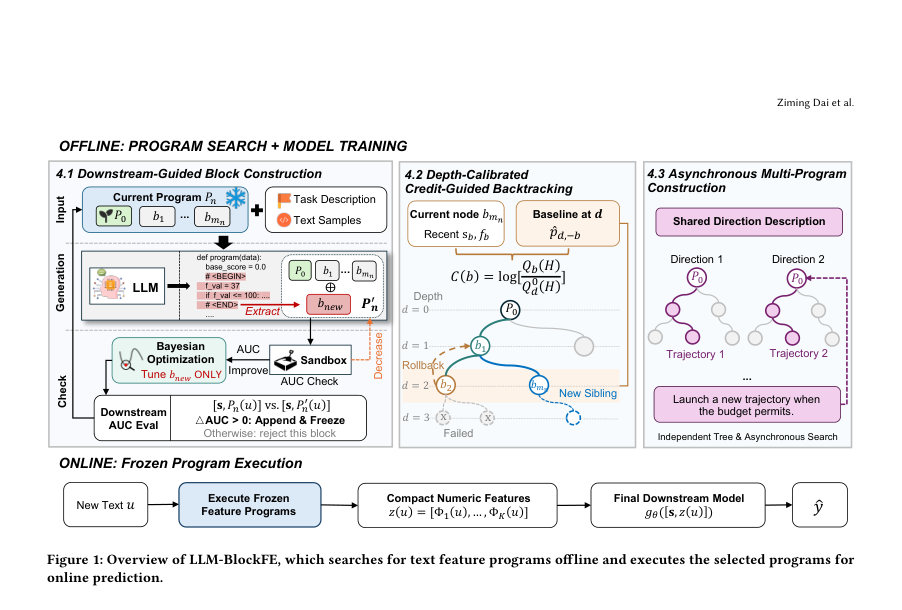
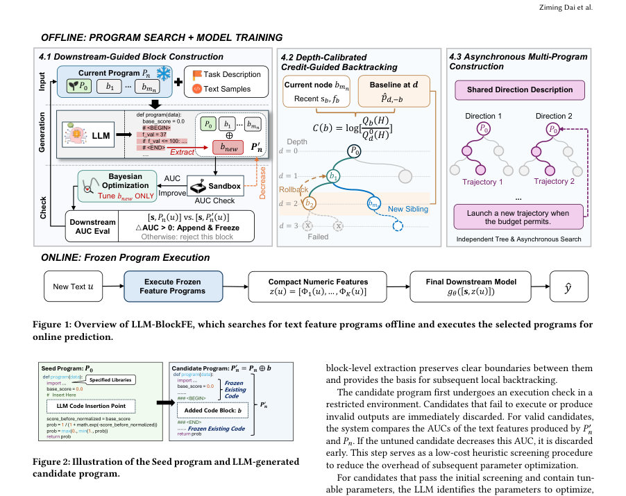
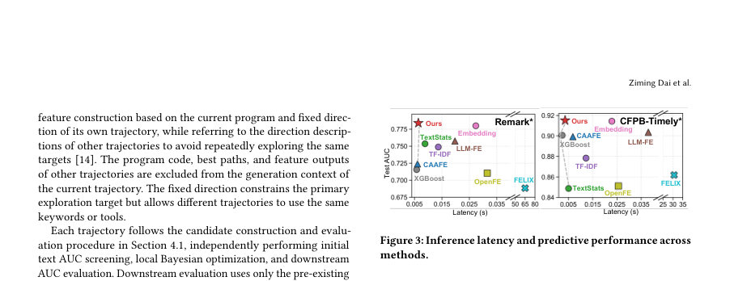

# Long Text to Predictive Features: LLM-Guided Blockwise Feature Engineering via Executable Program Search

- **게시일:** 2026-10-09
- **arXiv:** [2610.12390v1](http://arxiv.org/abs/2610.12390v1) · [PDF](https://arxiv.org/pdf/2610.12390v1)
- **저자:** Ziming Dai, Dabiao Ma, Ziheng Guo, Jack Dong, Zimu Zhou
- **분야:** cs.LG, cs.CL
- **선정 점수:** 6.13
- **선정 이유:** 최근성 1.3, 인용 영향 0.0 (인용 0회), 저자 영향 0.0 (최고 h-index 0), AI 주제 적합성 3.0, 개발자 관심 1.1, 학술 신호 0.8, 오픈 웨이트·주요 연구조직 신호 0.0

[← 2026-10-09 목록으로 돌아가기](../daily/2026-10-09.html)

<!-- paper-visuals:start -->
## 주요 Figure

> 원문 PDF에서 실제 Figure 캡션과 그림 영역이 함께 확인된 자료만 자동 추출했다.

*Figure · 원문 PDF 4쪽 · Figure 1: Overview of LLM-BlockFE, which searches for text feature programs offline and executes the selected programs for*

*Figure · 원문 PDF 4쪽 · Figure 2: Illustration of the Seed program and LLM-generated*

*Figure · 원문 PDF 6쪽 · Figure 3: Inference latency and predictive performance across*

<!-- paper-visuals:end -->

## 한 문장 요약

LLM-BlockFE는 오프라인에서 LLM을 이용해 긴 텍스트로부터 실행 가능한 코드 기반 특징(feature) 프로그램을 합성하고, 온라인에서는 이 동결된 프로그램만 실행해 지연 없이 구조화된 예측 특성을 제공하는 블록 단위 증분 탐색 프레임워크이다.

## 해결하려는 문제

산업용 리스크 제어 시스템은 빠르고 유지보수하기 쉬운 구조화된 탭형 모델(XGBoost 등)을 주로 사용하지만, 고객 응대 대화·신고문 등 긴 비정형 텍스트에 유의미한 리스크 신호가 포함되어 있다. 수동 규칙 설계는 비용이 크고, 샘플별 실시간 LLM 호출은 고비용·고지연으로 산업 배포에 부적합하다. 따라서 긴 텍스트에서 해석 가능하고 배포 가능한 구조화된 특성을 자동으로 생성하되, 온라인에서 LLM 호출을 전혀 필요로 하지 않는 방법이 필요하다.

## 핵심 기여

- 긴 텍스트 특성 공학을 ‘오프라인에서 실행 가능한 프로그램 합성’ 문제로 공식화하고, 생성된 프로그램을 온라인에서는 LLM 없이 바로 실행하도록 하는 LLM-BlockFE 프레임워크를 제안함.
- 완전 생성(complete program generation) + 블록 단위 추출/동결(append-only blocks) 프로토콜을 도입해 지역적 변경의 일관성 유지와 롤백이 가능한 증분 코드 구성 절차를 설계함.
- 깊이 보정(depth-calibrated)된 신용(credit) 기반 블록 수준 롤백 메커니즘을 제안하여, 단일 경로의 탐색이 조기 선택에 갇히는 문제를 완화함(베타-베르누이 모델, 경험-베이스라인 및 Jeffreys 스무딩 사용).
- 고정된 탐색 방향 설명을 공유하며 다수의 독립 탐색 궤적을 비동기·교호적으로 전개하여 중복 탐색을 줄이고 다양한 텍스트 신호를 발굴함.
- 실험(공개 2개, 비공개 2개)과 5개 실서비스 배포를 통해 오프라인 AUC와 온라인 KS(모니터링)에서 일관된 성능 향상을 보고함.

## 접근 방법

* 아키텍처 개요: (1) Seed Program P0를 정의(입력·출력 인터페이스·코드 삽입 지점·허용 라이브러리).
* (2) 각 탐색 궤적은 P0에서 시작하여 LLM이 완전 프로그램을 생성하면 정해진 마커(<BEGIN>...<END>)로 추가 블록 b를 추출하고, 기존 코드의 불허 변경을 검사한 뒤 블록만을 append(동결)한다.
* 알고리즘 흐름: (a) 후보 프로그램 실행 검사(sandbox) → (b) 초벌 텍스트-AUC 스크리닝(비용 절감용) → (c) 블록 내 튜닝 가능한 파라미터가 있으면 LLM이 식별한 범위로 Bayesian optimization 수행(블록 내 파라미터만 변경) → (d) 경량 고정 구성 XGBoost를 사용해 Dfit으로 학습, Dval로 AUC 평가하여 ΔAUC(조건부 향상)를 계산(식 (7)).
* ΔAUC>0이면 블록을 수용·동결.
* 탐색 제어: 각 노드(블록)의 최근 성공/실패 통계를 베타-베르누이로 모델링하고(depth-specific baseline via empirical-Bayes with κ), H 시도 내 유효 자식 생성 확률 Q_b(H)를 계산하여 같은 깊이의 기준 Q0_d(H)와의 비율 R_b에 대해 크레딧 C(b)=log R_b를 정의, R_b<ρ이면 한 단계 롤백.
* 병렬성/범위: K(실험 설정에서 5)개의 비동기 독립 궤적을 전개하고, 각 궤적은 최초 수용 블록으로 탐색 방향을 고정하여 다른 궤적의 방향 설명만 공유(코드·경로·출력은 공유하지 않음).
* 학습·평가 프로토콜: 데이터 분할 60% train / 20% val / 20% test; Dfit⊂Dtrain으로 후보 평가(모델 학습), Dval로 비교; 최종은 모든 동결된 최적 프로그램 출력과 기존 구조화 변수 s를 합쳐 Ddown으로 학습 후 Dtest 평가.
* 구현 세부(본문에서 확인된 설정): 생성 LLM은 Seed-OSS-36B-Instruct(temperature=0.1), 탐색 트래젝토리 K=5, 라운드당 LLM에 20개 샘플 제공, 최대 깊이 5, 베이지안 옵트로 블록 파라미터 튜닝.

## 주요 결과

- 데이터셋: 공개 CFPB-Timely(200k 샘플, 7 구조화 피처), GossipCop(6,344 샘플), 비공개 Remark(100k, 32 구조화), Report(100k, 5 구조화). 실험 분할 60/20/20, 5 시드 평균 보고.
- 오프라인 AUC: 논문 본문 비교에서 LLM-BlockFE는 네 개 데이터셋에서 모든 경쟁 기법 중 최고 성능을 기록. 논문이 명시한 각 데이터셋에 대한 '가장 강한 베이스라인 대비 절대 AUC 개선'은 0.0069 ~ 0.0358(데이터셋별 개선값: 최대 0.0358, 최소 0.0069). (Table 1에서 예: CFPB-Timely 최종 AUC 0.8881, GossipCop 0.9472, Remark 0.6804, Report 0.5545).
- 온라인 배포(실서비스) 결과: 5개 금융 리스크 제어 응용에서 2025-09 ~ 2025-11 기간 총 15개 애플리케이션-월 비교에서 기존 수작업 전략 대비 KS가 모든 비교에서 향상(절대 개선 0.02 ~ 1.56 percentage points).
- 온라인 A/B 사례: 약 10억 RMB 대출 집행 대상 실험에서 처리군의 누적 부실률(bad debt rate)이 8.0%→7.7%로 유의미히 감소(승인자 수 변화 없음).
- 지연·배포 비용: 온라인 추론은 동결된 프로그램 실행만으로 이루어져 '온라인 LLM 호출 없음'과 '밀리초 수준의 추론 지연'을 본문에서 보고(대규모 동시성 환경에 GPU 불필요).

## 한계

- 저자가 명시하거나 본문에서 직접 확인되는 한계: (1) 생성 모델(LLM) 선택에 성능 차가 존재함 — 본문은 Seed-OSS-36B-Instruct, Qwen3.5-27B, DeepSeek-R1 간 성능 차를 보고함(개선 폭 차이 존재). (2) 본 연구의 평가 과제는 이진 분류 위주(금융 리스크 중심)로 설정되어 있으며, 저자도 다른 감독학습 설정으로의 확장 가능성을 언급하였으나 본문 실험은 주로 바이너리 문제에 한정됨.
- 추론 가능한/본문에서 합리적으로 확인되는 제약(저자가 직접 '한계'로 명시하지 않은 것): (1) 오프라인 단계에서 LLM 호출·Bayesian optimization·다중 궤적 탐색 등의 계산 비용과 운영 복잡도가 발생하며, 대규모·자주 갱신되는 도메인에서는 오프라인 리소스 부담이 클 수 있음. (2) 자동 생성된 코드의 안전성·보안·비즈니스 규칙 적합성은 수동 리뷰가 필요하며, 본문은 실행 검사·불허 변경 정책을 도입하지만 완전 자동화된 안전 보장은 아님. (3) 텍스트 분포 변화(도메인 시프트) 시 동결된 프로그램의 유효성이 저하될 수 있으며, 주기적 재탐색·재학습 정책이 필요함(본문에서 재학습 스케줄링에 대한 구체적 언급은 없음).

## 개발자 관점

- 온라인 지연과 비용을 최소화하려면 LLM-BlockFE의 핵심은 '오프라인으로 모든 LLM 작업을 끝내고 온라인에서는 동결된 코드만 실행'하는 설계임 — 배포 환경은 GPU 불필요, 추론은 밀리초 단위로 가능하므로 대량 동시성 산업 적용에 적합함.
- 재현을 위해 필요한 구성요소(본문 근거): Seed program P0 인터페이스(입력/출력/삽입지점), LLM(Seed-OSS-36B-Instruct 등), 후보 실행용 샌드박스, 블록 파라미터 최적화용 베이지안 옵티마이저, 평가용 경량 XGBoost(고정 하이퍼파라미터), 데이터 분할(Dfit/Dval/Dtest). 본문 Appendix에 기본 하이퍼파라미터 제공(W=12, H=3, κ=4, ρ=0.5, p0=0.1).
- 안전·신뢰성 관행: LLM이 전체 프로그램을 생성하되 지정 마커로 추가 블록만 추출하고 '원본 코드의 임의 변경 시 후보 거부' 규칙을 반드시 적용하라. 후보에 대해 문법/실행 검사(sandbox)와 downstream AUC 게이트를 통해 예측 유효성을 확인하고, 코드 리뷰·정책 검토 절차를 운영할 것.
- 운영 비용·모니터링: 오프라인 탐색(LLM 호출, 파라미터 튜닝)은 비용이 크므로 탐색 예산(트래젝토리 수 K, 최대 깊이, LLM 라운드 수)을 비즈니스 가치 대비 설정하라. 배포 후에는 KS·A/B 모니터링과 텍스트 분포 감시를 통해 동결 프로그램의 성능 저하 시 재탐색·업데이트 정책을 수립하라.
- 구현 팁: 블록 단위로 파라미터를 기록·버전관리하고, 각 블록의 수용 시점에 대해 ΔAUC 등 메트릭을 로깅해 블록별 기여도를 추적하라. 탐색 안정성을 위해 depth-calibrated credit (κ, W, H)와 rollback threshold ρ 값을 실험적으로 튜닝하라.

**근거 범위:** 본 분석은 제공된 논문 PDF 본문 전체(본문, 표, 그림 캡션, 부록)를 근거로 작성함. 실험 설정·수치(데이터 분할, AUC, KS 개선, 하이퍼파라미터 등)는 본문과 부록에 명시된 값을 직접 인용했음. PDF 추출 과정에서의 미세한 표기·문맥 누락 가능성은 있으나, 본문에 명확히 기재되지 않은 구현 세부(예: 내부 하이퍼파라미터 튜닝의 모든 값, 내부 샌드박스 구현 방식 등)는 임의로 보완하지 않았음을 밝힘.
