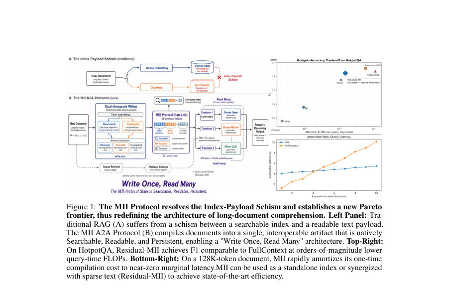
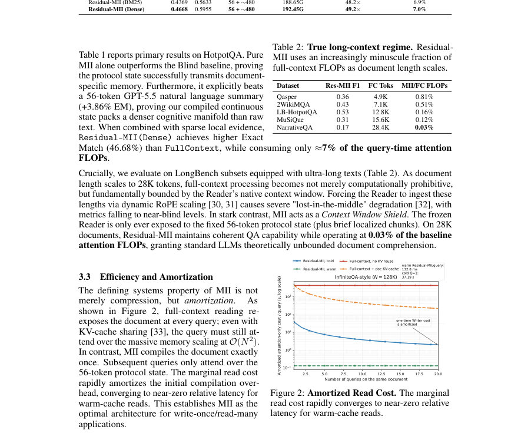
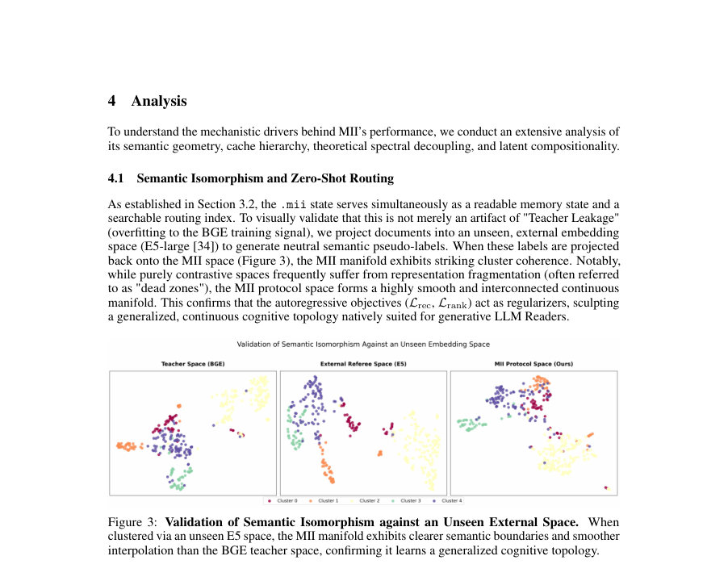

# Machine-Interpretable Information: Compiling Documents into Searchable and Readable Protocol States

- **게시일:** 2026-09-22
- **arXiv:** [2609.23371v1](http://arxiv.org/abs/2609.23371v1) · [PDF](https://arxiv.org/pdf/2609.23371v1)
- **저자:** Yifan Wang, Dejing Dou
- **분야:** cs.CL, cs.LG
- **선정 점수:** 6.65
- **선정 이유:** 최근성 0.6, 인용 영향 0.0 (인용 0회), 저자 영향 0.0 (최고 h-index 0), AI 주제 적합성 2.8, 개발자 관심 0.5, 학술 신호 0.3, 오픈 웨이트·주요 연구조직 신호 2.5

[← 2026-09-22 목록으로 돌아가기](../daily/2026-09-22.html)

<!-- paper-visuals:start -->
## 주요 Figure

> 원문 PDF에서 실제 Figure 캡션과 그림 영역이 함께 확인된 자료만 자동 추출했다.

*Figure · 원문 PDF 2쪽 · Figure 1: The MII Protocol resolves the Index-Payload Schism and establishes a new Pareto*

*Figure · 원문 PDF 5쪽 · Figure 2: Amortized Read Cost. The marginal*

*Figure · 원문 PDF 6쪽 · Figure 3: Validation of Semantic Isomorphism against an Unseen External Space. When*

<!-- paper-visuals:end -->

## 한 문장 요약

문서를 56-토큰 고정 대역폭의 연속적 프로토콜 상태(.mii)로 컴파일하는 Writer와, 이를 다양한 고정된 Reader의 임베딩 공간으로 투영하는 가벼운 Translator를 결합해 검색성·추론성·재구성성을 동시에 갖는 교차-모델 기계 판독 가능 문서 형식을 제안한다.

## 해결하려는 문제

기존 RAG 방식은 검색용 밀집 벡터(색인)와 추론을 위해 모델이 재입력해야 하는 긴 텍스트(페이로드) 사이의 근본적인 인덱스–페이로드 분리(index–payload schism)를 가졌고, 기존의 컨텍스트 압축 방법들은 특정 아키텍처에 묶인 비공유 내부 활성화(state)를 생성하여 교차-모델(interoperability) 전송이 불가능했다. 본 연구는 (i) 문서를 아키텍처에 독립적인 고정 대역폭의 기계 판독 가능 상태로 컴파일할 수 있는가, (ii) 그 상태가 검색(라우팅), 전역 메모리(추론), 상세 재구성(근거 제시)을 동시에 유지할 수 있는가, (iii) sparse 텍스트와 결합했을 때 완전 컨텍스트 처리 성능을 훨씬 낮은 비용으로 근접할 수 있는가를 탐구한다.

## 핵심 기여

- MII 프로토콜: 문서를 K=56 토큰의 고정 대역폭 연속 상태로 컴파일하는 A2A(Agent-to-Agent) 문서→상태 프로토콜을 제안하여 검색성, 추론성, 재구성을 단일 이식 가능 아티팩트로 통합함.
- 크로스-모델 가독성: GPT-2 토크나이저를 사용하는 Writer와 서로 다른 대형 LLM(예: Llama-3, Qwen, Mistral) 독립 Reader들 사이에서 Translator를 학습해 동일한 .mii 상태로부터 읽어낼 수 있음을 실증함.
- Residual-MII: 컴파일된 전역 기억(MD)과 질의-특정 희소 텍스트(RD(q))의 캐시 계층을 도입해 희소 텍스트와의 시너지로 단일-컨텍스트 처리 성능에 근접하면서 쿼리 시 주의 연산(Attention FLOPs)을 대폭 절감함.
- 메커니즘 분석: 이중 시계열(Dual-Timescale) Mamba Writer의 스펙트럼 분리, 은닉 은행(global/event/cover)의 역할 규명, 잠재공간의 외과적 이식(단일 엔티티 토큰의 이식/추적)과 다중 .mii 상태 연결으로 최대 5-hop의 잠재 추론을 달성한 모듈성·조합성 증거 제시.
- 시스템·형식 제안: .mii 파일 형식 초안과 수치적 민감도(예: bfloat16 필요성, INT8 양자화 실패)·컴파일·읽기 관점의 비용·연산 절감 Amortization을 시스템 관점에서 제시함.

## 접근 방법

* 주요 구성은 (1) Dual-Timescale Mamba 기반 Writer Wψ: 입력 문서 D를 GPT-2 토크나이저로 임베딩한 뒤 Slow/Fast 두 SSM(Mamba) 브랜치(각각 12층, 합쳐서 fusion dim=2048)를 병렬로 수행하고, 출력 H에서 세 가지 메모리 은행으로 MD를 구성한다(K=56: Global 16, Event 24, Cover 16).
* Global 은행은 학습된 쿼리로 문서-수준 의미를 집계하고, Event 은행은 fast-branch 변화량 δfast에 따라 상위 K 위치를 선택하며, Cover 은 은닉 시퀀스의 균등 샘플링을 담당한다.
* (2) Stage-1 학습: Writer는 (R1) 문서-레벨 BGE 정렬(Ldoc), (R2) 위치-조건 청크 검색 정렬(Lmsr), (R3) 경량 디코더를 통한 청크 토큰 재구성(Lrec) 및 스펙트럼 정규화 등으로 학습된다.
* (3) Translator Tϕ(r)와 Reader 바인딩(Stage-2): Writer와 Reader(고정)를 동결하고 Translator만 학습하여 P(r)D = Tϕ(MD)를 Reader 임베딩 공간으로 투영한 뒤 랭킹 손실(Lrank), anti-prior(Lanti), 생성 손실(Lgen) 등으로 최적화한다.
* (4) Residual-MII: 필요시 질의-특정 희소 텍스트 RD(q)를 P(r)D 뒤에 덧붙여 캐시 계층을 구성하여 고빈도·정확성 높은 세부 정보 재구성 보강.
* 구현 세부: Writer 활성 부품 약 ∼226M 파라미터, Translator(2 인코더 레이어 포함) 및 맵핑 계층 포함 시 총 ~0.5B 파라미터 규모; bfloat16 연속 값으로 .mii를 저장(.mii 포맷 초안 포함).

## 주요 결과

- HotpotQA(dev, 7,405 쿼리): Pure MII(프로토콜 상태만) EM=0.2986, F1=0.3794, Avg Attn FLOPs ≈10.89G (FLOPs 비율 vs FullContext ≈0.4%); 이는 Blind(문맥 없음)과 56-token 텍스트 요약(Summary-56, EM=0.2600)을 능가함(EM 차이 ≈+3.86%p).
- Residual-MII(Dense) (MII + Dense top-3 chunk residuals): EM=0.4668, F1=0.5955, Avg Attn FLOPs ≈192.45G, FLOPs 비율 약 7.0% (FullContext 대비). 이 수치는 FullContext(EM=0.4639, F1=0.6114, Avg Attn FLOPs=2.73T)에 대해 EM에서 근소하게 우세하면서 쿼리 시간 FLOPs를 ≈93% 절감한 결과임.
- Retrieval·스케일링 실험(표본): 문서 길이가 커질수록 Residual-MII의 FLOPs 이점이 증대. 예: NarrativeQA(28.4K tokens)에서 Residual-MII FLOPs 비율 0.03%; LongBench 서브셋(예: 2WikiMQA)에서도 낮은 비율(0.51% 등)을 보고함.
- 구조적/해석 실험: (i) Global 은행을 제거하면 Pure MII와 Residual-MII 모두에서 EM이 거의 붕괴(≈-99% EM 감소), Global 은행이 필수인 L1 캐시임을 확인. (ii) Event 은행은 Pure MII에서 오히려 노이즈로 작용해 제거시 성능 상승(+10.4% EM)하는 반면, Residual-MII에서는 Event 은행이 희소 텍스트와 결합될 때 성능을 개선함(복합적 역할 확인).
- 크로스-모델 가독성: 동일 .mii 상태에 대해 서로 다른 Reader(Qwen/Mistral/Llama-3 등)에 대해 Translator를 학습하면 읽을 수 있음(테이블과 실험에서 모델별 EM 수치 보고). 작가 측이 GPT-2 vocab(≈50K)을 사용하고 리더들이 >128K vocab를 쓰는 구조적 어긋남에도 Translator가 기하학적 정렬을 통해 교차-모델 해독을 가능하게 함.

## 한계

- 저자 명시(논문 본문): (1) 경험적 비손실성 격차 — 현재 K=56, bfloat16 형식임에도 불구하고 희귀 엔티티의 문자 그대로 재구성은 Residual-MII(희소 텍스트 캐시)가 필요하며 이는 본 연구의 0.2B급(또는 총 ≈0.5B) 프로토타입 Writer 용량과 Translator 정렬 마찰 때문이라고 주장함.
- 저자 명시: (2) 고정 대역폭 병목 — 엄격한 K=56 규격은 VBR(가변 비트레이트) 유연성이 없어 매우 밀집한 문서에서는 과압축, 희소한 문서에서는 대역폭 낭비를 유발할 수 있음.
- 저자 명시: (3) 파라메트릭 메모리 얽힘 — Reader의 거대한 파라메트릭 메모리와 .mii에서 디코딩되는 지식의 완전한 분리는 어려우며, 잠재적 파라메트릭 환각(parametric hallucination) 문제를 완전히 배제하려면 반사실적(counterfactual) 추가 평가가 필요함.
- 실험적 제약(본문 기반 관찰): 주요 정량 실험은 HotpotQA 및 LongBench 일부 서브셋에 집중되어 있어 다른 도메인(예: 코드, 법률 문서, 멀티모달 문서)으로의 일반화는 본문에서 직접 입증되지 않음; 또한 하드웨어·학습 시간·에너지 비용의 절대 수치(예: 전체 컴파일 비용, GPU 시간/비용에 대한 구체적 값)는 상세히 제공되지 않음.

## 개발자 관점

- 재현성: 아키텍처·학습 하이퍼파라미터 대부분이 부록에 공개되어 있음 — Writer는 dual-branch Mamba(각 12층, d_model=1024, state expansion factor=2, d_state=16), 초기화된 step-size bias(∆slow=-1.5, ∆fast=+0.5), 메모리 은행 배분(16/24/16), Stage-1 옵티마이저 AdamW lr=2e-4, 배치 유효치 16, 그래디언트 클리핑 1.0 등은 구현 복제에 직접 유용함.
- 모델·파라미터 비용: 컴파일(Writer) 파이프라인 전체는 약 ∼0.5B 파라미터(Writer 활성 부품 ≈226M, Translator 포함 약 277M) 규모로 제시되어, 동일 대역폭을 생성하는 기존 7B급 autoencoder 접근보다 파라미터·추론 비용 측면에서 효율적임. 단, Writer 용량 확장이 성능(재구성 손실)에 민감함(스케일업으로 Lrec 개선 보고).
- 숫자 정밀도 요구: .mii 연속 상태는 높은 정보 밀도로 동작하므로 bfloat16 같은 부동소수점 정밀도를 요구하며, 8-bit 양자화(예: INT8) 실험에서 QA 성능이 완전 붕괴했다고 보고되어 실서비스 배포시 양자화·저장·전송 손실에 주의해야 함.
- 운영·시스템 설계: .mii 파일 포맷(헤더 메타데이터+연속 페이로드)을 통해 검색(centroid in header)과 로드-온-디맨드 전략을 분리할 수 있어 대규모 DB(FAISS 등)에 적합; Writer는 오프라인(또는 배치)으로 컴파일하고 Reader는 O(K)로 쿼리 처리하여 write-once/read-many 워크플로에 적합함.
- 보안·배포: 논문은 암호학적 소금(salt)/서명 필드를 명시한 .mii 스키마 초안을 제공함 — 민감한 지식의 A2A 배포를 고려할 때 컴파일 시 암호화 키를 주입하는 방식으로 권한 있는 Translator만 디코딩하도록 설계 가능함(추가 연구·감사 필요).

**근거 범위:** 분석은 제공된 논문 PDF 본문(초록보다는 본문, 부록 포함)의 텍스트를 근거로 작성함. 본문에 수록된 표(예: HotpotQA Table 1), 아키텍처·하이퍼파라미터(부록 A), .mii 포맷(부록 D) 및 분석 섹션을 직접 참조하였음. 다만 실험의 전체 학습 인프라(총 GPU 시간·비용·시드 재현성 등)와 일부 미세 구현 세부(예: 정확한 학습 스케줄표의 모든 단계, 하드웨어별 성능)는 PDF에 상세 수치로 기재되지 않아 해당 항목에 대해선 보수적으로 기술했음.
