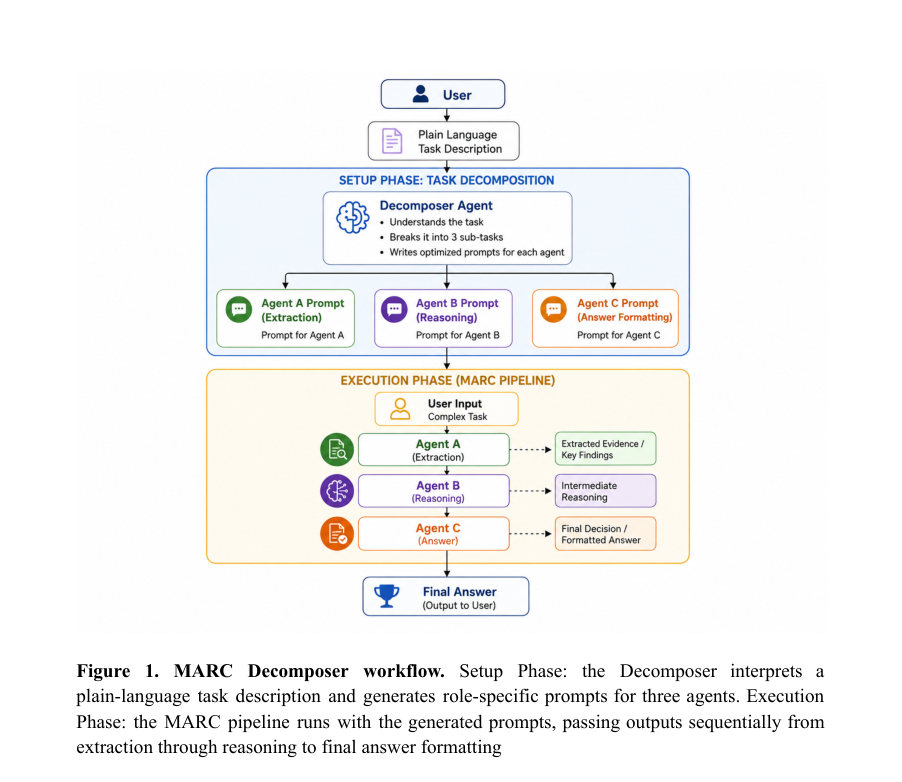
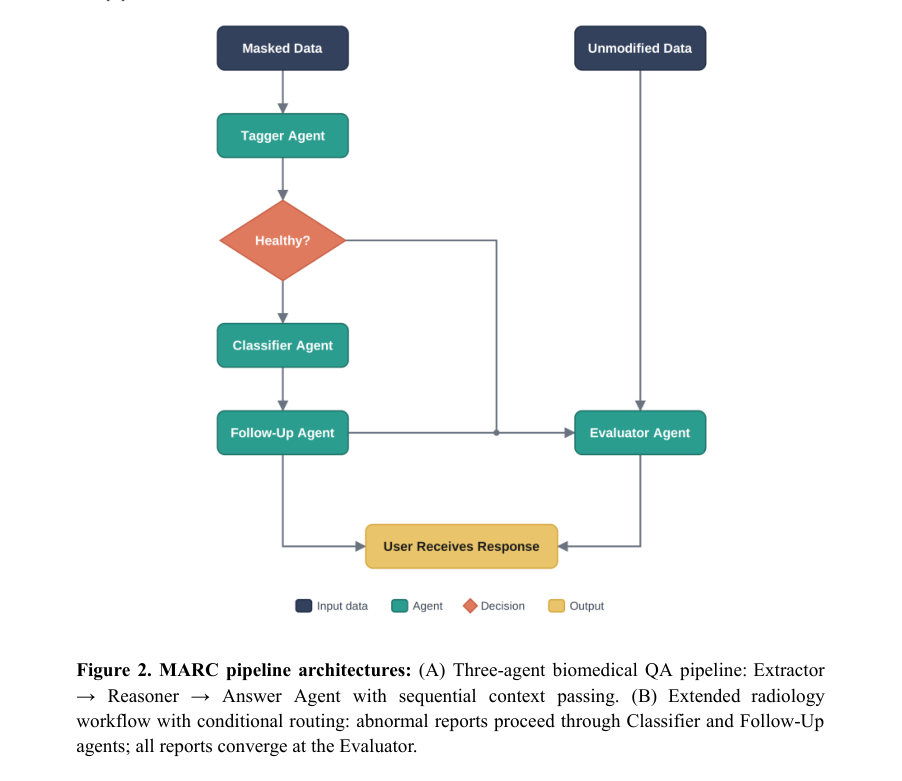
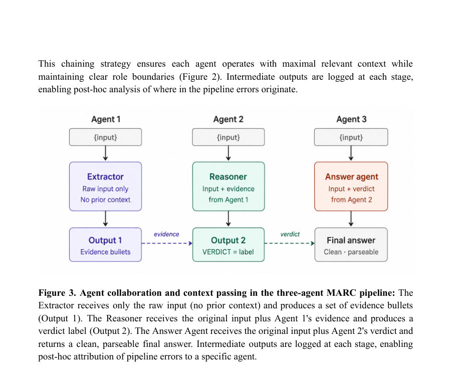

# MARC v1: An Open-Source Multi-Agent Framework for Clinical AI Reasoning and Coordination

- **게시일:** 2026-08-14
- **arXiv:** [2608.13476v1](http://arxiv.org/abs/2608.13476v1) · [PDF](https://arxiv.org/pdf/2608.13476v1)
- **저자:** Saisha Shetty, Satvik Tripathi, Austin Lin, Colin Zhao, Theodore Kim, Don Enwerem, Jacinta Arnold, Shahriar Faghani, Tessa S Cook
- **분야:** cs.AI, cs.CL
- **선정 점수:** 6.96
- **선정 이유:** 최근성 0.8, 인용 영향 0.0 (인용 0회), 저자 영향 1.8 (최고 h-index 24), AI 주제 적합성 3.0, 개발자 관심 0.9, 학술 신호 0.5, 오픈 웨이트·주요 연구조직 신호 0.0

[← 2026-08-14 목록으로 돌아가기](../daily/2026-08-14.html)

<!-- paper-visuals:start -->
## 주요 Figure

> 원문 PDF에서 실제 Figure 캡션과 그림 영역이 함께 확인된 자료만 자동 추출했다.

*Figure · 원문 PDF 4쪽 · Figure 1. MARC Decomposer workflow. Setup Phase: the Decomposer interprets a*

*Figure · 원문 PDF 5쪽 · Figure 2. MARC pipeline architectures: (A) Three-agent biomedical QA pipeline: Extractor*

*Figure · 원문 PDF 7쪽 · Figure 3. Agent collaboration and context passing in the three-agent MARC pipeline: The*

<!-- paper-visuals:end -->

## 한 문장 요약

MARC v1은 임상 AI 작업을 단일 프롬프트 대신 역할별 결정론적 다중 에이전트 파이프라인으로 구성해 추론·추출·응답·평가를 분리하고 YAML 기반 설정과 Decomposer로 작업별 에이전트 프롬프트를 자동 생성하는 오픈소스 프레임워크이다.

## 해결하려는 문제

기존 임상용 LLM 시스템은 한 번의 프롬프트로 추출, 추론, 검증, 응답 생성을 동시에 수행하여 내부 실패 원인(추출 오류 vs 추론 오류 등)을 파악하기 어렵고, 수동 프롬프트 엔지니어링과 코드 변경 없이 파이프라인을 재구성하기 어려우며, 기관 환경에서 외부 API 의존성으로 인한 데이터·프라이버시 제약을 받는다.

## 핵심 기여

- 역할별(추출·추론·응답·평가) 에이전트를 순차적으로 연결하고 중간 출력을 로깅하여 단계별 실패 귀속(stage-wise failure attribution)을 가능하게 하는 다중 에이전트 임상 프레임워크(MARC) 설계 및 구현.
- 자연어로 된 작업 설명을 받아 세부 에이전트와 역할별 프롬프트 템플릿을 자동 생성하고 구조적 제약(변수 바인딩, VERDICT 포맷, 길이 제한)을 검증하는 Decomposer 모듈 제안.
- 에이전트 정의, 모델 할당, 프롬프트, 지식(옵션 RAG) 등을 YAML 구성 파일로 외부화하여 코드 변경 없이 파이프라인을 재구성할 수 있도록 한 선언적 구성 방식.
- 온프레미스 CPU 호환(예: Ollama + MedGemma 4B)과 API 기반(예: Google Gemini 계열) 양쪽 배포 모드를 지원해 기관별 데이터 통제와 모델 교체를 용이하게 함.
- 에이전트 수준에서 온톨로지적 역할·출력 제약(제로샷, temperature=0, verdict 라인 등)을 적용해 결정론적·재현가능한 파이프라인 실행을 보장.

## 접근 방법

* MARC는 Python으로 구현된 순차적 다중 에이전트 아키텍처(레벨 2 자율성)를 사용한다.
* 각 에이전트는 언어 모델, 역할별 프롬프트 템플릿, 선택적 RAG 모듈을 갖고 agents.yaml에 선언적으로 정의된다.
* 기본 3-에이전트 파이프라인은 (1) 정보 추출기: 원문에서 2–4개의 증거 불릿을 추출(결론 금지), (2) 분류·분석(Reasoner): 원문과 추출 결과를 받아 다단계 추론 후 표준화된 verdict 라인으로 결론 출력, (3) 응답 생성기(Answer Agent): Reasoner의 verdict 라인을 찾아 순수한 레이블만 반환하도록 역할을 분리한다.
* 모든 에이전트는 제로샷 temperature=0으로 실행되어 결정론적 결과를 산출하며, 프롬프트 템플릿은 네 가지 구성요소(역할 정의, 작업 지시, 출력 제약, 런타임 변수)를 갖는다.
* Decomposer는 MedGemma 4B를 사용해 단일 대화 턴에서 작업을 세 하위과제로 분해하고 에이전트 명, 역할, 프롬프트 템플릿을 포함하는 JSON 사양을 생성하고 구조적 제약을 검증해 파일로 저장한다.
* 런타임 변수는 {input}과 {previous_agent_output}을 통해 명시적으로 전달되며, Agent 2의 verdict 포맷(e.g., "VERDICT = <label>")을 Agent 3이 그대로 추출하도록 설계되어 후처리 파싱을 최소화한다.
* 프레임워크는 LangChain을 통해 다양한 모델과 연동되며, 구성 파일만 수정해 모델 식별자(예: gemini-2.0-flash, gemini-1.5-flash, MedGemma 4B)를 교체할 수 있다.

## 주요 결과

- 논문은 MARC의 설계·구현과 세 가지 대표적 사용 사례(생의학 질문응답, 방사선 보고서 생성, Decomposer를 통한 작업 적응형 파이프라인 생성)를 기술하고 해당 파이프라인 아키텍처와 흐름을 상세히 제시함.
- 구체적 정량적 성능 지표(정확도, F1, latency, 비용 등)나 광범위한 벤치마크 비교는 본문에서 제공되지 않음. 저자는 향후 다양한 임상 작업·데이터셋·모델 백엔드를 통한 종합적 평가가 필요함을 명시함.
- 프레임워크는 MedGemma 4B(오프라인/Ollama)와 Google Gemini 계열(API)를 사용해 테스트되었음을 본문에서 보고함(구체적 데이터셋·실험 설정·수치 미기재).

## 한계

- 저자가 명시한 한계: 현재 기본 구현은 순차적 에이전트 실행에 집중하여 병렬 실행, 동적 라우팅, 이견 해결, 반복적 정제 루프 등 더 유연한 오케스트레이션이 필요할 수 있음. 또한 본 논문은 프레임워크 설계와 대표적 사용 사례 중심이며 포괄적 실험·정량적 벤치마크를 제공하지 않음(성능·비용·지연·오류 국지화에 대한 비교 부재).
- 본문에서 확인되는 추가 제약(합리적 관찰): (1) 실제 임상 데이터·PHI 처리 사례와 관련한 보안·규제 준수 절차(감사 로그, 접근 제어 등)는 상세히 기술되지 않음, (2) 결정론적 설정(temperature=0)과 포맷 제한은 재현성을 높이나 창의적 추론이 필요한 일부 작업에서는 성능 제약을 초래할 수 있음, (3) Decomposer가 MedGemma 4B를 사용한다는 기술적 의존성으로 인해 해당 모델의 한계(도메인 범용성·오류 전파)가 파이프라인 설계에 영향을 줄 수 있음.

## 개발자 관점

- 구성·프롬프트를 YAML과 별도 텍스트 파일로 분리(agents.yaml, prompts/)하고 LangChain을 사용하면 모델 교체와 파이프라인 재구성 시 코드 변경 없이 실험 속도와 유지보수성이 크게 향상된다.
- 에이전트 간 명시적 변수 바인딩({input}, {previous_agent_output})과 표준화된 verdict 포맷을 도입하면 중간 출력의 자동 파싱·에러 귀속이 용이해져 디버깅과 검증 작업이 수월해진다.
- 제로샷 temperature=0의 결정론적 실행은 재현성·감사 가능성을 제공하나, 실제 성능·유연성 트레이드오프를 평가해 에이전트별로 온도·프롬프트 전략을 다르게 적용할 필요가 있다.
- 로컬(Ollama + MedGemma 4B)과 API(Gemini) 양방향 배포를 지원하므로 기관 정책·비용·지연 요구사항에 따라 에이전트별 모델을 분산 배치하면 비용·프라이버시 균형을 맞출 수 있다.
- Decomposer로 작업별 자동 프롬프트 생성은 비개발자(임상의)가 파이프라인을 설계하는 데 유용하지만, 자동 생성 프롬프트의 품질 검증(구조·의학적 정확성)과 실패 시 수동 보완 워크플로우를 마련해야 한다.

**근거 범위:** 논문 PDF 본문 기반 분석임. 본 분석은 제공된 PDF 텍스트 전체(본문, 보충 설명, 부록)를 근거로 작성했으며, 논문이 제시한 설계·구성·배포·제한점은 본문에서 직접 인용 가능한 수준으로 정리함. 다만 논문은 정량적 실험 결과(수치, 데이터셋 세부, 비교 벤치마크)를 제공하지 않으므로 성능 관련 수치·비교는 보고되지 않았으며, 구현의 구체적 하이퍼파라미터·실행 로깅·사용자 연구(휴먼 팩터) 등은 PDF에서 명확히 확인되지 않아 본 문서에 포함되지 않았음.
