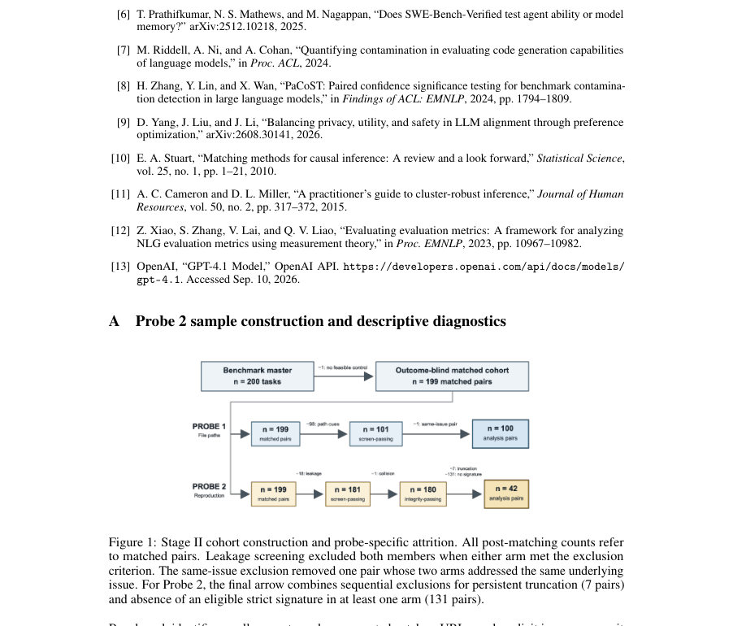

# Measurement-First Auditing of Agentic Leaderboards: Contamination Susceptibility, Matched-Control Re-evaluation, and Scorer Validation

- **게시일:** 2026-10-06
- **arXiv:** [2610.05830v1](http://arxiv.org/abs/2610.05830v1) · [PDF](https://arxiv.org/pdf/2610.05830v1)
- **저자:** Dishu Yang, Qi Su, Hongbo Qin, Hansong Zhang
- **분야:** cs.AI
- **선정 점수:** 6.05
- **선정 이유:** 최근성 0.9, 인용 영향 0.0 (인용 0회), 저자 영향 0.0 (최고 h-index 0), AI 주제 적합성 2.2, 개발자 관심 0.6, 학술 신호 0.8, 오픈 웨이트·주요 연구조직 신호 1.6

[← 2026-10-06 목록으로 돌아가기](../daily/2026-10-06.html)

<!-- paper-visuals:start -->
## 주요 Figure

> 원문 PDF에서 실제 Figure 캡션과 그림 영역이 함께 확인된 자료만 자동 추출했다.

*Figure · 원문 PDF 9쪽 · Figure 1: Stage II cohort construction and probe-specific attrition. All post-matching counts refer*

<!-- paper-visuals:end -->

## 한 문장 요약

공개 벤치마크의 오염(claim)을 훈련·평가·파이프라인 세 경로로 분리해 증거 수준별로 코딩하는 measurement-first 감사 프레임워크를 제안하고, 이를 HAL 전반의 소급증거 감사와 SWE-bench Verified에 대한 outcome-blind same-repository 매치드-컨트롤 재평가(대칭 누수 스크리닝·스코어러 검증 포함)에 적용해 취약성은 넓게 관찰되나 행동적 간격은 샘플·스코어러 한계로 결론 불확정임을 보였다.

## 해결하려는 문제

공개된 과제 진술과 해답 산출물이 공개 상태로 남아 있는 상황에서 리더보드 점수가 실제 문제 해결 역량을 반영하는지(추론) 아니면 기억·검색을 반영하는지(오염) 판별하려면 서로 다른 증거를 요구하는 여러 경로(훈련 시 노출, 평가 시 검색, 파이프라인/스캐폴드 누출)를 명확히 구분해야 한다. 기존 관찰(예: SWE-bench의 파일경로 성능 갭)은 불확실한 대안설명(저장소 구성, 이슈 길이, 패치 복잡도 등)과 검증되지 않은 스코어러에 의해 과도하게 해석될 수 있다.

## 핵심 기여

- 세 가지 오염 경로(훈련-시 노출, 평가-시 검색, 파이프라인/스캐폴드 누출)를 분리하고, 수정-핀(revision-pinned) 증거와 fail-closed 규칙에 따라 각 경로를 open/partial/closed/?로 코딩하는 measurement-first 취약성·사건 카드(프레임워크)를 제안함.
- Holistic Agent Leaderboard(HAL)의 9개 구성(configuration)에 대해 수정-핀 증거 기반 감사(Stage I)를 수행하여 채널별 취약성·확인된 사건을 표로 정리함(9구성×3채널 모두에서 'closed' 없음, 4개 구성에서 파이프라인 사건 확인).
- SWE-bench Verified에 대해 outcome-blind same-repository matched-control 재평가(Stage II)를 설계·실행: 대칭적 정답-누수 필터링, 쌍별 매칭(비재사용, 비용함수), 페어-가중 및 저장소-균형(포스트혼) 추정량과 클러스터 인식 불확실성 분석을 도입함.
- 재현(conditional reproduction) 스코어러에 대한 검증 절차(구성 음성-음성 검사, 인간 합의 레이블을 이용한 민감도·정밀도 평가)를 도입해 스코어러 검증 게이트를 통과하지 못하면 재현 대비는 기술적 진단으로 처리하도록 규정함.
- GPT-4.1·DeepSeek-V4-Flash를 대상으로 Probe 1(파일경로 식별)과 Probe 2(패치 행 회복)를 적용해 취약성은 관찰되나 Top-3 주요 간격은 신뢰구간에 의해 결론 불확정이며, 재현 스코어러가 검증 게이트를 통과하지 못해 재현 관련 가설들은 미결임을 보고함.

## 접근 방법

* 프레임워크 구성은 Stage I(수정-핀 provenance 감사)와 Stage II(행동적 매치드-컨트롤 재평가)로 나뉜다.
* Stage I: 각 HAL 구성에 대해 세 채널(T: training-time exposure, R: evaluation-time retrieval, L: pipeline/scaffold leakage)에 관해 사전정의된 관찰가능 전제조건과 문서화된 증거를 검색·핀하고, 증거 기준에 따라 O/P/C/?로 코딩(결손증거는 음성이 아님; fail-closed).
* 보조적으로 로컬 아티팩트 인벤토리, 40-쿼리 discoverability 검사, 테스트/비테스트 아티팩트 비교를 수행.
* Stage II: SWE-bench Verified의 테스트 분할에서 outcome-blind으로 same-repository 일대일 매칭(제한: merge 날짜 365일 이내, 변경 파일 수 차이 ≤1, 이슈 길이 30–1200 단어 등)하여 초기 199 페어를 구성(저장소별 매칭, 비용함수식(논문 Eq.3) 사용).
* 누수 필터링은 대칭적(pair-level): Probe1는 금지 기준으로 경로/베이스네임 노출이 양쪽 중 하나라도 있으면 페어 전체 제외; Probe2는 엄격한 'strict gold signature' 기준(공백 정규화 후 exact-line 일치 등)으로 페어 제외.
* Probe1(파일경로 식별) 주 지표는 Top-3 정확도(사전지정), 대비 추정량은 쌍-가중 평균 Δ_pair(Equation 1)와 포스트호크의 저장소-균형 Δ_repo(Equation 2).
* 불확실성은 사전지정 쌍별 퍼센타일 부트스트랩(10,000)과 포스트호크 t-구간(저장소별), 계층 부트스트랩, leave-one-repo-out 민감도 검사 사용.
* Probe2(조건부 재현)는 엄격한 정확-라인 스코어러와 재현 스코어러의 검증 게이트를 도입: 구성된 음수(다른 태스크의 잘못된 골드)로 거짓양성 검사, 인간 합의 라벨로 민감도·정밀도 추정(역확률 가중치 표본) — 사전계획에서는 민감도 수치 기준을 두지 않았으나 통과하려면 실증적 민감도 근거가 필요함.
* 실험 대상 모델은 GPT-4.1과 DeepSeek-V4-Flash, 디코딩은 temperature=0, 툴/브라우징/검색 비허용.

## 주요 결과

- HAL 감사(9구성): 훈련-시 노출(T)은 9개 모두 'partial'로 표기(모델별 시점 적격성 미상 등 이유), 평가-시 검색(R)은 7개 'open', 2개 'partial', 파이프라인 누출(L)은 4개 'open', 2개 'partial', 3개 'unknown'. 어떤 채널도 'closed'로 코딩되지 않음(결손증거는 unknown 처리).
- 확인된 사건: 파이프라인/스캐폴드 누출이 확인된 구성은 AssistantBench(현재), SciCode(현재), TAU-bench Airline(현재), USACO(과거)로 보고됨; 구성-스코프의 확인된 검색 사건은 보고되지 않음.
- Probe1(파일경로 식별): 매칭 후 대칭 누수 필터링과 동일-이슈 제외를 거쳐 100 페어(10개 저장소) 분석 대상 확보. GPT-4.1 Top-3 정확도는 0.710(벤치마크) vs 0.610(컨트롤), 쌍-가중 간격 +0.100 with 95% CI [−0.030, +0.230]; DeepSeek-V4-Flash Top-3은 0.640 vs 0.570, 간격 +0.070 [−0.070, +0.210]. 포스트호크 저장소-균형 및 계층 부트스트랩 구간 역시 모두 0을 포함하여 주요 Top-3 간격은 통계적 배제 실패(결론 불확정).
- 누수(프롬프트측) 탐지: 원문 일치 기반 검사에서 벤치마크 이슈 63/199(31.7%), 컨트롤 57/199(28.6%)에서 적어도 하나의 금본 경로·베이스네임이 존재해 대칭적 제외로 98페어(49.2%)가 제거되었음(검출은 문자적 매칭이므로 하한치).
- Probe2(재현 스코어러 검증): 엄격-스코어러 적용 가능한 페어는 42/199, 모델 출력 총 168개 중 스코어러 발화는 3건뿐. 인간 합의 레이블에 대한 검증 결과 스코어러 민감도 설득력 있게 입증되지 않음(DeepSeek 민감도 추정 0.00, GPT-4.1 0.19, 불확실도 큰 95% 구간), 두 DeepSeek 스코어러 발화는 인간-음성(거짓양성)으로 판정. 따라서 재현 관련 가설(H2,H3)은 검증 게이트 실패로 미결정이며 strict-score 대비는 기술적 관찰로만 보고됨. 결론적으로 본 연구는 훈련 데이터 멤버십, 오염 유병률, 벤치마크 유발 점수 인플레이션을 입증하지 않음.

## 한계

- 저자가 명시한 한계: (a) Probe2에서 인간-합의 양성 사례가 매우 적어 스코어러 민감도를 확증할 수 없음, (b) strict-scorer는 채점 대상 응답을 엄격히 규정해 솔루션 특정 리콜에만 유리하고 대체 구현을 벌점할 수 있음, (c) 수동 검토는 arm-블라인드였으나 모델 정체성과 스코어러 유도층은 노출되어 있어 검토자 편향 가능성, (d) Probe2 표본은 outcome-근접 기준으로 선택되어 모집단 대표성 부족, (e) 표본이 10개·9개 저장소에 클러스터되어 있어 통계적 힘이 제한적, (f) 평가된 모델은 두 개의 API 서비스에 국한되어 일반화 한계, (g) 컨트롤은 공개된 작업이지만 '노출되지 않음'이 확인된 음성 대조군이 아니므로 사전학습 노출 부재를 보장하지 못함, (h) API 생성은 고정 시드가 없어 완전한 재현 불가, (i) HAL 감사는 특정 리비전·증거 날짜에 국한되어 누락된 실행 흔적·구성 귀속 공백이 존재함.
- 추가로 본문에서 확인되는 한계(논문이 직접 언급하거나 본문 근거로 합리적으로 확인 가능한 제약): (a) 누수 탐지는 문자적(정확일치) 검사에 의존하므로 의미적 또는 부분적 누수는 과소검출될 가능성(하한치), (b) strict exact-line 스코어러 및 저장소-균형 추정치는 사후적(post-hoc) 도입으로 해석상 주의 필요, (c) 누수 스크리닝 자체가 분석 모집단을 변경하여(예: 잔존 이슈가 더 짧음·저장소 구성 변화) 결과의 일반화에 영향, (d) 사전규정 민감도 기준 부재로 스코어러 검증 게이트가 결과 해석에서 주관적 요소를 남김.

## 개발자 관점

- 벤치마크·허니니스(허니스) 감사를 설계할 때 리비전-핀된 증거와 증거 LEDGER(증거 ID·타임스탬프)를 확보해 채널별(훈련/평가/파이프라인) 가능한 경로를 분리·기록하라—결손 증거를 '격리' 증거로 잘못 해석하지 말 것.
- 행동 검증은 same-repository matched-control(비교 대조를 저장소 단위로 맞춤)과 대칭적 누수 필터링을 결과-블라인드로 적용해 프롬프트측 누수로 인한 편향을 줄여야 한다. 누수 필터가 분석 모집단을 변화시킬 수 있음을 명시적으로 진단하라.
- 재현(reproduction)과 같은 정성적 산출을 자동 스코어러로 측정하려면 사전에 민감도·특이도 기준을 정하고 독립 인간 합의를 통한 검증 샘플로 스코어러 민감도를 실증적으로 확인하라. 스코어러가 낮은 민감도·정밀도를 보이면 자동 대비는 기술적 관찰로만 취급해야 한다.
- 통계적 불확실성 처리에서 페어-가중 추정량 외에 저장소-균형 추정량·계층 부트스트랩·leave-one-repo-out 등 클러스터를 고려한 분석을 준비하라. 저장소 클러스터링과 샘플 크기(특히 소수 저장소)는 구간 너비에 큰 영향이 있다.
- 실험 재현성을 위해 매칭·샘플링·부트스트랩 시드와 고정된 기준(예: GPT-4.1 컷오프 날짜)을 문서화하고, 가능하면 API 호출의 고정 시드·완전한 출력 기록·실행 트레이스를 보존하라. 실행 흔적(trace)과 허니스 로그가 없으면 여러 판단이 unknown으로 돌아간다.

**근거 범위:** 논문 PDF 본문(제공된 전체 텍스트)을 기반으로 분석·요약함. 모든 수치(샘플 크기, 간격, 퍼포먼스 수치), 표기(채널 라벨, 사건 식별), 방법적 세부사항(매칭 기준·부트스트랩 복제수·검증절차 등)는 본문에서 직접 추출한 내용이다. 본 분석에서는 PDF에 명시되지 않은 구현 세부사항이나 추가 수치(저자가 직접 언급하지 않은 임계값 등)는 생성하지 않았으며, 사후적(post-hoc) 선택과 원문에 적시된 한계는 본문 근거로 구분해 기술함.
