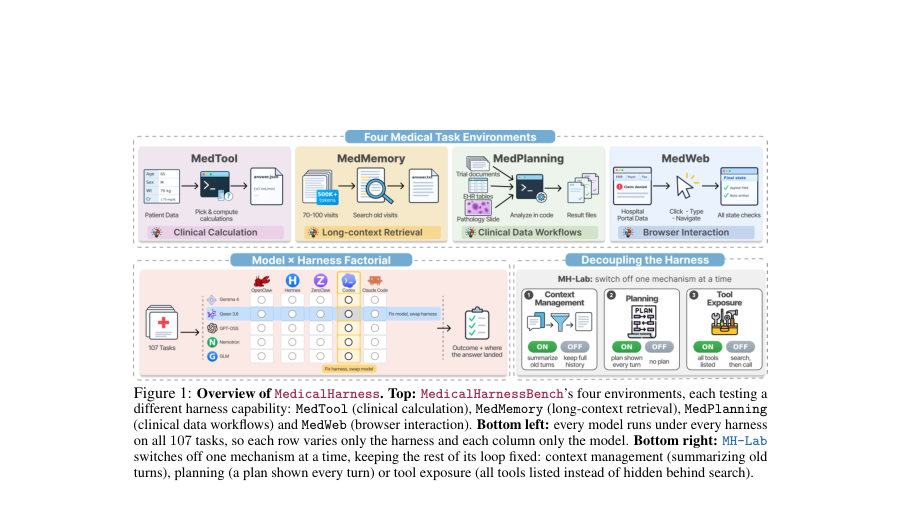
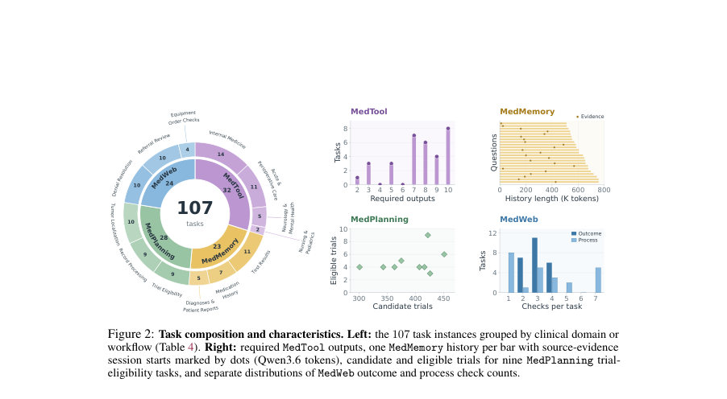
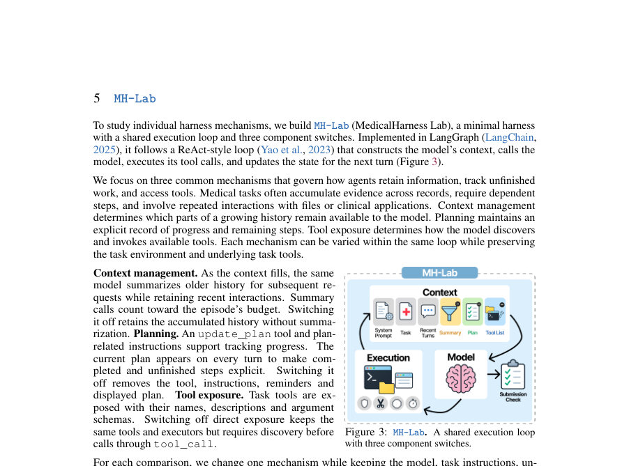

# MedicalHarness: A Controlled Evaluation of LLMs and Agent Harnesses on Medical Tasks

- **게시일:** 2026-10-06
- **arXiv:** [2610.05778v1](http://arxiv.org/abs/2610.05778v1) · [PDF](https://arxiv.org/pdf/2610.05778v1)
- **저자:** Ziqing Wang, Lili Zhao, Kaize Ding
- **분야:** cs.CL
- **선정 점수:** 6.77
- **선정 이유:** 최근성 0.9, 인용 영향 0.0 (인용 0회), 저자 영향 0.0 (최고 h-index 0), AI 주제 적합성 3.0, 개발자 관심 0.5, 학술 신호 0.8, 오픈 웨이트·주요 연구조직 신호 1.6

[← 2026-10-06 목록으로 돌아가기](../daily/2026-10-06.html)

<!-- paper-visuals:start -->
## 주요 Figure

> 원문 PDF에서 실제 Figure 캡션과 그림 영역이 함께 확인된 자료만 자동 추출했다.

*Figure · 원문 PDF 2쪽 · Figure 1: Overview of MedicalHarness. Top: MedicalHarnessBench’s four environments, each testing a*

*Figure · 원문 PDF 5쪽 · Figure 2: Task composition and characteristics. Left: the 107 task instances grouped by clinical domain or*

*Figure · 원문 PDF 6쪽 · Figure 3: MH-Lab. A shared execution loop*

<!-- paper-visuals:end -->

## 한 문장 요약

의료 작업에서 동일한 LLM이 서로 다른 에이전트 하네스(harness) 안에서 어떻게 달라지는지 통제된 실험(107개 과제, 5모델×5하네스, MH-Lab)을 통해 분산을 분해하고 개별 메커니즘(문맥관리·계획·도구노출)의 영향을 분석한 연구.

## 해결하려는 문제

의료 에이전트의 성능 평가는 모델과 이를 감싸는 에이전트 하네스의 합성 속성이다. 기존 비교들은 하네스 이외 변수를 함께 바꾸거나 하네스 내부 메커니즘을 묶어서 비교해, (1) 동일한 모델·실행 조건 아래에서 오직 하네스만 바꾸는 통제된 비교를 반복 수행해야 하고, (2) 전체 하네스 간 비교만으로는 문맥관리·계획·도구노출 같은 개별 메커니즘이 언제·어떻게 도움되는지 분리해 설명할 수 없다는 한계가 있다.

## 핵심 기여

- MedicalHarnessBench: 임상 계산(MedTool), 장문 문맥 검색(MedMemory), 임상 데이터 워크플로우(MedPlanning), 브라우저 상호작용(MedWeb) 4개 능력 도메인에 걸친 총 107개 실행가능(task-executable) 의료 과제로 구성된 벤치마크를 제안하고 구성·검증함.
- 통제된 비교 연구: 다섯 개의 공개 가중치 모델을 다섯 개의 상용/오픈 하네스에서 동일한 서빙·입력·예산 조건 하에 모든 조합으로 실행(총 8,025 episodes, 3개 시드)하고 결과 및 실행 추적(trace)을 분석함.
- MH-Lab: 하나의 공통 실행 루프에서 문맥관리(context management), 계획(planning), 도구 노출(tool exposure)을 한 번에 하나씩 끄는 개별 메커니즘 실험을 통해 각 메커니즘의 인과적 효과를 평가함.

## 접근 방법

* 의사결정적 정의와 통제 설계: 하네스 h는 (Ch, Uh, Th)의 절차 삼중체로 정의되며 Ch는 모델에 보여줄 컨텍스트를 구성하고, Uh는 모델 행동을 실행·관찰·상태 업데이트하며, Th는 종료를 결정한다.
* 모델–하네스 분해: 각 환경에서 모델·하네스·시드를 균형 디자인으로 돌려 평균 과제 성과 ¯ymhσ를 ¯ymhσ = µ + αm + βh + γmh + εmhσ로 분해하고 네 성분(모델·하네스·상호작용·반복 변동)을 제곱합으로 측정했다.
* MedicalHarnessBench: 107과제를 네 환경으로 구성하고 각 환경별 채점 규칙(예: MedTool은 계산기 선택 F1×정답 출력 비율, MedMemory/MedPlanning/MedWeb은 대부분 이진체크)을 정의했다.
* 실험 설정: Gemma4-26B-A4B, Qwen3.6-35B-A3B, GPT-OSS-120B, Nemotron-3.5-30B-A3B, GLM-4.7-Flash 등 5개 공개 모델을 vLLM으로 로컬 서빙, OpenClaw/Hermes/ZeroClaw/Codex/Claude Code 등 5개 하네스를 통해 동일 모델을 실행(시드 42,43,44).
* MH-Lab 구현: LangGraph 기반 ReAct 스타일 공통 루프에서 (1) 문맥관리(요약을 켜거나 끔), (2) 계획(매 턴 계획을 표시하거나 제거), (3) 도구 노출(직접 노출/검색을 통한 노출) 세 스위치를 조작하여 paired 실험 수행.
* 실행 추적: 모든 모델 호출을 프록시로 기록해 요청·응답·토큰 사용량·도구호출·종료사유 등을 저장하고 분석.

## 주요 결과

- 전체 평균 분산 분해(4환경 평균): 모델 효과가 전체 분산의 약 58%를 설명했고, 하네스의 주효과는 12%, 모델–하네스 상호작용 12%, 실행 반복(시드) 변동 18%로 하네스와 상호작용을 합하면 약 25%의 분산을 차지함.
- 환경별 차이: MedMemory에서는 하네스의 주효과가 25%에 달하고(상호작용 포함시 40% 수준), MedPlanning에서는 실행 간 변동이 40%로 높아 모델·하네스 영향이 환경마다 상이함(표 8 참조: 예: MedTool 모델비중 73.2%, MedMemory 모델비중 47.4%).
- 단일 우위 하네스 부재: 어떤 하네스도 모든 모델과 모든 과제에서 일관되게 최고가 아니며, 리더의 우위는 대부분 불확실성 범위 내에 있음(25개 모델·환경 블록 중 유의하게 격차가 95% CI에서 0을 배제하는 경우는 매우 적음).
- 응답 제공(answer rate) 차이의 중요성: MedTool·MedMemory에서 하네스 간 차이는 '응답을 주는 빈도'에서 더 크게 나타나는 경향이 있어(10개의 모델–환경 쌍 중 9개에서 answer-rate 스프레드가 score 스프레드보다 큼) 한정된 질문에 대한 점수만 비교하면 하네스 차이를 놓칠 수 있음.
- 제품 하네스에서의 모듈 활성화 희소성: 상용/제품 하네스들에서 요약(summarization) 모듈은 원창(기본 윈도우)에서 2–5%만 활성화되어, 이런 모듈의 효과는 사전 조건(p firing)이 충족되지 않으면 탐지하기 어려움이라고 보고함. 이는 MH-Lab 실험 설계 이유이기도 함. (본문 참고)

## 한계

- 저자 언급 한계: 메커니즘은 실제로 '발동(fire)'할 때만 결과를 바꾸며, 인터페이스가 모델의 동작 방식과 맞아야 효과가 난다(예: 도구 검색 인터페이스 뒤에 숨기면 모델이 도구를 이름으로 호출할 때 호출이 거부되어 실패가 발생).
- 저자 언급 한계: 일부 하네스 간 우위는 표본된 과제·모델 집합과 불확실성 때문에 통계적으로 유의미하지 않으며, 단일 모델·과제에 대한 결론을 일반화하기 어렵다.
- 추론 가능한 실험적 제약(본문 근거): 비교는 다섯 공개 모델과 다섯 하네스, 107과제에 한정되어 있어 다른(예: 폐쇄 상용) 모델·하네스·의료환경으로 일반화될 때 제한이 있을 수 있다. 본 실험은 로컬 vLLM 서빙과 일부 하네스 기본값(예: 출력 cap)을 조정한 환경에서 수행되었으며, 이 설정이 결과에 영향을 줄 수 있다.
- 탐지 한계(본문 관찰): 제품 하네스 내 일부 메커니즘의 낮은 활성화율(예: 요약 2–5%)은 실제 운영 하에서 이 메커니즘의 유효성을 평가하거나 ablation 효과를 통계적으로 검출하기 어렵게 만든다.

## 개발자 관점

- 모델–하네스 쌍을 항상 보고하라: 의료 결과를 보고할 때는 사용한 모델과 하네스를 쌍으로 명시하고, 점수와 함께 과제가 답변된 비율(answer rate)을 함께 공개하라(하네스가 더 자주 '답을 주는' 쪽이 유리할 수 있음).
- 문맥 관리 설계: 장문·다회기 의료 기록을 다루는 하네스는 요약·압축뿐 아니라 '근거의 위치·날짜'를 보존하는 증거 중심(evidence-focused) 컨텍스트 관리를 도입해 장기 추적을 유지하도록 설계하라(요약 호출이 실제로 '발동'하도록 입력 예산과 정책을 맞출 것).
- 계획(plan) 표현의 임상적 근거화: 대규모 워크플로우(예: 임상 시험 선별)에서는 계획 단계를 단순한 해야할 일 목록이 아닌 명시적 임상 조건(포함·제외 기준별 충족 여부와 증거 링크)으로 구성해 모델이 미해결 항목을 재검색·완료하도록 유도하라.
- 완료 검증(verification) 루틴 추가: 계산 워크플로우·브라우저 액션 등 주요 단계 뒤에 결과 확인(예: 제출 확인, 포털 상태 재확인) 체크를 넣어 미완료·미파일링 실수를 줄여라(제로클로우의 제출 체크가 Qwen3.6의 MedMemory 점수를 0.42→0.51로 올린 사례).
- 도구 노출 인터페이스 설계: 도구 검색(discovery)과 도구 호출(call)을 분리할 경우, 발견된 도구를 모델이 바로 호출할 수 있는 경로를 제공해야 한다(발견 후 이름으로 직접 호출하는 모델 행동과 맞지 않으면 호출이 거부되어 실패가 발생함). 또한 도구-발견 후 호출 실패를 줄이려면 도구가 직접 노출되도록 하는 옵션을 제공하라. 인프라 실무적으로는 실행 추적(요청·응답·토큰 수·도구 호출 로그)을 체계적으로 수집해 실패 원인을 분석하라.

**근거 범위:** 이 분석은 제공된 논문 PDF 본문(페이지 내 텍스트)을 근거로 작성되었다. 본문에서 직접 제시된 수치(예: 107과제, 5모델×5하네스, 8,025 episodes, 분산 분해 비율, MH-Lab 실험 결과 등)를 사용했으며, 보충자료(섹션 E, H, I 등)에 대한 참조는 본문에 인용된 범위 내에서만 반영했다. PDF에 없는 세부 구현·하이퍼파라미터나 외부 코드 변경 내역은 생성하지 않았고, 일부 세부 수치는 본문 표와 설명에 의존했으므로 원문 표·부록을 함께 확인하면 더 정확하다.
