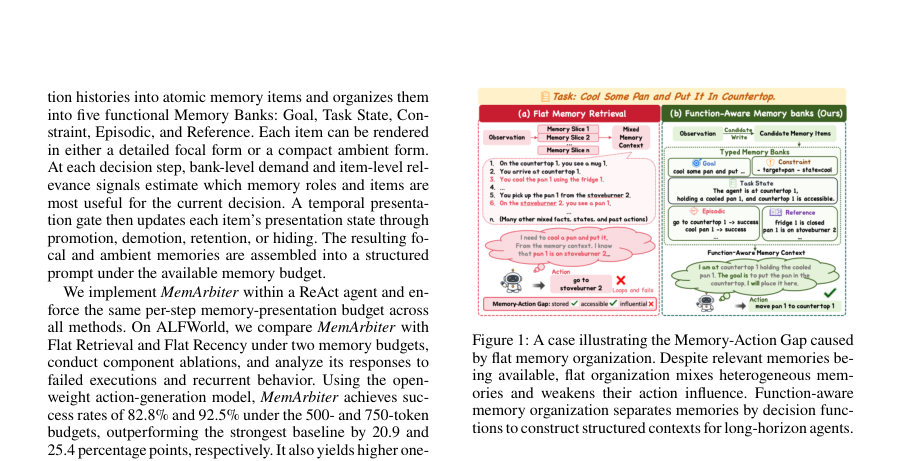
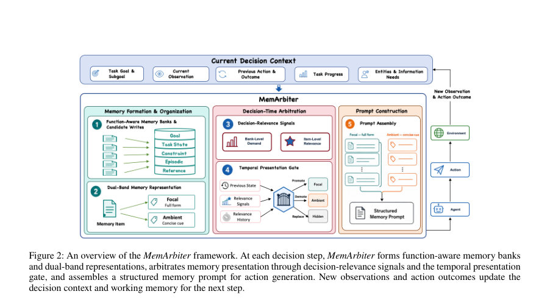
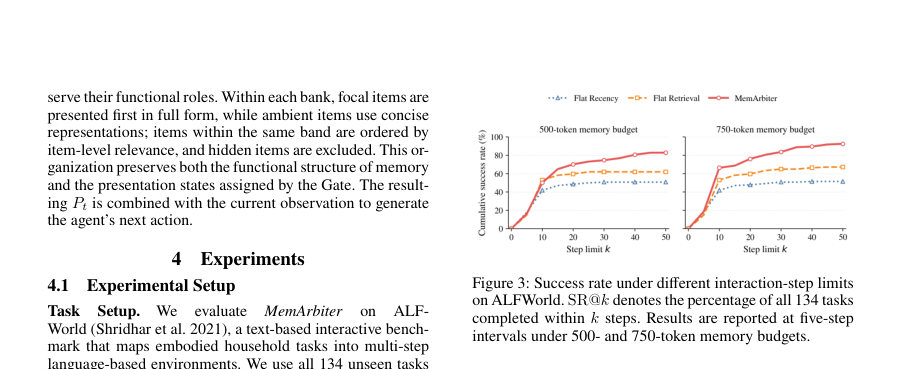

# MemArbiter: Decision-Time Memory Arbitration for Long-Horizon LLM Agents

- **arXiv:** [2608.02113v1](http://arxiv.org/abs/2608.02113v1) · [PDF](https://arxiv.org/pdf/2608.02113v1)
- **저자:** Jiajun Dong, Yutao Hu, Fengrui Fan, Shihan Dou, Yueming Wu, Deqing Zou
- **분야:** cs.AI
- **선정 점수:** 9.19
- **선정 이유:** 최근성 0.6, 핵심어: large language model, 핵심어: llm, 분야 가중치 2.0, 구체적인 초록

### 한 문장 요약

MemArbiter는 상호작용 기록을 다섯 가지 기능적 메모리 은행으로 분해하고 focal/ambient 이중 프레임과 시간적 프레젠테이션 게이트를 도입해 장기 하이호라이즌 LLM 에이전트의 결정 시점에 메모리를 중재함으로써 ‘메모리→액션’ 전달의 Memory-Action Gap를 줄이는 의사결정 메모리 관리 프레임워크이다.

### 해결하려는 문제

장기 하이호라이즌 태스크에서 에이전트가 과거의 관찰·결과를 축적하고 이를 현재 의사결정에 활용해야 하지만, 메모리에 저장된 정보가 접근성은 있어도 현재 결정에 충분히 반영되지 않는 Memory-Action Gap가 존재한다. 기존 방법이 주로 메모리의 접근성(저장/검색)을 개선하는 데 집중하는 반면, 서로 다른 결정 기능을 가진 기억의 구성, 우선순위 설정, 제시 형식의 불일치로 인해 올바른 정보가 현재 의사결정에 충분히 영향을 미치지 못하는 문제를 다룬다.

### 핵심 기여

- 메모리-액션 간극(Memory-Action Gap)을 정의하고 이의 메모리 관리 측면을 엔드-투-엔드로 아키텍처화했다.
- 다섯 가지 기능적 메모리 은행(Goal, Task State, Constraint, Episodic, Reference)을 도입하고, 각 아이템에 대해 후보 작성(Candidate Writer)으로 원천 정보를 분해해 은행별로 업데이트한다.
- 두 가지 프레임(초점형 focal과 간결형 ambient)과 시간적 프레젠테이션 게이트를 통해 각 아이템의 프롬프트 제시를 동적으로 제어함으로써 메모리의 현재 의사결정에 대한 기여를 조절한다.
- ALFWorld에서 평면화된 검색/최근성 Baseline 대비 메모리 아리스테이션 방식의 성능 향상을 입증하고, 오픈-웨이트와 폐쇄형(action 생성 모델의 GPT-5.4 교차 적용)에서의 일반화 가능성을 보인다.

### 접근 방법

* MemArbiter는 외부 메모리 모듈로 동작하며, 단계 t의 시작에서 상태 파싱(state parsing)으로 목표(subgoal), 현재 관찰, 이전 행동/결과, 누적 인터랙션 궤적에서 현재 의사결정 맥락(ct)을 구성한다.
* 이어 다섯 은행별 후보 아이템(candidate writes)을 생성하는 Candidate Writer를 통해 새로운 정보를 분해·저장하고, 업데이트 전략 Ub에 따라 기존 아이템을 대체/합치거나 신규 아이템으로 삽입한다.
* 업데이트 전에는 유효성 검사, 중복 제거, 충돌 해결이 수행된다.
* 각 메모리 아이템은 focal(전체 콘텐츠 보존)과 ambient(핵심 엔티티/관계/상태를 담은 간결 프롬프트) 두 표현으로 표현된다.
* 은행 수준의 수요(demand)와 아이템 수준의 적합성(relevance)을 바탕으로 Temporal Presentation Gate가 zi,t를 업데이트하여 프레임의 프레젠테이션 형태를 focal/ambient/hidden으로 조정한다.
* 마지막으로 Prompt Assembly가 은행별로 구성된 메모리 프롬프트 Pt를 생성해 현재 관찰 내용과 결합하여 다음 액션 생성을 돕는다.
* 주요 구성 요소는 다음과 같다: (1) Candidate Writer/Wb(ct): ct를 바탕으로 각 은행의 메모리 아이템 후보를 생성하고, (2) Dual-Band 표현: 은행과 밴드의 직교적 차원으로 아이템의 기능과 현재 제시 형태를 분리, (3) 결정 관련 신호: 은행 수준의 수요 db,t와 아이템 수준의 관련성 ηi,t를 통해 은행 및 아이템의 상태를 판단, (4) Temporal Presentation Gate: 과거 상태의 연속성(history)과 현재의 관련성 신호를 고려해 focal/ambient/hidden을 결정, (5) Prompt Assembly: 은행별로 아이템을 구성해 프롬프트를 형식화한다.
* 이 프레임워크는 ALFWorld에 적용되었으며 500/750토큰의 메모리 예산 아래 Flat Recency/Flat Retrieval 대비 성능이 향상되도록 설계되었다.

### 주요 결과

- 실험 데이터셋: ALFWorld의 평가세트 134개 unseen 태스크를 대상으로 평가.
- 주요 정량 결과: 500토큰 예산에서 MemArbiter의 SR@50은 82.84%로 Flat Retrieval 대비 20.90pp 증가, 750토큰 예산에서 92.54%로 Flat Retrieval 대비 25.38pp 증가(표 2).
- 태스크 타입별 성능: Pick Two에서 500토큰 예산 시 MemArbiter가 58.82%, 750토큰 예산 시 70.59%로 가장 높은 성능을 기록. 여섯 카테고리 중 다수에서 최상위 성능.
- 교차 모델 검증: GPT-5.4를 액션 생성 모델로 교체한 조건에서도 MemArbiter의 SR@50이 83.58%로 Flat Retrieval/Flat Recency 대비 각각 12.69pp, 10.45pp 차이로 우수한 일반화성을 보임.
- 구성요소 ablation: w/o Functional Banks: SR@50=67.16%(-15.68pp), w/o Dynamic Signals: SR@50=65.67%(-17.17pp), w/o Temporal Gate: SR@50=73.88%(-8.96pp). 전체 구성의 조합이 가장 강력하며, 은행 기능 분리와 동적 신호/시간 게이트의 결합이 장기 상호작용에서 중요함。

### 한계

- 저자는 한 가지 환경(ALF-World)에서의 평가만 수행했고, 다중 모달(web, 비주얼 등)이나 개방형 환경으로의 일반화 여부는 확인되지 않음.
- 미리 정의된 다섯 메모리 은행과 신호가 도메인에 의존적이며, 도메인-적응적 역할/신호를 연구할 여지가 있음.
- 메모리 제시의 조작이 의도한 인과적 효과를 직접 보여주는 실험은 아니며, 특정 promotion/demotion이 행동 변화로 직접 귀속되는지에 대한 인과관계 증거는 제한적임(
-  개발자 관점에서의 시사점과 한계 구분 필요).

### 개발자 관점

- 메모리 은행 구성을 명확히 분리하고, Candidate Writer를 통해 은행별 아이템을 독립적으로 업데이트하는 설계가 재현 가능성을 높인다.
- 동적 은행 신호(db,t)와 아이템 수준 관련성(ηi,t)을 통해 결정 맥락에 맞춘 프롬프트 구성을 자동화하되, 500/750토큰 같은 고정 메모리 예산을 지키도록 설계한다.
- 템포럴 프레젠테이션 게이트를 도입해 단순히 최신의 정보가 아니라 결정 맥락의 지속성과 필요성에 따라 focal/ambient/hidden 간 이동을 관리하는 것이 장기 태스크에서 효과적임을 시사한다.
- 교차 모델 실험(오픈-웨이트/프라이빗 LLM)을 통해 메모리 아리스테이션의 혜택이 모델 의존적이 아님을 부분적으로 보여주며, 재현 가능한 벤치마크 및 구현 세부가 필요하다.
- 실제 배포 시에는 per-step 메모리 예산 관리, 프롬프트 구성의 계산 비용, 시나리오별 안전성 및 신뢰성 평가를 함께 고려해야 한다.

## 주요 Figure

> 원문 PDF에서 실제 Figure 캡션과 그림 영역이 함께 확인된 자료만 자동 추출했다.

*Figure · 원문 PDF 2쪽 · Figure 1: A case illustrating the Memory-Action Gap caused*

*Figure · 원문 PDF 4쪽 · Figure 2: An overview of the MemArbiter framework. At each decision step, MemArbiter forms function-aware memory banks*

*Figure · 원문 PDF 5쪽 · Figure 3: Success rate under different interaction-step limits*

<!-- paper-visuals:end -->

**근거 범위:** 논문 PDF 본문 기반 분석. 제공된 PDF 범위에서 추출된 텍스트를 바탕으로 정리하였으며, 알고리즘의 전체 구현 세부나 학습/추론 파이프라인의 미세한 파라미터까지는 본문 인용만으로 한정되어 있다. 일부 수식의 맥락은 본문 발췌에 의존하므로, 원문 전체의 수식 전개를 완전히 재현하려면 원문 전체를 확인이 필요하다.

---

- **소개 날짜:** 2026-08-05
- [← 2026-08-05 논문 목록으로 돌아가기](../daily/2026-08-05.md)
- [일별 아카이브 보기](../daily/index.md)

