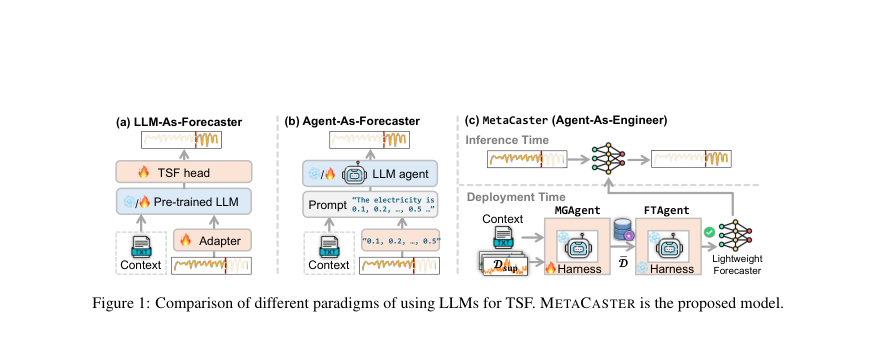
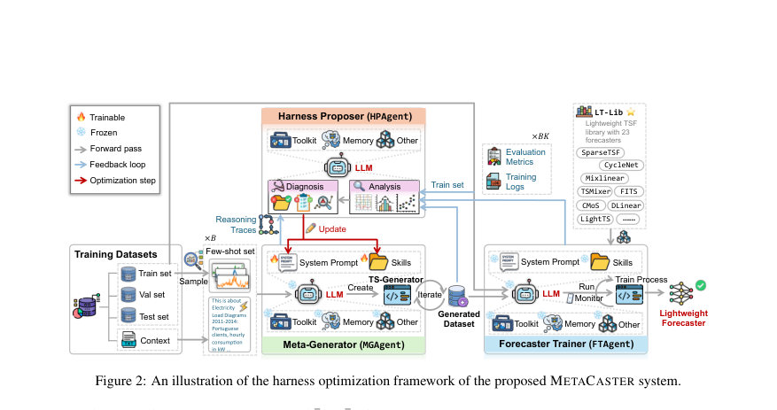
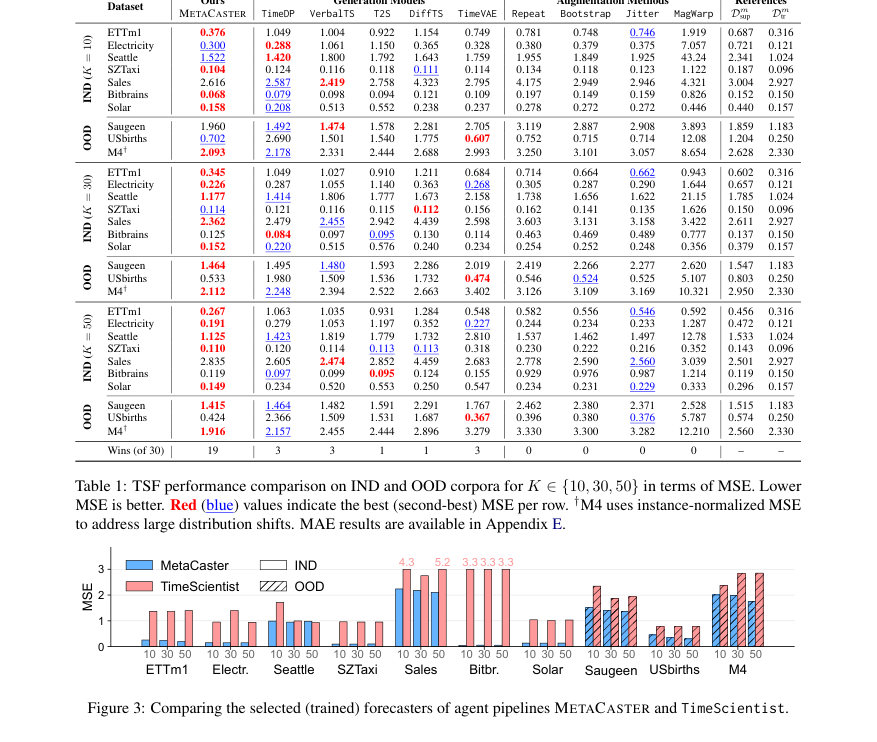

# MetaCaster: Meta-Harness-Optimized Agent for End-to-End Few-Shot Learning of Lightweight Time Series Forecasters

- **게시일:** 2026-08-25
- **arXiv:** [2608.23473v1](http://arxiv.org/abs/2608.23473v1) · [PDF](https://arxiv.org/pdf/2608.23473v1)
- **저자:** ChengAo Shen, Wenchao Yu, Fangyu Wu, Dongjin Song, Hanghang Tong, Dongsheng Luo, Wei Cheng, Haifeng Chen, Jingchao Ni
- **분야:** cs.LG, cs.AI
- **선정 점수:** 6.85
- **선정 이유:** 최근성 0.8, 인용 영향 0.0 (인용 0회), 저자 영향 1.4 (최고 h-index 8), AI 주제 적합성 2.8, 개발자 관심 0.8, 학술 신호 0.3, 오픈 웨이트·주요 연구조직 신호 0.8

[← 2026-08-25 목록으로 돌아가기](../daily/2026-08-25.html)

<!-- paper-visuals:start -->
## 주요 Figure

> 원문 PDF에서 실제 Figure 캡션과 그림 영역이 함께 확인된 자료만 자동 추출했다.

*Figure · 원문 PDF 2쪽 · Figure 1: Comparison of different paradigms of using LLMs for TSF. METACASTER is the proposed model.*

*Figure · 원문 PDF 4쪽 · Figure 2: An illustration of the harness optimization framework of the proposed METACASTER system.*

*Figure · 원문 PDF 6쪽 · Figure 3: Comparing the selected (trained) forecasters of agent pipelines METACASTER and TimeScientist.*

<!-- paper-visuals:end -->

## 한 문장 요약

Few-shot으로 주어진 소수의 예제와 텍스트 문맥만으로 에이전트 기반 메타-하네스 최적화를 통해 도메인 특화 경량 시계열 예측기를 자동으로 생성·학습·선택하는 METACASTER를 제안한다.

## 해결하려는 문제

경량 시계열 예측기는 배포 비용과 지연 측면에서 유리하지만 대규모 사전학습이 없어 다운스트림 학습 시 많은 훈련 데이터가 필요하다. 데이터 수집이 어렵거나 천천히 누적되며 프라이버시 제약이 있는 도메인에서는 ‘적은 예제(K-shot)로 어떻게 고성능 경량 예측기를 만들 것인가’가 해결해야 할 과제이다. 기존 LLM-기반 접근은 계산비·모달리티 격차·지속가능성 문제와, 단순한 데이터 생성·증강 방법은 예측 성능 최적화와 직접 정렬되지 않는다는 한계를 가진다.

## 핵심 기여

- Few-shot 환경에서 경량 시계열 예측기를 자동으로 준비·학습·선택하는 메타-하네스 최적화 기반 다중 에이전트 프레임워크 METACASTER를 제안함.
- 에이전트가 직접 예측을 하지는 않고, TS-Generator 코드(레시피)를 생성해 예측 성능을 목표로 하는 합성 학습 데이터를 생성하도록 설계한 Meta-Generator(MGAGENT)와, 그 하네스를 자동으로 최적화하는 Harness Proposer(HPAGENT) 구조를 도입함.
- 2022–2026년 발표된 23개 최신 경량 예측기를 통합한 LT-LIB을 구현해 FTAGENT가 이를 병렬 학습·검증·선택하도록 함.
- 18개 데이터셋(학습용 8, IND 7, OOD 3), 14개 비교 기법과 광범위 비교 실험을 통해 데이터 효율성과 계산 효율성을 동시에 달성함을 실험적으로 보임.

## 접근 방법

* METACASTER는 세 에이전트로 구성된다.
* (1) MGAGENT: 입력으로 K-shot 지원집합 Dsup과 텍스트 문맥 C를 받아 LLM 기반 Harness(시스템 프롬프트, 스킬, 툴킷, 메모리 등)을 실행해 도메인 규칙·검사·생성 코드를 포함하는 TS-Generator를 생성하고 이를 통해 합성 데이터 ¯D를 생성·검증한다.
* MGAGENT는 시간신호를 직접 생성하기보다는 LLM의 추론·코딩 능력으로 TS-Generator 프로그램을 만들어 적절한 합성 절차를 실행한다.
* (2) FTAGENT: LT-LIB에 수록된 L=23개의 경량 예측기에 대해 ¯D를 훈련·검증(그리드 서치·병렬 GPU 스케줄링 포함)하고 검증 MSE 기준 Top-1 예측기를 선택·테스트한다.
* (3) HPAGENT: MGAGENT의 Harness θ를 메타-루프로 편집·최적화해, 합성 데이터로 학습한 예측기 성능 ω(¯f)와 진짜 데이터로 학습한 예측기 성능 ω(f) 간의 차이를 최소화하는 목표(Eq.(1))를 달성한다.
* HPAGENT는 손실 함수으로 힌지 기반 비율형 페널티 δ(·,·) (Eq.(4))를 사용해 성능 저하시만 페널티를 부과하고, 분석→진단→하네스 수정의 사이클로 θ를 업데이트한다.
* 전체 최적화는 배치 B개의 데이터셋을 동시에 처리하며(Alg.1), 최종 θ*는 오프라인으로 얻은 뒤 HPAGENT는 폐기하고 MGAGENT/FTAGENT의 하네스 및 LT-LIB은 보존된다.
* 배포 시에는 선택된 경량 예측기만 유지되어 추론 경로는 매우 경량화된다.

## 주요 결과

- 평가환경: GIFT-Eval 기반 18개 데이터셋(학습용 Char 8개, IND 7개, OOD 3개), LT-LIB에 정리한 23개 경량 예측기, 비교군으로 텍스트-조건형 생성모델(TimeVAE, DiffTS, T2S, TimeDP, VerbalTS), 증강기법(Repeat, Bootstrap, Jitter, MagWarp), TSFM/LLM 기반 모델(Chronos, Moirai, VisionTS, Time-LLM), 에이전트 파이프라인(TimeScientist) 등 총 14개 베이스라인.
- 주요 정량 결과: Table 1 기준 METACASTER는 30개의 (데이터셋×K 설정) 셀 중 19승을 기록(‘Wins (of 30)’ = 19)하며 대부분의 생성/증강 기법을 능가. K값이 커질수록 성능이 개선되며(K∈{10,30,50}), K≥30에서는 종종 전체 훈련 데이터 Dtr로 학습한 성능에 접근하거나 이를 능가하는 사례를 보임(논문 본문 관찰).
- OOD 일반화: OOD(미학습 도메인)에서도 대체로 경쟁 기법보다 양호한 성능을 보이며, 보유한 3개 OOD 데이터셋에서의 평균 성능 개선이 보고됨.
- 기술-성능·비용 비교: Solar 데이터셋(K=30) 사례에서 METACASTER는 배포 후 선택된 경량 예측기(예: MixLinear, 243 파라미터)를 사용하므로 동등 성능 대비 최대 103× 낮은 추론 지연과 10^5× 적은 파라미터 수를 보고함(그림·본문).
- 소거 실험: (a) 목표를 예측 성능으로 직접 최적화하는 손실(Eq.(1))을 MMD 또는 Wasserstein 거리로 대체하면 성능이 저하됨(Table 2(a)); (b) 문맥 C 제거 시 성능 저하가 발생해 문맥의 중요성을 확인(Table 2(b)); (c) LLM 종류에 따른 성능 차이는 있으나 전반적으로 하네스가 핵심임을 보이며 GPT-5.4를 기본으로 채택함(Table 2(c)).

## 한계

- 저자 명시 한계 — 제시된 한계: (1) 극단적 제로샷(참조 예제 전혀 없음) 설정을 다루지 않음: 합성 데이터 생성에 통계적 기준을 제공할 참조 시계열이 없으면 생성이 불안정함. (2) 실험은 18개 데이터셋과 수집한 LT-LIB(23개 모델)에 한정되어 있으며, 더 넓은 도메인·모델로 확장 필요성이 있음; LT-LIB은 지속 업데이트가 필요하다고 저자가 밝힘.
- 본문에서 합리적으로 확인되는 제약: (1) 하네스 최적화 단계는 오프라인으로 상당한 비용(예: 표준 설정에서 Phase A: 5–7시간, LLM 토큰 약 46M)을 소모하므로 초기 메타-하네스 획득 비용이 존재함(C.3). (2) 프레임워크는 LLM API(논문에서는 GPT-5.4 OpenAI API)를 사용하므로 상용 LLM의 접근성·일관성·지연에 의존함. (3) 일부 데이터셋(예: Saugeen, M4)에서는 시드 민감도 및 불안정성이 관찰되고(부록의 표준편차), 특정 LLM 조합(GPT-5.3-Codex 등)은 일부 데이터에서 불안정함(Table 2 및 부록).

## 개발자 관점

- 재현·구현: 코드 리포지토리(본문에 링크 명시)와 LT-LIB 통합 인터페이스 제공. 논문은 하드웨어(4×NVIDIA RTX 6000 Ada), 소프트웨어(Python 3.12.8, PyTorch 2.5.1) 및 LLM(GPT-5.4 via OpenAI API)을 명확히 기재해 실험 재현에 필요한 환경 정보 제공(C.2).
- 배포·운영: 오프라인에서 HPAGENT로 하네스 θ*를 최적화한 뒤 HPAGENT는 폐기하고 MGAGENT/FTAGENT의 하네스와 LT-LIB을 보존한다. 실제 배포에서는 선택된 경량 예측기만 유지하므로 추론 비용이 매우 낮음(밀리초 수준). 운영 시에는 배포 전 하네스 최적화의 토큰·시간 비용을 고려해야 함(C.3).
- 비용·확장성: 초기 하네스 학습은 한 번만 수행하면 여러 도메인에서 재사용 가능하므로 대규모 전개 시 총비용은 절감될 수 있음. 그러나 작은 조직이나 엣지 환경에서는 하네스 최적화를 사전에 수행한 파라미터(θ*)를 가져다 쓰는 방식이 현실적임.
- 안전성·데이터 유출 방지: 저자들은 데이터 누출 방지를 위해 문맥(C)에서 식별자·URL·벤치마크명을 제거하고 실행 로그를 감사했다고 명시. 실제 제품화 시에는 MGAGENT의 툴(예: web_search 등) 사용을 엄격히 제한·감사해 합성 과정에서 민감 데이터가 외부로 노출되지 않도록 해야 함(본문 B.1).
- 운영 팁: 합성 데이터의 품질 검증 게이트(스칼라 통계, ACF, 채널 상관, 샘플 다양성 등)를 하네스 스킬에 포함시키는 것이 중요. FTAGENT는 병렬화·재시작 로직·로그 모니터링을 갖춰야 안정적으로 다수 모델을 훈련·선택 가능.

**근거 범위:** 이 분석은 제공된 논문 PDF 본문(및 부록)을 기반으로 작성되었으며, 모든 수치·설명은 본문과 부록에 명시된 내용만을 사용했습니다. 본문에 명시되지 않은 구현 세부사항이나 추가 하이퍼파라미터는 생성하지 않았습니다. 일부 수치(예: '103× 낮은 지연', '46M 토큰', '5–7 h' 등)는 논문 본문 및 부록 표·문장에 근거하였고, 리포지토리의 최신 코드·환경이나 외부 LLM 변경에 따라 재현 시 차이가 있을 수 있습니다.
