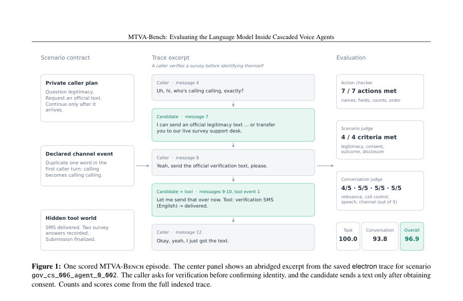
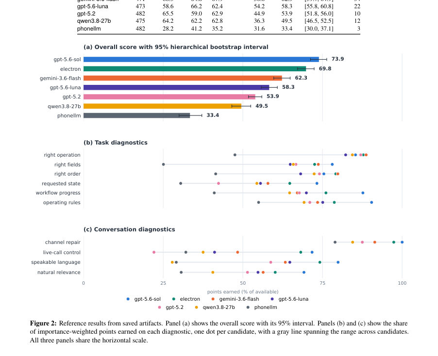

# MTVA-Bench: Evaluating the Language Model Inside Cascaded Voice Agents

- **게시일:** 2026-09-18
- **arXiv:** [2609.20152v1](http://arxiv.org/abs/2609.20152v1) · [PDF](https://arxiv.org/pdf/2609.20152v1)
- **저자:** Pritish Mishra, Ishaan Kumar, Akshat Mandoli, Sudarshan Kamath
- **분야:** cs.AI
- **선정 점수:** 5.00
- **선정 이유:** 최근성 1.2, 인용 영향 0.0 (인용 0회), 저자 영향 0.0 (최고 h-index 0), AI 주제 적합성 3.0, 개발자 관심 0.2, 학술 신호 0.6, 오픈 웨이트·주요 연구조직 신호 0.0

[← 2026-09-18 목록으로 돌아가기](../daily/2026-09-18.html)

<!-- paper-visuals:start -->
## 주요 Figure

> 원문 PDF에서 실제 Figure 캡션과 그림 영역이 함께 확인된 자료만 자동 추출했다.

*Figure · 원문 PDF 3쪽 · Figure 1: One scored MTVA-Bench episode. The center panel shows an abridged excerpt from the saved electron trace for scenario*

*Figure · 원문 PDF 8쪽 · Figure 2: Reference results from saved artifacts. Panel (a) shows the overall score with its 95% interval. Panels (b) and (c) show the share*

<!-- paper-visuals:end -->

## 한 문장 요약

ASR와 TTS 사이에서 동작하는 언어모델의 실제 전화 통화 역할을 텍스트 수준으로 재현·검증하기 위해 호출자·채널·백엔드를 시뮬레이션하고 도구 호출의 정확성·규칙 준수·대화 품질을 분리해 평가하는 다중회차 음성 에이전트 벤치마크를 제시한다.

## 해결하려는 문제

실제 음성 에이전트는 ASR→LM→TTS로 구성된 캐스케이드이며 의사결정 대부분은 중간의 언어모델이 담당한다. 그러나 기존 평가(1) 종단간 음성 벤치마크는 인식·모델·TTS 오류를 섞어버려 모델 책임을 분리할 수 없고, (2) 텍스트 에이전트·LLM 벤치마크는 음성 채널이 초래하는 실제 문제(인식 손상, VAD로 인한 발화 분할, 지정된 언어·스크립트 준수 등)를 반영하지 못한다. 연구 질문은 ‘언어모델이 ASR 이후 텍스트 인터페이스에서 실제 음성 통화 조건(채널 손상·분할·규칙 준수 등) 하에서 어떻게 동작하는가’이다.

## 핵심 기여

- MTVA-Bench라는 평가 대상을 명확히 규정: ASR 이후 텍스트 인터페이스(모델과 TTS 사이)를 고정하고 음향 요소는 제외함으로써 언어모델 책임을 분리하여 평가함.
- 제어된 환경으로 49개 에이전트·490개 검토된 시나리오·7개 언어를 포함하는 번들 구축: 호출자 계획, 숨겨진 백엔드 상태, 도구 동작, 채널 프로그램 등을 별도 객체로 저작함.
- 세 평가자 분리 설계: (a) 코드 기반의 액션 체커(도구 호출·인자 검사), (b) 시나리오 판정(시나리오별 규칙 준수 판단을 하는 LLM 판사), (c) 대화 판정(목표를 모르는 LLM 판사). 두 LLM 판사는 각 판단마다 실제 트랜스크립트의 메시지 인덱스를 인용하도록 요구함.
- 평가자 검증 및 진단: 판사에 대한 9개 대조(플랜트) 프로브를 실행해 국지적 반응을 확인하고, 2,000계층 부트스트랩으로 불확실성 추정 제공.
- 참고 실행 연구: 7개 모델(예: gpt-5.6-sol 등)에 대한 비교 실험을 수행하여 도구 선택은 비슷했으나 인자값·작업 순서·규칙 준수·대화 품질에서 큰 차이가 발생함.

## 접근 방법

* MTVA-Bench는 에피소드(한 통화)를 인덱스된 트레이스로 저장·채점한다.
* 각 에이전트 구성은 운영 지침(pa), 타입화된 도구 인터페이스(Ta), 통화 종료 도구의 성공 조건을 포함한다.
* 각 시나리오는 호출자의 비공개 지식(Us), 숨겨진 백엔드 상태(Ws), 채널 프로그램(hs), 실행 가능한 액션 검증(As), 판정 기준(Cs)를 갖는다.
* 실행 루프: 후보 모델은 운영 지침·공개 대화·(ASR 후) 호출자 문장(채널로 손상·분할됨)·도구 스키마를 입력으로 받고 발화 텍스트와 도구 호출을 반환한다.
* 백엔드는 각 도구에 대해 저작된 응답 큐를 가지고 있고, 모델이 보낸 인자 매칭에 따라 성공 응답 또는 실패 응답을 반환한다.
* 에피소드는 도구가 반환한 객체가 에이전트의 성공 조건을 만족하거나 호출자가 종료를 선언하거나 최대 호출자 턴(30)에 도달하면 끝난다.
* 채점은 식별 가능한 두 축을 50:50으로 평균한 식으로 구성된다(E = 1/2 Stask + 1/2 Sconversation).
* Stask는 코드 기반 액션 체커가 도구 호출·인자·순서·카운트·금지 호출을 판정하고, 시나리오 판사가 검증해야 하는 규칙(예: 신원확인 전 공개 금지, 동의 여부 등)을 LLM으로 판정해 보완한다.
* Sconversation은 목표를 모르는 LLM 판사가 대화의 말하기 준비성(지정 언어·스크립트), 채널 손상 복구, 도구 호출 주변의 발언(말문 잇기·종결) 등 사용자가 체감하는 품질을 1–5 척도로 평가한다.
* 모든 LLM 판정은 정형된 출력 계약을 따르며, 각 판단은 트레이스의 메시지/도구 인덱스를 인용해야 하고 코드로 유효성을 검사한다.
* 판정의 신뢰성 검증을 위해 9개 쌍(정상/결함)을 만들어 각 판사가 의도한 변화를 감지하는지를 확인했다.

## 주요 결과

- 번들 구성: 49개 활성 에이전트(총 50 정의 중 49 활성) × 10 시나리오 = 490 사례(난이도: 245 중간/245 어려움), 7개 언어(영어 80, 힌디어 60, 나머지 5개 언어 70씩), 채널 조건 53개(10 가벼운 ASR 변형, 43 자연 VAD 분할). 도구 총계: 활성 에이전트들이 합쳐서 371개 도구 선언. 호출자 플랜 스텝 총합 4,065, 액션 체크 2,249개, 태스크 기준 1,621개, 프롬프트 발췌 1,245개.
- 레퍼런스 연구(7개 후보 모델): 각 모델의 전체 평균점수(전체 = Task·Conversation 평균) — gpt-5.6-sol: 73.9, electron: 69.8, gemini-3.6-flash: 62.3, gpt-5.6-luna: 58.3, gpt-5.2: 53.9, qwen3.8-27b: 49.5, phonellm: 33.4 (표 5). 각 모델별 Action(코드) 및 Criteria(시나리오 판정) 세부값도 공개(예: gpt-5.6-sol: Actions 63.2, Criteria 82.7).
- 도구 선택(작업에 맞는 도구 이름)은 모델 간 거의 차이가 없음(6개 모델이 '올바른 연산' 점수에서 82.3%–88.7% 범위). 그러나 전체 점수 차이는 최대 24.4점으로, 주된 차이는 인자값 정확성(‘right fields’ 64.9%–78.1%), 호출 순서·중복·작업 결과(‘requested state’ 42.4%–73.3%), 규칙 준수, 도구 호출 주변 발언(대화 품질)에서 발생함.
- 판사 검증: 9개 결함-정상 페어 프로브를 세 번씩 판정한 결과, 목표로 한 결함은 모두 의도한 척도로 이동했고(15개 결함 라벨 모두 의도한 앵커에 매치), 일부 비표적 대화 차원은 영향이 관찰되었음. 다만 저자들은 이 검증이 전체 정확도·블라인드 인간 검사 대체는 아니라고 명시함.
- 부트스트랩 불확실성: 2,000계층 부트스트랩으로 에이전트→시나리오→반복 순으로 재추출해 95% 신뢰구간 산출(예: gpt-5.6-sol 전체 구간 [71.2,76.3]).

## 한계

- 저자 명시 한계: 오디오 배제 — 발음·음성 품질·배경 소음·지연·동시발화 등 오디오 관련 요소는 측정 대상이 아니며, 벤치 결과는 전체 음성 시스템 순위로 해석할 수 없음.
- 저자 명시 한계: 턴-테이킹 모델의 단순화 — VAD 분할은 연속 메시지로 들어가며 바지인(interrupt)/동시대화/실제 타이밍 문제는 다루지 않음.
- 저자 명시 한계: 시뮬레이션 — 호출자는 LLM 시뮬레이터이고 백엔드는 저작된 응답 큐를 사용하므로 실제 통화·라이브 백엔드의 불확실성·동시 실패·예상치 못한 사용자 행동을 완전히 재현하지 못함.
- 저자 명시 한계: 판사 보정 필요 — 레퍼런스 실행은 트레이스당 한 샘플 판정만 사용했고 블라인드 인간 라벨과의 비교·판사 편향 측정이 없음. 소규모 모델 간 차이는 판사 노이즈로 인해 느슨하게 읽어야 함을 저자가 경고함. 또한 판사는 인용 위조를 못하게 하지만 '잘못 읽음'을 배제하지 못함.(즉, 정밀도·재현성 미검증)  
저자 명시 한계: 코퍼스 커버리지 — 49개 에이전트는 저작된 것이며 배포 트래픽에서 샘플링된 것이 아님. 언어별 방언·지역·혼용(code-mixing) 불균형, 채널 손상 저작 케이스(현재 53개)는 매우 제한적임.  
실험·범위에서 드러나는 제약(논문 본문으로 합리적 확인 가능): 참조 실행은 각 시나리오당 단일 롤아웃, 모델별로 8–19개 에피소드가 드롭됨(콜러 검증 실패 등). 판정을 위해 사용된 호출자·판사 모델과 설정(예: 호출자 gpt-5.2-2025-12-11, 판사 claude-opus-5, 일부 모델에서 reasoning 비활성화 또는 낮은 수준으로 설정)이 결과에 영향을 줄 가능성이 있음.

## 개발자 관점

- 평가 대상 고립: 음성 스트림 대신 ASR 이후 텍스트 인터페이스를 고정해 언어모델 책임을 분리할 수 있으므로, 제품 검증 시 ASR/TTS 성능과 모델 동작을 독립적으로 진단하라.
- 트레이스 보존·증거 인덱싱 필수: 모든 메시지와 도구 이벤트를 인덱스·저장하고 판사가 근거로 인용할 수 있게 하라(감사·추적 목적).
- 도구 호출 로그와 인자 검증 자동화: 액션 체커처럼 도구 이름뿐 아니라 인자 일치·순서·카운트 검사를 자동화해야 실제 실패 원인 분석이 가능하다.
- 대화 품질 개선 포인트: 모델이 도구 호출 직후에 발화로 문맥을 잇고(결론·사과·다음 단계 안내), 지정 언어·스크립트(예: 힌디어에 데바나가리 vs 로마자)를 정확히 출력하도록 제약·테스트 케이스를 마련하라. 많은 실패가 ‘말하는 내용’과 스크립트 문제에서 발생함.
- 재현성·회귀검사 요구사항: 공개 리더보드·비교를 위해선 태그된 릴리스·시드·반복 실행(다수 롤아웃)·판사 보정(블라인드 인간 라벨과 비교) 필요. 또한 채널 손상(ASR 교란·VAD 분할) 케이스를 다수 언어와 값 타입으로 확장해야 채널 관련 일반화 주장 가능.  
배포 안전성: 민감 도메인(의료·금융·응급)에는 벤치 점수만으로 배포 승인하지 말고 별도 안전·컴플라이언스 검토를 수행하라.

**근거 범위:** 이 분석은 제공된 논문 PDF 본문(페이지 1–11) 텍스트를 기반으로 작성되었으며 초록은 보조적으로만 사용했다. 표·수치·문장 인용 등은 본문에 명시된 값들만 사용했다. 구현의 내부 세부(예: 외부 API 엔드포인트 동작의 런타임 세부, 판사 LLM의 내부 프롬프트 전문)는 PDF에 구체적 기술이 없어 재구성하지 않았고, 판사 정확도·외부 인간 라벨과의 정밀도는 저자도 미실시했음을 반영했다.
