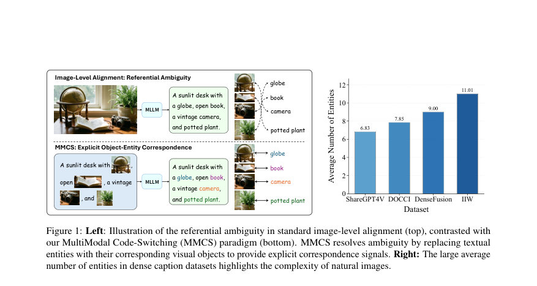
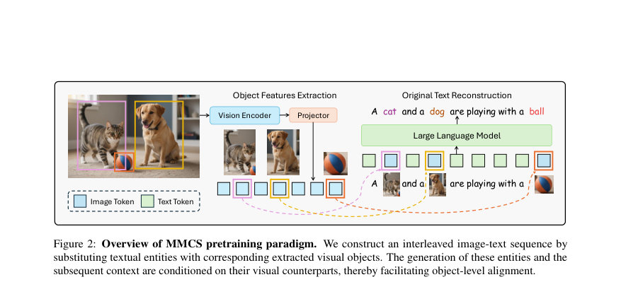
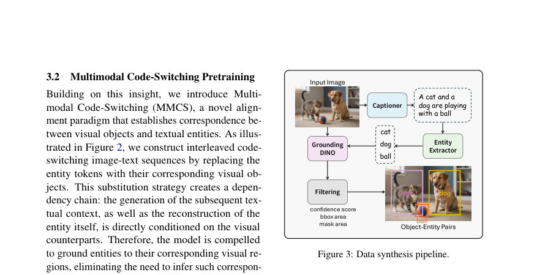

# MultiModal Code-Switching: Interleaving Visual Objects into Language for Explicit Object-Level Alignment

- **게시일:** 2026-08-13
- **arXiv:** [2608.11167v1](http://arxiv.org/abs/2608.11167v1) · [PDF](https://arxiv.org/pdf/2608.11167v1)
- **저자:** Changhao Xiang, Shangyu Xing, Zhen Wu, Jianbing Zhang, Xinyu Dai
- **분야:** cs.CV, cs.CL, cs.LG
- **선정 점수:** 4.28
- **선정 이유:** 최근성 0.8, 인용 영향 0.0 (인용 0회), 저자 영향 0.0 (최고 h-index 0), AI 주제 적합성 2.5, 개발자 관심 0.5, 학술 신호 0.5, 오픈 웨이트·주요 연구조직 신호 0.0

[← 2026-08-13 목록으로 돌아가기](../daily/2026-08-13.html)

<!-- paper-visuals:start -->
## 주요 Figure

> 원문 PDF에서 실제 Figure 캡션과 그림 영역이 함께 확인된 자료만 자동 추출했다.

*Figure · 원문 PDF 2쪽 · Figure 1: Left: Illustration of the referential ambiguity in standard image-level alignment (top), contrasted with*

*Figure · 원문 PDF 3쪽 · Figure 2: Overview of MMCS pretraining paradigm. We construct an interleaved image-text sequence by*

*Figure · 원문 PDF 4쪽 · Figure 3: Data synthesis pipeline.*

<!-- paper-visuals:end -->

## 한 문장 요약

자연 이미지에서 참조 불명확성 문제를 해결하기 위해 텍스트 속 명사구(엔티티)를 대응하는 시각 객체 임베딩으로 대체하는 'MultiModal Code-Switching (MMCS)'라는 사전학습 패러다임을 제안하여 명시적 객체-엔티티 정렬을 유도한다.

## 해결하려는 문제

기존 MLLM의 모달리티 정렬은 이미지 전체를 하나의 전역 표현으로 압축한 뒤 긴 캡션을 예측하도록 학습하는 이미지-레벨 정렬에 의존한다. 자연 이미지는 여러 객체를 포함하기 때문에 전역 표현만으로는 텍스트 엔티티와 특정 시각 영역 간의 대응을 추론하기 어렵고(참조 불명확성), 이로 인해 데이터 비효율성과 표현의 의미적 접지(semantic grounding) 저하가 발생한다. 본 논문은 이러한 이미지-레벨 정렬의 한계를 해결하고 객체 수준의 명시적 대응을 제공하는 방법을 제시하는 것을 연구 질문으로 삼는다.

## 핵심 기여

- MultiModal Code-Switching (MMCS)라는 새로운 모달리티 정렬 사전학습 패러다임을 제안하여 텍스트 엔티티를 대응하는 시각 객체 토큰으로 대체함으로써 객체-엔티티의 명시적 대응을 학습하도록 함.
- 대규모 자동 합성 파이프라인을 제시하여 773,779(논문 표기: 773K)개의 샘플과 총 5,145,630개의 객체(평균 6.65개/샘플)를 포함하는 사전학습 데이터셋을 생성하고, 자동 및 인적 검증을 통해 품질을 보고함.
- 언어모델 기반의 생성 손실(LLM)과 엔티티 복원 손실(Lentity)을 결합한 학습 목표를 제안하여, 시각 객체 임베딩이 텍스트 생성 문맥과 엔티티 재구성 모두에 기여하도록 설계함.
- 다양한 모델 규모(Qwen2.5-3B, Qwen3-8B, Llama3-8B)와 비전 인코더(SigLIP2, QwenViT)에서 광범위한 실험을 수행해 MMCS가 데이터 효율성과 시각 기반 정렬·지각 능력을 지속적으로 향상시킴을 보임.
- 내부 표현 정렬(CKA, CKNNA, Mutual k-NN), 어텐션 시각화, 토큰 수준 로그우도 분석 등 분석을 통해 MMCS가 보다 날카로운 어텐션과 향상된 표현 일관성으로 성능 향상을 야기함을 기계적 인사이트로 제시함.

## 접근 방법

* MMCS는 입력 이미지와 해당 상세 캡션에서 추출한 텍스트 엔티티(주로 명사구)를 해당 엔티티에 대응하는 시각 객체의 이미지 토큰으로 교체하여(interleaving) 생성 조건을 재구성한다.
* 형식적으로는 캡션의 연속 엔티티 구간 e=[xi..xi+m]를 그에 대응하는 v_object(엔티티의 바운딩박스와 겹치는 이미지 토큰 집합)로 대체하여 X_MMCS = Concat(X< i, v_object, X> i+m)을 만든다.
* 손실은 (1) 시각 토큰을 문맥으로 사용해 다음 토큰을 예측하는 언어모델 손실 LLM과 (2) 대체한 시점에서 원래 엔티티 시퀀스 e를 복원하도록 하는 엔티티 재구성 손실 Lentity의 합 LMMCS = LLM + Lentity로 정의된다.
* 데이터 합성 파이프라인은 (a) Qwen3-VL-32B-Instruct로 상세 캡션 생성, (b) Qwen2.5-72B-Instruct로 엔티티(명사구) 추출, (c) Grounding DINO로 엔티티의 바운딩박스 확보, (d) 필터링(박스 임계값 0.4, 텍스트 임계값 0.3, bbox 면적 제한(작거나 전체의 >50% 제외), SAM-2.1로 마스크 생성 후 마스크 면적이 bbox의 20% 미만인 객체 제외)을 거쳐 정확한 객체-엔티티 페어를 얻는다.
* 모델 구성은 SigLIP2-SO-400M 비전 인코더(타일 분해 전략), Qwen2.5-3B/Qwen3-8B/Llama3-8B LLM, 2-layer MLP projector(2×2 픽셀 언쉐플 사용)이며, 사전학습 데이터(773K)로 MMCS 또는 이미지-레벨 대조 학습을 수행하고 이후 LLaVA-NeXT(779K)로 SFT를 진행한다.
* 실험상 사전학습 시 LLM 백본은 동결된 상태에서 projector를 학습하는 구성 및 SFT에서는 LoRA를 적용한 설정을 사용했다.

## 주요 결과

- 데이터 효율성: 동일한 SFT(200K) 하에서 사전학습 샘플 수를 0→600K로 바꿔 비교한 결과 MMCS는 매우 높은 데이터 효율을 보였으며, 논문은 '50K 샘플만으로 이미지-레벨 방식의 600K와 동등하거나 더 우수한 성능을 달성'한다고 보고함(Figure 4).
- 시각 그라운딩(RefCOCO/+/g): Qwen2.5-3B+SigLIP2 기준에서 MMCS는 Ref 계열 전반에서 유의한 개선을 보였고(예: Table 1의 평균 Acc@0.5 기준, Caption 대비 MMCS 평균치 59.12→70.29), 논문은 평균 7.9% 향상이라고 요약함.
- 시각 지각 및 일반 VQA: Table 2에서 MMCS는 CVBench 평균 4.0% 향상, OCRBench 평균 2.8% 향상, V-Star 평균 2.0% 향상 등 전반적 지각능력에서 개선을 보였고 논문은 전반적으로 지각 기반 벤치마크에서 평균 2.1% 향상이라고 보고함.
- 어블레이션: 두 손실 성분이 모두 중요함. Lentity를 제거하면 지각(perception) 벤치에서 약 -4.0% 하락(논문 기술), LLM을 제거하면 그라운딩 성능에서 약 -4.9% 하락(논문 기술), 따라서 Lentity는 시맨틱 정밀성 앵커, LLM은 문맥 통합에 중요함(Table 3).
- 표현 정렬 분석: COCO2014 검증의 1,000 샘플에 대해 층별 CKA, CKNNA, Mutual k-NN을 계산한 결과 MMCS가 이미지-레벨 사전학습보다 높은 레이어별 표현 정렬 점수를 기록하여(그림 5) 내부 표현 수준에서의 정렬 개선을 확인함.

데이터·품질 통계: 합성 데이터셋은 773,779 샘플, 총 5,145,630 객체, 평균 캡션 길이 961.65자, 평균 객체 수 6.65를 보고함(Table 4). VLM Judge(Gemini-3-Pro)와 인간 평가에 의한 객체 정렬 정확도는 평균 각각 0.949, 0.942로 보고되어 합성 라벨의 품질이 비교적 높음을 보임(Table 5).

## 한계

- 저자가 명시한 한계: 현재 구현은 자연 이미지 내 시각 객체에 주로 초점을 맞추었으며, 차트나 장면 텍스트 인식 같은 다른 도메인으로의 확장은 향후 작업으로 남겨둠. 또한 자동 합성 과정에서 생성된 주석은 원본 데이터셋의 라이선스·프라이버시 위험(얼굴, 번호판, 위치 단서 등)을 계승할 수 있고 데이터 바이어스가 내재할 수 있음을 저자가 명시함.
- 본문 실험·방법에서 확인되는 제약: MMCS는 객체와 텍스트 엔티티의 자동 정렬(grounding DINO 등)에 의존하므로 정렬 품질이 낮으면 효과가 감소할 가능성이 있으나 논문 내 실험은 10%/30% 인위적 오염 실험에서 비교적 강건함을 보였음(Table 9). 또한 사전학습 단계에서 LLM 백본을 동결한 설정을 사용하였으므로, 백본을 함께 학습하는 경우의 거동은 본문에서 직접적으로 검증되지 않음(본문에서 'LLM은 동결'로 언급). 마지막으로, MMCS가 일반 VQA에 끼치는 이득은 그라운딩·지각 분야보다 상대적으로 작아(논문 수치), 지식·추론·명령 수행 능력 개선에는 한계가 있음.

## 개발자 관점

- 데이터 합성 파이프라인은 재현 가능하고 실용적임: 상세 캡션 생성(Qwen3-VL-32B-Instruct), 엔티티 추출(Qwen2.5-72B-Instruct), 객체 정렬(Grounding DINO), 마스크 필터링(SAM-2.1) 순으로 구성되어 있으며 논문에 필터 임계값(박스 0.4, 텍스트 0.3, 마스크 면적 ≥ bbox의 20%, bbox 면적 제한 등)이 공개되어 있어 동일 파이프라인 재현이 가능함(Section 3.3, Appendix A.1).
- 두 가지 손실을 모두 사용해야 함: LLM(문맥 생성)과 Lentity(엔티티 재구성)를 함께 최적화해야 객체 정렬과 문맥 통합에서 최대 성능을 얻음(ablations, Table 3).
- 토큰·연산 이점: MMCS는 대상 객체 중심의 로컬 토큰만 LLM에 삽입하므로 평균 이미지 토큰 수를 약 41.4% 절감해(그림 7) 사전학습 시 계산 효율성을 개선할 수 있음.
- 다양한 비전 인코더와 호환: 논문은 SigLIP2와 QwenViT 양쪽에서 실험을 수행했고 MMCS가 일관된 이득을 보였으므로 다양한 비전 백본에 적용 가능함(Section 4.4, Table 2).
- 노이즈와 확장성: 자동 주석의 일부 오류(10% 수준)는 허용 가능하며(성능 유지), 30% 수준의 교란에서도 완전히 붕괴하지 않음(Table 9). 따라서 완벽한 수작업 주석 없이도 대규모 자동 합성으로 확장 가능함(Section D.2, D.4). 그러나 실제 배포 시 원본 이미지의 라이선스·프라이버시·편향 문제를 반드시 검토해야 함(제한점).

**근거 범위:** 이 분석은 제공된 논문 PDF 본문(페이지 1–21 및 부록)을 기반으로 작성되었으며, 본문에서 명시된 표와 그림(예: Table 1–15, Table 4–6, Figures 1–9)과 기술된 수치 및 문장들을 직접 인용해 요약하였습니다. 외부 코드·데이터 리포지터리나 추가 보충자료는 확인하지 않았고, 본문에 직접 명시되지 않은 구현 세부사항(예: 공개된 코드 위치, 모델 체크포인트 경로)은 포함하지 않았습니다.
