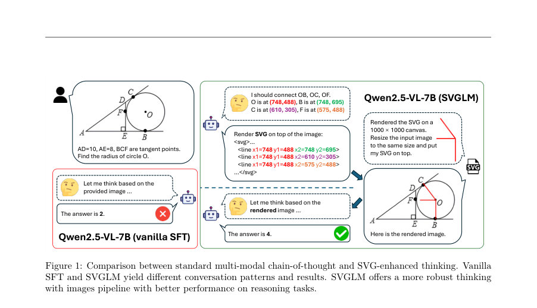
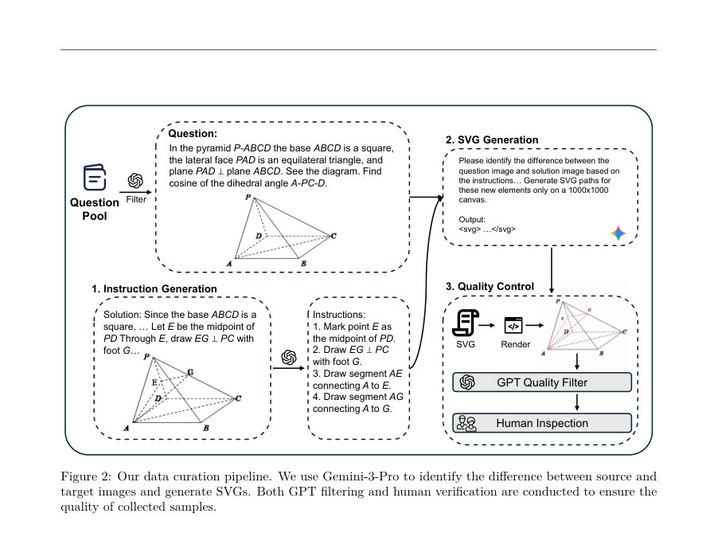
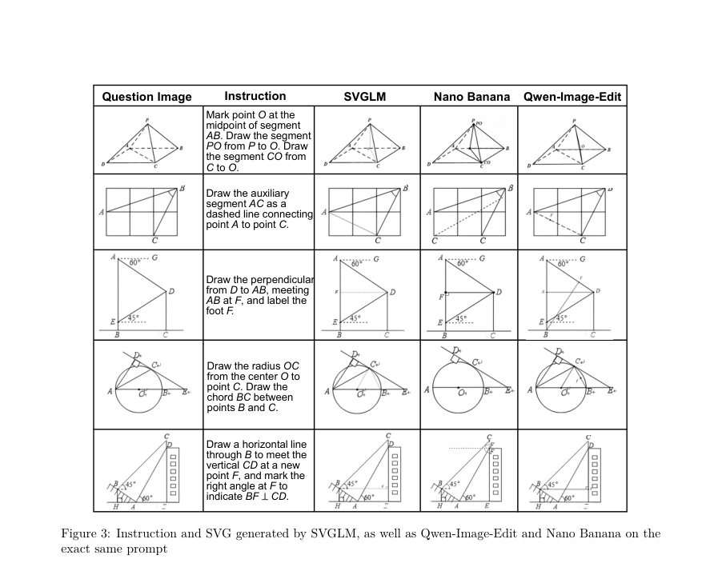

# Multimodal Thinking with Renderable Programs

- **게시일:** 2026-09-27
- **arXiv:** [2609.30130v1](http://arxiv.org/abs/2609.30130v1) · [PDF](https://arxiv.org/pdf/2609.30130v1)
- **저자:** Sunli Chen, Ding Zhong, Ziqiao Ma, Jiaxin Liu, Zeyuan Yang, Hao Zhang, Lie Lu, Joyce Chai, Chuang Gan
- **분야:** cs.CV, cs.CL
- **선정 점수:** 6.21
- **선정 이유:** 최근성 0.5, 인용 영향 0.0 (인용 0회), 저자 영향 1.9 (최고 h-index 31), AI 주제 적합성 2.7, 개발자 관심 0.4, 학술 신호 0.8, 오픈 웨이트·주요 연구조직 신호 0.0

[← 2026-09-27 목록으로 돌아가기](../daily/2026-09-27.html)

<!-- paper-visuals:start -->
## 주요 Figure

> 원문 PDF에서 실제 Figure 캡션과 그림 영역이 함께 확인된 자료만 자동 추출했다.

*Figure · 원문 PDF 2쪽 · Figure 1: Comparison between standard multi-modal chain-of-thought and SVG-enhanced thinking. Vanilla*

*Figure · 원문 PDF 4쪽 · Figure 2: Our data curation pipeline. We use Gemini-3-Pro to identify the difference between source and*

*Figure · 원문 PDF 8쪽 · Figure 3: Instruction and SVG generated by SVGLM, as well as Qwen-Image-Edit and Nano Banana on the*

<!-- paper-visuals:end -->

## 한 문장 요약

SVG(Scalable Vector Graphics) 기반의 렌더 가능한 프로그램을 멀티모달 추론 체인에 통합해 VLM이 중간 시각적 상태를 생성·렌더링하며 ‘think-with-image’ 능력을 향상시키는 SVGLM 패러다임과 8K 규모의 SVG 편집 데이터셋을 제안한다.

## 해결하려는 문제

기존 VLM은 도형·차트·구조화된 시각자료 등 디지털 그래픽을 정확히 이해하거나 시각적 근거에 기반한 중간 추론 단계를 생성하는 데 한계가 있다. 기존 접근은 (i) 래스터/잠재 표현을 생성해 긴 시각적 코드를 비효율적으로 만드는 방식, 또는 (ii) 파이썬 등 명령형 코드에 의존해 소프트웨어 스택에 brittle하게 결합되는 방식에 의존해 확장성·검증 가능성에 제약이 있다. 본 논문은 SVG라는 선언적·해상도 독립적 표현을 이용해 텍스트 기반 추론과 시각적 근거를 연결할 수 있는지 평가한다.

## 핵심 기여

- 고품질 LLM-검증 SVG 이미지 편집 데이터셋(약 8,000 샘플)을 구성하고 수집 파이프라인을 제시했다 (GPT-5 필터링, Gemini-3.0-Thinking으로 좌표 생성, GPT-5+사람 검수).
- SVG를 중간 산출물(tool-call 형식)의 형태로 VLM 추론 루프에 통합하는 SVGLM 패러다임을 제안했다(‘<tool_call>’ 토큰으로 XML-encoded SVG를 생성·렌더링하고 피드백을 받음).
- 오픈소스 VLM들을 SVG 기반의 SFT로 미세조정하여 수학·기하학적 추론 벤치마크에서 성능 향상을 보였음을 실험적으로 증명했다.
- SVG 생성·렌더링의 독립적인 효과(생성만/렌더피드백 포함)를 분리한 소거실험으로 SVG의 생성과 렌더 피드백이 각각 기여함을 입증했다.

## 접근 방법

* 아키텍처·절차: 모델은 자유로운 텍스트 생성 도중 언제든지 ‘<tool_call>…</\tool_call>’ 토큰으로 XML 형식의 SVG를 출력해 도구 호출을 트리거한다.
* 호출 인자에는 1000×1000 캔버스 기준으로 정규화한 SVG 코드와 캔버스(문제 이미지 또는 빈 캔버스) 지정이 포함된다.
* 생성한 SVG는 결정론적으로 렌더링되어 원래 대화 컨텍스트로 다시 입력되며 모델은 렌더된 이미지를 참조해 다음 추론 단계를 진행한다.
* 데이터 수집: MathCanvas-Instruct의 기하 샘플을 GPT-5로 필터링하고, Gemini-3.0-Thinking으로 질문·해답 이미지 차이를 분석해 키포인트 좌표와 SVG를 생성한 뒤 GPT-5 검증 및 인간 검수로 품질을 확보(인간평가: 구조적 오류 1%).
* 학습·추론 세부: LLaMa-Factory 기반으로 SFT를 수행하였고 언어모델 파라미터 전부를 튜닝하되 비전 토워와 멀티모달 프로젝터는 동결했다.
* 학습 설정은 3 epochs, learning rate 1e-5, effective batch size 8, 8×NVIDIA H100 환경(부록 B).
* 실험 설정: MathCanvas-Bench의 Plane/Solid Geometry 평가(가중 정확도)와 POPE(grounded reasoning) 등으로 비교.
* 추가로 reasoning-density(무·간결·완전) 레벨의 대화 포맷을 제작해 SFT에 사용했다.

## 주요 결과

- 주요 벤치(MathCanvas-Bench)에서 SVGLM은 모든 베이스 모델에 대해 SFT 및 zero-shot 대비 성능 향상을 보였다 (Table 2). 예: Qwen2.5-VL-7B의 경우 weighted score는 zero-shot 19.5 → SFT 21.8 → SVGLM 30.9로 SVGLM이 SFT 대비 +9.1pp 상승, LLaVa-Next-Mistral-7B는 SFT 13.2 → SVGLM 23.1, InternVL3-8B는 SFT 23.0 → SVGLM 29.8.
- 논문 전반의 요약 주장은 SVGLM이 zero-shot 대비 약 +8% 포인트, direct SFT 대비 약 +6.5% 포인트 향상을 보였다고 보고했다(본문).
- 데이터 품질 평가: 수집된 샘플의 인간 평가 결과에서 '완벽 재구성'이 79.5%, '약간의 평행 이동' 10%, '큰 평행 이동' 9.5%, '구조적 오류' 1%로 보고되어 데이터 품질이 높음을 주장한다 (Table 1).
- Grounded reasoning(POPE) 실험에서도 SVGLM이 성능 향상을 보였다. 예: LLaVa-Next: zero-shot 47.4 → SFT 61.2 → SVGLM 69.4; Qwen2.5: 74.4 → 81.9 → 83.8; InternVL3: 81.6 → 82.3 → 84.8 (Table 4).
- 소거 실험(Table 5)에서 SVG 생성만(렌더 미피드백)도 SFT보다 개선을 보였고, 렌더된 이미지를 컨텍스트로 재투입하면 추가 향상이 발생해 '생성+렌더' 두 단계 모두 유의미한 기여를 함을 보였다.

## 한계

- 저자 명시 한계: 계산 자원과 유료 API 호출 제약으로 대형 모델과 더 큰 SVG 데이터셋에서의 결과를 검증하지 못했다고 명시함(결과의 확장성·스케일 검증 부족).
- 실험·도메인 제한(본문에서 확인되는 제약): 평가가 주로 수학적 기하(Plane, Solid Geometry) 및 MathCanvas 기반 문제에 집중되어 있어 자연 이미지 편집·일반 오픈 도메인 시나리오로의 일반화가 검증되지 않음.
- 데이터 수집 의존성: 고품질 SVG 생성에 Gemini-3.0-Thinking·GPT-5 등의 상용 LLM을 활용했으며(본문), 이는 재현 시 유료 API와 추가 비용을 요구할 가능성이 있음.
- 모델·데이터 오염 위험: 본문에서 Qwen3-VL 등 일부 모델은 훈련 데이터 오염 의심 사례로 제외되었음을 밝히며, 데이터 오염이 성능 측정에 큰 영향을 줄 수 있음을 시사함. 해당 위험은 재현 시 주의 필요함.

## 개발자 관점

- 재현 필요 자원: 논문 구현은 언어모델 전체 SFT(vision tower 동결)를 전제로 하며 8×NVIDIA H100 수준의 GPU 자원과 LLaMa-Factory 기반 환경이 요구된다(부록 B의 학습 설정 참조).
- 데이터 파이프라인: 고품질 SVG 데이터 구축에는 (i) 문제·해답 이미지 쌍 필터링(GPT-5), (ii) 정밀 좌표·SVG 생성(Gemini-3.0-Thinking), (iii) 자동·휴먼 검수(GPT-5 + 인간)가 포함되어야 하며, 좌표는 1000×1000 캔버스 정규화 규칙을 엄격히 지켜야 한다(본문·부록 A).
- 모델 통합 설계: 툴 호출 형태('<tool_call>' 래퍼)로 XML-encoded SVG를 출력하고 렌더된 이미지를 다시 컨텍스트로 입력하는 루프가 핵심이다. 렌더러와 입출력 포맷(좌표 정밀도, 캔버스 정렬)이 재현성에 결정적 영향이 있으므로 엔지니어링 시 주의해야 한다.
- 비용·의존성 고려: 데이터 수집(LLM API)과 검수에 유료 서비스가 쓰였고, 이미지 렌더링·저장·피드백 루프의 운영 비용이 존재한다. 또한 기존 이미지 편집 모델(확산 기반)은 텍스트-기반 지시에 취약해 SVG 루프를 통한 접근이 비용·품질 면에서 유리할 수 있다는 점을 감안하라.
- 안전성과 검증성: SVG는 선언적·거리독립적 표현으로 인간 검증·디버깅이 쉽고, 중간 시각적 산출물이 명시적이므로 환각(hallucination) 진단·수정에 유리하다. 다만 생성된 SVG의 좌표·구조 오류는 잘못된 추론을 낳을 수 있으므로 엄격한 품질 필터링이 필요하다.

**근거 범위:** 본 분석은 제출된 논문 PDF 본문(주요 텍스트, 표와 부록의 학습·데이터 수집 설명)을 기반으로 작성되었다. 표(Table 1–6), 데이터 수집·학습 설정(본문 및 부록 B), 사례적 설명(그림·문단)을 직접 참조해 수치와 절차를 인용했으며, 코드·데이터 공개 여부나 추가 구현 세부(예: 공개 저장소 링크)는 PDF에 명시되지 않아 확정적으로 기술하지 않았다.
