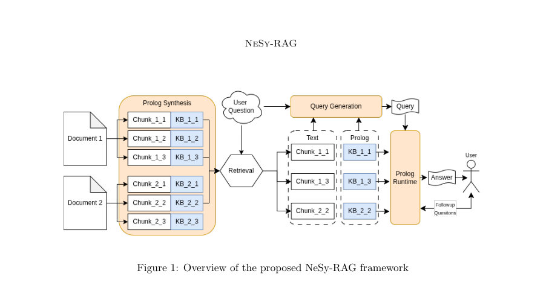
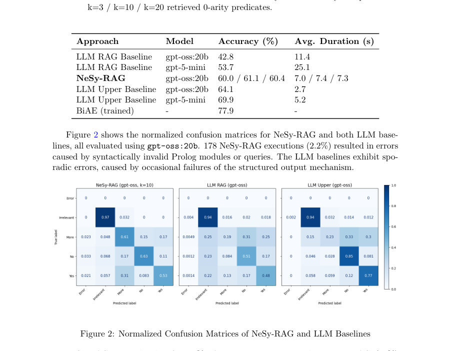

# NeSy-RAG: Neuro-Symbolic RAG for Explainable Question Answering

- **게시일:** 2026-08-08
- **arXiv:** [2608.06292v1](http://arxiv.org/abs/2608.06292v1) · [PDF](https://arxiv.org/pdf/2608.06292v1)
- **저자:** Jonas Gann, Michael Gertz
- **분야:** cs.CL, cs.SC
- **선정 점수:** 4.04
- **선정 이유:** 최근성 0.5, 인용 영향 0.0 (인용 0회), 저자 영향 0.0 (최고 h-index 0), AI 주제 적합성 2.5, 개발자 관심 0.2, 학술 신호 0.8, 오픈 웨이트·주요 연구조직 신호 0.0

[← 2026-08-08 목록으로 돌아가기](../daily/2026-08-08.html)

<!-- paper-visuals:start -->
## 주요 Figure

> 원문 PDF에서 실제 Figure 캡션과 그림 영역이 함께 확인된 자료만 자동 추출했다.

*Figure · 원문 PDF 3쪽 · Figure 1: Overview of the proposed NeSy-RAG framework*

*Figure · 원문 PDF 9쪽 · Figure 2: Normalized Confusion Matrices of NeSy-RAG and LLM Baselines*

<!-- paper-visuals:end -->

## 한 문장 요약

NeSy-RAG은 검색 기반 QA에 대해 텍스트 청크로부터 귀속 가능한 Prolog 모듈과 0-arity 술어를 합성해 기호적 추론과 사용자 맥락 확인(knowledge-gap detection)을 결합함으로써 설명 가능하고 결정론적 답변을 제공하는 신경-기호 RAG 프레임워크이다.

## 해결하려는 문제

기존 RAG(검색 증강 생성)는 외부 지식으로 LLM의 사실성을 높이지만 내부 추론 과정이 불투명하고, 중간 추론 단계의 출처 귀속이 보장되지 않으며, 사용자 특화 맥락(사용자 정보)이 누락되었을 때 이를 체계적으로 감지·해결하지 못해 불완전하거나 잘못된 답변을 내는 문제가 있다. 본 논문은 이러한 한계를 해결하고자 한다.

## 핵심 기여

- 검색된 텍스트 청크마다 귀속 가능한(Prolog 모듈 단위로) 규칙·사실을 합성하는 모듈식 신경-기호 RAG 프레임워크(NeSy-RAG)를 제안.
- 0-arity(무인수) 술어 추상화를 도입하여 청크별 Prolog 모듈의 기능을 Boolean 주장으로 노출시키고, 자연어↔코드 임베딩을 통한 술어 검색으로 제약된 쿼리 구성을 가능하게 함.
- 기호적 지식-갭(knowledge-gap) 감지 메커니즘을 도입하여 추론 중 사용자의 불완전한 사실(dynamic facts)을 식별하고 자동으로 후속 질문을 유도·처리하도록 설계.
- 청크-단위 모듈 합성과 술어 수준의 계층적 검색으로 대규모 지식에 대해 확장성 있는 쿼리 생성·추론을 구현.
- 도메인 특화 학습 없이 ShARC 벤치마크에서 기존 동일 모델 기반 RAG 대비 유의한 성능 향상을 보임.

## 접근 방법

* 아키텍처·알고리즘·추론 절차: - 입력: 도메인 지식 D를 청크 집합 C로 분할하고, 질문 q와(부분적) 사용자 맥락 I를 받음.
* - 단계 1(청크별 Prolog 합성): 각 검색된 텍스트 청크 cm에 대해 LLM을 이용해 Prolog 모듈 pm=(Rm,Fm)를 합성.
* 모듈은 해당 청크에 고유하게 귀속되어 추론 추적 시 출처를 명시할 수 있음.
* - 단계 2(0-arity 추상화): 모듈 내부의 기능을 0-arity(Boolean) 규칙으로 추상화해 모듈 기능을 간결한 주장 단위로 노출.
* - 단계 3(계층적 검색·쿼리 구성): 먼저 질의와 청크 레벨로 관련 청크를 선택(평가는 본 연구에서 시뮬레이션됨, 실험은 각 인스턴스에 원문 스니펫 + 무작위 distractor 2개로 구성).
* 0-arity 규칙을 코드·자연어 공동 임베딩(jina-code-embeddings-1.5b)을 통해 질의 유사도로 랭킹한 뒤 상위 k개 규칙만 LLM에 노출하여 Prolog 쿼리를 생성함(쿼리 생성은 모듈 전체 로딩 불필요).
* - 단계 4(기호적 실행·지식 갭 처리): 생성된 모듈을 SWI-Prolog(swipl)에 로드하고 쿼리를 실행.
* 실행 중 dynamic predicate(사용자 정보에 의존하는 Boolean 인자)가 평가될 때 외부 인터랙션 함수(PySwip)를 통해 후속 질문을 생성·투입하고, 시뮬레이터(평가용 LLM)가 컨텍스트에 따라 응답.
* 응답 불가 시 해당 predicate를 true/false로 가정하여 결과 민감도를 판단해 'more'를 결정할지 최종 yes/no를 반환.
* - 출력: 결정론적 Prolog 응답과 각 추론 단계에 대응하는 실행 추적(trace)을 제공하여 각 사실·규칙을 원본 청크로 귀속 가능하게 함.

## 주요 결과

- 데이터셋: ShARC 테스트 분할(8,276개 인스턴스)으로 평가. 평가는 도메인 특화 학습 없이 수행됨.
- 핵심 정량 성능(정확도, 평균 처리시간): NeSy-RAG (gpt-oss:20b) 정확도 60.0% / 61.1% / 60.4% (k=3 / 10 / 20, k=10에서 61.1%), 평균 처리시간 7.0s / 7.4s / 7.3s. LLM RAG Baseline (gpt-oss:20b) 42.8% 정확도, 평균 11.4s. LLM RAG Baseline (gpt-5-mini) 53.7% 정확도, 평균 25.1s. LLM Upper Baseline (gpt-oss:20b, 맥락 완전 제공) 64.1% 정확도, 평균 2.7s. 트레이닝된 모델 BiAE (문헌상) 77.9%로 상한선 제시.
- 에러 및 행동 양상: 178회 실행(2.2%)에서 문법적/구문적 오류로 인한 Prolog 모듈·쿼리 실패가 발생. NeSy-RAG는 'more' 클래스를 올바르게 분류한 비율에서 LLM RAG(19%)·LLM Upper(23%)보다 높은 61%를 기록해 지식-갭 감지의 유효성을 보였음.
- 오류 패턴: NeSy-RAG는 'yes'를 'more'로 잘못 분류하는 경향이 있어(yes→more 31%) 동적 술어 과생성(over-generation)이 주된 성능 제한 요인으로 지적됨. 또한 더(미결정)를 잘못 확신으로 분류하는 경우(more→yes 17%, more→no 15%)가 존재하지만 두 비율 모두 비교 대상 LLM들보다 낮음.

## 한계

- 저자가 명시한 한계: (1) 동적 술어의 과생성(over-generation)으로 인해 답변 가능한 경우를 보수적으로 'more'로 분류하는 오류가 발생하며, 이를 줄이는 것이 성능 개선의 직접적 경로라고 명시. (2) 본 평가는 단일 관련 스니펫 기반으로 설계되어 다중 홉(multi-hop)·다중 청크 간 추론은 현재 실험 범위 밖이며 향후 작업으로 제시. (3) 지식-갭 감지를 Boolean 술어(단일 Boolean 인자)에 한정해 구현했으며, 이를 확장하는 것이 필요하다고 명시.
- 본문에서 합리적으로 확인되는 추가 제약(저자 직접 언급 아님): (1) 평가에서 사용자 응답은 '이상적 사용자'를 시뮬레이션하는 LLM이 컨텍스트를 완전하게 참조해 응답하도록 설정되어 실제 사용자 응답의 불확실성·오류가 없는 이상적 조건임 — 실제 배포 시 후속 질문의 응답 품질이 성능에 큰 영향을 줄 것으로 보임. (2) 검색(혹은 후보 스니펫 선정) 성능이 전체 파이프라인 성능에 결정적이며, 본 실험은 검색을 시뮬레이션(대상 스니펫 + 랜덤 distractor)했으므로 실제 검색 구성과 성능 연동 효과는 추가 검증이 필요함. (3) 현재 구현은 Boolean 기반 동적 사실에 초점을 두어 수치·문자열 등 복합 타입의 사용자 정보 처리 및 상호작용 확장이 필요함.

## 개발자 관점

- 재현성과 구현: 논문 본문과 부록(Appendix B)에 Prolog 합성·0-arity 생성·쿼리 생성 등 주요 LLM 프롬프트가 제공되어 재현에 유리. 샘플 Prolog KB(Appendix A)도 포함되어 있어 모듈 구조와 동적 술어 설계 방식 확인 가능.
- 필수 구성 요소: 고성능 LLM(논문에서는 gpt-oss:20b, gpt-5-mini 사용), 코드·자연어 공동 임베딩(jina-code-embeddings-1.5b), SWI-Prolog(swipl) 및 PySwip를 통한 Prolog 통합, 임베딩 기반 검색 인프라가 필요함.
- 운영비용과 성능 고려: NeSy-RAG는 모듈 재사용(청크당 Prolog 합성 1회)과 0-arity 기반 쿼리 구성으로 LLM 호출·토큰 사용을 절감할 수 있으나, 초기 모듈 합성 및 임베딩 계산 비용이 존재. 실험상 평균 처리시간은 RAG LLM Baseline보다 작아(약 7.4s vs 11.4s) 응답성 측면 이점이 있음.
- 안전성·설명성: Prolog 실행 추적을 통해 각 규칙·사실을 원문 청크에 귀속시키므로 감사·검증·디버깅에 유리. 또한 지식-갭 감지로 불확실할 때 'more'로 응답하는 보수적 정책이 고위험 도메인에서 허용 가능한 안전성 이점을 제공.
- 배포 상 실용적 고려사항: (1) 실제 사용자와의 후속 질문 루프는 논문처럼 이상적 LLM 시뮬레이션이 아니므로 UX·대화 정책 설계 필요. (2) 검색 품질(청크 선정)이 전체 결과에 큰 영향—검색 구성(스니펫 수, 랭킹 품질)과 k(상위 0-arity 규칙 수) 하이퍼파라미터 튜닝이 중요. (3) 동적 술어 생성 규칙을 더 엄격히 제약해야 불필요한 후속 질문을 줄이고 정확도를 개선할 수 있음.

**근거 범위:** 이 분석은 제공된 논문 PDF 본문(페이지 1–18, 부록 포함)의 텍스트를 근거로 작성되었다. 실험 설정(검색 시뮬레이션, 사용자인포메이션 시뮬레이션), 표에 제시된 수치(정확도·평균 처리시간·에러율 등), 부록의 프롬프트와 샘플 Prolog 코드 등은 본문에서 확인된 내용이다. 논문 외부 구현 세부사항(예: 실제 검색 시스템 구성, 프로덕션 사용자 응답 품질 등)은 본문에서 명시적으로 제공되지 않아 본 분석에서는 재구성하거나 추정하지 않았다.
