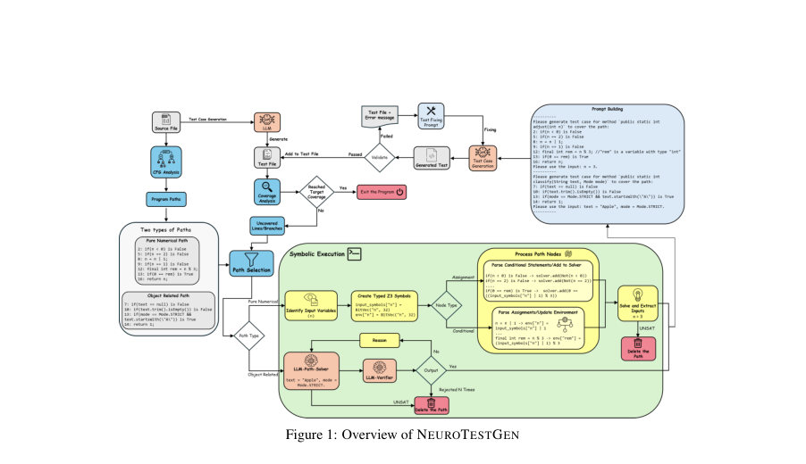
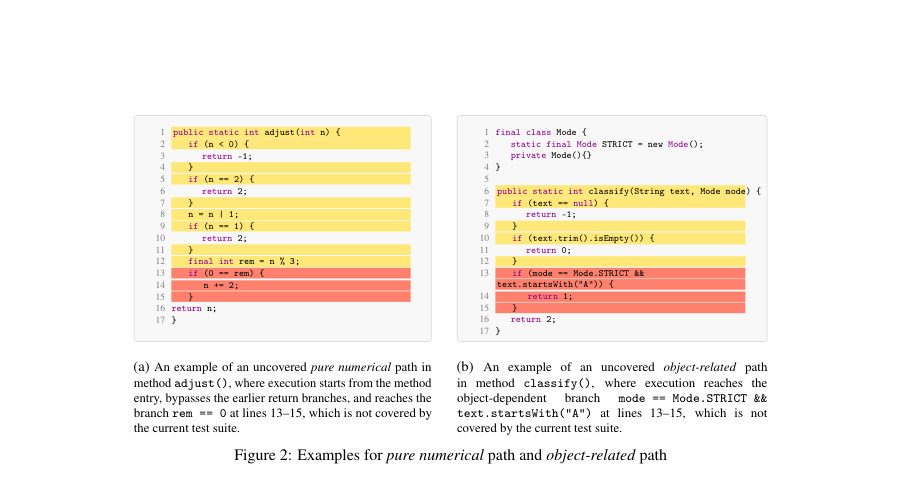
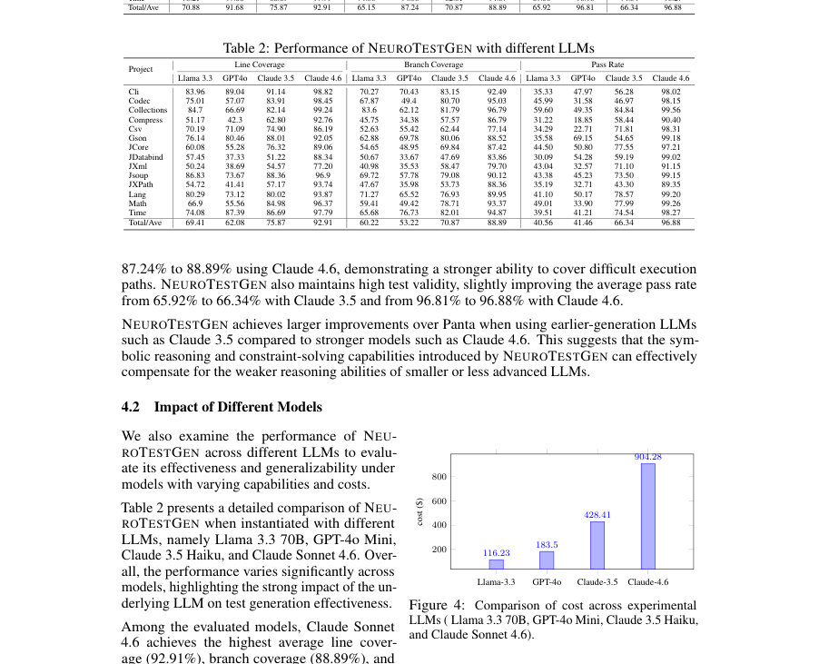

# NEUROTESTGEN: Neuro-Symbolic Guided Test Generation with Large Language Models

- **게시일:** 2026-09-27
- **arXiv:** [2609.30178v1](http://arxiv.org/abs/2609.30178v1) · [PDF](https://arxiv.org/pdf/2609.30178v1)
- **저자:** Ruixin Zhang, Jiho Shin, Hung Viet Pham, Song Wang
- **분야:** cs.SE
- **선정 점수:** 5.87
- **선정 이유:** 최근성 0.5, 인용 영향 0.0 (인용 0회), 저자 영향 1.5 (최고 h-index 11), AI 주제 적합성 1.7, 개발자 관심 0.2, 학술 신호 0.8, 오픈 웨이트·주요 연구조직 신호 1.2

[← 2026-09-27 목록으로 돌아가기](../daily/2026-09-27.html)

<!-- paper-visuals:start -->
## 주요 Figure

> 원문 PDF에서 실제 Figure 캡션과 그림 영역이 함께 확인된 자료만 자동 추출했다.

*Figure · 원문 PDF 3쪽 · Figure 1: Overview of NEUROTESTGEN*

*Figure · 원문 PDF 4쪽 · Figure 2: Examples for pure numerical path and object-related path*

*Figure · 원문 PDF 7쪽 · Figure 4: Comparison of cost across experimental*

<!-- paper-visuals:end -->

## 한 문장 요약

NEUROTESTGEN은 SMT 기반의 상징적 실행(Z3)으로 경로별 제약을 추출하고, 이를 LLM(예: Claude, Llama, GPT)로 유도해 구체적이고 실행 가능한 단위 테스트를 반복 검증하면서 목표 라인·브랜치를 달성하는 신경-심볼릭 하이브리드 테스트 생성 시스템이다.

## 해결하려는 문제

LLM은 인간 수준의 가독성 있는 테스트를 잘 생성하지만 정밀한 경로 제약(path constraints)을 만족시키는 입력을 안정적으로 만들어내지 못한다. 반면 상징적 실행은 경로 제약을 정확히 유도할 수 있으나 현실적이고 가독성 있는 테스트 케이스를 직접 생성하지 못하고 확장성(path explosion, 힙 모델링 등)에서 제약을 받는다. 본 연구는 특정 라인·브랜치를 목표로 하는 구조적 커버리지를 효율적으로 달성하기 위해 두 접근의 장점을 결합할 수 있는지, 그리고 객체 관련 복잡 제약을 포함한 경로를 어떻게 해결할지를 다룬다.

## 핵심 기여

- NEUROTESTGEN: 상징적 실행(Z3)으로 경로 제약을 추출하고 LLM으로 구체적 테스트를 합성하는 신경-심볼릭 통합 프레임워크 제안.
- 경로 분류(순수 수치적 경로 vs 객체 관련 경로)와 이에 따른 이중 해법 적용: 수치적 경로는 SMT로 해결, 객체 관련 경로는 LLM 기반 Path-Solver와 LLM-Verifier로 해결.
- 타입 주석을 포함한 경로-유도 프롬프트 설계 및 실행-검증-피드백의 반복 보정 루프를 통해 컴파일/런타임 오류와 경로 미달성 문제를 점진적으로 교정.
- Defects4J(14개 프로젝트, 130개 클래스, 2,971개 메서드)에서 기존 최첨단(Panta) 대비 여러 LLM 조합(Claude, Llama, GPT)에서 일관된 성능 향상을 실증하고 비용·모델별 비교 제시.
- 심층적 실패 분석(부분 커버리지, 비도달 경로, LLM 한계 등)과 기여도 평가를 위한 절제된 소거 실험(symbolic-only vs full) 제공.

## 접근 방법

* NEUROTESTGEN의 전체 워크플로우는 다음 단계로 구성된다.
* (1) 초기 LLM 기반 테스트 케이스 생성을 통해 기본 테스트 세트를 확보한다.
* (2) 정적 코드 분석으로 제어흐름그래프(CFG)를 구성하고 실행 가능한 경로들을 열거한 뒤, 현재 커버리지와 대조하여 미커버 경로 후보를 식별한다.
* (3) 미커버 경로를 '순수 수치적' 또는 '객체 관련'으로 분류한다.
* 순수 수치적 경로는 메서드 매개변수를 심볼릭 변수로 매핑하고(타입 기반) 경로를 따라갈 때 브랜치 조건을 Z3 호환 제약으로 변환하여(루프 바디는 건너뜀) Z3로 만족성을 검사하고 모델에서 얻은 구체값을 얻어 후속 테스트 생성 지침으로 사용한다.
* (4) 객체 관련 경로는 LLM-Path-Solver에 소스 코드, 시그니처, 분기 조건, 경로 문맥을 제공해 LLM이 직접 입력 값을 추론하도록 한다.
* 이때 LLM-Verifier가 생성 입력을 심볼릭으로 추적(정적/경로 검증)하여 실제로 의도한 경로를 따르는지를 확인하고 실패 사유를 Path-Solver로 피드백해 반복 보정한다.
* (5) 프롬프트 빌딩 단계에서 변수·컨테이너 타입을 코드 주석으로 명시하고(path guidance: Z3 결과 또는 LLM 추론값 포함), 세 가지 코드 유형(변수 정의/객체 생성, 일반 연산, 조건/루프의 True/False 실행 요구)을 통합한 템플릿을 LLM에 전달해 테스트를 생성한다.
* (6) 생성된 테스트는 컴파일·실행 검증을 거치며, 실패 시 에러 메시지와 실패 테스트를 LLM에 다시 제출해 수정하도록 한다.
* (7) 반복 과정은 목표 커버리지를 달성하거나 사전정의된 반복 예산/시도 한도에 도달할 때까지 계속된다.
* 구현상 중요한 선택으로는 루프 바디를 건너뛰는 단순화, 실패한 경로의 반복 선택을 방지하는 경로 이력 로그, LLM 디코딩 파라미터(최대 토큰 4096, 온도 0.2), 128K 토큰 컨텍스트 윈도우 지원 모델 사용 등이 있다.

## 주요 결과

- 데이터셋: Defects4J에서 14개 프로젝트, 130개 클래스, 2,971개 메서드(전체 경로 중 평균 80.96%가 객체 관련 경로, 19.04%가 순수 수치적 경로).
- 주요 비교(Panta 대비, Table 1): Claude-3.5 기반에서 평균 라인 커버리지를 70.88% -> 75.87%로, 브랜치 커버리지를 65.15% -> 70.87%로 개선. Claude-4.6 기반에서 라인 커버리지 91.68% -> 92.91%, 브랜치 커버리지 87.24% -> 88.89%로 향상. 테스트 유효성(pass rate)은 Claude-3.5에서 65.92% -> 66.34%, Claude-4.6에서 96.81% -> 96.88%로 소폭 향상.
- LLM별 NEUROTESTGEN 성능(Table 2): Llama 3.3: 라인 69.41%, 브랜치 60.22%, 패스율 40.56%; GPT-4o Mini: 라인 62.08%, 브랜치 53.22%, 패스율 41.46%; Claude 3.5: 라인 75.87%, 브랜치 70.87%, 패스율 66.34%; Claude 4.6: 라인 92.91%, 브랜치 88.89%, 패스율 96.88%.
- 비용(그림 4): Llama 3.3 약 $116.23, GPT-4o Mini 약 $183.50, Claude 3.5 약 $428.41, Claude Sonnet 4.6 약 $904.28; 최고 성능 모델(Claude 4.6)은 최저 비용 모델(Llama 3.3) 대비 약 7.8× 비용 소요.
- 소거(ablations, Table 3): 'symbolic-only'와 전체 NEUROTESTGEN 비교에서 LLM 컴포넌트가 통합되면 평균 라인/브랜치 커버리지가 모두 일관되게 증가(예: Claude-3.5에서 라인 73.45% -> 75.87%, 브랜치 68.53% -> 70.87%).

## 한계

- 저자가 명시한 한계: (1) 상징적 실행의 확장성 제약(path explosion, 힙 상태의 불완전한 모델링), (2) 도메인 특화 라이브러리나 깊은 의미 이해가 필요한 프로그램에서는 LLM 보정에도 한계가 있음, (3) 반복적 보정(컴파일·실행·프롬프트 사이클)으로 인한 계산 비용 및 시간 오버헤드.
- 실험 본문·부록에서 확인되는 제약(저자와 구분): (1) JaCoCo의 보고 한계로 인해 '부분적으로 커버된(branch partially covered)' 조건들이 적절히 표면화되지 않아 추가 탐색 대상으로 제공되지 않음(이로 인해 실제로는 미탐색인 경로가 남음), (2) JaCoCo는 불가능한(infeasible) 경로와 단순히 미커버 경로를 구분하지 못해 비실행 가능 경로를 목표로 시도할 수 있음, (3) 루프 바디를 스킵하는 설계 결정으로 루프 관련 제약을 놓칠 수 있음, (4) LLM 한계로 인한 오류 — 코드 지식 부족(타입·상속 관계 오해), 크로스-파일(외부 클래스 정의) 문맥 부재, 복잡한 제어흐름에 대한 추론 실패, 테스트 생성 단계에서의 부정확한 어설션 또는 컴파일/런타임 오류로 인해 올바른 입력이 있어도 테스트가 최종적으로 추가되지 못하는 경우가 발생함.

## 개발자 관점

- 재현/구현: 구현에는 Z3 SMT 솔버 통합, 정적 CFG·경로 열거기, JaCoCo 기반 커버리지 검사, LLM 호출(최대 컨텍스트 128K, max tokens 4096, temp 0.2) 및 프롬프트 템플릿이 필요하며, 저자 제공 코드·데이터(링크)는 재현에 유용함.
- 프롬프트 설계: 변수/컨테이너 타입을 주석으로 명시하는 것이 LLM의 객체 생성과 API 사용 정확도를 높였으므로 프롬프트에 타입·필드 정보를 적극 포함해야 함.
- 하이브리드 전략: 수치적 제약은 SMT에 맡기고 객체·API 관련 제약은 LLM이 보정하도록 역할을 분담하면 상호 보완적 이득을 얻음. 다만 루프 처리(현재는 스킵)는 별도 설계 필요.
- 비용·모델 선택: 최고 성능 모델(Claude Sonnet 4.6)은 비용이 매우 높으므로(논문 수치: 약 $904.28) 비용 제약이 있는 환경에서는 Claude 3.5가 성능/비용 균형 측면에서 실용적 선택이 될 수 있음. 저비용 모델(Llama, GPT-4o)은 성능과 패스율이 낮으므로 추가 보정(문맥 확장, 외부 지식 제공)이 필요함.
- 운영·안전성: 반복 컴파일·실행을 포함한 보정 루프는 시간이 많이 걸리고 실패한/비현실적 경로에 토큰·연산 비용을 낭비할 수 있으므로 경로 이력 관리와 infeasible 경로 판별(심볼릭으로 사전 필터링)이 실무적으로 중요함.

**근거 범위:** 논문 PDF 본문(페이지 1–16) 기반 분석임. 표와 그림(예: Table 1–3, Figure 4) 및 부록의 실패 분석을 근거로 수치와 설계 세부사항을 추출했으며, 본문에 명시된 값만 사용함. 표의 프로젝트별 상세 숫자 및 총계는 PDF 표기와 일치하도록 인용했음. 텍스트 추출 과정에서 표 형식 변환이나 캡션 누락 가능성이 있으나, 주요 정량 결과(평균 및 총계)와 설계·제한사항은 본문에서 직접 확인한 내용임.
