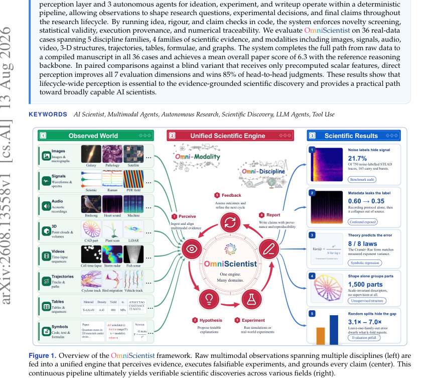
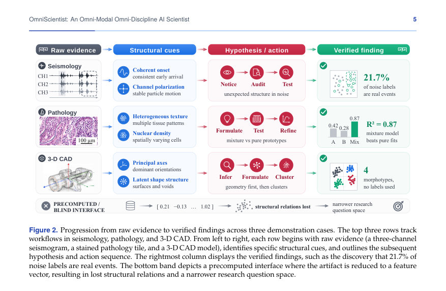
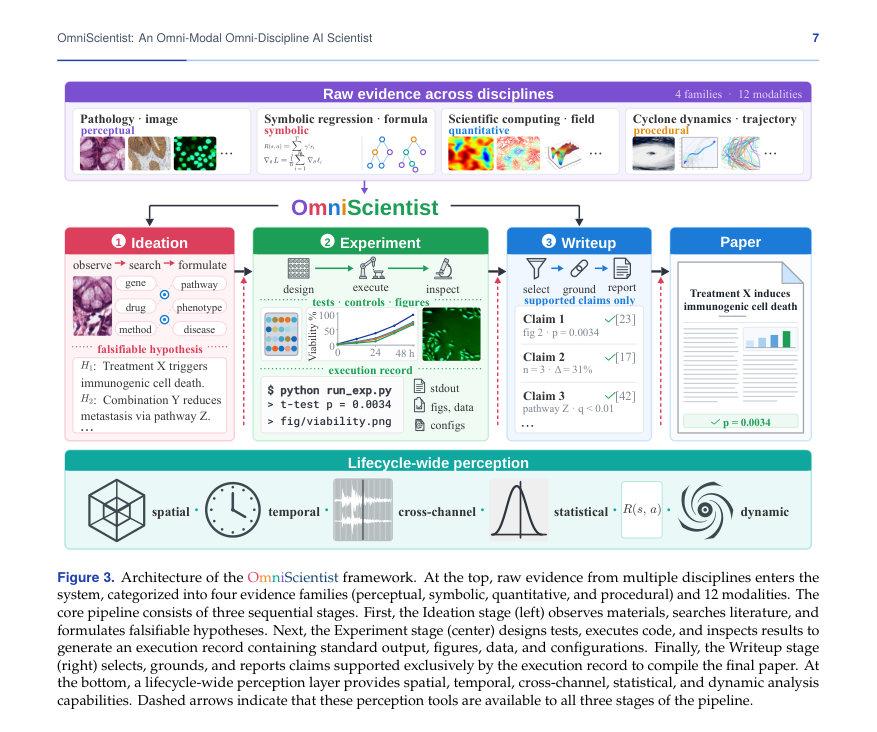

# OmniScientist: An Omni-Modal Omni-Discipline AI Scientist

- **게시일:** 2026-08-15
- **arXiv:** [2608.13558v1](http://arxiv.org/abs/2608.13558v1) · [PDF](https://arxiv.org/pdf/2608.13558v1)
- **저자:** Bobo Li, Hao Fei, Tianjie Ju, Mong-Li Lee, Wynne Hsu
- **분야:** cs.AI, cs.CL
- **선정 점수:** 6.36
- **선정 이유:** 최근성 0.5, 인용 영향 0.0 (인용 0회), 저자 영향 1.7 (최고 h-index 17), AI 주제 적합성 2.8, 개발자 관심 0.5, 학술 신호 0.9, 오픈 웨이트·주요 연구조직 신호 0.0

[← 2026-08-15 목록으로 돌아가기](../daily/2026-08-15.html)

<!-- paper-visuals:start -->
## 주요 Figure

> 원문 PDF에서 실제 Figure 캡션과 그림 영역이 함께 확인된 자료만 자동 추출했다.

*Figure · 원문 PDF 1쪽 · Figure 1. Overview of the OmniScientist framework. Raw multimodal observations spanning multiple disciplines (left) are*

*Figure · 원문 PDF 5쪽 · Figure 2. Progression from raw evidence to verified findings across three demonstration cases. The top three rows track*

*Figure · 원문 PDF 7쪽 · Figure 3. Architecture of the OmniScientist framework. At the top, raw evidence from multiple disciplines enters the*

<!-- paper-visuals:end -->

## 한 문장 요약

OmniScientist는 원시 멀티모달 증거를 직접 인식하는 인지(Perception)-우선의 멀티에이전트 파이프라인으로, 아이디에이션·실험·작성의 세 에이전트와 코드로 강제되는 idea/rigour/claim 체크를 결합해 증거-추적가능한 전주기(데이터→논문) 자동 연구를 실행한다.

## 해결하려는 문제

기존 ‘AI 과학자’들은 워크플로우(가설→실험→작문)를 자동화했지만 원시 관측(이미지, 신호, 영상, 3D, 궤적 등)에 내재한 공간·시간·교차채널·절차적 관계를 잃은 전처리된 요약(텍스트/스칼라 피처/라벨 등)을 주로 사용했다. 이로 인해 에이전트가 감지·가설화·실험설계·결론근거에 필요한 핵심 증거 구조를 놓치고, HARKing·데이터 유출·다중비교 오용 같은 문제에 취약하며 최종 주장의 증거 추적성(provenance)과 재현성이 약화되는 한계가 있다.

## 핵심 기여

- 원시 멀티모달 증거를 지속적으로 유지·검사하는 perception-first, multi-agent 전주기 엔진(Perception layer + Ideation, Experiment, Writeup agents) 설계.
- 아이디어·엄밀성·주장 검증을 코드화한 결정적(Deterministic) 파이프라인: 아이디어·rigour·claim 체크로 우발적 HARKing, 유출, 실행위조를 방지하고 숫자 추적성을 보장함.
- 과학적 증거를 퍼셉추얼·심볼릭·정량통계·절차적의 4개 가족으로 분류하여 도메인-무관한 동일 엔진으로 다양한 데이터(이미지, 신호, 오디오, 비디오, 3D, 표, 수식, 그래프 등)를 처리하도록 구현.
- 5개 분야(물리/지구/생명/농업/공학)·36개 실제 데이터셋으로 구성한 데모 스위트에서 원시 데이터→컴파일된 논문 전 경로를 모두 완료하고, 인지(Perception)가 없는 블라인드 대비 우월성을 입증함.

## 접근 방법

* OmniScientist는 perception layer와 세 개의 자율 에이전트(아이디에이션, 실험, 작성)를 ReAct 루프 안에서 운영하되, 에이전트 간의 단계 전환과 산출물 허가는 코드로 구현된 결정적 체크들(idea, rigour, claim)에 의해 통제된다.
* 주요 구성요소:
* Perception layer: 입력 파일의 모달리티(이미지, 신호, 오디오, 비디오, 3D, 궤적, 표, 수식, 그래프 등)를 자동 분류하고 해당 모달리티별 네이티브 분석 도구(예: analyze_signal, analyze_3d)와 시각화 도구(look_at_image 등)를 등록·예산 기반으로 호출해 원시 구조를 보존하면서 검사함.
* Ideation: 자료 관찰, 문헌검색(OpenAlex/Crossref), ≥5 후보 아이디어 생성 및 자체 스크리닝(신규성·실행가능성·검증 가능성) 후 최종 아이디어 확정.
* 아이디어 체크로 스키마·문헌근거·샘플 추정·누수(leakage)·시각감사 등을 의무화함.
* Experiment: 최종 아이디어를 코드로 구현(run_python 환경), 반복적 디버깅과 실행을 통해 결과(표준출력, 그림, 데이터, 구성파일)를 수집.
* 실험 설계는 최소 4개 이상의 분석(주요 테스트·베이스라인·어블레이션·메커니즘·감도 분석 등)을 포함하도록 요구.
* Writeup: 섹션 템플릿(분야별 스타일)으로 결과·방법·그림을 연결해 논문 초안을 작성하되, claim 체크로 논문 내 모든 숫자가 실행기록(Execution Record)의 실제 출력으로 추적되도록 강제함.
* 코드 기반 검증: Algorithm 1/2 및 Table 14에 명시된 여러 predicate(예: 보고된 수치가 실제 stdout에 존재하는지, 데이터가 디스크에서 로드되었는지, 다중검정 보정이 시도된 모든 테스트 수를 포함하는지 등)를 실행 시마다 적용해 산출물의 증거근거와 통계적 엄밀성을 확보함.

## 주요 결과

- 36개 실제 데이터 케이스(5개 분야, 4개 증거 가족, 다수 모달리티)에서 원시 데이터→컴파일된 논문 전 경로를 모두 완료(36/36).
- 참조(reasoning) 백본(Claude Sonnet 5)을 사용한 경우 생성 논문들의 평균 전체 점수는 6.3(논문 본문 기준 서술).
- 직관적 비교: 원시 관찰을 받는 전체 시스템은 원시 관찰 대신 사전계산된 스칼라 특성만 받는 블라인드 변형에 비해 7개 평가 차원(신규성·타당성·명료성·의의·재현성·멀티모달 그라운딩·사실정확성) 모두에서 향상되었고, 쌍별 비교에서 85%의 우승률을 보였음(논문 본문 서술).
- 실험 단계 통계: 실험 단위당 평균 run_python 호출 수는 31.8회(Table 16). 아이디에이션 단계 평균 에이전트 스텝은 8.8, 실험 단계 평균 에이전트 스텝은 36.0(Table 16).
- 결과 분포: 36회 중 자기보고된 실험 판정은 Supported 16(44%), Mixed 17(47%), Refuted 2(6%), No verdict 1(3%)(Table 17). 논문당 평균 게재된 분석 수는 7.4건, 실험에서 'demoted'(논문에 포함되지 않고 실행기록으로 남긴) 분석은 평균 1.9건/런(총 67건).  
- 체크·재시도 통계: 36개 기본 런에서 총 115회의 스테이지 finalize 거부(재시도)를 기록했고(주요 거부 사유는 비유의적 결과를 정작 발견된 비유의적 결과로 처리하려 함), 35/36 실험 스테이지가 rigour 체크를 통해 종료됨(Table 15,16,17).

## 한계

- 저자가 명시한 한계: 단일한 유한 검색은 우선권(absolute priority)을 보장할 수 없으므로 완전한 ‘최초’ 주장을 할 수 없어 표현을 완화함(논문 본문에서 이 정책을 명시).
- 저자가 명시한 한계: 시스템은 완전 계산적(fully computational) 연구만 허용하도록 설계되어 물리적/습식(wet-lab) 실험을 자동으로 수행하지 않음(ideation 체크에서 ‘fully_computational’ 요구).
- 본문에서 분명히 확인되는 제약(저자가 직접 지적하지 않았거나 추가로 확인되는 한계): (1) 성능은 추론 백본(Reasoning backbone) 품질에 크게 의존함(다수의 비교 테이블과 성공 케이스 수 차이로 입증됨, Table 3/4). (2) 탐색과 계산 비용을 제한하는 단계별 예산(ideation/experiment step budget, 이미지 예산 등)이 있어 매우 광범위한 탐색 또는 고비용 모델·실험의 자동화에는 제약이 있음(본문에서 예산·스텝 한계 명시, Table 16). (3) 지각(perception) 모델은 실험에서 고정(pinned)되어 있으며, 이 선택이 다른 인식 모델·설정에서의 일반화에 미치는 영향은 본문에서 제한적으로만 평가됨. (4) 평가는 36개 데모 케이스와 2명의 교차-분야 판사에 기반하므로(채점자 수와 케이스 수의 제약) 보다 광범위한 사용자·전문가 검증과 실제 학계 검토와의 일치성은 추가 검증이 필요함.

## 개발자 관점

- 증거 추적성(provenance)을 시스템 구조의 1차 데이터 구조로 설계하라: 실행기록(Execution Record)에 stdout, 생성 그림, I/O, 시도한 모든 테스트를 저장하고, 논문 내 모든 숫자를 이 기록과 매칭해 추적 가능하도록 강제함(Algorithm 1, Figure 5).
- 에이전트 설계: 한 역할(아이디에이션/실험/작성)에 대해 자유로운 언어적 탐색을 허용하되(stage 내부) 단계 전환·출력 허가는 코드화된 predicate로 엄격히 검증하라(Algorithm 2, Table 14).
- per-modality 도구 추상화: 모달리티별로 네이티브 수치분석(analyze_*)과 시각화(look_at_*)를 모두 제공해 에이전트가 비용·목표에 따라 원시 수치 혹은 시각-검사를 선택하게 하라(Table 18).
- 통계적 엄밀성 실무: 적어도 4개 분석(주시험+베이스라인+어블레이션+감도 등)을 설계하도록 요구하고, 디버깅 루프에서 시도된 모든 테스트를 다중비교 보정의 분모에 포함시키며(‘demoted’ 분석 포함), 비유의적(비의미) 결과를 헤드라인으로 승격하지 못하게 자동화된 규칙으로 막아라(Table 14/15, Algorithm 1).
- 운영·재현성: 재현을 위해 데이터는 실제 디스크로 로드되었는지, 모든 보고 숫자가 실제 run_python 출력에 존재하는지 등을 코드로 검증하라. 또한 자동화 비용(예: 평균 31.8 run_python 호출/실험)은 배포·자원계획에 직접적인 영향을 주므로 사전 평가·예산 산정이 필요함(Table 16).

**근거 범위:** 이 분석은 제공된 논문 PDF 본문(주요 본문, 표와 알고리즘, 부록 일부 포함)에서 직접 확인한 내용만을 근거로 작성했다. 표(Table 1–19), 알고리즘(Algorithm 1–2), 그림 설명과 본문 서술에서 추출한 수치·정책·통계만 사용했으며, PDF에 포함되지 않았거나 명시적 근거가 없는 구현 세부사항·추정 수치는 포함하지 않았다. 일부 추가 구현·평가 세부사항(예: 소스코드의 내부 함수명/구성, 외부 인프라 비용)은 본문에 제한적으로만 기술되어 있어 일반화하거나 보충하지 않았다.
