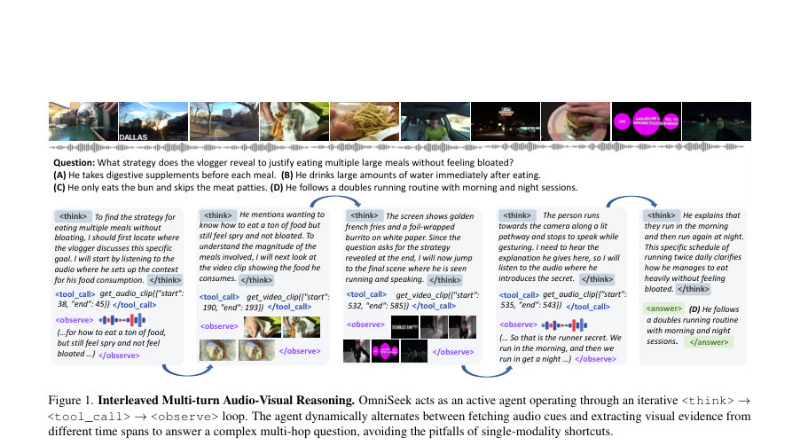
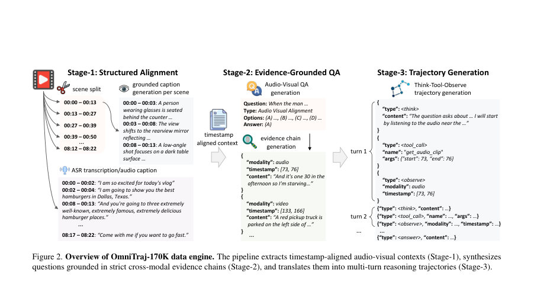
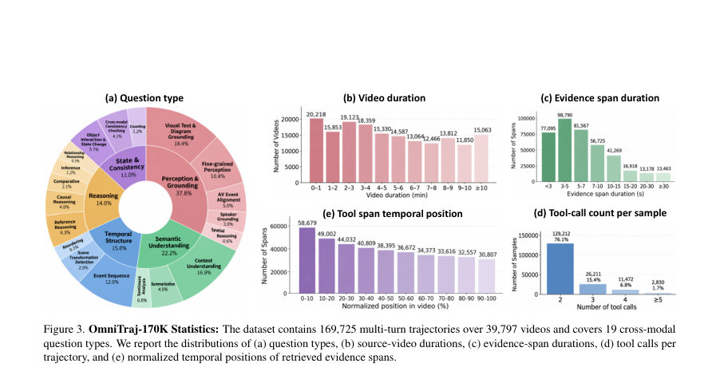

# OmniSeek: Native Tool Integration for Multi-turn Audio-Visual Reasoning

- **게시일:** 2026-10-03
- **arXiv:** [2610.02181v1](http://arxiv.org/abs/2610.02181v1) · [PDF](https://arxiv.org/pdf/2610.02181v1)
- **저자:** Haibo Wang, Jiteng Mu, Jialu Li, Jingru Yi, Yuanjun Xiong, Jianming Zhang, Lifu Huang, Mingze Xu
- **분야:** cs.CV
- **선정 점수:** 5.65
- **선정 이유:** 최근성 0.8, 인용 영향 0.0 (인용 0회), 저자 영향 1.1 (최고 h-index 4), AI 주제 적합성 2.6, 개발자 관심 0.8, 학술 신호 0.3, 오픈 웨이트·주요 연구조직 신호 0.0

[← 2026-10-03 목록으로 돌아가기](../daily/2026-10-03.html)

<!-- paper-visuals:start -->
## 주요 Figure

> 원문 PDF에서 실제 Figure 캡션과 그림 영역이 함께 확인된 자료만 자동 추출했다.

*Figure · 원문 PDF 2쪽 · Figure 1. Interleaved Multi-turn Audio-Visual Reasoning. OmniSeek acts as an active agent operating through an iterative <think> →*

*Figure · 원문 PDF 3쪽 · Figure 2. Overview of OmniTraj-170K data engine. The pipeline extracts timestamp-aligned audio-visual contexts (Stage-1), synthesizes*

*Figure · 원문 PDF 4쪽 · Figure 3. OmniTraj-170K Statistics: The dataset contains 169,725 multi-turn trajectories over 39,797 videos and covers 19 cross-modal*

<!-- paper-visuals:end -->

## 한 문장 요약

오디오·비주얼 장기 맥락에서 모델이 스스로 '보거나 듣기' 도구를 호출해 시계열 증거를 순차적으로 획득·재추론하는 에이전트 프레임워크(OmniSeek)와 이를 학습시키기 위한 대규모 다중회차 증거 궤적 코퍼스(OmniTraj-170K), 그리고 교차모달 의존성을 보장하는 보상(ravn)을 제안한다.

## 해결하려는 문제

기존 Omni-LLM들은 긴 오디오·비디오 스트림을 단일 패스(단회 인코딩)로 소화하여 희박한 시간·모달리티 증거가 희석되면 언어적 선입견이나 단일 모달 지름길(unimodal shortcut)에 의존하게 된다. 본문은 (1) 어떤 시점·모달리티를 다시 검사할지 모델 자체가 결정하도록 하는 능력, (2) 멀티홉·다중회차로 원시 오디오·비디오 세그먼트를 반복적으로 맥락에 첨가하여 추론을 고도화하는 능력, (3) RL 과정에서 단일모달 숏컷을 강화하지 않도록 실제 모달 의존성을 측정·보상하는 방법의 부재를 해결하려고 한다.

## 핵심 기여

- OmniSeek: Omni-LLM을 <think>→<tool_call>→<observe> 루프로 동작하는 능동적 멀티턴 오디오·비주얼 증거 탐색 에이전트로 전환하는 프레임워크를 제안.
- OmniTraj-170K: 장·단기 영상에서 타임스탬프 정렬된 오디오·비주얼 증거를 포함하는 169,725개의 멀티턴 체인-오브-생각(trajectories) 코퍼스를 자동 생성하는 3단계 데이터 엔진(장면 분할→증거 기반 QA→궤적 조립)을 구축.
- 학습 전략: ① 포맷·행동 정렬을 위한 감독적 SFT(혼합 데이터, 10% 도구 궤적), ② GSPO 기반의 보상형 RL(정확도·포맷·도구 사용 보상)으로 광범위 탐색, ③ 난이도 기반 하드 사례 미세조정(롤아웃 확장) 및 Audio-Visual Necessity 보상을 추가한 3단계 훈련 파이프라인을 설계.
- Audio-Visual Necessity (ravn): attention 마스킹을 이용해 한 회차(rollout)에서 토큰별 모달 의존도(ℓ_full − ℓ_/ℓ_)를 계산하고, 성공한 궤적에 대해 약한 모달을 기준으로 보상하여 단일모달 숏컷을 억제하는 검증 가능한 보상 설계를 제시.

## 접근 방법

* 아키텍처·추론 프로토콜: 모델은 초기 전역(희박 샘플) 맥락을 입력받고 반복적으로 <think> → <tool_call> → <observe> 루프를 수행한다.
* 도구는 modality-decoupled로 get_audio_clip(start,end)과 get_video_clip(start,end,fps,resolution)를 제공하며, 호출 시 원시 오디오/비디오 클립(고해상도/고프레임) 을 반환해 즉시 컨텍스트에 <observe>로 추가한다.
* 메서드는 '어느 모달을 언제 다시 볼지'를 모델의 내적 상태가 결정하도록 설계되며 종료는 모델의 자기반영(<think>)으로 판단한다.
* 데이터 및 시범(Cold-start): OmniTraj-170K 생성 파이프라인은 (1) PySceneDetect로 장면 분할 후 Qwen3.5-397B-A17B로 장면별 timestamped visual captions 생성 및 ASR을 병렬로 정렬(Stage-1), (2) 19가지 유형의 AV 질문을 생성하며 각 질문에 대해 2–7개의 정렬된 증거 스팬(모달·타임스탬프·텍스트)을 명시하고 최소 하나의 audio·video 스팬을 포함하도록 강제(Stage-2), (3) 증거체인에 따라 <think> 노드(모델 생성)와 도구 호출·관찰(<tool_call>, <observe>)을 결정적으로 결합해 멀티턴 궤적을 조립(Stage-3).
* 학습: Phase1 SFT(OmniTraj-170K, mixed 10% tool trajectories)로 포맷·행동 정렬, Phase2 GSPO RL(30K OmniVideo100K multiple-choice + 1K VideoHolmes; 보상 R = racc + rformat + rtool; rollout G=8)로 탐색·정책 학습, Phase3 GSPO RL(하드 8K 샘플, 롤아웃 G=16)으로 정제하며 ravn을 추가해 R = racc + rformat + rtool + ravn.
* Audio-Visual Necessity 계산: 한 궤적 τ에 대해 원래 로그우도를 ℓ_full 획득한 뒤, 각각 audio/visual 키를 attention에서 마스킹한 상태로 교차-대체 없는 teacher-forced 전진(두 번)을 수행해 ℓ\A, ℓ\V 를 얻고, 토큰별 감퇴 ΔA_t, ΔV_t를 rectifier로 집계해 necA, necV 산출.
* 정답 여부 c와 함께 ravn = c * min(necA, necV)로 정의해 '약한 모달' 기준으로만 성공한 궤적에 보상 부여.

## 주요 결과

- 데이터셋: OmniTraj-170K는 169,725개의 멀티턴 궤적을 포함하며 39,797개 비디오에서 추출되고, 증거 스팬 대부분이 3–10초, 76.1% 샘플은 2회 도구 호출, 23.9%는 3회 이상 도구 호출을 필요로 함(본문 Fig.3 통계).
- 주요 성능(대표 지표, 표 1): OmniSeek(30B, Qwen3-Omni 기반) 주요 벤치마크 정확도: Daily-Omni 80.0, WorldSense 62.4, FutureOmni 58.3, OmniVideoTest 69.5, VideoHolmes 74.6, OmniVideoBench 47.7, MMOU 70.4, LVOmni 44.2, Video-MME 78.5, LongVideoBench 66.4, MLVU 77.1, LVBench 51.4. 이들 중 여러 장기·멀티홉 과제에서 기존 공개 모델들(예: Qwen3-Omni-Instruct 등) 대비 유의미한 개선을 보임(예: VideoHolmes 74.6 vs. OmniVideo-R1 62.9).
- 학습 단계 기여(ablations, 표 2): Phase1 SFT은 '정렬 비용(alignment tax)'으로 일부 벤치마크 성능 하락을 초래(예: Daily-Omni 71.9→69.1). Phase2 RL로 회복 및 개선(예: VideoHolmes 55.9→69.6). Phase3와 롤아웃 확장(G 8→16)은 추가 개선(예: Daily-Omni 75.9→78.2). Audio-Visual Necessity(ravn) 추가로 더 개선(Phase3 G=16 대비 ravn 적용 시 Daily-Omni +1.8, WorldSense +3.2, OmniVideoTest +2.2, VideoHolmes +2.9 등).
- 멀티턴 도구 호출의 효과(표 4·그림5): 텍스트 전용 CoT(동일 RL 절차 적용) 대비 OmniSeek의 다중회차 도구 호출은 복합 AV 문제에서 큰 이득(예: OmniVideoTest +13.5, WorldSense +8.1, Daily-Omni +7.0). 또한 과제 복잡도에 따라 호출 수를 늘려 성능 개선(예: VideoHolmes·MMOU는 ≥5 호출에서 최고 성능).

## 한계

- 저자 명시(본문 Appendix A.7): 오디오 시퀀스의 토큰량이 시간에 선형적으로 증가하여(본 모델 기준 32K 토큰 한계, 오디오 토크율 약 12.5 tokens/sec), 매우 장시간(예: 수시간) 비디오 처리 시 컨텍스트 오버플로우가 발생하고 모델의 포맷·도구 호출 행동이 붕괴(예: 88분 샘플에서 <think> 루프 반복·관찰 도구 미호출 및 가상 관찰(허위 관찰) 생성). 저자는 임시 해법으로 재생 속도 가속이나 모달리티 비대칭 토큰 압축을 제안하나 세부적 해법은 미완성임.
- 저자 언급된 제한(학습 측면): Phase1 SFT의 '정렬 세금'으로 초기 성능 하락이 관측되어 RL 단계로 복구해야 함(따라서 SFT 단독 적용은 위험).
- 추론·실험 범위에서 합리적으로 확인되는 제약(추정): 대규모 연산 자원 소모와 재현 비용이 높음(훈련 설정에 32×H200, 128×H200 GPU 사용 명시(Table 6), 최대 시퀀스 길이 65,536 등), 따라서 실무 재현·배포에는 상당한 인프라가 필요함.
- 방법론적 한계(추론): ravn는 토큰-레벨 attention 마스킹에 의존하여 모달 의존도를 간접적으로 측정하므로, attention 구조·토크나이저 특성에 의해 민감할 수 있고 이로 인해 일부 경우 실제 '의존성'을 과소/과대평가할 가능성이 존재함(본문에서 추가 롤아웃 없이 계산하는 장점은 언급됨).

## 개발자 관점

- 재현성·데이터: OmniTraj-170K 생성은 (i) 장면 분할(PySceneDetect), (ii) 장면별 Qwen3.5 기반 시각 캡셔닝(엄격한 시각 전용 제약문 사용), (iii) 원본 ASR 병렬 정렬을 통해 timestamped evidence를 확보하고, QA 생성은 증거 스팬(모달·타임스탬프·텍스트)을 직접 복사하도록 설계되어 데이터 합리성(비환상화)을 높임 — 재현 시 동일한 파이프라인·프롬프트 적용 필요.
- 훈련·하이퍼파라미터: Phase1 SFT은 mixed-data 전략(도구 궤적 10%, 나머지 90%는 단회 QA)으로 사전모델 일반화 보존을 권장. RL은 GSPO 사용, Phase2 rollout G=8, Phase3 G=16, 학습률 1e-6(Phase2/3), SFT 5e-6 등 구체 하이퍼파라미터와 배치/에폭(Table 6) 제공되어 실제 재현 가능.
- 시스템 구현: inference 도구 인터페이스는 get_audio_clip/get_video_clip 형태로 단순화되어 있어 모듈화가 용이하나, 영상·오디오 클립을 원시(고해상도)로 컨텍스트에 직접 첨가하므로 메모리·초대형 컨텍스트 관리가 핵심 공학적 문제임(최대 시퀀스 길이·프레임·픽셀 한계가 Table 6에 명시됨).
- 운영·배포 고려사항: 긴 오디오 스트림 처리 시 컨텍스트 초과로 행동 붕괴가 보고되어(본문 Appendix A.7) 실제 서비스에서는 (i) 모달리티 비대칭 압축(무음 제거·요약), (ii) 정책으로 재생 속도 변환, 또는 (iii) 모델 컨텍스트 확장/윈도잉 전략 필요.
- 안전성·검증: 모델이 관찰을 도구 호출 없이 '상상'하는 오류(허위 관찰)를 보고하므로 도구 호출이 실제로 수행되었음을 검증하는 로깅·체크포인트(툴 호출에 대한 deterministic 기록) 및 ravn 같은 모달 의존성 검증을 배포 시 필수로 포함할 것.

**근거 범위:** 본 분석은 제공된 논문 PDF 본문(메인 및 부록 포함)에서 직접 인용·요약하여 작성함. 핵심 수치(OmniTraj-170K 크기, 데이터·학습 설정, 표 1·2·3의 성능, Table 6의 하이퍼파라미터, Appendix A.7의 한계 등)는 PDF 본문에서 확인된 값만 사용했다. 코드 구현의 세부적인 엔지니어링(예: 데이터 파이프라인의 세부 캐싱·I/O 최적화, 모델 체크포인트 경로, 실제 GPU 시간·비용 산정)은 PDF에 명시되지 않아 추정하지 않았다.
