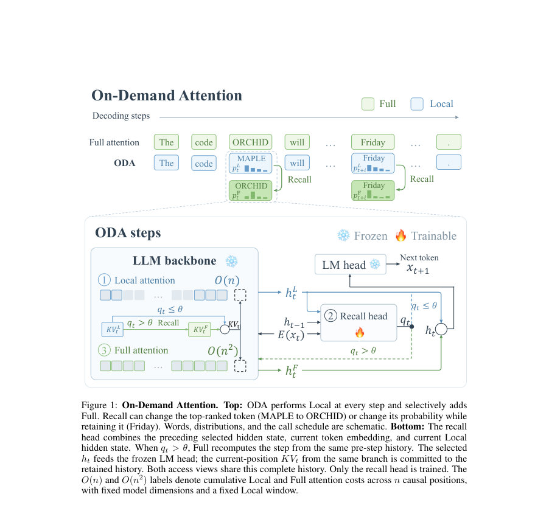
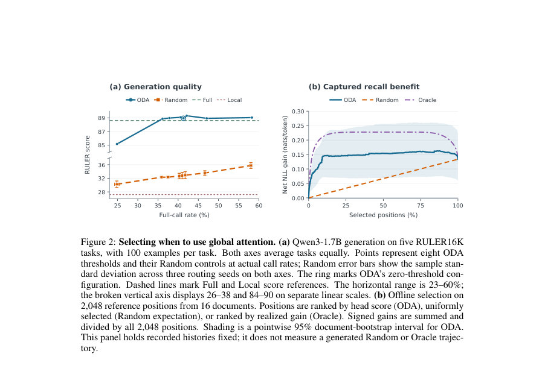
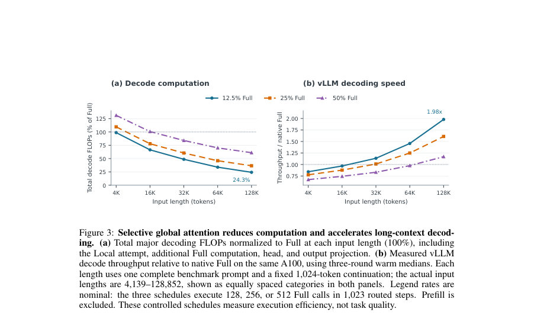

# On-Demand Attention: Language Models Know When to Recall

- **게시일:** 2026-09-19
- **arXiv:** [2609.20734v1](http://arxiv.org/abs/2609.20734v1) · [PDF](https://arxiv.org/pdf/2609.20734v1)
- **저자:** Haibo Feng, Ruiqi Liang, Hanyang Peng, Shiqi Yu
- **분야:** cs.CL
- **선정 점수:** 7.03
- **선정 이유:** 최근성 0.8, 인용 영향 0.0 (인용 0회), 저자 영향 1.4 (최고 h-index 8), AI 주제 적합성 2.6, 개발자 관심 0.5, 학술 신호 0.3, 오픈 웨이트·주요 연구조직 신호 1.5

[← 2026-09-19 목록으로 돌아가기](../daily/2026-09-19.html)

<!-- paper-visuals:start -->
## 주요 Figure

> 원문 PDF에서 실제 Figure 캡션과 그림 영역이 함께 확인된 자료만 자동 추출했다.

*Figure · 원문 PDF 2쪽 · Figure 1: On-Demand Attention. Top: ODA performs Local at every step and selectively adds*

*Figure · 원문 PDF 7쪽 · Figure 2: Selecting when to use global attention. (a) Qwen3-1.7B generation on five RULER16K*

*Figure · 원문 PDF 8쪽 · Figure 3: Selective global attention reduces computation and accelerates long-context decod-*

<!-- paper-visuals:end -->

## 한 문장 요약

사전학습된 디코딩 상태로부터 '전역(Full) 어텐션'의 즉각적 이득을 예측하는 경량 recall 헤드를 학습해, 로컬 먼저 계산(local-first)하고 필요할 때만 전역 어텐션을 재호출해(온디맨드) 긴 컨텍스트 추론 비용을 크게 줄이는 방법을 제안한다.

## 해결하려는 문제

긴 컨텍스트 환경에서 autoregressive 디코딩은 매 토큰마다 전체 기록(history)에 대해 전역(Full) 어텐션을 수행해 계산 비용이 급증한다. 그러나 모든 생성 단계에서 먼 과거 정보가 항상 필요하지 않으며, '언제 전역 어텐션을 수행할지'를 미리 판단해 불필요한 전역 읽기를 건너뛰는 적응적 할당 방법이 필요하다. 이때 온라인 결정은 아직 전역 계산을 수행하기 전의 상태만을 이용해야 하므로, 사전학습된 백본을 변경하지 않고도 그런 결정을 할 수 있는 근거와 실용적 방법을 찾는 것이 핵심 연구 질문이다.

## 핵심 기여

- 사전학습된 모델의 디코딩 상태에 전역 어텐션(Full)이 로컬(Local)보다 현재 예측에 유리한지를 예측할 수 있는 신호가 존재함을 실험적으로 규명함.
- On-Demand Attention(ODA) 제안: 매 단계 로컬 계산을 먼저 수행하고, 경량의 recall 헤드(q_t)를 통해 전역 재계산을 선택적으로 호출하는 local-first 디코딩 파이프라인을 제시함. 백본은 동결하고 recall 헤드만 학습함으로써 전체 KV 캐시를 보존함.
- cost-aware 학습 목표 및 손실: 전역 호출 비용 λ를 도입한 비용-조정 이득(dt = g_t − λ)를 signed-log 변환(T)한 목표에 대해 Huber 회귀로 recall 헤드를 학습함.
- vLLM 기반 GPU 측 조건부 실행 구현을 제시하여, 실제 디코딩에서 전역 호출 감소가 실질적 속도 향상으로 이어짐을 보임(긴 컨텍스트에서).
- 여러 백본(Qwen3 계열 및 Gemma)과 하이브리드 어텐션 아키텍처에서 selective recall이 로컬로 잃는 품질을 대부분 회복하면서 전역 호출 빈도를 크게 줄이는 것을 실증함.

## 접근 방법

* 정의 및 의사결정 기준: 같은 사전 상태 C_{t−1}에서 Local과 Full을 각각 계산해 다음 토큰의 NLL 차이 g_t = log p^F_t(x_{t+1}) − log p^L_t(x_{t+1})를 이득으로 정의한다.
* 비용 λ를 도입해 dt = g_t − λ를 계산하고, signed-log 변환 y_t = sign(dt) log(1+\|dt\|)을 목표로 회귀학습한다.
* recall 헤드 R_ψ는 현재 단계에서 사용 가능한 세 입력(이전 선택된 숨김 상태 h_{t−1}, 현재 입력 토큰 임베딩 E_ϕ(x_t), 현재 Local 최종 숨김 h^L_t)을 받아 스칼라 점수 q_t를 출력한다.
* 학습은 Full 트렁크를 계산하고(전체 기록 보존), 동일한 트렁크 역사에서 두 counterfactual(Full·Local) 현재-위치 후보를 만들어 페어드 감독을 구성한다.
* 손실은 Huber 회귀(δ=1)로 최소화하며, 배치/감소 규칙 및 τ_hist 등 구현 세부는 부록에 명시됨.
* 추론(디코딩) 절차: 각 토큰에서 먼저 Local(초기 s=4 및 최근 윈도우 w=2048 포함)을 계산하고 q_t > θ(기본 θ=0)이면 동일한 사전 상태에서 Full로 현재 단계 재계산(재호출)하여 그 결과를 선택해 커밋한다.
* 선택된 숨김 상태의 현재-위치 KV는 전체 보존된 히스토리에 커밋되어 이후 recall에서 접근 가능하다.
* 계산 비용 모델은 Local(고정 ℓ = s+w)과 Full(역사 길이 n에 선형 의존)의 FLOPs 차이를 사용해 ρ(Full 호출율)에 따른 평균 절감량을 유도하고, vLLM에서 GPU측 조건부 실행을 구현해 라우팅 오버헤드를 줄였다.

## 주요 결과

- 모델·벤치마크 성능(품질·실제 Full 호출률): Qwen3-1.7B(RULER16K) Full 81.94, Local 19.23, ODA 81.17 (실제 Full 호출률 41.6%). LongBench v1: Full 37.94, Local 23.66, ODA 36.82 (Full 70.6%).
- 다른 백본들: Qwen3-8B(RULER16K) Full 92.59, Local 25.43, ODA 91.07 (Full 47.3%). Qwen3.5-2B Full 94.35, Local 28.21, ODA 94.08 (Full 44.3%). Gemma-4-12B-it Full 96.61, Local 30.07, ODA 95.27 (Full 57.8%). (각 백본별로 별도 recall 헤드를 학습함; 헤드 간 전이 실험은 없음.)
- 학습된 타이밍의 중요성: 다섯 RULER16K 작업에서 동일한 실제 Full 호출 비율을 갖는 Random 스케줄과 비교했을 때 ODA가 품질 측면에서 현저히 우수함(예: threshold=0에서 ODA 88.96 vs Random 32.79, 해당 실험의 Full 기준은 88.63). 즉, 단순 빈도만이 아니라 호출 타이밍의 학습이 성능에 중요함.
- 계산·실행 효율: 128K 입력 토큰, 1K 출력 토큰, 약 12.5% Full 호출 시 ODA는 주요 디코딩 FLOPs를 Full 대비 24.26%로 사용(약 75.74% FLOPs 절감)하고, vLLM에서 동일 조건의 warm 측정으로 토큰 처리량이 75.54 → 149.52 tokens/s로 1.98× 향상됨. 반면 짧은 문맥(예: 4K)에서는 ODA가 15.8% 느린 결과를 보였음—속도 이득은 문맥 길이와 recall 비율에 의존함.
- recall 헤드 및 학습 규모: recall 헤드 파라미터 수 28,325,889(본문에 28.3M 표기), Qwen3 학습 풀은 196,608 예제(최대 길이 16,384)를 사용. Local 설정은 초기 s=4, 최근 윈도우 w=2048(현재 토큰 포함).

## 한계

- 저자가 명시한 한계: (1) 학습 감독은 Full 트렁크 히스토리로부터 얻는 페어드 계산에 기반하므로 학습 시 사용한 역사 분포(Full 트렁크)가 배포 시 정책이 실제로 만들어내는 히스토리와 다를 수 있어 감독-배포 불일치가 존재함. (2) 전체 역사 KV를 보존하므로 정보 접근성은 보장되지만 KV 저장은 선형 공간을 요구함(메모리 비용). (3) 속도 이득은 전역 호출을 줄여도 Local 시도의 비용과 제어 오버헤드를 상쇄할 때만 실현되며, 문맥 길이·recall 비율에 크게 의존함.
- 실험적·범위 제약(본문에서 확인 가능한 제약): (1) vLLM 기반 실행 및 속도·FLOPs 측정은 Qwen3-1.7B에 대해 상세히 보고되었으나 다른 백본(예: Qwen3-8B, Gemma)의 실행속도 측정은 제공되지 않음. (2) 각 백본마다 별도의 recall 헤드를 학습했으며 헤드의 전이 가능성(transferability)은 실험하지 않음. (3) 전체 학습에 필요한 실제 GPU 시간·총 비용은 명시되지 않음(부록에 '미기재'로 표기). (4) 제안된 방법은 항상 Full 궤적을 복원하지 않으며, 연속적 Local 단계에서의 재계산 행동이 항상 전체 품질에 미치는 장기 영향(미래 토큰에 대한 파급효과)은 감독 설계상 직접 최적화되지 않음.

## 개발자 관점

- 구현: 전체 KV 캐시를 보존하는 상태 관리가 필수이며, Local 뷰(초기 s + 최근 w)와 전체(페이지된) KV 뷰를 함께 관리하는 런타임(저자 구현은 vLLM 최적화 경로)을 준비해야 한다.
- GPU 측 conditional execution: Local 계산, FP32 recall 헤드 평가, 그리고 조건부 Full 재계산을 동일한 GPU 실행 흐름(예: CUDA Graphs) 내에서 처리해 라우팅 동기화 오버헤드를 줄여야 실제 속도 이득을 얻는다.
- 학습 비용·절차: recall 헤드만 학습하지만 라벨·특성 생성을 위해 Full 트렁크와 두 counterfactual(Full/Local 현재-위치 후보)을 계산해야 하므로 학습 계산량은 백본이 동결 상태라도 크다—학습 리소스 산정 시 이 점을 포함할 것.
- 하이브리드 백본 호환성: 하이브리드(예: Gated DeltaNet)에서는 일부 레이어만 Local로 제한하도록 런타임에서 레이어별 접근 범위를 제어할 수 있다(논문 Qwen3.5-2B 사례).
- 운영·튜닝: recall 점수 임계값 θ(기본 0)와 Full 호출 비용 λ를 하이퍼파라미터로 두어 품질-비용 트레이드오프를 조정한다. 실제 배포에선 토큰 가중 Full 호출률과 문맥 길이별 속도 측정을 함께 기록해 운영 포인트를 선정할 것(속도 이득은 문맥 길이·recall 예산에 민감).

**근거 범위:** 이 분석은 제공된 논문 PDF 본문(제목부터 부록까지 포함)에서 직접 추출한 내용에 기반함. 표와 본문에 명시된 수치(예: 성능, 호출률, FLOPs/속도 관련 수치), 아키텍처·학습 절차(입력·목표·손실 함수)와 저자가 명시한 한계는 본문에서 확인한 그대로 보고함. 논문이 직접 공개하지 않거나 부록에서 미기재된 항목(예: 전체 학습에 소요된 총 GPU시간, 공개 코드·체크포인트의 완전한 구현 세부)은 본 분석에서 생성하지 않았으며 해당 정보는 원문/저자 배포를 통해 확인해야 함.
